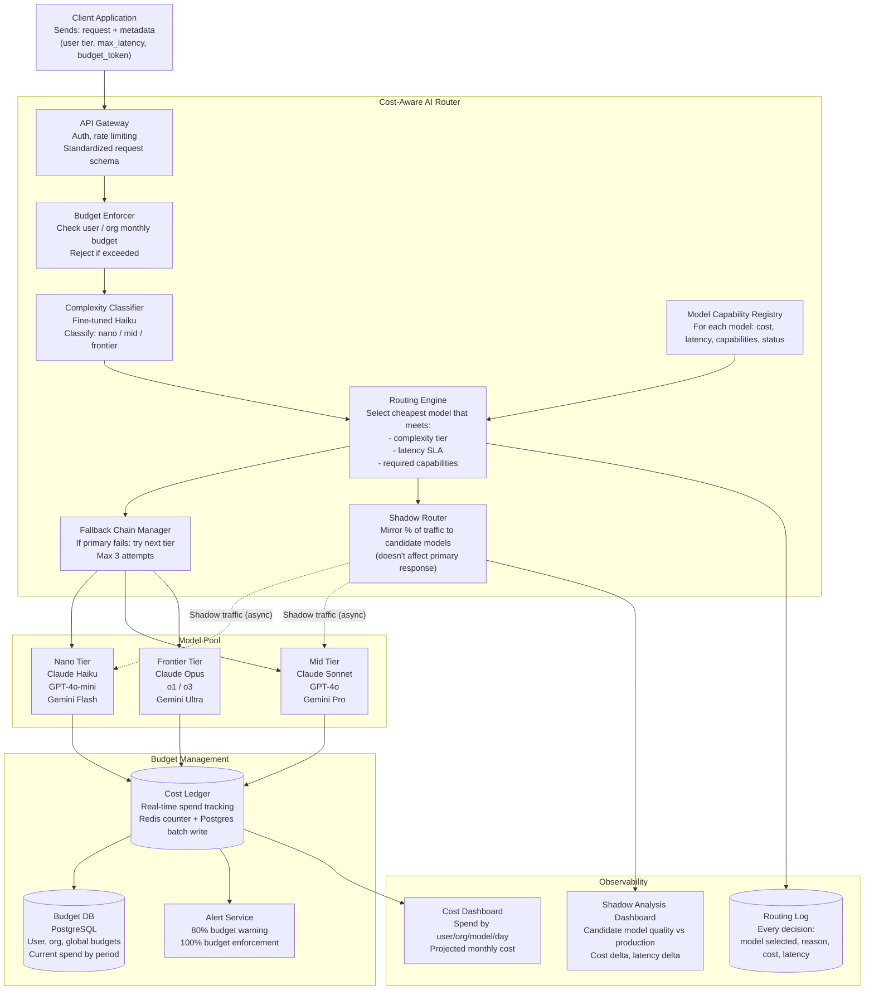
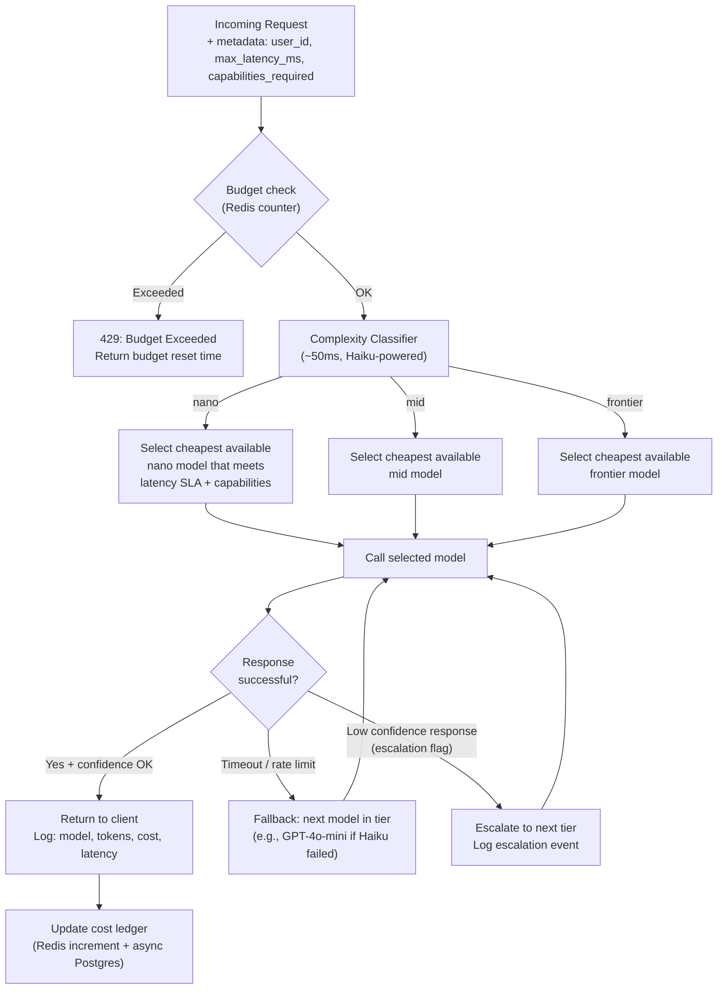
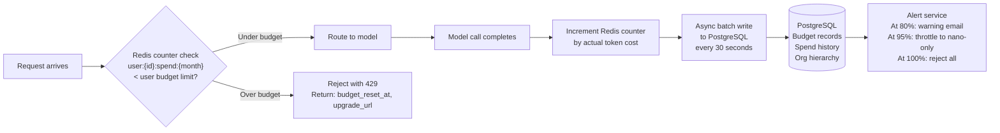
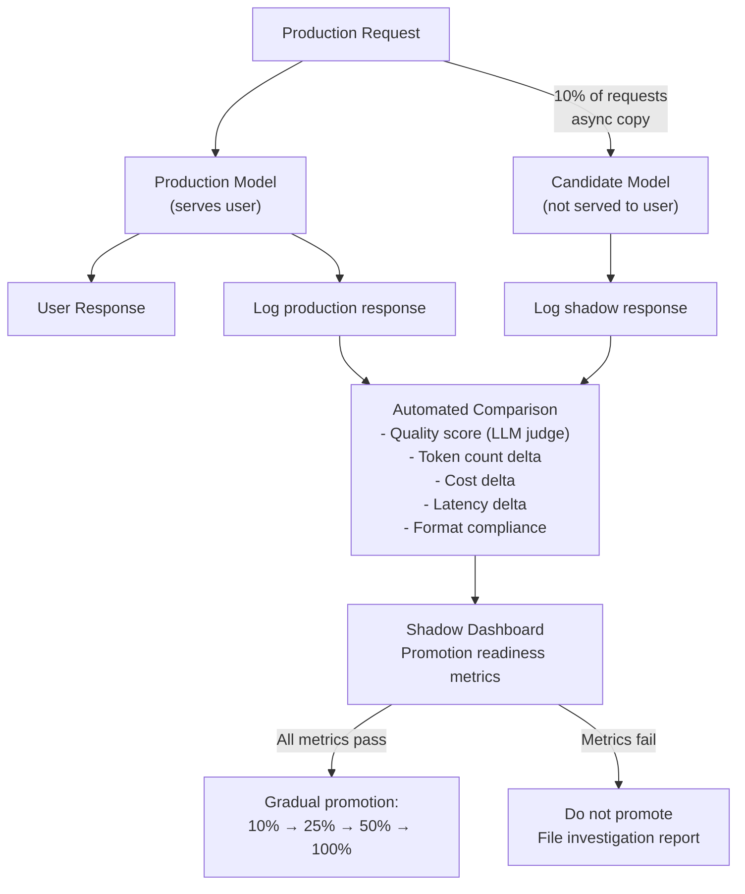

# Architecture Blueprint
## Design Case 08: Cost-Aware AI Router

An intelligent API gateway that sits in front of multiple LLM providers and automatically dispatches each request to the cheapest model that can handle it correctly. The router enforces cost budgets, latency SLAs, and falls back gracefully through a model chain when cheaper models fail. New models are validated in shadow mode before carrying live traffic.

---

## System Overview



---

## Routing Decision Flow



---

## Model Capability Registry

The registry is the source of truth for what each model can do and what it costs. It's version-controlled and hot-reloadable without a deployment.

```yaml
models:
  claude-haiku-3-5:
    tier: nano
    provider: anthropic
    status: active          # active | shadow | deprecated | circuit_open
    pricing:
      input_per_1m:  0.08
      output_per_1m: 0.30
      cached_input_per_1m: 0.008
    latency_p50_ms: 400
    latency_p99_ms: 1200
    context_window_tokens: 200000
    capabilities:
      - classification
      - extraction
      - short_generation     # < 500 tokens output
      - structured_output
      - tool_use
      - vision
    not_suitable_for:
      - complex_reasoning
      - long_generation      # > 1000 tokens output
      - code_generation_hard
    max_concurrent_requests: 200

  claude-sonnet-4:
    tier: mid
    provider: anthropic
    status: active
    pricing:
      input_per_1m:  3.00
      output_per_1m: 15.00
      cached_input_per_1m: 0.30
    latency_p50_ms: 1500
    latency_p99_ms: 4000
    context_window_tokens: 200000
    capabilities:
      - classification
      - extraction
      - short_generation
      - long_generation
      - code_generation
      - complex_reasoning
      - structured_output
      - tool_use
      - vision
    max_concurrent_requests: 100

  claude-opus-4:
    tier: frontier
    provider: anthropic
    status: active
    pricing:
      input_per_1m:  15.00
      output_per_1m: 75.00
      cached_input_per_1m: 1.50
    latency_p50_ms: 3000
    latency_p99_ms: 12000
    context_window_tokens: 200000
    capabilities:
      - all
    max_concurrent_requests: 50
```

---

## Budget Enforcement Architecture



**Budget hierarchy:**
- Per-user budget (e.g., $10/month on free tier)
- Per-organization budget (e.g., $500/month on pro tier)
- Global platform budget (safety ceiling, protects against runaway costs)

When an organization's budget is hit, all users in the org are affected — this prevents one high-usage user from degrading service for others.

---

## Shadow Mode Testing



---

## 📂 Navigation

**In this folder:**
| File | |
|---|---|
| 📄 **Architecture_Blueprint.md** | ← you are here |
| [📄 Component_Breakdown.md](./Component_Breakdown.md) | Component deep dive |
| [📄 Interview_QA.md](./Interview_QA.md) | Interview prep |

⬅️ **Prev:** [07 AI Content Moderation Pipeline](../07_AI_Content_Moderation_Pipeline/Architecture_Blueprint.md) &nbsp;&nbsp;&nbsp; ➡️ **Next:** [Section 14 — Hugging Face Ecosystem](../../14_Hugging_Face_Ecosystem/01_Hub_and_Model_Cards/Theory.md)
