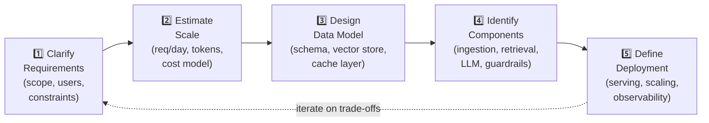

# 🏗️ 13 — AI System Design

⬅️ [12 Production AI](../12_Production_AI/Readme.md) &nbsp;|&nbsp; [🏠 Home](../00_Learning_Guide/Readme.md) &nbsp;|&nbsp; [14 Hugging Face Ecosystem ➡️](../14_Hugging_Face_Ecosystem/Readme.md)

> Five real AI systems, designed end-to-end — learn to draw the architecture, justify every decision, and ace the interview.

**[▶ Start here → System Design Framework](./System_Design_Framework.md)**

---

## At a Glance

| | |
|---|---|
| 📚 Topics | 5 case studies |
| ⏱️ Est. Time | 8–10 hours |
| 📋 Prerequisites | [12 Production AI](../12_Production_AI/Readme.md) |
| 🔓 Unlocks | [14 Hugging Face Ecosystem](../14_Hugging_Face_Ecosystem/Readme.md) |

---

## What's in This Section

Apply this 5-step framework to any AI system design question — then study the five case studies below to see it applied in full.

---

## Topics

| # | Case Study | Core Challenge | Files |
|---|---|---|---|
| 01 | [Customer Support Agent](./01_Customer_Support_Agent/) | Multi-turn memory + tool calling + graceful escalation to human | [🗺️ Blueprint](./01_Customer_Support_Agent/Architecture_Blueprint.md) · [🔨 Build Guide](./01_Customer_Support_Agent/Build_Guide.md) · [🔍 Components](./01_Customer_Support_Agent/Component_Breakdown.md) · [🌊 Data Flow](./01_Customer_Support_Agent/Data_Flow_Diagram.md) · [🛠️ Tech Stack](./01_Customer_Support_Agent/Tech_Stack.md) · [🎯 Interview Q&A](./01_Customer_Support_Agent/Interview_QA.md) |
| 02 | [RAG Document Search System](./02_RAG_Document_Search_System/) | Chunking strategy, hybrid BM25 + vector search, reranking, access control | [🗺️ Blueprint](./02_RAG_Document_Search_System/Architecture_Blueprint.md) · [🔨 Build Guide](./02_RAG_Document_Search_System/Build_Guide.md) · [🔍 Components](./02_RAG_Document_Search_System/Component_Breakdown.md) · [🌊 Data Flow](./02_RAG_Document_Search_System/Data_Flow_Diagram.md) · [🛠️ Tech Stack](./02_RAG_Document_Search_System/Tech_Stack.md) · [🎯 Interview Q&A](./02_RAG_Document_Search_System/Interview_QA.md) |
| 03 | [AI Coding Assistant](./03_AI_Coding_Assistant/) | AST-aware codebase indexing, sub-200ms latency, LSP integration | [🗺️ Blueprint](./03_AI_Coding_Assistant/Architecture_Blueprint.md) · [🔨 Build Guide](./03_AI_Coding_Assistant/Build_Guide.md) · [🔍 Components](./03_AI_Coding_Assistant/Component_Breakdown.md) · [🌊 Data Flow](./03_AI_Coding_Assistant/Data_Flow_Diagram.md) · [🛠️ Tech Stack](./03_AI_Coding_Assistant/Tech_Stack.md) · [🎯 Interview Q&A](./03_AI_Coding_Assistant/Interview_QA.md) |
| 04 | [AI Research Assistant](./04_AI_Research_Assistant/) | Multi-agent orchestration, source credibility scoring, conflict detection across papers | [🗺️ Blueprint](./04_AI_Research_Assistant/Architecture_Blueprint.md) · [🔨 Build Guide](./04_AI_Research_Assistant/Build_Guide.md) · [🔍 Components](./04_AI_Research_Assistant/Component_Breakdown.md) · [🌊 Data Flow](./04_AI_Research_Assistant/Data_Flow_Diagram.md) · [🛠️ Tech Stack](./04_AI_Research_Assistant/Tech_Stack.md) · [🎯 Interview Q&A](./04_AI_Research_Assistant/Interview_QA.md) |
| 05 | [Multi-Agent Workflow](./05_Multi_Agent_Workflow/) | Agent coordination, shared artifact state, human-in-the-loop checkpoints | [🗺️ Blueprint](./05_Multi_Agent_Workflow/Architecture_Blueprint.md) · [🔨 Build Guide](./05_Multi_Agent_Workflow/Build_Guide.md) · [🔍 Components](./05_Multi_Agent_Workflow/Component_Breakdown.md) · [🌊 Data Flow](./05_Multi_Agent_Workflow/Data_Flow_Diagram.md) · [🛠️ Tech Stack](./05_Multi_Agent_Workflow/Tech_Stack.md) · [🎯 Interview Q&A](./05_Multi_Agent_Workflow/Interview_QA.md) |

**How to use each case study:** Start with the Architecture Blueprint for the full picture. Read Component Breakdown to understand every box. Use Data Flow Diagram to trace a real request end-to-end. Then test yourself with Interview Q&A.

---

## Key Concepts at a Glance

| Concept | Why It Matters |
|---|---|
| **AI systems have unique failure modes** | Context window overflow, hallucinated citations, token cost blowout, and latency SLA breaches — none of which appear in traditional system design |
| **Every case study has the same skeleton** | Ingest → store → retrieve → augment → generate → guard → respond — what differs is how each layer is tuned for the domain |
| **Latency budget is an architectural constraint** | LLM calls take 1–10 seconds; a 200ms SLA forces caching, streaming, and async design before you write a line of code |
| **Evaluation is structural, not optional** | Each system needs a golden dataset and an LLM-as-judge pipeline baked in from day one — not bolted on after launch |
| **The Tech Stack file is as important as the Blueprint** | Knowing why Pinecone over Weaviate, why Redis over Postgres for sessions, is what separates senior answers from junior ones |

---

## Also in This Section

[📐 System Design Framework](./System_Design_Framework.md) — the 5-step structured approach for tackling any AI system design question in an interview or on the whiteboard. Read this first.

---

## 📂 Navigation

⬅️ **Prev:** [12 Production AI](../12_Production_AI/Readme.md) &nbsp;&nbsp; ➡️ **Next:** [14 Hugging Face Ecosystem](../14_Hugging_Face_Ecosystem/Readme.md)
