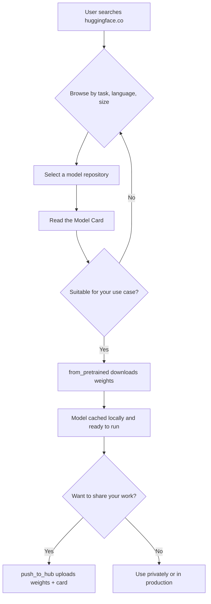

# Hugging Face Hub and Model Cards

## The Story 📖

Before the Hugging Face Hub, every AI team built from scratch, shared models as zip files over email, and had no idea what data produced a given model. Reproducing a paper's results could take months of GPU time just to reach the starting line.

👉 This is why we need the **Hugging Face Hub** — a central, searchable registry where models, datasets, and demos live alongside documentation that explains exactly what they do.

---

## What is the Hugging Face Hub?

GitHub for AI models. A platform at [huggingface.co](https://huggingface.co) where researchers and companies publish:

- **Models** — pre-trained neural networks ready for download or fine-tuning
- **Datasets** — labelled data loadable in two lines of code
- **Spaces** — live demos powered by Gradio or Streamlit

Every item has a **model card** — a structured README documenting what the model does, how it was trained, its limitations, and its license. Think of it as the nutrition label on packaged food.

---

## Why It Exists — The Problem It Solves

- **Reproducibility**: Weights were rarely shared; nobody could reproduce results without months of GPU time. The Hub versions and stores weights.
- **Discoverability**: No single place to compare models. Hub search filters by task, language, size, and library.
- **Documentation gaps**: Models were deployed without bias or capability disclosures. Model cards enforce structured documentation.

---

## How It Works — Step by Step



**Step 1 — Find a model:** Filter by task, language, library, and license at [huggingface.co/models](https://huggingface.co/models).

**Step 2 — Read the model card:** Task, training data, evaluation metrics, known biases, usage examples, license.

**Step 3 — Download with `from_pretrained`:** Downloads weights, config, and tokenizer; caches to `~/.cache/huggingface/hub`. Subsequent calls use the cache.

**Step 4 — Publish with `push_to_hub`:** Uploads everything back. The Hub uses **Git LFS** for large binary weight files.

---

## Repository Structure

Every Hub repo is a Git repository:

```
my-model/
├── README.md              ← The model card (YAML frontmatter + Markdown)
├── config.json            ← Model architecture config
├── tokenizer.json         ← Tokenizer vocabulary and merge rules
├── tokenizer_config.json
├── special_tokens_map.json
├── model.safetensors      ← Model weights (preferred format)
└── pytorch_model.bin      ← Older weight format
```

The `README.md` starts with YAML **frontmatter** that populates Hub search filters:

```yaml
---
language: en
license: apache-2.0
tags:
  - text-classification
  - sentiment-analysis
datasets:
  - sst2
metrics:
  - accuracy
---
```

**`.safetensors`** is the preferred format — unlike `.bin` (Python pickle, can execute arbitrary code on load), safetensors is safe and fast. Always prefer it.

---

## Versioning and Private Repos

Pin to a specific commit hash for production stability:

```python
model = AutoModel.from_pretrained(
    "bert-base-uncased",
    revision="a265f773a47193eed794233aa2a0f0bb6d3eaa63"
)
```

Private repos require authentication:
```python
from huggingface_hub import login
login(token="hf_your_token_here")
model = AutoModel.from_pretrained("your-org/private-model")
```

Or set `HUGGING_FACE_HUB_TOKEN` as an environment variable.

---

## Datasets on the Hub

```python
from datasets import load_dataset
ds = load_dataset("imdb")
ds = load_dataset("squad")
```

50,000+ datasets, each with cards documenting source, size, splits, methodology, and known issues.

---

## Where You'll See This in Real AI Systems

- Meta (LLaMA), Mistral, Google (Gemma), Microsoft (Phi) all use the Hub as their primary model distribution channel
- Research authors link to Hub model pages instead of GitHub for immediate reproducibility
- Engineering teams pin to commit hashes in production configs for deliberate, stable updates
- Companies use private Hub orgs to share fine-tuned models internally

---

## Common Mistakes to Avoid ⚠️

- **Skipping the model card** — you might deploy a model with the wrong language support or a non-commercial license
- **Loading from `main` in production** — `main` can change; pin to a commit hash
- **Ignoring license restrictions** — "research-only" licenses are legally binding
- **Filling disk space** — cache at `~/.cache/huggingface/hub` can reach hundreds of GB; set `TRANSFORMERS_CACHE` on servers
- **Using `.bin` from unknown authors** — pickle files can contain malicious code; prefer safetensors

---

## Connection to Other Concepts 🔗

- All `from_pretrained()` calls in the **Transformers library** (02) fetch from the Hub
- **Datasets library** (03) uses the same Hub infrastructure
- **PEFT/LoRA** (04) model cards document what was adapted and how
- **Spaces** (07) are a Hub feature — demos live alongside model repos

---

✅ **What you just learned:** The Hugging Face Hub is a version-controlled registry for models, datasets, and demos, with model cards providing structured documentation for discoverability, reproducibility, and responsible deployment.

🔨 **Build this now:** Go to [huggingface.co/models](https://huggingface.co/models), filter by task = "text-classification" and language = "English," find a model with over 1 million downloads, and identify: (1) its training dataset, (2) its accuracy score, and (3) its license.

➡️ **Next step:** Learn how to actually run these models in Python — [02_Transformers_Library/Theory.md](../02_Transformers_Library/Theory.md).

---

## 🛠️ Practice Project

Apply what you just learned → **[I4: Custom LoRA Fine-Tuning](../../20_Projects/01_Intermediate_Projects/04_Custom_LoRA_Fine_Tuning/Project_Guide.md)**
> This project uses: downloading a base model with from_pretrained(), pushing your fine-tuned adapter to Hub, writing a model card

---

## 📂 Navigation

**In this folder:**

| File | Description |
|------|-------------|
| 📄 **Theory.md** | Hub overview, model cards, versioning (you are here) |
| [📄 Cheatsheet.md](./Cheatsheet.md) | Key commands and model card fields at a glance |
| [📄 Interview_QA.md](./Interview_QA.md) | 9 interview questions about the Hub |
| [📄 Code_Example.md](./Code_Example.md) | Working code: load models, push to hub, create model cards |

⬅️ **Prev:** [14_Hugging_Face_Ecosystem README](../Readme.md) &nbsp;&nbsp;&nbsp; ➡️ **Next:** [Transformers Library](../02_Transformers_Library/Theory.md)
