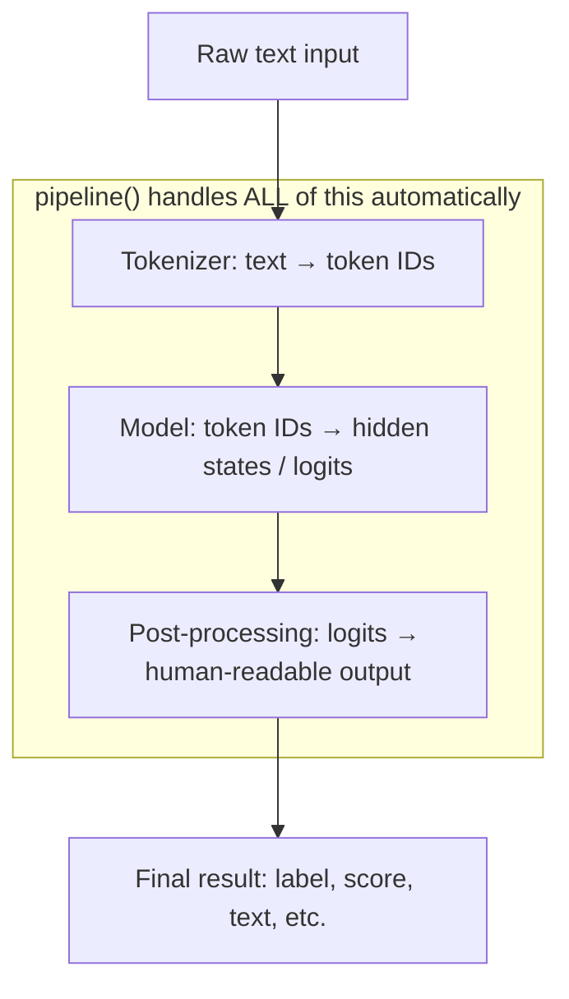

# The Transformers Library

## The Story 📖

Before the `transformers` library, using BERT or GPT meant cloning research repos with undocumented code, debugging obscure training scripts, and fighting dependency conflicts. Researchers at different companies built the same model architectures independently with no shared abstractions.

👉 This is why we need the **Transformers library** — a universal adapter that lets every developer run state-of-the-art models with one line of code.

---

## What is the Transformers Library?

The Hugging Face `transformers` Python package provides:

- **Hundreds of pre-trained model architectures** (BERT, GPT-2, T5, LLaMA, Whisper, ViT, and more)
- **The `pipeline` API** — a one-liner that handles the entire inference workflow
- **`AutoClass` system** — automatically selects the right model and tokenizer class for any Hub model
- **`from_pretrained` / `push_to_hub`** — seamless Hub integration
- **Support for PyTorch, TensorFlow, and JAX** — same API, any backend

---

## How It Works — Step by Step



### Three Layers of Abstraction

**Layer 1: pipeline API (highest level)** — one call handles everything; best for quick prototyping.

```python
from transformers import pipeline
classifier = pipeline("sentiment-analysis")
result = classifier("I love this library!")
# → [{'label': 'POSITIVE', 'score': 0.9998}]
```

**Layer 2: AutoClasses (medium level)** — load model and tokenizer separately for control over inputs/outputs.

```python
from transformers import AutoTokenizer, AutoModelForSequenceClassification
tokenizer = AutoTokenizer.from_pretrained("distilbert-base-uncased-finetuned-sst-2-english")
model = AutoModelForSequenceClassification.from_pretrained("...")
inputs = tokenizer("I love this!", return_tensors="pt")
outputs = model(**inputs)
```

**Layer 3: Direct model class (lowest level)** — import `BertModel`, `GPT2LMHeadModel`, etc. for architecture customization.

---

## The AutoClass System

Given any Hub model ID, `AutoClass` reads `config.json` to determine the architecture and instantiates the right Python class automatically.

| AutoClass | Use for |
|-----------|---------|
| `AutoTokenizer` | Any tokenizer — always use this |
| `AutoModel` | Base model (hidden states, no task head) |
| `AutoModelForSequenceClassification` | Text classification |
| `AutoModelForTokenClassification` | NER, POS tagging |
| `AutoModelForQuestionAnswering` | Extractive QA |
| `AutoModelForSeq2SeqLM` | Translation, summarization |
| `AutoModelForCausalLM` | Text generation (GPT, LLaMA) |
| `AutoModelForMaskedLM` | Fill-in-the-blank (BERT-style) |
| `AutoModelForSpeechSeq2Seq` | Speech to text (Whisper) |
| `AutoModelForImageClassification` | Image classification |

---

## Supported Pipeline Tasks

| Task string | What it does |
|-------------|-------------|
| `"sentiment-analysis"` / `"text-classification"` | Classify text into categories |
| `"token-classification"` / `"ner"` | Label individual tokens |
| `"question-answering"` | Extract answer span from context |
| `"summarization"` | Condense long text |
| `"translation"` | Translate between languages |
| `"text-generation"` | Generate continuation of a prompt |
| `"fill-mask"` | Fill in a `[MASK]` token |
| `"zero-shot-classification"` | Classify without task-specific training |
| `"automatic-speech-recognition"` | Audio → text (Whisper) |
| `"image-classification"` | Classify what's in an image |
| `"image-to-text"` | Describe an image in words |

---

## The Technical Side

The library wraps the transformer math with an **operational layer**:

- **Tokenization**: converts strings to integer IDs using `vocab.txt` / `tokenizer.json`
- **Padding / truncation**: ensures batches have uniform length for GPU matrix ops
- **Attention masks**: marks real tokens vs. padding
- **Device placement**: moves tensors to CPU or GPU
- **Output decoding**: converts logits or token IDs back to strings

---

## Common Mistakes to Avoid ⚠️

- **Mixing tokenizer and model versions** — always load both from the same checkpoint
- **Forgetting `return_tensors`** — `tokenizer(text)` returns Python lists; pass `return_tensors="pt"` for PyTorch
- **Not calling `model.eval()`** — disables dropout; pair with `torch.no_grad()` to skip gradient computation
- **Using `AutoModel` for classification** — it outputs hidden states, not predictions; use `AutoModelForSequenceClassification`
- **Pipeline default models** — `pipeline("sentiment-analysis")` uses a default model that may not suit your domain; specify `model=` in production

---

## Connection to Other Concepts 🔗

- All models come from the **Hub** (01) via `from_pretrained`
- **Datasets library** (03) produces data in the format transformers tokenizers expect
- **PEFT/LoRA** (04) wraps transformers models with adapter layers
- **Trainer API** (05) takes a transformers model and handles the training loop
- **Inference optimization** (06) techniques like quantization are applied to transformers models

---

✅ **What you just learned:** The Transformers library provides a unified API across hundreds of model architectures — from a one-liner `pipeline()` for quick use, to `AutoClasses` for full control over tokenization and inference.

🔨 **Build this now:** Run `pipeline("summarization")` on any 3-paragraph news article and print the summary. Then swap in `pipeline("sentiment-analysis")` on the same text. Two tasks, nearly identical code.

➡️ **Next step:** Learn how to load and transform training data efficiently — [03_Datasets_Library/Theory.md](../03_Datasets_Library/Theory.md).

---

## 📂 Navigation

**In this folder:**

| File | Description |
|------|-------------|
| 📄 **Theory.md** | Transformers library overview (you are here) |
| [📄 Cheatsheet.md](./Cheatsheet.md) | All pipeline tasks and AutoModel classes |
| [📄 Interview_QA.md](./Interview_QA.md) | 9 interview questions |
| [📄 Code_Example.md](./Code_Example.md) | pipeline examples for 6 tasks |
| [📄 Pipeline_Guide.md](./Pipeline_Guide.md) | Complete guide to every pipeline type |

⬅️ **Prev:** [Hub and Model Cards](../01_Hub_and_Model_Cards/Theory.md) &nbsp;&nbsp;&nbsp; ➡️ **Next:** [Datasets Library](../03_Datasets_Library/Theory.md)
