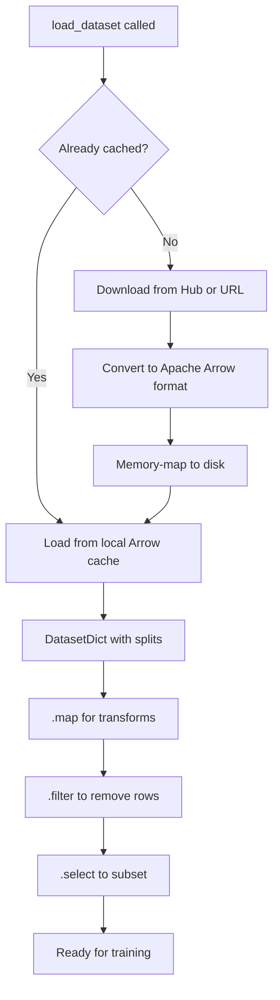

# The Datasets Library

## The Story 📖

Before the `datasets` library, AI practitioners spent up to 80% of project time finding, downloading, parsing, and cleaning data. Every dataset came in a different format — CSVs, JSONs, custom parsers — and all of it had to fit into memory before you could touch it.

👉 This is why we need the **Datasets library** — instant, consistent access to thousands of datasets with a unified API that handles downloading, caching, streaming, and transformation.

---

## 📌 Learning Priority

**Must Learn** — core concepts, needed to understand the rest of this file:
[What is the Datasets Library?](#what-is-the-datasets-library) · [How It Works](#how-it-works--step-by-step)

**Should Learn** — important for real projects and interviews:
[Streaming Mode](#streaming-mode) · [Common Mistakes](#common-mistakes-to-avoid-)

**Good to Know** — useful in specific situations, not needed daily:
[Loading Custom Datasets](#loading-custom-and-local-datasets) · [Apache Arrow](#technical-side--apache-arrow)

**Reference** — skim once, look up when needed:
[Connection to Other Concepts](#connection-to-other-concepts-)

---

## What is the Datasets Library?

A universal data loader with superpowers:

- **Loads any Hub dataset** in 2 lines (50,000+ datasets)
- **Handles large datasets** via memory mapping — process 500 GB on a laptop
- **`.map()` function** for efficient parallel data transformation
- **Direct integration** with the `transformers` training pipeline
- **Streaming mode** — process data without downloading it all first

```python
from datasets import load_dataset
ds = load_dataset("imdb")
print(ds["train"][0])
```

---

## Why It Exists — The Problem It Solves

- **Inconsistent formats**: GLUE has 9 subtasks with different column names and file structures. `load_dataset("glue", "mrpc")` gives a uniform interface for all 9.
- **Memory limitations**: Common Crawl shards are hundreds of GB — impossible to load into RAM. The library uses **memory-mapped Arrow files** so only accessed rows are in RAM.
- **Slow preprocessing**: Tokenizing 1M examples one-by-one takes hours. `.map()` supports multiprocessing in chunks, cutting hours to minutes.

---

## How It Works — Step by Step



### Step 1 — Load a dataset

```python
from datasets import load_dataset

ds = load_dataset("imdb")                  # Movie reviews
ds = load_dataset("squad")                 # Question answering
ds = load_dataset("glue", "mrpc")          # GLUE task with subset
ds = load_dataset("wmt16", "de-en")        # Translation pair

# Returns a DatasetDict with splits
# DatasetDict({
#     train: Dataset({features: ['text', 'label'], num_rows: 25000})
#     test:  Dataset({features: ['text', 'label'], num_rows: 25000})
# })
```

### Step 2 — Explore the data

```python
train_ds = ds["train"]
print(train_ds[0])           # First example as a dict
print(train_ds[0:5])         # First 5 examples as dict of lists
print(train_ds.features)
# {'text': Value(dtype='string'), 'label': ClassLabel(names=['neg', 'pos'])}
print(f"Train size: {len(train_ds)}, Columns: {train_ds.column_names}")
```

### Step 3 — Transform with `.map()`

```python
from transformers import AutoTokenizer
tokenizer = AutoTokenizer.from_pretrained("bert-base-uncased")

def tokenize_function(examples):
    return tokenizer(examples["text"], truncation=True, padding="max_length", max_length=512)

tokenized_ds = train_ds.map(
    tokenize_function,
    batched=True,           # Process multiple examples at once (faster)
    num_proc=4,             # Use 4 CPU cores in parallel
    remove_columns=["text"] # Drop original text column after tokenization
)
```

### Step 4 — Filter and select

```python
positive_ds = train_ds.filter(lambda example: example["label"] == 1)
long_ds = train_ds.filter(lambda example: len(example["text"]) > 200)
small_ds = train_ds.shuffle(seed=42).select(range(1000))  # Random 1000
```

---

## Streaming Mode

Process a dataset without downloading it first — each batch is downloaded on demand.

```python
streaming_ds = load_dataset("c4", "en", split="train", streaming=True)
for i, example in enumerate(streaming_ds):
    print(example["text"][:100])
    if i == 4:
        break

tokenized_stream = streaming_ds.map(tokenize_function, batched=True)
```

**Use streaming when:**
- Dataset is larger than your disk space
- You only need one pass (e.g., one training epoch)
- You want to start training without waiting for a full download

**Don't use streaming when:**
- You need multiple random-access passes (sorting, augmentation)
- Dataset fits on disk and you'll reuse it (cached Arrow loading is faster)

---

## Loading Custom and Local Datasets

```python
# From local files
ds = load_dataset("csv", data_files={"train": "train.csv", "test": "test.csv"})
ds = load_dataset("json", data_files="data.jsonl")
ds = load_dataset("parquet", data_files="data.parquet")
ds = load_dataset("text", data_files={"train": "train/*.txt"})

# From a pandas DataFrame
import pandas as pd
from datasets import Dataset
ds = Dataset.from_pandas(pd.read_csv("my_data.csv"))
```

---

## Technical Side — Apache Arrow

`datasets` stores data in **Apache Arrow** columnar format:

- **Columnar layout**: accessing `"text"` across 1M rows loads only that column
- **Memory mapping**: data lives on disk; the OS loads pages into RAM only when accessed — enabling 500 GB datasets on 16 GB RAM
- **Zero-copy**: Arrow data passes to PyTorch or NumPy without copying bytes

The first `.map()` call with a new function is slow (writes transformed cache to disk); every subsequent call is instant (reads from Arrow cache).

---

## Common Mistakes to Avoid ⚠️

- **Not using `batched=True` in `.map()`** — without batching, each example is processed separately, 10–50× slower
- **Forgetting `.set_format("torch")`** before passing to a DataLoader — raw `Dataset` objects return Python dicts, not tensors
- **Inconsistent `cache_dir`** — different configs create new cache entries; use `cache_dir` consistently
- **Indexing a streaming dataset** — `streaming_ds[100]` fails; streaming datasets are iterables, not indexable
- **Skipping `remove_columns` in `.map()`** — leaving the original text column wastes memory and confuses the Trainer

---

## Connection to Other Concepts 🔗

- **Transformers library** (02): tokenizers produce exactly the format that `datasets.map()` expects
- **Trainer API** (05): accepts `datasets.Dataset` directly as `train_dataset` and `eval_dataset`
- **PEFT/LoRA** (04): same `load_dataset` pattern feeds fine-tuning pipelines
- **Hub** (01): `load_dataset("name")` is the Hub equivalent of `from_pretrained("name")`

---

✅ **What you just learned:** The Datasets library provides a fast, memory-efficient interface to 50,000+ Hub datasets with consistent `.map()`, `.filter()`, and streaming APIs that plug directly into the transformers training ecosystem.

🔨 **Build this now:** Run `load_dataset("imdb")`, call `.map()` to add a word-count column (`len(example["text"].split())`), then use `.filter()` to keep only reviews with more than 100 words. Print the new dataset size.

➡️ **Next step:** Learn how to adapt large models to your data efficiently — [04_PEFT_and_LoRA/Theory.md](../04_PEFT_and_LoRA/Theory.md).

---

## 📂 Navigation

**In this folder:**

| File | Description |
|------|-------------|
| 📄 **Theory.md** | Datasets library overview (you are here) |
| [📄 Cheatsheet.md](./Cheatsheet.md) | Key functions and transforms at a glance |
| [📄 Interview_QA.md](./Interview_QA.md) | 9 interview questions |
| [📄 Code_Example.md](./Code_Example.md) | Loading, transforming, streaming examples |

⬅️ **Prev:** [Transformers Library](../02_Transformers_Library/Theory.md) &nbsp;&nbsp;&nbsp; ➡️ **Next:** [PEFT and LoRA](../04_PEFT_and_LoRA/Theory.md)
