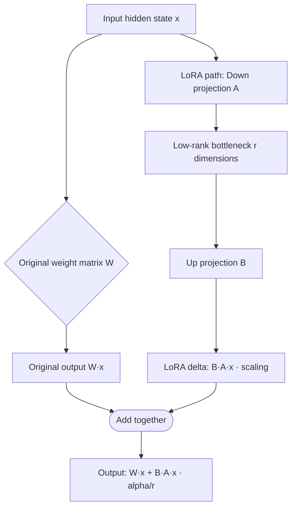
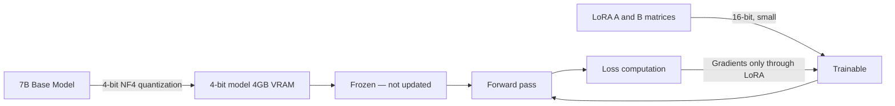

# PEFT and LoRA — Parameter-Efficient Fine-Tuning

## The Story 📖

You want to teach a world-class professor a new specialty — say, tax law. You don't need to re-educate them from scratch, putting them back through kindergarten and undergraduate school. You just add a focused specialization course on top of everything they already know. Two months later, they're a tax expert. Their general intelligence and knowledge base are untouched; you only updated a small slice. LoRA does exactly this for AI models — instead of retraining 7 billion parameters, you inject a tiny trainable module that specializes the model for your task, while the original weights stay completely frozen.

👉 This is why we need **PEFT (Parameter-Efficient Fine-Tuning)** — it makes fine-tuning massive language models accessible to anyone with a single GPU.

---

## What is PEFT?

**PEFT** is a category of techniques for fine-tuning large language models (LLMs) while updating only a small fraction of the total parameters. Instead of unfreezing and training all 7B+ parameters of a model (which requires 100GB+ of GPU memory), PEFT methods add small trainable components while keeping the original weights frozen.

Think of it as the difference between renovating an entire skyscraper versus just redecorating a few offices. The building (base model) stays the same; you only modify specific rooms (adapter layers).

**The main PEFT methods:**
- **LoRA** (Low-Rank Adaptation) — injects small trainable matrices into attention layers
- **QLoRA** — LoRA on top of a 4-bit quantized base model (even more memory efficient)
- **Prefix Tuning** — prepends trainable "virtual tokens" to the input
- **Prompt Tuning** — learns soft tokens prepended to every input
- **IA³** — scales internal model activations with small learned vectors

LoRA and QLoRA are by far the most widely used in practice.

---

## Why It Exists — The Problem It Solves

**Problem 1 — Full fine-tuning requires enormous GPU memory.** Fine-tuning LLaMA-7B from scratch requires storing the model weights (14GB in FP16), gradients (14GB), and optimizer states (28GB for AdamW) — roughly 56GB total. No consumer GPU has this much VRAM.

**Problem 2 — Full fine-tuning is slow and expensive.** Training all parameters through backpropagation on a 7B model takes weeks on expensive A100 GPUs, costing thousands of dollars per run.

**Problem 3 — Storing multiple fine-tuned models is impractical.** If you fine-tune the same base model for 10 different use cases, you need to store 10 copies of 14GB = 140GB of weights. With LoRA, you store the base model once and only small LoRA adapter files (~50MB each) for each use case.

---

## How LoRA Works — Step by Step



### The Core Idea — Low-Rank Decomposition

A weight matrix in a transformer might be 4096 × 4096 = 16.7 million parameters. LoRA doesn't modify this matrix directly. Instead, it adds two small matrices alongside it:

- **Matrix A**: shape `[4096 × r]` — down-project to rank `r`
- **Matrix B**: shape `[r × 4096]` — up-project back to original dimension

Where `r` is the **rank** — typically 4, 8, 16, or 64. The update to the original weight is `ΔW = B × A`.

If `r = 8` and the original matrix is 4096 × 4096:
- Original parameters: 4096 × 4096 = 16,777,216
- LoRA parameters: (4096 × 8) + (8 × 4096) = 65,536 — just **0.39%** of the original!

### The Math

At initialization:
- A is initialized with **random Gaussian** values
- B is initialized to **zeros** (so the initial LoRA output is zero — the model starts unchanged)

During forward pass:
```
output = W·x + (B·A·x) × (alpha / r)
```

Where `alpha` is a scaling factor (usually set equal to `r` or twice `r`). During training, only A and B are updated. W stays frozen.

After training, you can **merge** the LoRA weights into W: `W_new = W + B·A × (alpha/r)`. This gives you a fine-tuned model with no inference overhead — it looks like a regular model.

---

## QLoRA — Making LoRA Even More Accessible

**QLoRA** (Quantized LoRA) combines two ideas:

1. **4-bit quantization of the base model** — compress the frozen base model weights from 16-bit floats to 4-bit integers, reducing memory from 14GB to ~4GB for a 7B model
2. **LoRA adapters in 16-bit** — the trainable LoRA matrices remain in full precision for accurate gradient computation

The result: you can fine-tune a 7B model on a consumer GPU with just 6-10GB of VRAM. This is what made running LLM fine-tuning accessible on a single RTX 3090 or 4090.



The key innovation: gradients don't flow through the frozen quantized base model (which would require dequantization), only through the small LoRA matrices.

---

## Key Hyperparameters

### `r` — Rank
Controls the "capacity" of the adapter. Higher rank = more expressive = more parameters.
- `r=4` — very lightweight, good for simple task adaptation
- `r=8` — good default for most tasks
- `r=16` — better for complex tasks that need more capacity
- `r=64` — high capacity, used for continued pretraining-style adaptation

### `lora_alpha` — Scaling Factor
Controls how strongly the LoRA update is applied. Effectively scales the learning rate of LoRA.
- Common rule: set `alpha = r` (e.g., `r=8, alpha=8`) or `alpha = 2*r`
- Higher alpha = stronger LoRA update relative to frozen weights

### `target_modules` — Which Layers to Apply LoRA To
Controls which weight matrices in the model get LoRA adapters.
- For transformer models: typically `["q_proj", "v_proj"]` (query and value matrices in attention)
- More aggressive: `["q_proj", "k_proj", "v_proj", "o_proj"]` (all attention projections)
- Maximum: include FFN layers too: `["q_proj", "v_proj", "gate_proj", "up_proj", "down_proj"]`

### `lora_dropout`
Dropout probability applied to the LoRA layers during training. Regularizes the adapters.
- Typical: 0.05 to 0.1

---

## Where You'll See This in Real AI Systems

- **Open-source LLM fine-tuning** — virtually every publicly shared fine-tuned LLaMA/Mistral model was trained with LoRA or QLoRA. The Alpaca, Vicuna, and WizardLM models all used LoRA-based training.
- **Domain adaptation at companies** — fine-tuning a base LLM on company documents, customer support logs, or legal text. LoRA adapters are stored per-department and hot-swapped.
- **Personal fine-tuning** — Hugging Face's AutoTrain and tools like Axolotl make LoRA fine-tuning accessible to non-ML engineers
- **Research** — virtually all LLM fine-tuning papers in 2023-2024 used QLoRA as the efficiency baseline

---

## Common Mistakes to Avoid ⚠️

- **Using too low a rank for a complex task** — `r=4` might not have enough capacity to learn complex coding or reasoning tasks; try `r=16` or `r=32` first
- **Forgetting to merge weights before deployment** — during training, LoRA adds inference overhead. Merge with `model.merge_and_unload()` for production to eliminate this.
- **Not specifying `target_modules` correctly** — wrong module names fail silently or target zero layers. Always check `model.named_modules()` or the model's docs.
- **Using `load_in_4bit=True` without `bitsandbytes`** — QLoRA requires the `bitsandbytes` library; install it with `pip install bitsandbytes`
- **Training without gradient checkpointing** — for large models, enable `gradient_checkpointing=True` to trade compute for memory during backpropagation

---

## Connection to Other Concepts 🔗

- **Transformers library** (02_Transformers_Library) provides the base models that PEFT adapts
- **Datasets library** (03_Datasets_Library) provides the training data fed to PEFT fine-tuning
- **Trainer API** (05_Trainer_API) orchestrates the training loop for PEFT models — pass a PEFT model directly to `Trainer`
- **Inference optimization** (06_Inference_Optimization) — QLoRA's quantization is closely related to the INT4 quantization techniques discussed there
- The `peft` library is made by Hugging Face and integrates directly with `transformers` and `trl` (the RLHF/SFT training library)

---

✅ **What you just learned:** LoRA fine-tunes large models by injecting tiny trainable low-rank matrices into frozen attention layers, reducing trainable parameters by 99%+ while retaining task adaptation quality. QLoRA extends this by also quantizing the base model to 4-bit precision.

🔨 **Build this now:** Install `peft` and `bitsandbytes`, load a small model (`facebook/opt-350m`), wrap it with `LoraConfig(r=8, target_modules=["q_proj", "v_proj"])`, and print the number of trainable vs total parameters using `model.print_trainable_parameters()`.

➡️ **Next step:** Learn how to manage the full training loop with the Trainer API — [05_Trainer_API/Theory.md](../05_Trainer_API/Theory.md).

---

## 🛠️ Practice Projects

Apply what you just learned:
- → **[I4: Custom LoRA Fine-Tuning](../../20_Projects/01_Intermediate_Projects/04_Custom_LoRA_Fine_Tuning/Project_Guide.md)** — LoRA fine-tune a 7B model on custom Q&A data, push adapter to Hub
- → **[A5: Fine-Tune → Evaluate → Deploy](../../20_Projects/02_Advanced_Projects/05_Fine_Tune_Evaluate_Deploy/Project_Guide.md)** — QLoRA with 4-bit quantization for maximum efficiency

---

## 📂 Navigation

**In this folder:**

| File | Description |
|------|-------------|
| 📄 **Theory.md** | PEFT and LoRA explained from scratch (you are here) |
| [📄 Cheatsheet.md](./Cheatsheet.md) | LoRA hyperparameters and comparison table |
| [📄 Interview_QA.md](./Interview_QA.md) | 9 interview questions |
| [📄 Code_Example.md](./Code_Example.md) | LoRA fine-tuning with PEFT library |
| [📄 When_to_Use.md](./When_to_Use.md) | Decision guide: full fine-tune vs LoRA vs QLoRA |

⬅️ **Prev:** [Datasets Library](../03_Datasets_Library/Theory.md) &nbsp;&nbsp;&nbsp; ➡️ **Next:** [Trainer API](../05_Trainer_API/Theory.md)
