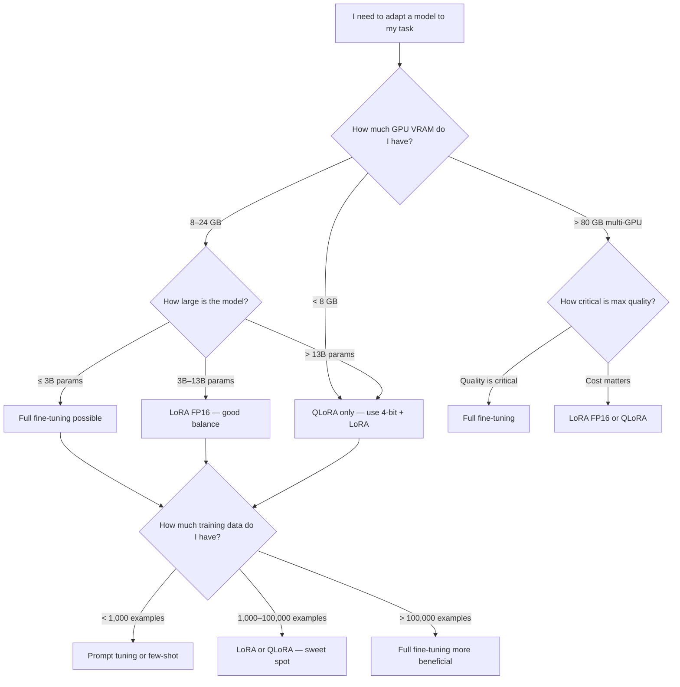

# PEFT Fine-Tuning — When to Use What

A decision guide for choosing between full fine-tuning, LoRA, QLoRA, and prompt-based approaches.

---

## The Big Picture Decision Tree



---

## Approach Comparison Table

| | Full Fine-Tune | LoRA (FP16) | QLoRA (INT4) | Prompt Tuning |
|---|---|---|---|---|
| **Min VRAM (7B model)** | ~56 GB | ~16 GB | ~6–10 GB | ~14 GB |
| **Trainable params** | 100% | 0.1–1% | 0.1–1% | <0.01% |
| **Training speed** | Slowest | Fast | Fast | Fastest |
| **Quality ceiling** | Best | Near-best | Slightly below LoRA | Weakest |
| **Storage per model** | 14 GB | ~50–200 MB adapter | ~50–200 MB adapter | <1 MB |
| **Multiple task variants** | Need 10× 14 GB | One base + small adapters | One base + small adapters | One base + tiny prompts |
| **Inference overhead** | None | Small (removed by merge) | Small (removed by merge) | None |
| **Deployment complexity** | Simple | Slightly complex (merge first) | Slightly complex (merge first) | Simple |

---

## When to Use Each Approach

### Full Fine-Tuning

**Use when:**
- You have multi-GPU machines with 80+ GB VRAM (A100s or H100s)
- Maximum quality on your task is critical (e.g., medical, legal, safety-critical)
- You have a large, high-quality labeled dataset (100K+ examples)
- You're doing continued pretraining (adapting the model's general knowledge, not just task format)
- You need to modify the model's tokenizer or embedding layer

**Avoid when:**
- Hardware is limited
- You need multiple task-specific variants of the same base model
- You want to keep adapters separate from the base model for sharing

**Typical examples:** Training GPT-from-scratch on domain corpora, full BERT fine-tuning on large NER datasets, fine-tuning Whisper on specialized audio domains.

---

### LoRA (FP16 base model)

**Use when:**
- You have 16–24 GB VRAM
- You need high quality close to full fine-tuning
- You want clean adapter files that can be shared and swapped
- You're doing instruction tuning, chat fine-tuning, or domain adaptation
- The model is up to 7B parameters on consumer hardware or 13B on datacenter GPUs

**Avoid when:**
- VRAM is very limited (< 12 GB) — use QLoRA instead
- Your task requires very large rank (r > 64) — approaches full fine-tuning cost

**Typical examples:** Fine-tuning LLaMA-7B for customer support, adapting Mistral-7B for SQL generation, specializing BERT for domain-specific NER.

---

### QLoRA (4-bit base model + LoRA)

**Use when:**
- You have 6–12 GB VRAM (RTX 3090/4090, A10, T4)
- You want LoRA benefits but can't afford FP16 model loading
- You're fine-tuning 7B–13B models on consumer hardware
- Budget is the primary constraint

**Avoid when:**
- You can afford LoRA FP16 — QLoRA is slightly lower quality due to quantization
- Your task is very sensitivity-critical (the tiny quality loss may matter)
- You're training very small models (< 1B) — quantization overhead not worth it

**Typical examples:** Personal fine-tuning of LLaMA on a gaming GPU, startup with limited cloud budget, academic research with single-GPU constraint.

---

### Prompt Tuning (Soft Prompts)

**Use when:**
- The model is very large (> 10B) and already quite capable
- You need an extremely lightweight adaptation (< 1 MB)
- You're switching between many tasks frequently
- You cannot modify model weights (API-only access simulation)

**Avoid when:**
- The model is < 3B parameters — prompt tuning doesn't work well at this scale
- Your task requires significant behavior change from the base model
- Quality matters — LoRA significantly outperforms prompt tuning in most benchmarks

**Typical examples:** Adapting GPT-3 (API-accessible) style models, switching between 50+ task variants where storage is a concern.

---

### Few-Shot Prompting (No Training at All)

**Use when:**
- You have fewer than 50–100 labeled examples
- You want results immediately with zero training
- You're prototyping and not sure the task is viable
- The model is already very capable for your task

**Avoid when:**
- You have 1,000+ high-quality examples — training will outperform prompting
- Consistent output format is critical — prompting is less reliable than fine-tuning
- Latency is important — long few-shot prompts add tokens and increase cost

---

## Hardware Requirements Summary

| GPU | VRAM | Max model (LoRA FP16) | Max model (QLoRA INT4) |
|-----|------|-----------------------|------------------------|
| RTX 3060 | 12 GB | 3B | 7B |
| RTX 3090 / 4090 | 24 GB | 7B | 13B |
| A10G | 24 GB | 7B | 13B |
| A100 40GB | 40 GB | 13B | 30B+ |
| A100 80GB | 80 GB | 30B | 65B+ |
| 2× A100 80GB | 160 GB | 65B | 70B+ |

*Approximate values. Actual VRAM usage depends on batch size, sequence length, and optimizer.*

---

## The Practical Recommendation for Most Situations

If you're starting out and have a single GPU with 16–24 GB VRAM, use **QLoRA**:

```python
from transformers import BitsAndBytesConfig
from peft import LoraConfig

bnb_config = BitsAndBytesConfig(
    load_in_4bit=True,
    bnb_4bit_quant_type="nf4",
    bnb_4bit_compute_dtype=torch.bfloat16,
    bnb_4bit_use_double_quant=True,
)

lora_config = LoraConfig(
    r=16,
    lora_alpha=32,
    target_modules=["q_proj", "v_proj"],
    lora_dropout=0.05,
    bias="none",
    task_type="CAUSAL_LM",
)
```

Start here. Increase `r` if quality is insufficient. Move to LoRA FP16 if you can afford the VRAM. Consider full fine-tuning only if you have datacenter-grade hardware and a specific quality requirement that LoRA cannot meet.

---

## 📂 Navigation

**In this folder:**

| File | Description |
|------|-------------|
| [📄 Theory.md](./Theory.md) | Full PEFT and LoRA explanation |
| [📄 Cheatsheet.md](./Cheatsheet.md) | Quick reference |
| [📄 Interview_QA.md](./Interview_QA.md) | 9 interview questions |
| [📄 Code_Example.md](./Code_Example.md) | Working code examples |
| 📄 **When_to_Use.md** | Decision guide (you are here) |

⬅️ **Prev:** [Datasets Library](../03_Datasets_Library/Theory.md) &nbsp;&nbsp;&nbsp; ➡️ **Next:** [Trainer API](../05_Trainer_API/Theory.md)
