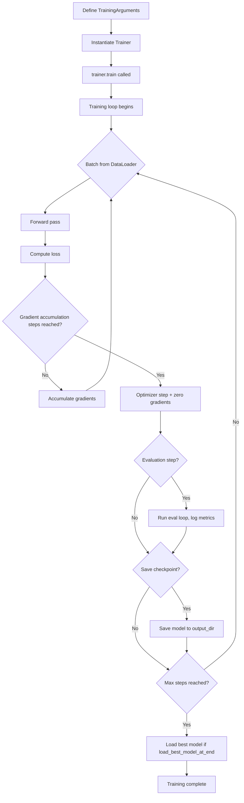

# The Trainer API

## The Story 📖

Managing a construction project yourself means tracking every worker's hours, ordering materials at the right time, coordinating inspections, and making sure the budget doesn't run over — all while trying to do the actual construction. Most projects fail because of management overhead, not because of bad workers. Writing a PyTorch training loop from scratch has the same problem: you spend 80% of your time on boilerplate — gradient accumulation, mixed precision, evaluation loops, checkpoint saving, logging — and only 20% on the actual model. The Trainer API is hiring a professional project manager who handles all of it.

👉 This is why we need the **Trainer API** — it manages the entire training workflow so you can focus on your model and data, not the training infrastructure.

---

## What is the Trainer API?

Think of `Trainer` as a pre-built training loop with every feature already implemented. You provide the model, data, and configuration — it handles everything else.

The `Trainer` class in `transformers`:
- Runs train, evaluation, and prediction loops
- Handles **gradient accumulation** (simulate larger batch sizes)
- Handles **mixed precision training** (FP16/BF16 for speed)
- Handles **distributed training** (multiple GPUs with one code change)
- Saves **checkpoints** and loads the best one automatically
- Logs metrics to **TensorBoard, Weights & Biases, MLflow**, or the console
- Provides a **callback system** for customization
- Works with PyTorch, and integrates with `accelerate` under the hood

---

## Why It Exists — The Problem It Solves

**Problem 1 — Boilerplate.** A complete PyTorch training loop with evaluation, gradient accumulation, mixed precision, and checkpointing is 200-400 lines of code that must be written and debugged for every project. `Trainer` reduces this to a `TrainingArguments` object and `trainer.train()`.

**Problem 2 — Distributed training complexity.** Making code run on 4 GPUs instead of 1 normally requires major refactoring (DataParallel, DistributedDataParallel, `torchrun` scripts). With `Trainer`, passing `--nproc_per_node=4` to the launch command is all that changes.

**Problem 3 — Inconsistent training configurations.** Different engineers write slightly different training loops with different evaluation frequencies, logging schemes, and saving strategies, making it hard to reproduce results. `TrainingArguments` makes all these choices explicit and version-controllable.

---

## How It Works — Step by Step



### Step 1 — Define TrainingArguments

This is where all training hyperparameters live:

```python
from transformers import TrainingArguments

args = TrainingArguments(
    output_dir="./my-model",           # Where to save checkpoints
    num_train_epochs=3,                # Number of epochs
    per_device_train_batch_size=16,    # Batch size per GPU
    per_device_eval_batch_size=32,     # Eval batch size per GPU
    learning_rate=2e-5,                # Learning rate
    evaluation_strategy="epoch",       # Eval after each epoch
    save_strategy="epoch",             # Save after each epoch
    load_best_model_at_end=True,       # Load best checkpoint at end
    metric_for_best_model="accuracy",  # Which metric defines "best"
    fp16=True,                         # Mixed precision training
)
```

### Step 2 — Instantiate Trainer

```python
from transformers import Trainer

trainer = Trainer(
    model=model,
    args=args,
    train_dataset=tokenized_train,
    eval_dataset=tokenized_eval,
    tokenizer=tokenizer,
    compute_metrics=compute_metrics,   # Optional: custom metric function
    data_collator=data_collator,       # Optional: custom batching
)
```

### Step 3 — Train and Evaluate

```python
trainer.train()         # Run the full training loop
trainer.evaluate()      # Run evaluation on eval_dataset
trainer.predict(test)   # Get predictions on test set
trainer.save_model()    # Save final model
```

---

## TrainingArguments — Key Parameters Explained

### Batch Size and Gradient Accumulation

```python
per_device_train_batch_size=16,  # Actual batch per GPU
gradient_accumulation_steps=4,   # Effective batch = 16 × 4 = 64
```

**Why gradient accumulation?** If you want an effective batch size of 64 but only have VRAM for 16 examples at once, you process 4 mini-batches of 16, accumulate gradients without updating, then perform one optimizer step. The model sees a "virtual" batch of 64.

### Learning Rate and Warmup

```python
learning_rate=2e-5,
warmup_ratio=0.1,       # First 10% of steps are warmup
warmup_steps=500,       # OR specify steps directly (overrides ratio)
lr_scheduler_type="linear",  # "cosine", "polynomial", "constant", etc.
```

**Warmup** gradually increases the learning rate from 0 to the target value at the start of training. Without warmup, large initial gradients can destabilize training early on.

### Evaluation and Saving

```python
evaluation_strategy="steps",  # "no", "steps", "epoch"
eval_steps=500,               # Eval every 500 steps (when strategy="steps")
save_strategy="steps",        # "no", "steps", "epoch"
save_steps=500,
save_total_limit=3,           # Keep only the 3 most recent checkpoints
load_best_model_at_end=True,  # Reload best checkpoint after training finishes
metric_for_best_model="f1",   # Which metric determines "best"
greater_is_better=True,       # Is higher metric better?
```

### Precision and Speed

```python
fp16=True,            # FP16 mixed precision (NVIDIA GPUs)
bf16=True,            # BF16 mixed precision (Ampere+ GPUs, better numerical stability)
# Note: use fp16 OR bf16, not both

tf32=True,            # Enable TF32 on Ampere+ GPUs (CUDA default for matmuls)

dataloader_num_workers=4,  # Parallel data loading workers
group_by_length=True,      # Group similar-length sequences — reduces padding waste
```

### Logging

```python
logging_steps=100,           # Log every 100 steps
logging_dir="./logs",        # TensorBoard log directory
report_to="wandb",           # "tensorboard", "wandb", "mlflow", "none"
run_name="my-experiment",    # Name for W&B or MLflow run
```

---

## compute_metrics — Custom Evaluation

```python
import numpy as np
from sklearn.metrics import accuracy_score, f1_score

def compute_metrics(eval_pred):
    logits, labels = eval_pred
    predictions = np.argmax(logits, axis=-1)
    return {
        "accuracy": accuracy_score(labels, predictions),
        "f1": f1_score(labels, predictions, average="weighted"),
    }
```

The function receives `eval_pred`, a named tuple with `(logits, labels)`. Return a dict of metric name → float value. The Trainer logs all these automatically.

---

## Callbacks — Extending Trainer Behavior

**Callbacks** let you inject custom logic at specific training events without modifying the training loop. They're like event handlers.

```python
from transformers import TrainerCallback

class EarlyStoppingCallback(TrainerCallback):
    def __init__(self, patience=3):
        self.patience = patience
        self.best_metric = None
        self.no_improvement_count = 0

    def on_evaluate(self, args, state, control, metrics, **kwargs):
        current = metrics.get("eval_f1")
        if self.best_metric is None or current > self.best_metric:
            self.best_metric = current
            self.no_improvement_count = 0
        else:
            self.no_improvement_count += 1
            if self.no_improvement_count >= self.patience:
                control.should_training_stop = True  # Stop training
        return control
```

**Built-in callbacks:**
- `EarlyStoppingCallback` — stops training when metrics stop improving
- `TensorBoardCallback` — writes logs to TensorBoard
- `WandbCallback` — sends metrics to Weights & Biases
- `ProgressCallback` — shows the progress bar

---

## The Data Collator

A **data collator** controls how individual examples are batched together. The most common one is `DataCollatorWithPadding`, which pads sequences dynamically (to the longest sequence in each batch, not globally).

```python
from transformers import DataCollatorWithPadding

data_collator = DataCollatorWithPadding(
    tokenizer=tokenizer,
    padding=True,
    return_tensors="pt"
)

trainer = Trainer(
    ...
    data_collator=data_collator,   # Dynamic padding per batch = less waste
)
```

Dynamic padding vs static padding: static padding pads all sequences to `max_length` (512 tokens) wasting compute on short sequences. Dynamic padding pads to the max length in each batch, often much shorter — reducing wasted computation by 30-50%.

---

## Where You'll See This in Real AI Systems

- **Fine-tuning pipelines** at virtually every company using Hugging Face models — `Trainer` is the standard interface
- **Automated ML platforms** like Hugging Face AutoTrain use `Trainer` internally
- **Research code** — most HF-based papers use `Trainer` to ensure reproducible training configurations via `TrainingArguments`
- **Multi-GPU training** — `Trainer` + `accelerate` makes distributed training require zero code changes

---

## Common Mistakes to Avoid ⚠️

- **Not setting `evaluation_strategy` and `save_strategy` to match** — if `evaluation_strategy="epoch"` but `save_strategy="steps"`, `load_best_model_at_end=True` won't work
- **Forgetting `group_by_length=True`** for variable-length data — leads to wasteful padding
- **Using `fp16=True` on CPUs** — FP16 only speeds up on GPUs; on CPU it can be slower or cause errors
- **Setting `num_train_epochs` without knowing steps** — use `max_steps` for streaming datasets where epoch length is unknown
- **Not defining `compute_metrics`** when using `load_best_model_at_end=True` with a custom metric — Trainer won't know what to optimize unless you tell it

---

## Connection to Other Concepts 🔗

- **Transformers library** (02_Transformers_Library) provides the models — pass `AutoModelForXxx` directly to `Trainer`
- **Datasets library** (03_Datasets_Library) — `Dataset` objects plug directly into `train_dataset` and `eval_dataset`
- **PEFT/LoRA** (04_PEFT_and_LoRA) — pass a `PeftModel` to `Trainer` just like a regular model
- **Inference optimization** (06_Inference_Optimization) — after training, optimize the saved model for deployment

---

✅ **What you just learned:** The Trainer API encapsulates the entire PyTorch training loop — gradient accumulation, mixed precision, evaluation, checkpointing, logging, and callbacks — behind a simple `Trainer(model, args, data).train()` interface.

🔨 **Build this now:** Take the tokenized IMDB dataset from Section 03, wrap DistilBERT with `AutoModelForSequenceClassification`, create a `TrainingArguments` with `num_train_epochs=1` and `evaluation_strategy="epoch"`, and run `trainer.train()`. Watch the loss go down.

➡️ **Next step:** Learn how to make your trained model run faster and cheaper in production — [06_Inference_Optimization/Theory.md](../06_Inference_Optimization/Theory.md).

---

## 🛠️ Practice Project

Apply what you just learned → **[I4: Custom LoRA Fine-Tuning](../../22_Capstone_Projects/09_Custom_LoRA_Fine_Tuning/03_GUIDE.md)**
> This project uses: SFTTrainer from TRL (built on Trainer), TrainingArguments, callbacks, logging training loss

---

## 📂 Navigation

**In this folder:**

| File | Description |
|------|-------------|
| 📄 **Theory.md** | Trainer API overview and key parameters (you are here) |
| [📄 Cheatsheet.md](./Cheatsheet.md) | TrainingArguments and callbacks cheat sheet |
| [📄 Interview_QA.md](./Interview_QA.md) | 9 interview questions |
| [📄 Code_Example.md](./Code_Example.md) | Full training loop with Trainer |

⬅️ **Prev:** [PEFT and LoRA](../04_PEFT_and_LoRA/Theory.md) &nbsp;&nbsp;&nbsp; ➡️ **Next:** [Inference Optimization](../06_Inference_Optimization/Theory.md)
