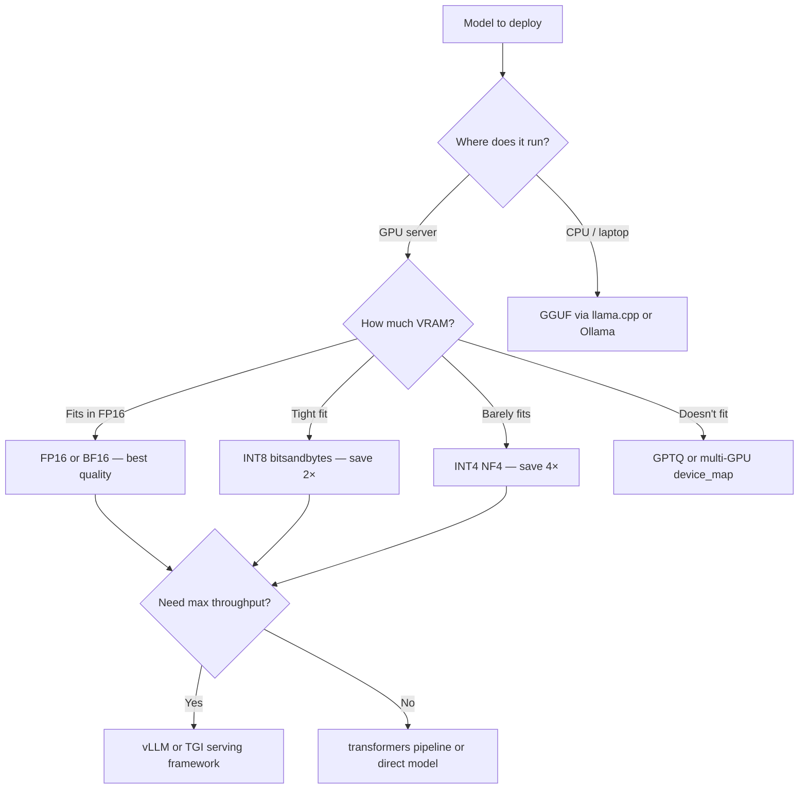

# Inference Approaches — Comparison Guide

A practical side-by-side comparison of full precision, INT8, INT4, and GGUF inference.

---

## The Big Picture



---

## Comparison Table

| Approach | Storage Format | VRAM (7B) | Load Time | Inference Speed | Quality Loss | GPU Required |
|----------|---------------|-----------|-----------|-----------------|--------------|--------------|
| **FP32** | `.safetensors` FP32 | ~28 GB | Slow | 1× baseline | None | Yes |
| **FP16** | `.safetensors` FP16 | ~14 GB | Fast | 1.5–2× | Negligible | Yes |
| **BF16** | `.safetensors` BF16 | ~14 GB | Fast | 1.5–2× | Negligible | Ampere+ GPU |
| **INT8** (bitsandbytes) | FP16 + quantize at load | ~7 GB | Moderate | ~1.5× | Very small | Yes (CUDA) |
| **INT4 NF4** (bitsandbytes) | FP16 + quantize at load | ~4 GB | Moderate | ~1.5× | Small | Yes (CUDA) |
| **GPTQ** | Pre-quantized INT4 | ~4 GB | Fast | 2–3× | Small | Yes |
| **GGUF Q4_K_M** | Pre-quantized mixed 4-bit | ~4 GB | Fast | CPU: 3–15 t/s | Small | No |
| **GGUF Q8_0** | Pre-quantized INT8 | ~7 GB | Fast | CPU: 1–5 t/s | Tiny | No |

*Token generation rates for GGUF on CPU assume modern laptop (Apple M-series or Intel Core Ultra).*

---

## FP32 — Full Precision

```python
from transformers import AutoModelForCausalLM
import torch

model = AutoModelForCausalLM.from_pretrained("facebook/opt-1.3b")
# Default dtype = FP32 if no torch_dtype specified
```

**When to use:**
- Training (FP32 gradients provide stability)
- Testing correctness of a new model (verify outputs before quantizing)
- Small models (< 500M params) where memory is not a concern

**When NOT to use:**
- Any GPU inference with models > 1B parameters
- Production serving (wastes VRAM and is slower than FP16)

---

## FP16 / BF16 — Half Precision

```python
model = AutoModelForCausalLM.from_pretrained(
    "facebook/opt-1.3b",
    torch_dtype=torch.float16,   # or torch.bfloat16
    device_map="auto"
)
```

**When to use:**
- Default for all GPU inference — start here
- FP16: NVIDIA V100, T4, A10G
- BF16: NVIDIA A100, H100, RTX 3090/4090 (Ampere+); better numerical stability

**Quality impact:** Effectively zero for inference. FP16 has been standard for production inference for years.

**Speed gain:** 1.5-2× vs FP32 on Tensor Core GPUs. Free performance.

---

## INT8 — 8-bit Quantization (bitsandbytes LLM.int8())

```python
model = AutoModelForCausalLM.from_pretrained(
    "facebook/opt-1.3b",
    load_in_8bit=True,
    device_map="auto"
)
```

**When to use:**
- Model fits in FP16 but you want to serve more requests per GPU (smaller footprint = more concurrent requests)
- Model barely fits in FP16 and you need a buffer
- Fast production inference with very high quality requirements (INT8 is near-lossless)

**Quality impact:** Very small for most tasks. The LLM.int8() algorithm handles outlier features in FP16 to minimize accuracy loss.

**Limitation:** Cannot use for fine-tuning without additional handling (`prepare_model_for_kbit_training`).

---

## INT4 — 4-bit Quantization (NF4 / bitsandbytes)

```python
from transformers import BitsAndBytesConfig
import torch

bnb_config = BitsAndBytesConfig(
    load_in_4bit=True,
    bnb_4bit_quant_type="nf4",
    bnb_4bit_compute_dtype=torch.bfloat16,
    bnb_4bit_use_double_quant=True,
)

model = AutoModelForCausalLM.from_pretrained(
    "meta-llama/Llama-2-7b-hf",
    quantization_config=bnb_config,
    device_map="auto"
)
```

**When to use:**
- Model doesn't fit in VRAM at INT8 (very limited hardware)
- Fine-tuning large models (QLoRA — see Section 04)
- Running 7B models on consumer GPUs (RTX 3090: 24GB → 4GB needed = fits easily)

**Quality impact:** Noticeable but often acceptable. Generation quality may degrade on complex reasoning tasks. Test on your specific use case.

**Advantage over GPTQ:** No calibration dataset needed; quantize any model instantly at load time.

---

## GPTQ — Pre-quantized INT4 (Offline Optimization)

```python
# pip install auto-gptq
from auto_gptq import AutoGPTQForCausalLM
from transformers import AutoTokenizer

model = AutoGPTQForCausalLM.from_quantized(
    "TheBloke/Llama-2-7B-GPTQ",   # Pre-quantized model on Hub
    device="cuda:0",
    use_safetensors=True,
)
```

**How it differs from bitsandbytes INT4:**
GPTQ uses a calibration dataset and optimizes quantization weights layer-by-layer using the Optimal Brain Surgeon algorithm. The result is a pre-quantized model file with lower quantization error than dynamic quantization.

**When to use:**
- Production GPU deployment where you want best quality at INT4
- You have a calibration dataset representative of your task
- You can afford the one-time quantization computation (~1-4 hours for 7B model)

**Find pre-quantized models:** TheBloke on Hugging Face Hub hosts thousands of GPTQ models: search for `TheBloke/{model-name}-GPTQ`.

---

## GGUF — CPU-Optimized Quantization (llama.cpp / Ollama)

```python
# Option A: Use via Ollama (easiest for local use)
# curl https://ollama.ai/install.sh | sh
# ollama run llama2  # Downloads GGUF, runs inference

# Option B: Use via ctransformers Python library
from ctransformers import AutoModelForCausalLM as CTAutoModel

model = CTAutoModel.from_pretrained(
    "TheBloke/Llama-2-7B-GGUF",
    model_file="llama-2-7b.Q4_K_M.gguf",  # Specific GGUF file
    model_type="llama"
)
result = model("The capital of France is")

# Option C: Use via llama-cpp-python
from llama_cpp import Llama
llm = Llama(model_path="./llama-2-7b.Q4_K_M.gguf", n_ctx=4096)
output = llm("Hello, I am a", max_tokens=50)
print(output['choices'][0]['text'])
```

**GGUF quantization levels:**

| Level | Bits/weight | 7B VRAM | Quality |
|-------|------------|---------|---------|
| Q2_K | ~2.6 | ~2.9 GB | Weak |
| Q4_0 | ~4.5 | ~3.8 GB | Good |
| Q4_K_M | ~4.8 | ~4.1 GB | Better (recommended) |
| Q5_K_M | ~5.7 | ~4.8 GB | Very good |
| Q8_0 | ~8.5 | ~7.2 GB | Near-perfect |

**When to use GGUF:**
- Running locally without a GPU (laptop, desktop CPU)
- macOS on Apple Silicon (M1/M2/M3) — Metal GPU support available
- Privacy-sensitive applications (model stays completely local)
- Building local AI assistants (Ollama provides an OpenAI-compatible API)

**Performance on Apple M2 Pro:**
- Q4_K_M 7B: ~35 tokens/second (real-time, responsive)
- Q8_0 7B: ~20 tokens/second (slightly slower but higher quality)

---

## Decision Guide

```
My use case is:
├── GPU server with plenty of VRAM
│   └── Use FP16 / BF16 — no reason to quantize
│
├── GPU server, VRAM is limited
│   ├── Model fits in INT8
│   │   └── Use bitsandbytes INT8 — near-lossless
│   ├── Model fits only in INT4
│   │   ├── Need best quality → GPTQ
│   │   └── Dynamic / fast setup → bitsandbytes NF4
│   └── Model doesn't fit even in INT4
│       └── Use device_map="auto" with INT4 + multi-GPU
│
├── Training / fine-tuning a large model
│   └── QLoRA (INT4 bitsandbytes NF4 + LoRA) — see Section 04
│
└── Running locally without GPU (CPU only)
    └── GGUF via Ollama or llama-cpp-python
        └── Recommended: Q4_K_M for balance of quality and speed
```

---

## 📂 Navigation

**In this folder:**

| File | Description |
|------|-------------|
| [📄 Theory.md](./Theory.md) | Full inference optimization explanation |
| [📄 Cheatsheet.md](./Cheatsheet.md) | Quick reference |
| [📄 Interview_QA.md](./Interview_QA.md) | 9 interview questions |
| [📄 Code_Example.md](./Code_Example.md) | Working code examples |
| 📄 **Comparison.md** | Inference approach comparison (you are here) |

⬅️ **Prev:** [Trainer API](../05_Trainer_API/Theory.md) &nbsp;&nbsp;&nbsp; ➡️ **Next:** [Spaces and Gradio](../07_Spaces_and_Gradio/Theory.md)
