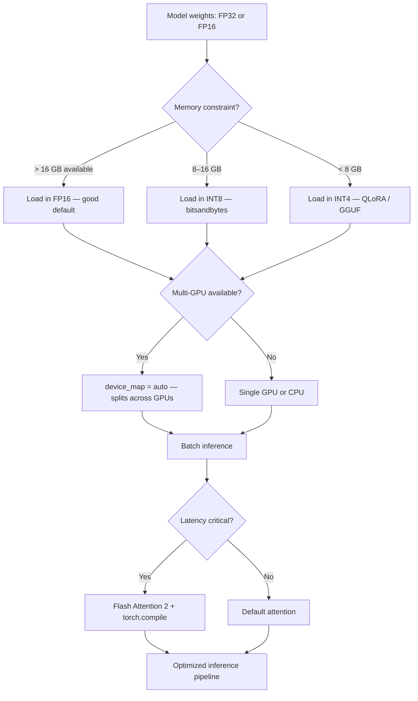

# Inference Optimization

## The Story 📖

Imagine your model is a sports car — a Ferrari. It can go 200 mph. But someone left the parking brake on, four tires are underinflated, and you're driving in the wrong gear. In practice, most deployed models are like this: running in full 32-bit float precision when 8-bit is sufficient, loading onto a single device when they could span multiple, processing one request at a time when batching would use the GPU effectively. Inference optimization is the process of removing all those brakes.

👉 This is why we need **Inference Optimization** — the difference between a model that costs $50/day and one that costs $2/day at the same throughput, or between 1 second latency and 50ms.

---

## What is Inference Optimization?

Inference optimization refers to a collection of techniques that make model inference (prediction, not training) faster, cheaper, and more memory-efficient — without meaningfully degrading output quality.

Key techniques:
- **Quantization** — reduce weight precision from 32-bit to 8-bit or 4-bit
- **Device mapping** — spread model across GPUs automatically
- **Batch inference** — process multiple inputs at once
- **Flash Attention** — memory-efficient attention computation
- **Speculative decoding** — use a small draft model to speed up a large model
- **Compiled models** — `torch.compile()` fuses operations for GPU efficiency
- **Optimum library** — export models to ONNX, OpenVINO, or TensorRT for deployment

---

## Why It Exists — The Problem It Solves

**Problem 1 — Memory.** A 7B parameter model in FP32 requires 28 GB of VRAM. In FP16, 14 GB. In INT8, 7 GB. In INT4, ~4 GB. The model exists; the question is whether it fits on your hardware.

**Problem 2 — Latency.** Full-precision matrix multiplications are slow. Modern GPUs have special hardware (Tensor Cores) that perform FP16 and INT8 operations significantly faster than FP32.

**Problem 3 — Cost.** Cloud GPU costs scale with time. A model that serves 100 requests/minute instead of 10 requests/minute costs 10× less per request. Optimization directly translates to cost reduction.

---

## How It Works — The Optimization Layers



---

## Quantization — The Main Technique

**Quantization** maps high-precision floating point weights to lower-precision integers or floats. Think of it like rounding decimal coordinates to the nearest grid point — you lose a tiny bit of precision but save massive amounts of space.

### FP32 → FP16 (Half Precision)

The simplest optimization. FP16 uses 2 bytes per number instead of 4. Halves memory, often increases speed.

```python
from transformers import AutoModelForCausalLM
import torch

model = AutoModelForCausalLM.from_pretrained(
    "facebook/opt-1.3b",
    torch_dtype=torch.float16,    # Load directly in FP16 — half the memory
    device_map="auto"
)
```

No quality loss. Use this as your baseline for all GPU inference.

### INT8 Quantization (bitsandbytes)

Compress weights to 8-bit integers. Memory reduced by 4× vs FP32. Slight quality decrease for some models.

```python
model = AutoModelForCausalLM.from_pretrained(
    "facebook/opt-1.3b",
    load_in_8bit=True,   # INT8 quantization via bitsandbytes
    device_map="auto"
)
```

**How it works:** Weights are stored as INT8 but dequantized to FP16 for actual computation. The dequantization happens in small blocks (block-wise quantization), minimizing the quantization error per block. This approach is called **LLM.int8()** (developed by Tim Dettmers).

### INT4 Quantization (QLoRA / BitsAndBytes)

Compress to 4-bit using the NF4 format. Memory reduced by 8× vs FP32. Slightly more quality loss, but often negligible for generation tasks.

```python
from transformers import BitsAndBytesConfig

bnb_config = BitsAndBytesConfig(
    load_in_4bit=True,
    bnb_4bit_quant_type="nf4",           # NF4: best for normally distributed weights
    bnb_4bit_compute_dtype=torch.bfloat16,
    bnb_4bit_use_double_quant=True,      # Extra compression
)

model = AutoModelForCausalLM.from_pretrained(
    "meta-llama/Llama-2-7b-hf",
    quantization_config=bnb_config,
    device_map="auto"
)
```

---

## Device Mapping — Distributing Large Models

`device_map="auto"` instructs `accelerate` to automatically place model layers across all available hardware:

```python
model = AutoModelForCausalLM.from_pretrained(
    "meta-llama/Llama-2-70b-hf",
    device_map="auto",                    # Auto-distribute across all GPUs
    torch_dtype=torch.float16,
)

# Inspect how layers were distributed
print(model.hf_device_map)
# {'model.embed_tokens': 0, 'model.layers.0': 0, ..., 'model.layers.40': 1, ...}
```

**Manual device maps** let you precisely control placement:

```python
device_map = {
    "model.embed_tokens": 0,    # First GPU
    "model.layers": 0,          # All layers on first GPU
    "model.norm": 1,            # Last GPU
    "lm_head": 1,
}
model = AutoModelForCausalLM.from_pretrained(
    "...", device_map=device_map, torch_dtype=torch.float16
)
```

**CPU offloading** — when the model doesn't fit in GPU VRAM at all, place some layers on CPU:

```python
# accelerate will put layers on CPU when GPU fills up
model = AutoModelForCausalLM.from_pretrained(
    "...",
    device_map="auto",
    max_memory={0: "20GB", "cpu": "60GB"}  # Limit GPU to 20GB, spill to CPU
)
```

---

## The Accelerate Library

The `accelerate` library by Hugging Face is the infrastructure behind device placement and distributed inference. Key features:

```python
from accelerate import Accelerator

accelerator = Accelerator(mixed_precision="fp16")

# Prepare model, optimizer, dataloader for the current hardware
model, optimizer, dataloader = accelerator.prepare(model, optimizer, dataloader)

# Training/inference works identically on 1 GPU, 8 GPUs, or CPU
for batch in dataloader:
    outputs = model(**batch)
    loss = outputs.loss
    accelerator.backward(loss)  # Handles distributed gradient sync
    optimizer.step()
```

For inference-only, `accelerate` handles device mapping and is used under the hood whenever you pass `device_map="auto"`.

---

## The Optimum Library — ONNX and Hardware-Specific Backends

Hugging Face **Optimum** is the library for deploying models to optimized runtimes beyond PyTorch:

```python
from optimum.onnxruntime import ORTModelForSequenceClassification
from transformers import AutoTokenizer

# Export to ONNX and run with ONNXRuntime (faster than PyTorch on CPU)
model = ORTModelForSequenceClassification.from_pretrained(
    "distilbert-base-uncased-finetuned-sst-2-english",
    from_transformers=True   # Convert PyTorch model to ONNX on-the-fly
)
tokenizer = AutoTokenizer.from_pretrained("distilbert-base-uncased-finetuned-sst-2-english")

inputs = tokenizer("I love Hugging Face!", return_tensors="pt")
outputs = model(**inputs)
```

Optimum also supports:
- **Intel OpenVINO** — optimized for Intel CPUs and GPUs
- **NVIDIA TensorRT** — optimized for NVIDIA GPUs (best latency for production)
- **Apple Core ML** — for macOS/iOS deployment
- **AWS Neuron** — for AWS Inferentia accelerators

---

## Batch Inference

Processing multiple inputs at once is often the single biggest speedup available. A GPU running one input at a time might use 5% of its compute capacity; batching 32 inputs can push it to 80%+.

```python
from transformers import pipeline
import torch

# Use batch_size in pipeline
pipe = pipeline(
    "text-classification",
    model="distilbert-base-uncased-finetuned-sst-2-english",
    batch_size=64,       # Process 64 inputs at a time
    device=0,            # GPU
)

# Pass a list — pipeline batches automatically
texts = ["text 1", "text 2", ..., "text 1000"]
results = pipe(texts)   # Runs in ceil(1000/64) = 16 batches
```

---

## Where You'll See This in Real AI Systems

- **Production APIs** — companies serving LLMs at scale use INT8 or INT4 quantization to halve their GPU costs
- **Edge deployment** — quantized models (INT4, GGUF format) run on laptops and phones where cloud models can't reach
- **vLLM** — the dominant open-source LLM serving library uses continuous batching and PagedAttention for 10-100× throughput vs naive inference
- **Hugging Face Inference Endpoints** — automatically applies optimization for deployed models
- **GGUF format** — the dominant format for running quantized LLMs locally (used by llama.cpp, Ollama)

---

## Common Mistakes to Avoid ⚠️

- **Using FP32 for GPU inference** — there is almost never a reason to use FP32 for inference on modern GPUs. Use FP16 or BF16 as minimum.
- **Evaluating quantized models only on perplexity** — perplexity doesn't capture all quality regressions. Test on your actual task metric.
- **Quantizing the tokenizer** — tokenization is not a matrix operation; quantization only applies to model weights
- **Batch size of 1 for offline processing** — if you're processing a dataset offline, batch size 1 wastes 90%+ of GPU capacity
- **Not using Flash Attention for long sequences** — standard attention has quadratic memory cost; FlashAttention-2 is linear in memory for long contexts

---

## Connection to Other Concepts 🔗

- **QLoRA** (04_PEFT_and_LoRA) uses INT4 quantization during training — the same bitsandbytes techniques appear here for inference
- **Trainer API** (05_Trainer_API) uses `fp16=True` during training — same idea applied to training instead of inference
- **Spaces and Gradio** (07_Spaces_and_Gradio) — deploying optimized models to Spaces makes demos much faster
- **Production AI** (12_Production_AI) — inference optimization is a core topic for production system design

---

✅ **What you just learned:** Inference optimization converts impractically large or slow models into production-ready systems using quantization (INT8/INT4), device mapping, batching, and specialized runtimes — often reducing cost by 4-10× with negligible quality loss.

🔨 **Build this now:** Load `facebook/opt-1.3b` in FP32, time a forward pass. Then reload it with `torch_dtype=torch.float16` and `load_in_8bit=True`, time again. Compare memory usage and latency.

➡️ **Next step:** Learn how to give your model a public-facing UI with Gradio and Spaces — [07_Spaces_and_Gradio/Theory.md](../07_Spaces_and_Gradio/Theory.md).

---

## 🛠️ Practice Project

Apply what you just learned → **[A5: Fine-Tune → Evaluate → Deploy](../../20_Projects/02_Advanced_Projects/05_Fine_Tune_Evaluate_Deploy/Project_Guide.md)**
> This project uses: loading fine-tuned model with load_in_4bit=True, comparing VRAM usage and inference speed before/after quantization

---

## 📂 Navigation

**In this folder:**

| File | Description |
|------|-------------|
| 📄 **Theory.md** | Inference optimization overview (you are here) |
| [📄 Cheatsheet.md](./Cheatsheet.md) | Quantization comparison and quick reference |
| [📄 Interview_QA.md](./Interview_QA.md) | 9 interview questions |
| [📄 Code_Example.md](./Code_Example.md) | Load in 4-bit, use accelerate, benchmark |
| [📄 Comparison.md](./Comparison.md) | Full precision vs INT8 vs INT4 vs GGUF |

⬅️ **Prev:** [Trainer API](../05_Trainer_API/Theory.md) &nbsp;&nbsp;&nbsp; ➡️ **Next:** [Spaces and Gradio](../07_Spaces_and_Gradio/Theory.md)
