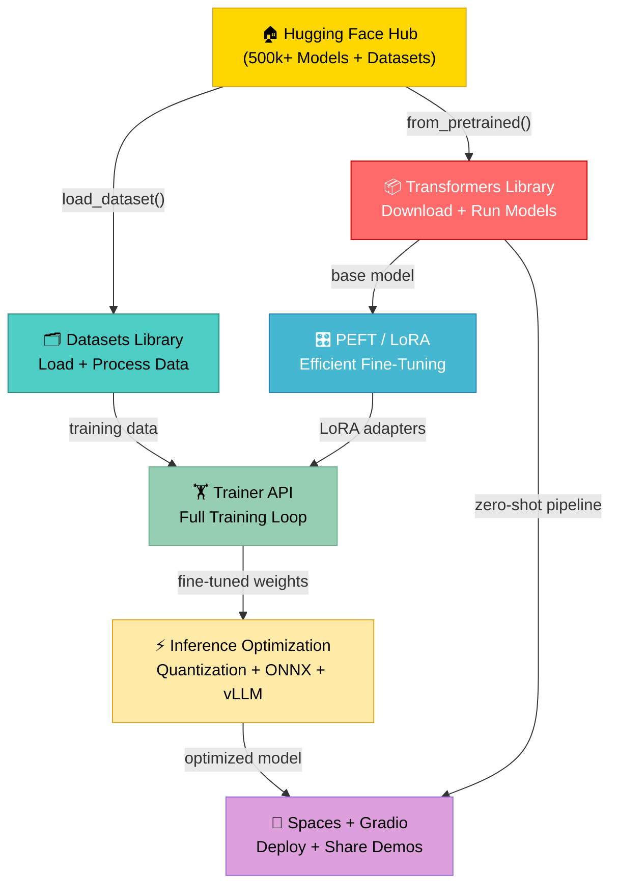

# 🤗 Hugging Face Ecosystem

⬅️ [13 AI System Design](../13_AI_System_Design/Readme.md) &nbsp;|&nbsp; [🏠 Home](../00_Learning_Guide/Readme.md) &nbsp;|&nbsp; [15 LangGraph ➡️](../15_LangGraph/Readme.md)

> The open-source platform that put state-of-the-art AI into every developer's hands — from model discovery to fine-tuning to production deployment, all under one roof.

**[▶ Start here → Hub and Model Cards Theory](./01_Hub_and_Model_Cards/Theory.md)**

---

## At a Glance

| | |
|---|---|
| 📚 Topics | 7 topics |
| ⏱️ Est. Time | 5–6 hours |
| 📋 Prerequisites | [AI System Design](../13_AI_System_Design/Readme.md) |
| 🔓 Unlocks | [LangGraph](../15_LangGraph/Readme.md) |

---

## What's in This Section

---

## Topics

| # | Topic | What You'll Learn | Files |
|---|---|---|---|
| 01 | [Hub and Model Cards](./01_Hub_and_Model_Cards/) | How to discover, compare, and download 500k+ models; what model cards tell you about capabilities, limitations, and licensing | [📖 Theory](./01_Hub_and_Model_Cards/Theory.md) · [⚡ Cheatsheet](./01_Hub_and_Model_Cards/Cheatsheet.md) · [🎯 Interview Q&A](./01_Hub_and_Model_Cards/Interview_QA.md) |
| 02 | [Transformers Library](./02_Transformers_Library/) | Using `pipeline()`, `AutoModel`, and `AutoTokenizer` to run virtually any architecture in 5 lines; how AutoClass works under the hood | [📖 Theory](./02_Transformers_Library/Theory.md) · [⚡ Cheatsheet](./02_Transformers_Library/Cheatsheet.md) · [🎯 Interview Q&A](./02_Transformers_Library/Interview_QA.md) |
| 03 | [Datasets Library](./03_Datasets_Library/) | Loading, streaming, and preprocessing datasets at any scale using memory-mapped Arrow files; the `map()` and `filter()` API | [📖 Theory](./03_Datasets_Library/Theory.md) · [⚡ Cheatsheet](./03_Datasets_Library/Cheatsheet.md) · [🎯 Interview Q&A](./03_Datasets_Library/Interview_QA.md) |
| 04 | [PEFT and LoRA](./04_PEFT_and_LoRA/) | How parameter-efficient fine-tuning adapts a 7B model on a single GPU by training only low-rank adapter matrices — less than 1% of the weights | [📖 Theory](./04_PEFT_and_LoRA/Theory.md) · [⚡ Cheatsheet](./04_PEFT_and_LoRA/Cheatsheet.md) · [🎯 Interview Q&A](./04_PEFT_and_LoRA/Interview_QA.md) |
| 05 | [Trainer API](./05_Trainer_API/) | How `Trainer` and `SFTTrainer` abstract away the training loop, handle gradient accumulation, mixed precision, callbacks, and distributed training | [📖 Theory](./05_Trainer_API/Theory.md) · [⚡ Cheatsheet](./05_Trainer_API/Cheatsheet.md) · [🎯 Interview Q&A](./05_Trainer_API/Interview_QA.md) |
| 06 | [Inference Optimization](./06_Inference_Optimization/) | INT8/INT4 quantization, BetterTransformer, ONNX export, and vLLM continuous batching — cutting VRAM and latency for production serving | [📖 Theory](./06_Inference_Optimization/Theory.md) · [⚡ Cheatsheet](./06_Inference_Optimization/Cheatsheet.md) · [🎯 Interview Q&A](./06_Inference_Optimization/Interview_QA.md) |
| 07 | [Spaces and Gradio](./07_Spaces_and_Gradio/) | Building interactive ML demos with Gradio components and deploying them to HF Spaces for free public hosting with optional GPU upgrades | [📖 Theory](./07_Spaces_and_Gradio/Theory.md) · [⚡ Cheatsheet](./07_Spaces_and_Gradio/Cheatsheet.md) · [🎯 Interview Q&A](./07_Spaces_and_Gradio/Interview_QA.md) |

---

## Key Concepts at a Glance

| Concept | What It Means |
|---|---|
| **The Hub is the npm registry of AI** | Over 500,000 models and 100,000 datasets, all versioned with Git LFS, described by model cards that document capabilities, biases, and licenses. |
| **`AutoClass` is the universal adapter** | `AutoModelForCausalLM.from_pretrained("any-model-id")` works for virtually any architecture because the `config.json` tells Transformers exactly which class to instantiate. |
| **LoRA freezes 99% of the model** | Instead of updating all weights, LoRA injects small trainable rank-decomposition matrices into attention layers, cutting GPU memory by 10x and training time dramatically. |
| **Quantization trades negligible accuracy for massive speedup** | Loading a model with `load_in_4bit=True` can shrink a 13B model from 28 GB VRAM to 5 GB, enabling fine-tuning and serving on consumer hardware. |
| **Spaces turns a Python script into a shareable URL** | A `gr.Interface` pushed to HF Spaces gets free hosting, a public link, and optional A10G GPU acceleration without any infrastructure work. |

---

## 📂 Navigation

⬅️ **Prev:** [13 AI System Design](../13_AI_System_Design/Readme.md) &nbsp;&nbsp; ➡️ **Next:** [15 LangGraph](../15_LangGraph/Readme.md)
