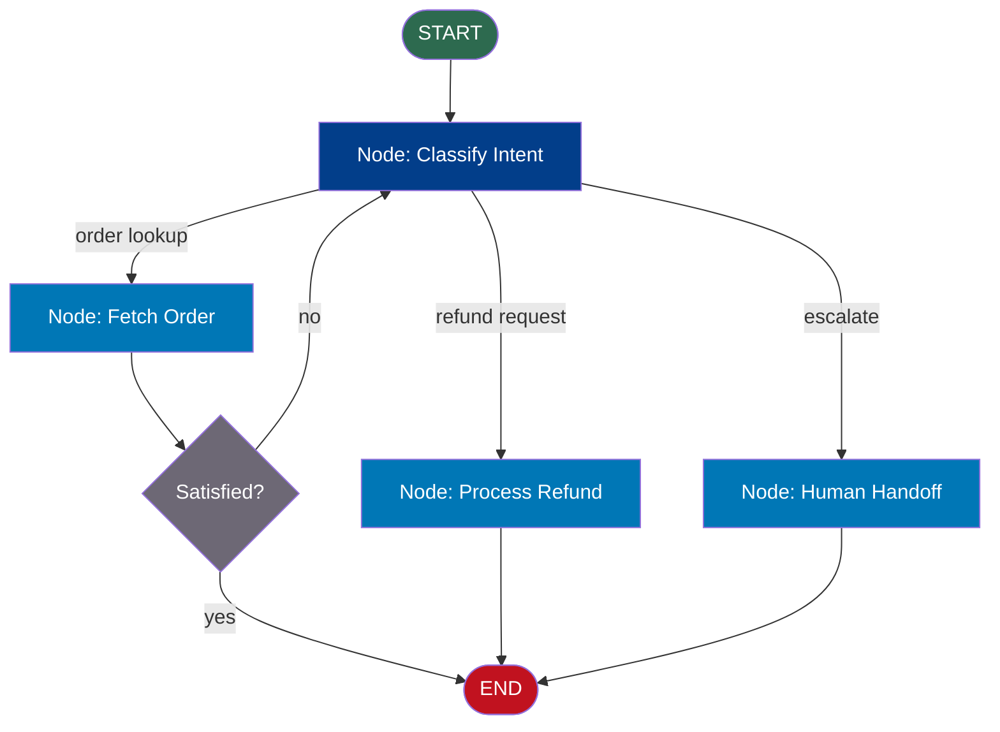
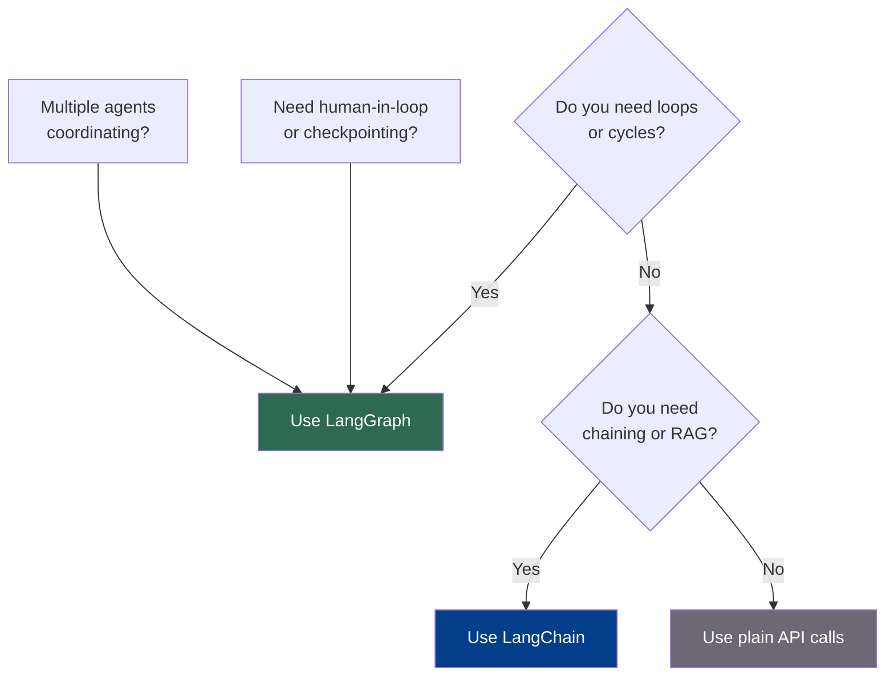

# LangGraph Fundamentals

## The Story 📖

You're building a customer service agent. "Where's my order?" is easy — a straight chain handles it. But then: "The package arrived damaged — I want a refund, check my store credit, and escalate if the total is over $500."

Now you need to branch (refund *or* store credit *or* escalation), loop back (check multiple conditions), and remember context across all steps. LangChain chains go A→B→C. Real agents need to branch, loop, and remember.

👉 This is why we need **LangGraph** — a framework for building stateful, cyclical AI agent workflows.

---

## What is LangGraph?

**LangGraph** is a library built on LangChain for defining AI workflows as a **graph** — nodes connected by edges — rather than a linear chain.

- **LangChain** = a recipe (step 1, step 2, step 3, done)
- **LangGraph** = a flowchart (check this, if yes go here, if no loop back, stop when done)

A LangGraph application is a **StateGraph**: a directed graph where every node is a Python function and every edge is a connection (fixed or conditional). A shared **State** object flows through the whole graph, updated at each node.

---

## Why It Exists — The Problem It Solves

Before LangGraph, `AgentExecutor` handled loops internally with no visibility or control. LangGraph provides first-class primitives for:

| Problem | LangGraph Solution |
|---|---|
| Linear-only workflows | Graph structure with conditional edges |
| No state visibility | Explicit `State` object passed to every node |
| Can't pause and resume | Built-in checkpointing system |
| Opaque agent loops | You define the loop logic yourself |

---

## How It Works — Step by Step

**Step 1: Define State** — A `TypedDict` holding all data flowing through the graph. Every node reads from it and writes back to it.

**Step 2: Write Nodes** — Python functions that receive State, do work (call an LLM, query a DB, make a decision), and return a dict of *only the fields to update*.

**Step 3: Connect with Edges** — Unconditional (always A→B) or conditional (a router function inspects State and returns the next node name).

**Step 4: Compile and Run** — Call `.compile()` to validate the graph, then `.invoke()` to run it.



### Minimal working example:

```python
from langgraph.graph import StateGraph, START, END
from typing import TypedDict

class AgentState(TypedDict):
    user_message: str
    intent: str
    response: str

def classify_intent(state: AgentState) -> dict:
    msg = state["user_message"].lower()
    if "order" in msg:
        return {"intent": "order_lookup"}
    elif "refund" in msg:
        return {"intent": "refund"}
    return {"intent": "general"}

def handle_order(state: AgentState) -> dict:
    return {"response": "Your order is on the way!"}

def handle_refund(state: AgentState) -> dict:
    return {"response": "Refund initiated. Allow 3–5 days."}

def handle_general(state: AgentState) -> dict:
    return {"response": "How can I help you further?"}

def route_by_intent(state: AgentState) -> str:
    return state["intent"]

graph = StateGraph(AgentState)
graph.add_node("classify", classify_intent)
graph.add_node("order_lookup", handle_order)
graph.add_node("refund", handle_refund)
graph.add_node("general", handle_general)

graph.add_edge(START, "classify")
graph.add_conditional_edges("classify", route_by_intent)
graph.add_edge("order_lookup", END)
graph.add_edge("refund", END)
graph.add_edge("general", END)

app = graph.compile()
result = app.invoke({"user_message": "Where is my order?", "intent": "", "response": ""})
print(result["response"])  # "Your order is on the way!"
```

---

## LangGraph vs LangChain vs Plain API Calls



| Scenario | Best Tool |
|---|---|
| Simple Q&A chatbot | Plain API |
| RAG pipeline | LangChain |
| Simple tool-using agent | LangChain AgentExecutor |
| Agent that retries until satisfied | LangGraph |
| Multi-agent system | LangGraph |
| Workflow needing human approval | LangGraph |

**Rule of thumb:** If you're writing `if/else` logic about what your AI should do *next*, use LangGraph. If it's a straight shot from input to output, a chain is fine.

---

## The StateGraph — Key Properties

The `StateGraph` central object:

1. **Manages state automatically** — passes current state to each node and merges partial updates back
2. **Supports cycles** — add an edge from node C back to node A with no extra work
3. **Integrates checkpointing** — attach a checkpointer at compile time to save every state transition
4. **Enables streaming** — `.stream()` yields updates as each node completes

The mental model: a **state machine** where each state contains all workflow data, and transitions are triggered by node functions returning partial updates.

---

## Where You'll See This in Real AI Systems

- **Customer support bots**: classify → route → respond → escalate (loop if unresolved)
- **Research agents**: search → synthesize → reflect → search again (loop until confident)
- **Code generation agents**: generate → run tests → fix bugs → run tests again (loop until green)
- **Financial workflows**: extract → validate → human approval for large transactions → execute

---

## Common Mistakes to Avoid ⚠️

1. **Using LangGraph for simple tasks** — no loops or branching means the overhead isn't worth it
2. **Mutating state directly** — nodes must *return* a dict of updates, not modify the state object in place
3. **Forgetting the START edge** — `graph.add_edge(START, "first_node")` is required; missing it is the most common first bug
4. **Running without compiling** — call `.compile()` before `.invoke()`
5. **Infinite loops with no exit** — always check a termination condition in your router
6. **Assuming nodes share memory** — nodes communicate *only* through state; everything shared must live in State

---

## Connection to Other Concepts 🔗

- **LangChain** (Section 14): LangGraph builds on it; LangChain provides LLM integrations, prompt templates, and tool calling that nodes use
- **State Management** (15/03): The TypedDict state pattern is central; understanding reducers is key for complex state
- **Human-in-the-Loop** (15/05): Checkpointing enables pausing and resuming from saved state
- **Multi-Agent** (15/06): Nodes can themselves be compiled LangGraph subgraphs, enabling supervisor architectures
- **Streaming** (15/07): The compiled graph's `.stream()` yields each node's output as it happens

---

✅ **What you just learned**: LangGraph models workflows as nodes (Python functions) connected by edges (fixed or conditional), with a shared State TypedDict flowing through the entire graph. It solves loops, branching, checkpointing, and multi-agent coordination that LangChain chains can't handle.

🔨 **Build this now**: Create a 2-node LangGraph graph with a TypedDict containing `text` and `char_count`. Node 1 sets `text`. Node 2 reads `text` and writes `char_count`. Compile, run with `.invoke()`, and print the final state.

➡️ **Next step**: `02_Nodes_and_Edges/Theory.md` — Learn how to define nodes and edges, including conditional routing.

---

## 🛠️ Practice Project

Apply what you just learned → **[A2: LangGraph Support Bot](../../20_Projects/02_Advanced_Projects/02_LangGraph_Support_Bot/Project_Guide.md)**
> This project uses: StateGraph, TypedDict state, nodes as Python functions, compile() and invoke()

---

## 📂 Navigation

**In this folder:**

| File | |
|---|---|
| 📄 **Theory.md** | ← you are here |
| [📄 Cheatsheet.md](./Cheatsheet.md) | Quick reference |
| [📄 Interview_QA.md](./Interview_QA.md) | Interview prep |
| [📄 Mental_Model.md](./Mental_Model.md) | Visual mental model |

⬅️ **Prev:** Section intro &nbsp;&nbsp;&nbsp; ➡️ **Next:** [Nodes and Edges](../02_Nodes_and_Edges/Theory.md)
