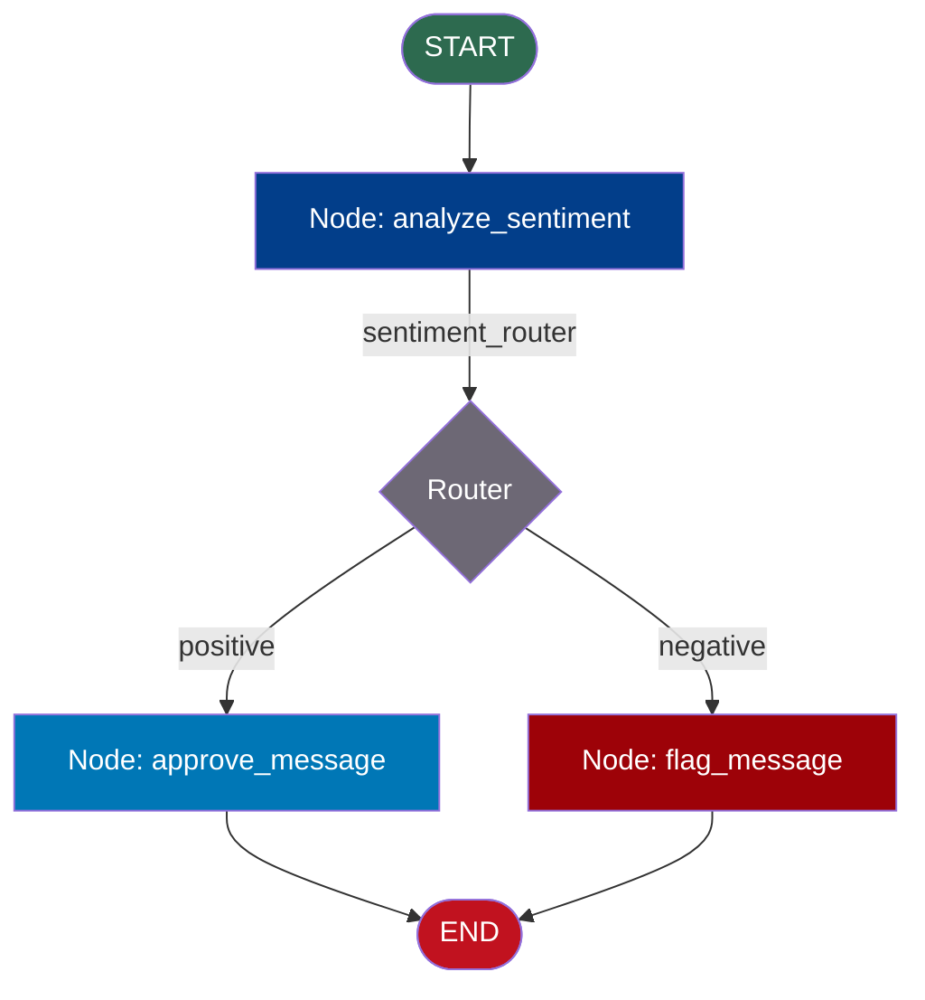

# Nodes and Edges — Code Example

## Simple 3-Node Graph with a Conditional Edge

This example builds a text processing pipeline with three nodes and a conditional edge that routes to different outputs based on the content of the text.

**Scenario**: A content moderation pipeline that:
1. Receives a message
2. Analyzes its sentiment
3. Routes to an "approve" node if positive, or a "flag" node if negative

```python
# nodes_edges_example.py
# Run: pip install langgraph
# Then: python nodes_edges_example.py

from langgraph.graph import StateGraph, START, END
from typing import TypedDict


# ─── 1. Define the State ────────────────────────────────────────────────────
# TypedDict defines every field the graph will use.
# All nodes share this same state structure.

class ModerationState(TypedDict):
    message: str          # The input message to moderate
    sentiment: str        # "positive" or "negative" (set by analyze node)
    action_taken: str     # What we did with the message (set by action nodes)
    reason: str           # Why we took that action


# ─── 2. Define Node Functions ───────────────────────────────────────────────
# Each function takes the full state and returns a PARTIAL update dict.

def analyze_sentiment(state: ModerationState) -> dict:
    """
    Node 1: Analyze the sentiment of the incoming message.
    In a real system this would call an LLM or sentiment model.
    Here we use simple keyword matching for clarity.
    """
    message = state["message"].lower()

    # Simple heuristic — replace with LLM call in production
    negative_words = ["hate", "terrible", "awful", "scam", "worst"]
    is_negative = any(word in message for word in negative_words)

    sentiment = "negative" if is_negative else "positive"

    print(f"  [analyze_sentiment] Message: '{state['message']}'")
    print(f"  [analyze_sentiment] Detected sentiment: {sentiment}")

    # Return only the field we're updating
    return {"sentiment": sentiment}


def approve_message(state: ModerationState) -> dict:
    """
    Node 2a: Approve the message and allow it to be posted.
    This node runs when sentiment is positive.
    """
    print(f"  [approve_message] Approving message ✓")
    return {
        "action_taken": "approved",
        "reason": "Sentiment is positive — no issues detected"
    }


def flag_message(state: ModerationState) -> dict:
    """
    Node 2b: Flag the message for human review.
    This node runs when sentiment is negative.
    """
    print(f"  [flag_message] Flagging message for review ⚠")
    return {
        "action_taken": "flagged",
        "reason": f"Negative sentiment detected in: '{state['message']}'"
    }


# ─── 3. Define the Router Function ─────────────────────────────────────────
# The router inspects state after analyze_sentiment runs
# and returns the NAME of the next node to execute.

def sentiment_router(state: ModerationState) -> str:
    """
    Router: decides whether to approve or flag based on sentiment.
    Must return a valid node name or END — never None.
    """
    if state["sentiment"] == "positive":
        return "approve"   # Name of the approve_message node
    else:
        return "flag"      # Name of the flag_message node


# ─── 4. Build the Graph ─────────────────────────────────────────────────────

# Create the StateGraph with our state type
graph = StateGraph(ModerationState)

# Add nodes — first arg is the name, second is the function
graph.add_node("analyze", analyze_sentiment)   # Node 1
graph.add_node("approve", approve_message)     # Node 2a
graph.add_node("flag", flag_message)           # Node 2b

# Add edges — defines the flow
graph.add_edge(START, "analyze")               # Entry: always start with analyze
graph.add_conditional_edges(                   # After analyze, router decides
    "analyze",                                 # Source node
    sentiment_router                           # Router function
)
graph.add_edge("approve", END)                 # approve → done
graph.add_edge("flag", END)                    # flag → done

# ─── 5. Compile the Graph ───────────────────────────────────────────────────
# .compile() validates the graph and returns a runnable CompiledGraph
app = graph.compile()


# ─── 6. Run the Graph ───────────────────────────────────────────────────────

def run_example(message: str):
    """Run the moderation graph on a single message."""
    print(f"\n{'='*55}")
    print(f"Input: '{message}'")
    print(f"{'='*55}")

    # Provide initial state — all fields must be present for TypedDict
    initial_state: ModerationState = {
        "message": message,
        "sentiment": "",        # Will be set by analyze node
        "action_taken": "",     # Will be set by approve or flag node
        "reason": ""            # Will be set by approve or flag node
    }

    result = app.invoke(initial_state)

    print(f"\n  Result:")
    print(f"    Sentiment:    {result['sentiment']}")
    print(f"    Action taken: {result['action_taken']}")
    print(f"    Reason:       {result['reason']}")


# Test with a positive message — should route to "approve"
run_example("I love this product, it's amazing!")

# Test with a negative message — should route to "flag"
run_example("This is the worst scam I've ever seen")

# Test with a neutral message — should route to "approve" (no negative words)
run_example("The package arrived on Tuesday")
```

---

## Expected Output

```
=======================================================
Input: 'I love this product, it's amazing!'
=======================================================
  [analyze_sentiment] Message: 'I love this product, it's amazing!'
  [analyze_sentiment] Detected sentiment: positive
  [approve_message] Approving message ✓

  Result:
    Sentiment:    positive
    Action taken: approved
    Reason:       Sentiment is positive — no issues detected

=======================================================
Input: 'This is the worst scam I've ever seen'
=======================================================
  [analyze_sentiment] Message: 'This is the worst scam I've ever seen'
  [analyze_sentiment] Detected sentiment: negative
  [flag_message] Flagging message for review ⚠

  Result:
    Sentiment:    negative
    Action taken: flagged
    Reason:       Negative sentiment detected in: 'This is the worst scam I've ever seen'

=======================================================
Input: 'The package arrived on Tuesday'
=======================================================
  [analyze_sentiment] Message: 'The package arrived on Tuesday'
  [analyze_sentiment] Detected sentiment: positive
  [approve_message] Approving message ✓

  Result:
    Sentiment:    positive
    Action taken: approved
    Reason:       Sentiment is positive — no issues detected
```

---

## Graph Structure Visualization



---

## Key Concepts Demonstrated

| Concept | Where in code |
|---|---|
| State TypedDict | `class ModerationState(TypedDict)` |
| Node as Python function | `def analyze_sentiment(state) -> dict` |
| Partial state update | `return {"sentiment": sentiment}` |
| Unconditional edge | `graph.add_edge(START, "analyze")` |
| Conditional edge with router | `graph.add_conditional_edges("analyze", sentiment_router)` |
| Router returning node name | `return "approve"` or `return "flag"` |
| Multiple paths to END | Both `approve` and `flag` have edges to `END` |
| Compile before run | `app = graph.compile()` |

---

## Extending This Example

To upgrade this example to use a real LLM for sentiment analysis:

```python
from langchain_openai import ChatOpenAI
from langchain_core.messages import HumanMessage

llm = ChatOpenAI(model="gpt-4o-mini")

def analyze_sentiment(state: ModerationState) -> dict:
    response = llm.invoke([
        HumanMessage(content=f"""
        Classify the sentiment of this message as exactly 'positive' or 'negative'.
        Message: {state['message']}
        Respond with only the word: positive or negative
        """)
    ])
    sentiment = response.content.strip().lower()
    return {"sentiment": sentiment}
```

The rest of the graph stays exactly the same — that is the power of separating node logic from graph structure.

---

## 📂 Navigation

**In this folder:**

| File | |
|---|---|
| [📄 Theory.md](./Theory.md) | Full explanation |
| [📄 Cheatsheet.md](./Cheatsheet.md) | Quick reference |
| [📄 Interview_QA.md](./Interview_QA.md) | Interview prep |
| 📄 **Code_Example.md** | ← you are here |

⬅️ **Prev:** [LangGraph Fundamentals](../01_LangGraph_Fundamentals/Theory.md) &nbsp;&nbsp;&nbsp; ➡️ **Next:** [State Management](../03_State_Management/Theory.md)
