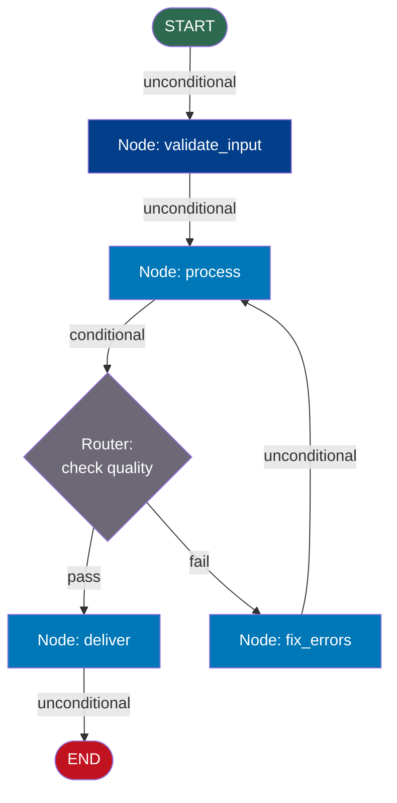
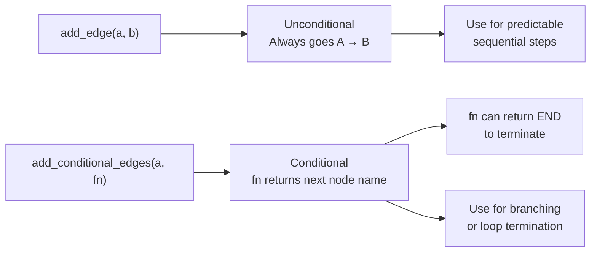

# Nodes and Edges

## The Story 📖

A car factory: workers stand at stations along the floor. Worker A bolts on doors, Worker B installs windows, Worker C does quality inspection. Between stations, conveyor belts carry the car forward. The inspector can decide: pass → shipping station, fail → loop back to Worker A for rework.

👉 This is why we need **Nodes and Edges** — nodes are the workers (functions that do things), edges are the conveyor belts (connections that move work forward, split it, or loop it back).

---

## What are Nodes?

A **node** is simply a Python function. It takes the current state as its only argument and returns a dict of fields to update.

```python
def my_node(state: MyState) -> dict:
    result = do_something(state["input"])
    return {"output": result}
```

**Rules for nodes:**
- Accept exactly one argument: the current state
- Return a dict — never `None`
- Return only the fields being updated, not the entire state
- Can call LLMs, databases, external APIs, or run pure Python logic
- Can be `async` functions if using `.ainvoke()`

```python
graph.add_node("node_name", node_function)
```

**Naming conventions:** use snake_case, describe what the node *does* (`"classify_intent"`, `"fetch_order"`). Avoid generic names like `"step1"` — router functions reference these names.

---

## What are Edges?

An **edge** connects two nodes, telling LangGraph which node runs next.

### Unconditional Edges

Always go from node A to node B — no logic involved.

```python
graph.add_edge("node_a", "node_b")
```

### Conditional Edges

Use a **router function** to decide the next node at runtime. The router inspects state and returns a node name string.

```python
def my_router(state: MyState) -> str:
    if state["quality"] == "pass":
        return "ship"
    else:
        return "rework"

graph.add_conditional_edges("inspect", my_router)
```

The router must return a node name string or the `END` constant.

---

## START and END — Special Nodes

```python
from langgraph.graph import START, END
```

- **START** — marks the entry point; must have `graph.add_edge(START, "first_node")`
- **END** — marks successful termination; a graph can have multiple paths to `END`; router functions can also return `END`

```python
graph.add_edge("final_node", END)

def router(state):
    if state["done"]:
        return END
    return "continue_node"
```

---

## How It All Connects



`fix_errors → process` creates the cycle (loop back for retry).

---

## Router Functions — The Full Pattern

```python
from langgraph.graph import END

def quality_router(state: FactoryState) -> str:
    quality_score = state["quality_score"]
    if quality_score >= 90:
        return "deliver"
    elif quality_score >= 50:
        return "fix_minor_errors"
    else:
        return "fix_major_errors"

def safe_router(state: FactoryState) -> str:
    if state["retry_count"] >= 3:
        return END
    if state["quality_score"] >= 90:
        return "deliver"
    return "fix_errors"
```

**Router best practices:**
- Always have a default case — never return `None`
- Check termination conditions first to avoid infinite loops
- Keep router logic simple; if complex, the logic belongs in a node

---

## Edge Types Summary



---

## Where You'll See This in Real AI Systems

- **Tool-using agents**: `call_llm → run_tool → call_llm` loop with a "done" router
- **RAG with re-ranking**: `retrieve → rerank → quality_check` with loop-back if quality is low
- **Multi-step form filling**: `ask_question → validate_answer` loop until all fields collected
- **Content pipeline**: `generate → review` routing to `approve`, `revise`, or `reject`

---

## Common Mistakes to Avoid ⚠️

1. **Router returning `None`** — every branch must explicitly return a node name or `END`; a fallthrough path raises `ValueError`
2. **Typo in node name** — `"shiip"` vs `"ship"` fails silently until runtime; node names are just strings
3. **Edge to an unregistered node** — always `add_node` before adding edges that reference it
4. **Forgetting `add_edge(START, ...)`** — graph compiles but fails on invoke; always wire the START edge
5. **Node returning `None`** — LangGraph tries to merge `None` into state and fails; always return at least `{}`
6. **Setting `state["next"]` expecting auto-routing** — setting a field doesn't route; you still need a conditional edge with a router function

---

## Connection to Other Concepts 🔗

- **State Management** (15/03): Nodes only communicate through state; state structure defines what nodes can pass to each other
- **Cycles and Loops** (15/04): Loops are edges pointing backward — `fix_errors → process` creates a cycle
- **Human-in-the-Loop** (15/05): Interrupts are configured at the edge level via `interrupt_before=["node_name"]`
- **Multi-Agent** (15/06): Nodes can themselves be compiled LangGraph subgraphs; edges behave identically

---

✅ **What you just learned**: Nodes are Python functions that read state and return partial updates. Edges are connections — unconditional (always straight) or conditional (router decides). `START` and `END` mark entry and exit. The router is a plain function that takes state and returns a node name string.

🔨 **Build this now**: Create a 3-node graph where node 1 generates a random number (0–100), node 2 checks if it's above 50, and the router sends to a "high" or "low" node. Print which branch was taken.

➡️ **Next step**: `03_State_Management/Theory.md` — Understand how TypedDict state works, what reducers do, and why state design is the most important architectural decision in LangGraph.

---

## 🛠️ Practice Project

Apply what you just learned → **[A2: LangGraph Support Bot](../../20_Projects/02_Advanced_Projects/02_LangGraph_Support_Bot/Project_Guide.md)**
> This project uses: conditional edges for intent routing, unconditional edges for linear steps, router functions

---

## 📂 Navigation

**In this folder:**

| File | |
|---|---|
| 📄 **Theory.md** | ← you are here |
| [📄 Cheatsheet.md](./Cheatsheet.md) | Quick reference |
| [📄 Interview_QA.md](./Interview_QA.md) | Interview prep |
| [📄 Code_Example.md](./Code_Example.md) | Working code example |

⬅️ **Prev:** [LangGraph Fundamentals](../01_LangGraph_Fundamentals/Theory.md) &nbsp;&nbsp;&nbsp; ➡️ **Next:** [State Management](../03_State_Management/Theory.md)
