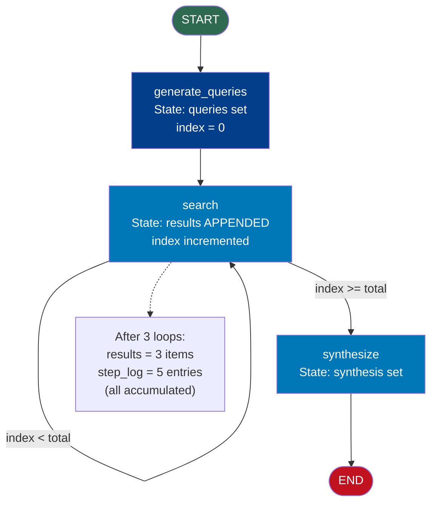

# State Management — Code Example

## StateGraph with TypedDict Showing State Accumulation

This example demonstrates how state flows between nodes, how reducers work for accumulating lists, and how to track iterations in a multi-step pipeline.

**Scenario**: A research pipeline that:
1. Takes a question
2. Generates 3 search queries
3. Retrieves (simulated) results for each query
4. Tracks all results in an accumulating list
5. Synthesizes a final answer

```python
# state_management_example.py
# Run: pip install langgraph
# Then: python state_management_example.py

from langgraph.graph import StateGraph, START, END
from typing import TypedDict, Annotated
import operator


# ─── 1. Define State with a Reducer ─────────────────────────────────────────
# The `results` field uses `operator.add` as a reducer.
# This means: when a node returns {"results": [new_item]},
# LangGraph APPENDS to the existing list rather than overwriting it.

class ResearchState(TypedDict):
    question: str                                    # Input question
    queries: list                                    # Generated search queries
    results: Annotated[list, operator.add]           # Accumulated search results (reducer!)
    current_query_index: int                         # Which query we're on
    synthesis: str                                   # Final synthesized answer
    step_log: Annotated[list, operator.add]          # Log of each step (also accumulates)


# ─── 2. Node: Generate Search Queries ───────────────────────────────────────

def generate_queries(state: ResearchState) -> dict:
    """
    Node 1: Take the user's question and generate 3 specific search queries.
    In production, an LLM would generate these. We simulate it here.
    """
    question = state["question"]
    print(f"\n[generate_queries] Question: '{question}'")

    # Simulated query generation (replace with LLM call)
    queries = [
        f"{question} - overview",
        f"{question} - recent research",
        f"{question} - practical examples",
    ]

    print(f"[generate_queries] Generated {len(queries)} queries")

    return {
        "queries": queries,
        "current_query_index": 0,
        "step_log": [f"Generated {len(queries)} search queries"]   # appended by reducer
    }


# ─── 3. Node: Search (runs once per query, loops) ───────────────────────────

def search(state: ResearchState) -> dict:
    """
    Node 2: Execute the current query and add results to the accumulating list.
    This node runs multiple times — once for each query.
    Each run APPENDS to `results` because of the operator.add reducer.
    """
    idx = state["current_query_index"]
    current_query = state["queries"][idx]

    print(f"\n[search] Executing query {idx + 1}/{len(state['queries'])}: '{current_query}'")

    # Simulated search results (replace with real search API)
    simulated_results = {
        0: "Light scatters at different wavelengths; blue has the shortest visible wavelength.",
        1: "2024 studies confirm Rayleigh scattering as the primary mechanism for sky color.",
        2: "Sunsets are red/orange because light travels through more atmosphere at low angles.",
    }
    result = simulated_results.get(idx, f"Result for: {current_query}")

    print(f"[search] Result: '{result[:60]}...'")

    # IMPORTANT: because results uses operator.add reducer,
    # returning {"results": [result]} will APPEND, not overwrite
    return {
        "results": [result],                                            # appended!
        "current_query_index": idx + 1,                                 # advance index
        "step_log": [f"Searched query {idx + 1}: '{current_query}'"]   # appended!
    }


# ─── 4. Node: Synthesize ────────────────────────────────────────────────────

def synthesize(state: ResearchState) -> dict:
    """
    Node 3: Combine all accumulated results into a final answer.
    By the time this node runs, `results` contains all search results
    from all iterations of the search node.
    """
    print(f"\n[synthesize] Combining {len(state['results'])} results...")

    # Show that all results were accumulated (not just the last one)
    combined = "\n- ".join(state["results"])
    synthesis = f"Based on {len(state['results'])} sources:\n- {combined}"

    print(f"[synthesize] Synthesis complete")

    return {
        "synthesis": synthesis,
        "step_log": ["Synthesis complete"]
    }


# ─── 5. Router: Should We Search More? ──────────────────────────────────────

def search_router(state: ResearchState) -> str:
    """
    Router: check if we have more queries to run.
    If yes, route back to search. If no, route to synthesize.
    """
    idx = state["current_query_index"]
    total_queries = len(state["queries"])

    if idx < total_queries:
        return "search"     # Loop back for next query
    else:
        return "synthesize" # All queries done, synthesize


# ─── 6. Build the Graph ─────────────────────────────────────────────────────

graph = StateGraph(ResearchState)

graph.add_node("generate_queries", generate_queries)
graph.add_node("search", search)
graph.add_node("synthesize", synthesize)

graph.add_edge(START, "generate_queries")
graph.add_edge("generate_queries", "search")          # Always search after generating queries
graph.add_conditional_edges("search", search_router)  # Loop or exit based on index
graph.add_edge("synthesize", END)

app = graph.compile()


# ─── 7. Run the Graph ───────────────────────────────────────────────────────

print("=" * 60)
print("RESEARCH AGENT — State Accumulation Demo")
print("=" * 60)

initial_state: ResearchState = {
    "question": "Why is the sky blue?",
    "queries": [],
    "results": [],          # Starts empty — will accumulate via reducer
    "current_query_index": 0,
    "synthesis": "",
    "step_log": [],         # Also accumulates
}

final_state = app.invoke(initial_state)

# ─── 8. Inspect Final State ─────────────────────────────────────────────────

print("\n" + "=" * 60)
print("FINAL STATE INSPECTION")
print("=" * 60)

print(f"\nQuestion: {final_state['question']}")
print(f"\nQueries generated: {len(final_state['queries'])}")
for i, q in enumerate(final_state['queries'], 1):
    print(f"  {i}. {q}")

print(f"\nResults accumulated: {len(final_state['results'])}")
print("  (All results preserved by operator.add reducer)")
for i, r in enumerate(final_state['results'], 1):
    print(f"  Result {i}: {r[:70]}...")

print(f"\nStep log ({len(final_state['step_log'])} entries):")
for entry in final_state['step_log']:
    print(f"  - {entry}")

print(f"\nFinal synthesis:\n{final_state['synthesis']}")
```

---

## Demonstrating the Reducer Difference

To see *why* reducers matter, here is a quick side-by-side:

```python
from langgraph.graph import StateGraph, START, END
from typing import TypedDict, Annotated
import operator

# WITHOUT reducer — list gets overwritten each time
class OverwriteState(TypedDict):
    items: list    # No reducer

# WITH reducer — list accumulates
class AccumulateState(TypedDict):
    items: Annotated[list, operator.add]   # Appends on update

def add_item(state) -> dict:
    return {"items": ["new_item"]}

# Build both graphs identically except for state type
def build_and_run(state_class, label):
    g = StateGraph(state_class)
    g.add_node("add1", add_item)
    g.add_node("add2", add_item)
    g.add_edge(START, "add1")
    g.add_edge("add1", "add2")
    g.add_edge("add2", END)
    app = g.compile()
    result = app.invoke({"items": ["original"]})
    print(f"\n{label}:")
    print(f"  Final items: {result['items']}")

build_and_run(OverwriteState, "WITHOUT reducer (overwrite)")
# Output: ['new_item']  ← original lost, then overwritten again

build_and_run(AccumulateState, "WITH reducer (accumulate)")
# Output: ['original', 'new_item', 'new_item']  ← all preserved
```

---

## Graph Flow Visualization



---

## Key Takeaways

| Concept | Demonstrated by |
|---|---|
| TypedDict state | `class ResearchState(TypedDict)` |
| Reducer with `operator.add` | `results: Annotated[list, operator.add]` |
| Accumulation across loops | `results` grows from `[]` to 3 items across 3 loop iterations |
| Partial state updates | Each node returns only its changed fields |
| Loop counter in state | `current_query_index` incremented each iteration |
| Loop termination via state | Router checks `current_query_index >= len(queries)` |
| Step logging | `step_log` accumulates entries across all nodes |

---

## 📂 Navigation

**In this folder:**

| File | |
|---|---|
| [📄 Theory.md](./Theory.md) | Full explanation |
| [📄 Cheatsheet.md](./Cheatsheet.md) | Quick reference |
| [📄 Interview_QA.md](./Interview_QA.md) | Interview prep |
| 📄 **Code_Example.md** | ← you are here |

⬅️ **Prev:** [Nodes and Edges](../02_Nodes_and_Edges/Theory.md) &nbsp;&nbsp;&nbsp; ➡️ **Next:** [Cycles and Loops](../04_Cycles_and_Loops/Theory.md)
