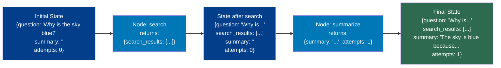

# State Management

## The Story 📖

A relay race with four runners and one baton — but this baton carries a scroll with the lap count, elapsed time, which runner is next, and accumulated penalties. Each runner reads the scroll, runs their leg, updates it, and hands it on. No runner keeps anything to themselves. Without the baton, Runner 3 wouldn't know the team was 30 seconds behind.

👉 This is why we need **State Management** — the state object is the baton, carrying all shared context between nodes so each node knows what happened and what comes next.

---

## What is State in LangGraph?

**State** is a Python `TypedDict` — a dictionary with declared, typed fields — passed to every node. Every node reads any field and returns updates to any field. LangGraph creates it from initial input, merges partial updates from each node, and returns the final state at termination.

```python
from typing import TypedDict, Annotated
import operator

class ResearchState(TypedDict):
    question: str           # The user's original question
    search_results: list    # Raw search results
    summary: str            # Synthesized answer
    quality_score: float    # Self-evaluation score
    attempts: int           # How many times we've tried
```

---

## Why State Design is the Most Important Architectural Decision

Design your state *before* writing any nodes, because:

1. **Nodes are constrained by state** — information that isn't in a field can't be shared
2. **State drives loops** — termination conditions live in state fields (`attempts`, `quality_score`, `is_done`)
3. **State is your debugging surface** — inspect it to understand what happened at each step
4. **State is what gets checkpointed** — small, well-named fields are easy to inspect and resume

| Bad State | Why It's Bad |
|---|---|
| `result: Any` | Too generic — what kind, from which step? |
| `data: dict` | Untyped nested dicts are hard to reason about |
| `step: int` | Controlling flow via step numbers = spaghetti |

| Good State | Why It's Good |
|---|---|
| `search_results: list[str]` | Clear type, clear purpose |
| `quality_score: float` | Directly checkable in router function |
| `attempts: int` | Clean loop counter |
| `messages: list[BaseMessage]` | Standard LangChain message list |

---

## How State Flows Between Nodes



At each step: LangGraph passes the **full current state** → node returns a **partial dict** → LangGraph **merges** it → passes updated state to the next node.

---

## Reducers — How State Gets Merged

By default, a node returning `{"field": new_value}` **overwrites** the existing value. For lists — especially message histories — you usually want to *append*. That's where **reducers** come in.

A **reducer** defines how a field's new value merges with the existing value, declared via `Annotated`.

```python
# Default (overwrite):
class State(TypedDict):
    summary: str    # Each update overwrites the previous

# Append (reducer):
from typing import Annotated
import operator

class State(TypedDict):
    messages: Annotated[list, operator.add]
```

With `operator.add` reducer:
- Current: `{"messages": ["Hello"]}`
- Node returns: `{"messages": ["How can I help?"]}`
- Result: `{"messages": ["Hello", "How can I help?"]}` ✓

Without reducer (overwrite):
- Result: `{"messages": ["How can I help?"]}` — original message lost!

### Custom reducer:
```python
def merge_results(existing: list, new: list) -> list:
    """Keep only the top 5 results by score."""
    combined = existing + new
    return sorted(combined, key=lambda x: x["score"], reverse=True)[:5]

class State(TypedDict):
    search_results: Annotated[list, merge_results]
```

---

## MessagesState — The Built-in Chat State

For chat applications, use `MessagesState` — a pre-built state with a `messages` field that uses the `add_messages` reducer (appends and deduplicates by message ID).

```python
from langgraph.graph import MessagesState
from langchain_core.messages import HumanMessage, AIMessage

# MessagesState is equivalent to:
# class MessagesState(TypedDict):
#     messages: Annotated[list[BaseMessage], add_messages]

graph = StateGraph(MessagesState)

def chatbot_node(state: MessagesState) -> dict:
    response = llm.invoke(state["messages"])
    return {"messages": [response]}  # add_messages reducer appends it
```

`add_messages` vs `operator.add`: also replaces existing messages with the same ID (useful for tool result injection).

---

## Immutable Update Pattern

Never mutate `state` directly. Return a dict instead:

```python
# WRONG
def bad_node(state: MyState) -> dict:
    state["count"] += 1  # Don't do this
    return {}

# CORRECT
def good_node(state: MyState) -> dict:
    return {"count": state["count"] + 1}
```

Why this matters:
- **Async/parallel safety**: multiple nodes can execute concurrently without race conditions
- **Checkpointing**: clean snapshots require predictable, serializable updates
- **Debugging**: each node's contribution is explicit and traceable
- **Testing**: test a node in isolation by passing a fake state dict

---

## Handling Missing Fields Safely

```python
def summarize(state: ResearchState) -> dict:
    results = state.get("search_results", [])
    if not results:
        return {"summary": "No results found.", "quality_score": 0.0}
    text = "\n".join(results)
    return {"summary": generate_summary(text), "quality_score": evaluate_quality(text)}
```

---

## Common Mistakes to Avoid ⚠️

1. **List field without a reducer** — if two nodes update `results: list`, the second overwrites the first; use `Annotated[list, operator.add]` for accumulating lists
2. **Missing required fields on invoke** — TypedDict fields aren't optional by default; missing one causes a `KeyError` inside a node
3. **Storing non-serializable objects** — PIL images, file handles, DB connections break checkpointing; store only serializable data
4. **Using state to control flow** — `state["next_node"] = "foo"` won't auto-route; flow control is handled by router functions
5. **Not designing state first** — starting with nodes before the schema leads to repeated refactoring

---

## Connection to Other Concepts 🔗

- **Nodes and Edges** (15/02): Nodes read and update state; state design makes nodes useful
- **Cycles and Loops** (15/04): Loop termination conditions (`attempts`, `is_satisfied`) live in state and are read by routers
- **Human-in-the-Loop** (15/05): Checkpointing saves the entire state; well-designed state = easy to inspect and resume
- **MessagesState**: Understanding reducers explains why `MessagesState` auto-appends correctly

---

✅ **What you just learned**: State is a TypedDict flowing through every node. Each node returns a partial dict of updates. Reducers control merge behavior — default overwrites, `operator.add` appends. `MessagesState` is a pre-built chat state. Design state first, before writing any nodes.

🔨 **Build this now**: Design a state TypedDict for a trip-planning agent with: destination, a list of activities (with reducer), budget, and approval flag. Write one node that adds two activities and verify that running it twice appends rather than overwrites.

➡️ **Next step**: `04_Cycles_and_Loops/Theory.md` — Learn how to build loops, set termination conditions, and avoid infinite loops.

---

## 🛠️ Practice Projects

Apply what you just learned:
- → **[A2: LangGraph Support Bot](../../20_Projects/02_Advanced_Projects/02_LangGraph_Support_Bot/Project_Guide.md)** — TypedDict state with messages, intent, and response fields
- → **[A4: Multi-Agent Research System](../../20_Projects/02_Advanced_Projects/04_Multi_Agent_Research_System/Project_Guide.md)** — shared state across supervisor and multiple worker agents

---

## 📂 Navigation

**In this folder:**

| File | |
|---|---|
| 📄 **Theory.md** | ← you are here |
| [📄 Cheatsheet.md](./Cheatsheet.md) | Quick reference |
| [📄 Interview_QA.md](./Interview_QA.md) | Interview prep |
| [📄 Code_Example.md](./Code_Example.md) | Working code example |

⬅️ **Prev:** [Nodes and Edges](../02_Nodes_and_Edges/Theory.md) &nbsp;&nbsp;&nbsp; ➡️ **Next:** [Cycles and Loops](../04_Cycles_and_Loops/Theory.md)
