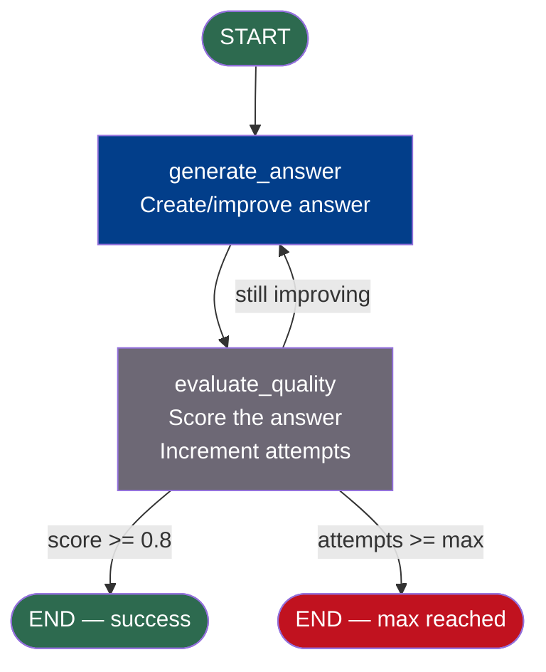

# Cycles and Loops — Code Example

## Agent Loop That Retries Until Satisfied

This example builds an answer quality improvement loop. The agent generates an answer, evaluates its own quality score, and keeps improving until the score exceeds a threshold or the maximum attempts are reached.

```python
# cycles_loops_example.py
# Run: pip install langgraph
# Then: python cycles_loops_example.py

from langgraph.graph import StateGraph, START, END
from typing import TypedDict, Annotated
import operator
import random


# ─── 1. State Definition ────────────────────────────────────────────────────

class ImprovementState(TypedDict):
    question: str
    current_answer: str
    quality_score: float
    attempts: int
    max_attempts: int
    score_history: Annotated[list, operator.add]   # accumulate all scores
    answer_history: Annotated[list, operator.add]  # accumulate all answers


# ─── 2. Node: Generate Answer ───────────────────────────────────────────────

def generate_answer(state: ImprovementState) -> dict:
    """
    Generates or improves an answer based on the question.
    In production: call an LLM here.
    In this demo: simulate progressively better answers.
    """
    attempt = state["attempts"]
    question = state["question"]

    # Simulate improving answers (in production, LLM would use the previous
    # answer and quality feedback to generate a better version)
    answers = [
        f"Initial answer to '{question}': It's a complex topic.",
        f"Improved answer (attempt 2): {question} involves several factors...",
        f"Better answer (attempt 3): The key insight about {question} is...",
        f"Good answer (attempt 4): Research shows {question} works because...",
        f"Excellent answer (attempt 5): {question} — a comprehensive explanation...",
    ]

    answer_idx = min(attempt, len(answers) - 1)
    new_answer = answers[answer_idx]

    print(f"\n[generate_answer] Attempt {attempt + 1}: Generated answer ({len(new_answer)} chars)")

    return {
        "current_answer": new_answer,
        "answer_history": [new_answer],    # appended to history via reducer
    }


# ─── 3. Node: Evaluate Quality ──────────────────────────────────────────────

def evaluate_quality(state: ImprovementState) -> dict:
    """
    Evaluates the quality of the current answer.
    In production: use an LLM as a judge.
    In this demo: simulate scores that improve with each attempt.
    """
    attempt = state["attempts"]

    # Simulate improving quality scores (replace with LLM judge)
    base_scores = [0.35, 0.55, 0.72, 0.85, 0.93]
    base = base_scores[min(attempt, len(base_scores) - 1)]
    # Add some randomness to make it realistic
    score = min(1.0, base + random.uniform(-0.05, 0.08))

    new_attempts = attempt + 1  # Increment the counter

    print(f"[evaluate_quality] Quality score: {score:.2f} (attempt {new_attempts}/{state['max_attempts']})")

    return {
        "quality_score": score,
        "attempts": new_attempts,
        "score_history": [round(score, 2)],  # appended to history via reducer
    }


# ─── 4. Router: Should We Loop or Exit? ─────────────────────────────────────

QUALITY_THRESHOLD = 0.80  # We want 80%+ quality

def quality_router(state: ImprovementState) -> str:
    """
    Determines whether to loop back and improve, or exit with the current answer.

    Three exit conditions:
    1. Quality score meets threshold → success exit
    2. Max attempts reached → forced exit (best answer wins)
    3. Still below threshold and have attempts remaining → loop back
    """
    score = state["quality_score"]
    attempts = state["attempts"]
    max_attempts = state["max_attempts"]

    # Exit: max attempts reached (hard limit — prevents infinite loops)
    if attempts >= max_attempts:
        print(f"[router] Max attempts ({max_attempts}) reached. Best score: {score:.2f}")
        return END

    # Exit: quality threshold met (success)
    if score >= QUALITY_THRESHOLD:
        print(f"[router] Quality threshold met! Score: {score:.2f} >= {QUALITY_THRESHOLD}")
        return END

    # Loop: still have attempts and quality not met yet
    print(f"[router] Score {score:.2f} below {QUALITY_THRESHOLD}. Looping back...")
    return "generate_answer"


# ─── 5. Build the Graph ─────────────────────────────────────────────────────

graph = StateGraph(ImprovementState)

graph.add_node("generate_answer", generate_answer)
graph.add_node("evaluate_quality", evaluate_quality)

# Flow: START → generate → evaluate → [router decides: loop or END]
graph.add_edge(START, "generate_answer")
graph.add_edge("generate_answer", "evaluate_quality")
graph.add_conditional_edges("evaluate_quality", quality_router)
#                           ^ exits to END or loops back to "generate_answer"

app = graph.compile()


# ─── 6. Run the Graph ───────────────────────────────────────────────────────

print("=" * 60)
print("IMPROVEMENT LOOP DEMO")
print(f"Quality threshold: {QUALITY_THRESHOLD}")
print("=" * 60)

initial_state: ImprovementState = {
    "question": "What is quantum entanglement?",
    "current_answer": "",
    "quality_score": 0.0,
    "attempts": 0,
    "max_attempts": 6,
    "score_history": [],
    "answer_history": [],
}

final_state = app.invoke(
    initial_state,
    config={"recursion_limit": 50}  # Safety net: 2 nodes × 6 loops × 1.2 buffer ≈ 15
)

# ─── 7. Results ─────────────────────────────────────────────────────────────

print("\n" + "=" * 60)
print("FINAL RESULTS")
print("=" * 60)

print(f"\nTotal attempts: {final_state['attempts']}")
print(f"Final quality score: {final_state['quality_score']:.2f}")
print(f"Threshold met: {final_state['quality_score'] >= QUALITY_THRESHOLD}")

print(f"\nScore progression:")
for i, score in enumerate(final_state['score_history'], 1):
    bar = "█" * int(score * 20)
    marker = " ← final" if i == len(final_state['score_history']) else ""
    print(f"  Attempt {i}: {score:.2f} |{bar}{marker}")

print(f"\nFinal answer:\n  {final_state['current_answer']}")
```

---

## Expected Output

```
============================================================
IMPROVEMENT LOOP DEMO
Quality threshold: 0.8
============================================================

[generate_answer] Attempt 1: Generated answer (48 chars)
[evaluate_quality] Quality score: 0.38 (attempt 1/6)
[router] Score 0.38 below 0.80. Looping back...

[generate_answer] Attempt 2: Generated answer (67 chars)
[evaluate_quality] Quality score: 0.57 (attempt 2/6)
[router] Score 0.57 below 0.80. Looping back...

[generate_answer] Attempt 3: Generated answer (63 chars)
[evaluate_quality] Quality score: 0.75 (attempt 3/6)
[router] Score 0.75 below 0.80. Looping back...

[generate_answer] Attempt 4: Generated answer (68 chars)
[evaluate_quality] Quality score: 0.87 (attempt 4/6)
[router] Quality threshold met! Score: 0.87 >= 0.80

============================================================
FINAL RESULTS
============================================================

Total attempts: 4
Final quality score: 0.87
Threshold met: True

Score progression:
  Attempt 1: 0.38 |███████▌
  Attempt 2: 0.57 |███████████▍
  Attempt 3: 0.75 |███████████████
  Attempt 4: 0.87 |█████████████████▍ ← final

Final answer:
  Good answer (attempt 4): Research shows quantum entanglement works because...
```

---

## Graph Structure



---

## Key Concepts in This Example

| Concept | Where demonstrated |
|---|---|
| Cycle creation | `add_edge("evaluate_quality", "generate_answer")` implied by conditional edge |
| Dual termination condition | Both `score >= threshold` and `attempts >= max` in router |
| Attempt counter | `attempts: int` incremented in `evaluate_quality` node |
| Score history accumulation | `score_history: Annotated[list, operator.add]` |
| Safety net | `config={"recursion_limit": 50}` in `.invoke()` |
| Router with 3 outcomes | Loop back, success exit, forced exit |

---

## Upgrading to Use a Real LLM

```python
from langchain_openai import ChatOpenAI
from langchain_core.messages import HumanMessage, SystemMessage

llm = ChatOpenAI(model="gpt-4o-mini")

def generate_answer(state: ImprovementState) -> dict:
    prompt = f"Answer this question: {state['question']}"
    if state["current_answer"]:
        prompt += f"\n\nPrevious answer to improve:\n{state['current_answer']}"
        prompt += f"\nQuality score was: {state['quality_score']:.2f} (target: 0.80+)"
        prompt += "\nPlease provide a more complete and detailed answer."
    response = llm.invoke([HumanMessage(content=prompt)])
    return {"current_answer": response.content, "answer_history": [response.content]}

def evaluate_quality(state: ImprovementState) -> dict:
    judge_prompt = f"""
    Question: {state['question']}
    Answer: {state['current_answer']}

    Rate this answer from 0.0 to 1.0 on completeness, accuracy, and clarity.
    Respond with only a number like 0.75
    """
    response = llm.invoke([HumanMessage(content=judge_prompt)])
    score = float(response.content.strip())
    return {
        "quality_score": score,
        "attempts": state["attempts"] + 1,
        "score_history": [score]
    }
```

---

## 📂 Navigation

**In this folder:**

| File | |
|---|---|
| [📄 Theory.md](./Theory.md) | Full explanation |
| [📄 Cheatsheet.md](./Cheatsheet.md) | Quick reference |
| [📄 Interview_QA.md](./Interview_QA.md) | Interview prep |
| 📄 **Code_Example.md** | ← you are here |

⬅️ **Prev:** [State Management](../03_State_Management/Theory.md) &nbsp;&nbsp;&nbsp; ➡️ **Next:** [Human-in-the-Loop](../05_Human_in_the_Loop/Theory.md)
