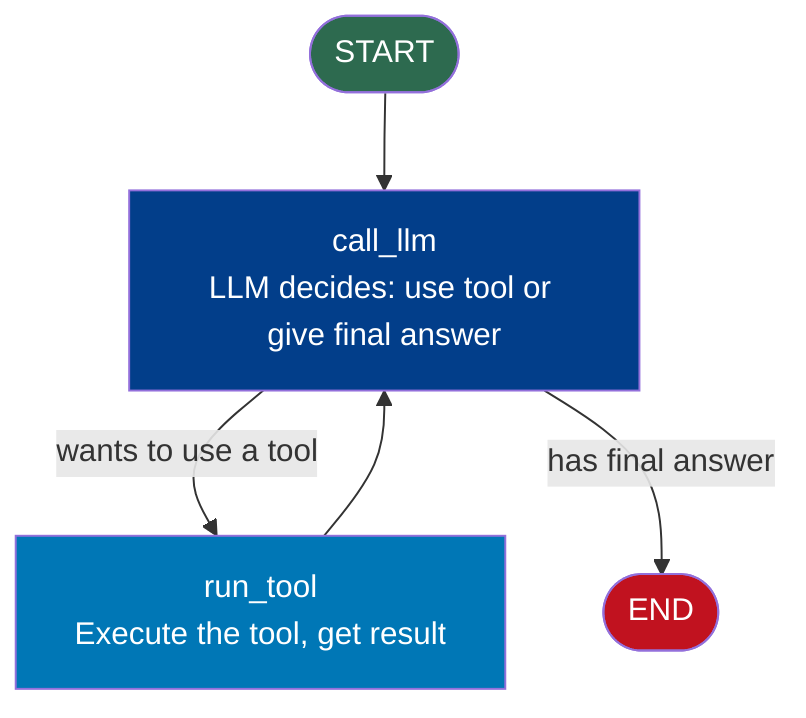
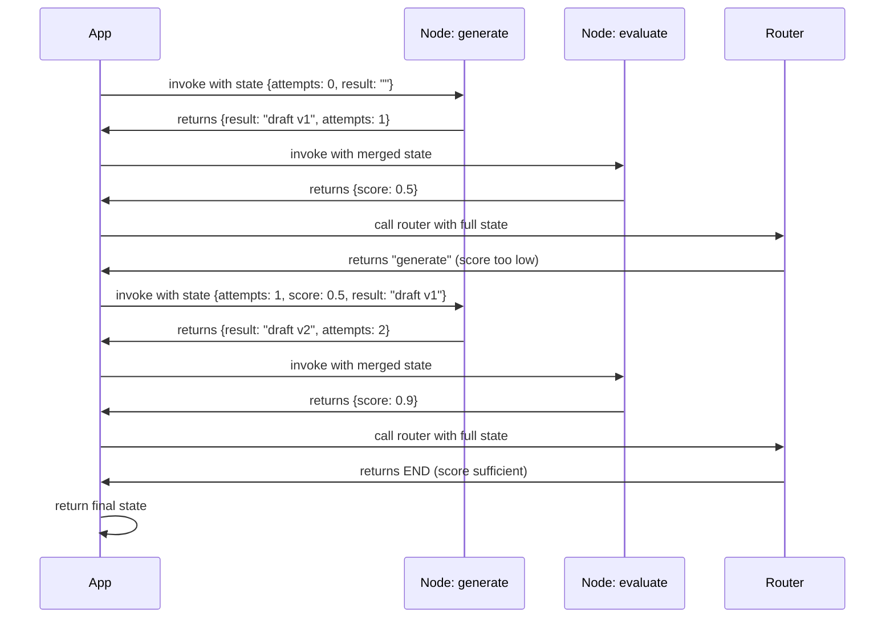

# Cycles and Loops

## The Story 📖

A detective doesn't stop after one clue. They question a witness, form a hypothesis, test it, find it incomplete, gather more evidence, and keep going until they're confident enough to make an arrest. They don't know in advance how many iterations it will take — they stop when the evidence is sufficient.

Both this and a weather model iterating to convergence share the same pattern: **do work, evaluate, decide to continue or stop**. Linear chains can't do this. LangGraph cycles can.

👉 This is why we need **Cycles in LangGraph** — the ability to loop back in a graph, letting agents iterate until a condition is met.

---

## What Makes LangGraph Different: Cycles

LangChain LCEL is a DAG (directed acyclic graph) — data flows one direction, no cycles. LangGraph supports **directed graphs with cycles** — an edge that points backward to an earlier node.


Creating the cycle requires nothing special — just add a backward edge:

```python
graph.add_edge("evaluate", "generate")   # This creates the cycle
```

What *is* special is how you break out of it.

---

## Loop Termination — How to Stop

A cycle without an exit is an infinite loop. Three ways to control termination:

### 1. Conditional Edge with Exit Route

Most common pattern. The router checks a state field and either continues or routes to a terminal node.

```python
def should_continue(state: AgentState) -> str:
    if state["quality_score"] >= 0.8:
        return "deliver"
    if state["attempts"] >= 5:
        return "deliver"       # Forced exit after max attempts
    return "generate"          # Loop back
```

### 2. `recursion_limit`

A safety net cap on total node executions. Default is 25. Raises `GraphRecursionError` if exceeded.

```python
result = app.invoke(state, config={"recursion_limit": 25})

from langgraph.errors import GraphRecursionError
try:
    result = app.invoke(state, config={"recursion_limit": 10})
except GraphRecursionError:
    print("Graph hit recursion limit — check loop termination logic")
```

`recursion_limit` counts **node executions**, not loop iterations. A 2-node loop with limit 25 gives only 12 full iterations.

### 3. State-Based Termination Flag

```python
class State(TypedDict):
    answer: str
    is_done: bool
    attempts: int

def router(state: State) -> str:
    if state["is_done"] or state["attempts"] >= 3:
        return END
    return "try_again"
```

---

## The Standard Agent Loop Pattern

Almost every LLM agent follows this structure:



The **ReAct loop** (Reason + Act): the LLM either calls a tool (loops) or produces a final answer (exits). The LLM itself determines when to stop.

```python
def call_llm(state: AgentState) -> dict:
    response = llm_with_tools.invoke(state["messages"])
    return {"messages": [response]}

def run_tool(state: AgentState) -> dict:
    last_message = state["messages"][-1]
    tool_results = execute_tools(last_message.tool_calls)
    return {"messages": tool_results}

def should_continue(state: AgentState) -> str:
    last_message = state["messages"][-1]
    if hasattr(last_message, "tool_calls") and last_message.tool_calls:
        return "run_tool"
    return END
```

---

## Preventing Infinite Loops

### Pattern 1: Always increment a counter
```python
def try_again(state: MyState) -> dict:
    return {"result": do_work(state), "attempts": state["attempts"] + 1}

def router(state: MyState) -> str:
    if state["attempts"] >= state["max_attempts"]:
        return END
    if is_good_enough(state["result"]):
        return END
    return "try_again"
```

### Pattern 2: Check both quality AND iteration limit
```python
def router(state: MyState) -> str:
    if state["iterations"] >= 10:
        return END                     # Hard limit always wins
    if state["score"] >= 0.9:
        return "finalize"
    return "improve"
```

### Pattern 3: Detect stalled progress
```python
def router(state: MyState) -> str:
    recent_scores = state["score_history"][-3:]
    if len(recent_scores) >= 3 and max(recent_scores) - min(recent_scores) < 0.01:
        return END   # No progress — stop
    if state["score"] >= threshold:
        return END
    return "iterate"
```

---

## Loop Execution — Step by Step



---

## Setting `recursion_limit`

Rule of thumb: `recursion_limit = (nodes_per_loop × max_loops) × 1.2`

A 3-node loop expecting 10 iterations: `(3 × 10) × 1.2 = 36` → set limit to at least 36.

---

## Common Mistakes to Avoid ⚠️

1. **No exit condition** — a loop with only one route always loops until `recursion_limit`; every loop needs at least one exit path
2. **No attempt counter** — checking only quality means a consistently low-quality LLM loops forever; always pair quality checks with attempt limits
3. **`recursion_limit` too low** — if a loop legitimately needs 20 iterations but limit is 10, you get an error even with correct logic
4. **Forgetting limit counts node executions** — a 3-node loop with limit 25 gives only 8 full iterations (3 × 8 = 24), not 25
5. **Router returning `None`** — use an `else` clause to always return a node name; missing cases raise `ValueError`

---

## Connection to Other Concepts 🔗

- **State Management** (15/03): loop counters (`attempts`, `iterations`) and exit flags (`is_done`) live in state; routers read them to make termination decisions
- **Human-in-the-Loop** (15/05): you can add human approval steps inside loops — the loop pauses for input, then continues or exits
- **Multi-Agent** (15/06): supervisor architectures often loop — delegating to sub-agents until the overall task is complete
- **Streaming** (15/07): streaming shows each node's output across all loop iterations, making it easy to watch an agent iterate toward a solution

---

✅ **What you just learned**: Cycles are created by adding backward edges. Loops need explicit termination in the router — typically a quality score, attempt counter, or flag. `recursion_limit` is a safety net counting node executions. The standard ReAct agent loop (call LLM → run tools → call LLM) is a cycle where the LLM decides when to stop.

🔨 **Build this now**: Build a loop that generates a random number between 1–100 each iteration, stores it in state, and exits when above 90. Track all generated numbers in an accumulating list. Print how many attempts it took.

➡️ **Next step**: `05_Human_in_the_Loop/Theory.md` — Learn how to pause a running graph, save its state, and resume after human review.

---

## 🛠️ Practice Project

Apply what you just learned → **[A2: LangGraph Support Bot](../../22_Capstone_Projects/12_LangGraph_Support_Bot/03_GUIDE.md)**
> This project uses: retry loop when confidence is low, exit condition when satisfied or max retries reached

---

## 📂 Navigation

**In this folder:**

| File | |
|---|---|
| 📄 **Theory.md** | ← you are here |
| [📄 Cheatsheet.md](./Cheatsheet.md) | Quick reference |
| [📄 Interview_QA.md](./Interview_QA.md) | Interview prep |
| [📄 Code_Example.md](./Code_Example.md) | Working code example |

⬅️ **Prev:** [State Management](../03_State_Management/Theory.md) &nbsp;&nbsp;&nbsp; ➡️ **Next:** [Human-in-the-Loop](../05_Human_in_the_Loop/Theory.md)
