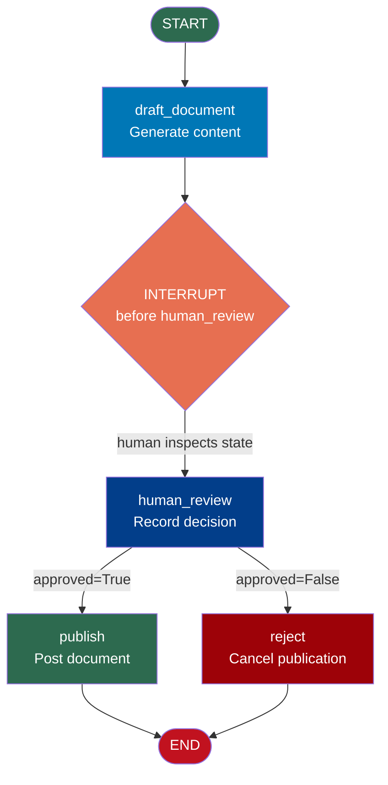

# Human-in-the-Loop — Code Example

## Graph That Pauses for Human Approval at a Key Node

This example builds a document publishing workflow that:
1. Drafts a document
2. Pauses for human review and approval
3. After approval, publishes the document and logs the action

```python
# human_in_loop_example.py
# Run: pip install langgraph
# Then: python human_in_loop_example.py

from langgraph.graph import StateGraph, START, END
from langgraph.checkpoint.memory import MemorySaver
from typing import TypedDict
import uuid


# ─── 1. State Definition ────────────────────────────────────────────────────

class PublishState(TypedDict):
    topic: str              # What to write about
    draft: str              # AI-generated draft document
    approved: bool          # Human approval decision
    reviewer_note: str      # Optional note from reviewer
    published_url: str      # URL after publishing
    audit_log: list         # Record of all actions taken


# ─── 2. Node: Draft Document ────────────────────────────────────────────────

def draft_document(state: PublishState) -> dict:
    """
    Node 1: Generate a draft document on the topic.
    In production: call an LLM here.
    """
    topic = state["topic"]
    print(f"\n[draft_document] Writing draft about: '{topic}'")

    # Simulated LLM output
    draft = f"""
    DRAFT DOCUMENT: {topic.upper()}
    ================================
    This document covers the key aspects of {topic}.

    Key points:
    - Point 1: Introduction to {topic}
    - Point 2: Why {topic} matters
    - Point 3: How to apply {topic} in practice
    - Point 4: Common misconceptions about {topic}

    Conclusion: {topic} is an important concept for modern AI practitioners.
    """

    print(f"[draft_document] Draft generated ({len(draft)} characters)")

    return {
        "draft": draft,
        "audit_log": [f"Draft generated for topic: {topic}"]
    }


# ─── 3. Node: Human Review ──────────────────────────────────────────────────
# This node is listed in interrupt_before — it will NEVER run automatically.
# Execution always pauses BEFORE this node.
# When the human approves (by calling invoke(None, config)), this node runs.

def human_review(state: PublishState) -> dict:
    """
    Node 2: Record that human review occurred.
    This node runs AFTER the interrupt is cleared — i.e., after the human
    has inspected the state (and optionally modified it with update_state).
    The human's approval is stored in state["approved"] which is set
    either by update_state() or defaults from initialization.
    """
    approved = state.get("approved", False)
    note = state.get("reviewer_note", "No note provided")

    print(f"\n[human_review] Review outcome: {'APPROVED' if approved else 'REJECTED'}")
    print(f"[human_review] Reviewer note: {note}")

    return {
        "audit_log": [f"Human review: {'approved' if approved else 'rejected'} — {note}"]
    }


# ─── 4. Node: Publish Document ──────────────────────────────────────────────

def publish_document(state: PublishState) -> dict:
    """
    Node 3a: Publish the approved document.
    Only reached if the approval router routes here.
    """
    print(f"\n[publish_document] Publishing approved document...")

    # Simulate publishing to a CMS or website
    fake_url = f"https://docs.example.com/{state['topic'].replace(' ', '-').lower()}"

    print(f"[publish_document] Published at: {fake_url}")

    return {
        "published_url": fake_url,
        "audit_log": [f"Document published at {fake_url}"]
    }


def reject_document(state: PublishState) -> dict:
    """
    Node 3b: Handle rejected documents.
    """
    print(f"\n[reject_document] Document rejected — not publishing")
    return {
        "published_url": "",
        "audit_log": ["Document rejected — publishing cancelled"]
    }


# ─── 5. Router: Check Approval ──────────────────────────────────────────────

def approval_router(state: PublishState) -> str:
    """After human_review runs, check if the document was approved."""
    if state.get("approved", False):
        return "publish"
    return "reject"


# ─── 6. Build the Graph ─────────────────────────────────────────────────────

graph = StateGraph(PublishState)

graph.add_node("draft_document", draft_document)
graph.add_node("human_review", human_review)
graph.add_node("publish", publish_document)
graph.add_node("reject", reject_document)

graph.add_edge(START, "draft_document")
graph.add_edge("draft_document", "human_review")
graph.add_conditional_edges("human_review", approval_router)
graph.add_edge("publish", END)
graph.add_edge("reject", END)

# ─── 7. Compile WITH checkpointer AND interrupt ──────────────────────────────
# interrupt_before=["human_review"] means: pause BEFORE human_review runs
# The checkpointer (MemorySaver) saves state when the pause happens

memory = MemorySaver()
app = graph.compile(
    checkpointer=memory,
    interrupt_before=["human_review"]  # <-- pause here for human review
)


# ─── 8. Demo: Approval Workflow ──────────────────────────────────────────────

def run_approval_workflow(topic: str, approve: bool, reviewer_note: str):
    """
    Simulates a complete human-in-the-loop approval workflow.
    """
    print("\n" + "=" * 60)
    print(f"STARTING WORKFLOW: '{topic}'")
    print("=" * 60)

    # Each workflow run gets a unique thread_id for isolation
    thread_id = f"doc-{uuid.uuid4().hex[:8]}"
    config = {"configurable": {"thread_id": thread_id}}

    # ── Phase 1: Run until interrupt ──────────────────────────────────────
    print(f"\n[Phase 1] Running graph until interrupt (thread: {thread_id})...")

    initial_state: PublishState = {
        "topic": topic,
        "draft": "",
        "approved": False,
        "reviewer_note": "",
        "published_url": "",
        "audit_log": [],
    }

    # invoke() returns when the interrupt is hit (before human_review)
    app.invoke(initial_state, config=config)

    print(f"\n[PAUSED] Graph is paused at interrupt point.")

    # ── Phase 2: Human reviews the paused state ───────────────────────────
    paused_state = app.get_state(config)

    print(f"\n[Phase 2] Human reviewing paused state...")
    print(f"  Draft preview (first 100 chars):")
    print(f"  {paused_state.values['draft'][:100].strip()}...")
    print(f"  Next node to run: {paused_state.next}")

    # ── Phase 3: Human decision ───────────────────────────────────────────
    print(f"\n[Phase 3] Human decision: {'APPROVE' if approve else 'REJECT'}")
    print(f"  Note: {reviewer_note}")

    # Update state with human's decision before resuming
    app.update_state(config, {
        "approved": approve,
        "reviewer_note": reviewer_note
    })

    # ── Phase 4: Resume execution ─────────────────────────────────────────
    print(f"\n[Phase 4] Resuming workflow...")

    # invoke(None, config) = resume from checkpoint, don't restart
    final_state = app.invoke(None, config=config)

    # ── Results ───────────────────────────────────────────────────────────
    print(f"\n{'=' * 60}")
    print(f"WORKFLOW COMPLETE")
    print(f"{'=' * 60}")
    print(f"  Topic:       {final_state['topic']}")
    print(f"  Approved:    {final_state['approved']}")
    print(f"  Published:   {final_state['published_url'] or 'N/A'}")
    print(f"\n  Audit Log:")
    for entry in final_state["audit_log"]:
        print(f"    - {entry}")


# Run two workflows: one approved, one rejected
run_approval_workflow(
    topic="Introduction to LangGraph",
    approve=True,
    reviewer_note="Great draft — approve for publication"
)

run_approval_workflow(
    topic="AI Investment Tips",
    approve=False,
    reviewer_note="Too promotional — needs legal review first"
)
```

---

## Expected Output

```
============================================================
STARTING WORKFLOW: 'Introduction to LangGraph'
============================================================

[Phase 1] Running graph until interrupt (thread: doc-a1b2c3d4)...

[draft_document] Writing draft about: 'Introduction to LangGraph'
[draft_document] Draft generated (389 characters)

[PAUSED] Graph is paused at interrupt point.

[Phase 2] Human reviewing paused state...
  Draft preview (first 100 chars):
  DRAFT DOCUMENT: INTRODUCTION TO LANGGRAPH
  ================================
  This document covers the key aspects of Intro...
  Next node to run: ('human_review',)

[Phase 3] Human decision: APPROVE
  Note: Great draft — approve for publication

[Phase 4] Resuming workflow...

[human_review] Review outcome: APPROVED
[human_review] Reviewer note: Great draft — approve for publication

[publish_document] Publishing approved document...
[publish_document] Published at: https://docs.example.com/introduction-to-langgraph

============================================================
WORKFLOW COMPLETE
============================================================
  Topic:       Introduction to LangGraph
  Approved:    True
  Published:   https://docs.example.com/introduction-to-langgraph

  Audit Log:
    - Draft generated for topic: Introduction to LangGraph
    - Human review: approved — Great draft — approve for publication
    - Document published at https://docs.example.com/introduction-to-langgraph
```

---

## Graph Structure



---

## Key Concepts Demonstrated

| Concept | Where in code |
|---|---|
| Checkpointer | `MemorySaver()` passed to `.compile()` |
| Interrupt before node | `interrupt_before=["human_review"]` |
| Thread isolation | `thread_id = f"doc-{uuid.uuid4().hex[:8]}"` |
| Run until interrupt | First `app.invoke(initial_state, config=config)` |
| Inspect paused state | `app.get_state(config)` |
| Modify before resume | `app.update_state(config, {"approved": True, ...})` |
| Resume from checkpoint | `app.invoke(None, config=config)` |
| Audit trail in state | `audit_log: list` accumulated across nodes |

---

## 📂 Navigation

**In this folder:**

| File | |
|---|---|
| [📄 Theory.md](./Theory.md) | Full explanation |
| [📄 Cheatsheet.md](./Cheatsheet.md) | Quick reference |
| [📄 Interview_QA.md](./Interview_QA.md) | Interview prep |
| 📄 **Code_Example.md** | ← you are here |

⬅️ **Prev:** [Cycles and Loops](../04_Cycles_and_Loops/Theory.md) &nbsp;&nbsp;&nbsp; ➡️ **Next:** [Multi-Agent with LangGraph](../06_Multi_Agent_with_LangGraph/Theory.md)
