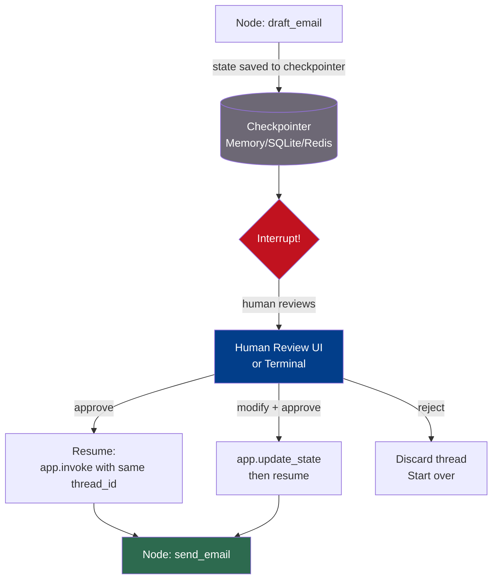

# Human-in-the-Loop

## The Story 📖

Imagine a robotic surgery system. The robot is faster and more precise than any human surgeon — it can make incisions at the exact right depth, at the exact right angle, every time. But no hospital in the world lets the robot operate fully autonomously. Before every incision, the surgeon reviews the robot's plan on a screen and presses a button to confirm: "Yes, proceed."

The robot does the hard work — the analysis, the planning, the precision execution. The human approves the critical steps. If the robot's plan looks wrong, the surgeon can intervene, adjust the plan, and then let the robot continue. Neither party works alone.

👉 This is why we need **Human-in-the-Loop** (HITL) workflows — AI systems that can pause at critical decision points, save their state, present it for human review, and resume with confidence after approval.

---

## 📌 Learning Priority

**Must Learn** — core concepts, needed to understand the rest of this file:
[What is HITL?](#what-is-human-in-the-loop-in-langgraph) · [How It Works](#how-it-works--step-by-step) · [Checkpointing System](#the-checkpointing-system)

**Should Learn** — important for real projects and interviews:
[Modifying State During Pause](#modifying-state-during-a-pause) · [Common Mistakes](#common-mistakes-to-avoid-)

**Good to Know** — useful in specific situations, not needed daily:
[interrupt_before vs interrupt_after](#interrupt_before-vs-interrupt_after) · [Where You'll See This](#where-youll-see-this-in-real-ai-systems)

**Reference** — skim once, look up when needed:
[Connection to Other Concepts](#connection-to-other-concepts-)

---

## What is Human-in-the-Loop in LangGraph?

**Human-in-the-Loop (HITL)** in LangGraph is the ability to pause a running graph at a specific node, save the entire graph state to persistent storage, wait for a human to review and optionally modify the state, and then resume execution from exactly where it left off.

LangGraph achieves this through two coordinated mechanisms:

1. **Interrupts** — configured pause points that stop execution at specific nodes
2. **Checkpointers** — storage backends that persist graph state to disk or memory

Without checkpointing, interrupts are meaningless — when the process pauses, there is nowhere to save the state, and it would be lost when you resume. The two always work together.

---

## Why It Exists — The Problem It Solves

Fully autonomous AI is risky in high-stakes domains. The stakes can include money (financial approvals), safety (medical recommendations), legal liability (contract drafting), or reputation (public communications). In these domains, you want AI to do the heavy lifting but humans to make the final call.

Before LangGraph's HITL primitives, implementing this required:
- Custom state serialization
- External queues or databases to hold paused state
- Manual code to resume from a saved checkpoint
- No standard way to modify state before resuming

LangGraph makes all of this first-class with `interrupt_before`, `interrupt_after`, `MemorySaver`, and `SqliteSaver`.

### Use cases where HITL is essential:

| Domain | Why Human Approval Matters |
|---|---|
| Financial approvals | Transactions over a threshold need human sign-off |
| Content moderation | Flagged content reviewed before removal action |
| Medical recommendations | AI suggestions reviewed by a clinician before patient contact |
| Legal document drafting | AI draft reviewed before sending to counterparty |
| Automated email campaigns | Marketing AI's email reviewed before mass send |
| Code deployment | AI-generated changes reviewed before production deploy |

---

## How It Works — Step by Step

### Step 1: Add a Checkpointer at Compile Time

A **checkpointer** is a storage backend. Every time a node finishes executing, LangGraph saves the full state to the checkpointer, keyed by a **thread_id** (a unique identifier for each conversation or workflow run).

```python
from langgraph.checkpoint.memory import MemorySaver
from langgraph.checkpoint.sqlite import SqliteSaver

# In-memory (lost when process restarts — good for dev/testing)
memory = MemorySaver()
app = graph.compile(checkpointer=memory)

# SQLite (persists to disk — good for simple production use)
with SqliteSaver.from_conn_string("checkpoints.db") as checkpointer:
    app = graph.compile(checkpointer=checkpointer)
```

### Step 2: Configure Interrupt Points

Interrupts tell LangGraph to pause execution *before* or *after* a specific node. When the graph hits an interrupt, it:
1. Saves the current state to the checkpointer
2. Raises a special exception internally
3. Returns control to your code (the `.invoke()` or `.stream()` call returns)

```python
# Pause BEFORE "send_email" runs (most common — review before action)
app = graph.compile(
    checkpointer=memory,
    interrupt_before=["send_email"]
)

# Pause AFTER "analyze_document" runs (review after analysis, before decision)
app = graph.compile(
    checkpointer=memory,
    interrupt_after=["analyze_document"]
)
```

### Step 3: Run Until the Interrupt

```python
config = {"configurable": {"thread_id": "approval-12345"}}

# This runs until the interrupt point and then returns
state_snapshot = app.invoke({"task": "Send refund email"}, config=config)
# Graph is now PAUSED — state is saved to checkpointer
```

### Step 4: Inspect and Optionally Modify State

```python
# Retrieve the paused state
current_state = app.get_state(config)

# Inspect what the graph wants to do
print("Pending task:", current_state.values["task"])
print("Proposed email:", current_state.values["draft_email"])

# Optional: modify state before resuming
# app.update_state(config, {"draft_email": "Modified email content"})
```

### Step 5: Resume Execution

```python
# Resume from the interrupt — pass None to continue with existing state
final_result = app.invoke(None, config=config)
# Graph continues from where it paused and runs to completion
```

---

## The Checkpointing System



### Thread IDs — How Multi-User Isolation Works

The `thread_id` in the config is what separates one user's workflow from another's. Two concurrent workflows with different thread IDs have completely separate state. This is how a production system handles thousands of simultaneous approval workflows without them interfering with each other.

```python
# User A's approval workflow
config_a = {"configurable": {"thread_id": "user-alice-order-5001"}}

# User B's approval workflow
config_b = {"configurable": {"thread_id": "user-bob-order-5002"}}

# Each has its own isolated state in the checkpointer
state_a = app.get_state(config_a)  # Alice's state
state_b = app.get_state(config_b)  # Bob's state
```

### MemorySaver vs SqliteSaver vs Custom

| Checkpointer | Storage | Persistence | When to Use |
|---|---|---|---|
| `MemorySaver` | In-process dict | Lost on restart | Development, testing |
| `SqliteSaver` | SQLite database file | Survives restart | Simple production, single-process |
| `PostgresSaver` | PostgreSQL | Distributed, survives restart | Multi-process production |
| Custom | Any store | You define it | Enterprise databases, Redis |

---

## interrupt_before vs interrupt_after

| | `interrupt_before` | `interrupt_after` |
|---|---|---|
| When it pauses | Before the node runs | After the node runs |
| State available | Everything computed so far | Includes the node's output |
| Typical use case | Approve before taking action | Review output before next step |
| Example | Review before sending email | Review analysis before flagging user |

---

## Modifying State During a Pause

One of the most powerful HITL features: you can change the state before resuming. This lets humans correct the AI's work, not just approve or reject it.

```python
# Check current state
state = app.get_state(config)
print(state.values["draft_email"])
# "Dear customer, your refund of $500 has been denied..."

# Human sees a mistake — it should be approved, not denied
app.update_state(config, {"draft_email": "Dear customer, your refund of $500 has been approved..."})

# Resume — now the graph continues with the corrected email
app.invoke(None, config=config)
```

---

## Where You'll See This in Real AI Systems

- **AI coding assistants**: generate PR description → developer reviews → merge button triggers send
- **AI customer service**: agent drafts resolution → support manager reviews → sends to customer
- **AI financial advisor**: AI generates investment recommendation → licensed advisor reviews → client receives
- **AI content calendar**: AI writes social posts → marketing manager approves → scheduled for posting
- **AI HR screening**: AI shortlists candidates → HR manager reviews → invitations sent to approved candidates

---

## Common Mistakes to Avoid ⚠️

1. **Forgetting the checkpointer** — `interrupt_before` without a checkpointer does nothing useful. The state has nowhere to be saved. Always compile with both: `graph.compile(checkpointer=..., interrupt_before=[...])`.

2. **Forgetting the thread_id in config** — Every `.invoke()`, `.get_state()`, and `.update_state()` call must use the same `config` with the same `thread_id`. Using different thread IDs is like looking in the wrong drawer.

3. **Calling `app.invoke(None, config)` without a paused checkpoint** — If there is no paused state for that thread_id, calling `invoke(None, ...)` may fail or start a new graph run unexpectedly.

4. **Using MemorySaver in production with multiple processes** — `MemorySaver` stores state in the Python process's memory. If you run multiple worker processes (as you would in production), each worker has its own memory — checkpoints are not shared. Use `SqliteSaver` or `PostgresSaver` for multi-process deployments.

5. **Not handling the interrupted state cleanly in your UI** — When the graph pauses, your application needs to present the relevant state to the human reviewer. Plan what information to surface and how to collect the human's decision.

---

## Connection to Other Concepts 🔗

- **Cycles and Loops** (15/04): HITL can be combined with loops — pause for human review at the start of each loop iteration, resume after approval.
- **State Management** (15/03): Understanding what is in state is essential for HITL — you need to know what to display to the human reviewer and what can be modified.
- **Multi-Agent** (15/06): HITL in multi-agent systems can pause the supervisor before it delegates to a high-stakes sub-agent.
- **Streaming** (15/07): Streaming and HITL are complementary — stream node outputs to show progress, then pause at the HITL node for approval.

---

✅ **What you just learned**: Human-in-the-loop in LangGraph uses interrupts (`interrupt_before`/`interrupt_after`) to pause execution at specific nodes, and checkpointers (`MemorySaver`, `SqliteSaver`) to persist the full graph state. The workflow resumes with `app.invoke(None, config)` using the same `thread_id`. You can modify state before resuming with `app.update_state()`. Thread IDs isolate concurrent workflows.

🔨 **Build this now**: Build a 3-node graph (draft, send, log). Add an interrupt before "send". Run it until the interrupt, print the drafted message from state, then resume. Verify the "send" and "log" nodes both ran after resuming.

➡️ **Next step**: `06_Multi_Agent_with_LangGraph/Theory.md` — Learn how to build systems where multiple specialized agents coordinate under a supervisor using LangGraph.

---

## 🛠️ Practice Project

Apply what you just learned → **[A2: LangGraph Support Bot](../../22_Capstone_Projects/12_LangGraph_Support_Bot/03_GUIDE.md)**
> This project uses: interrupt_before escalation node so a human approves before the message is sent, MemorySaver checkpointer


---

## 📝 Practice Questions

- 📝 [Q81 · human-in-the-loop](../../ai_practice_questions_100.md#q81--design--human-in-the-loop)


---

## 📂 Navigation

**In this folder:**

| File | |
|---|---|
| 📄 **Theory.md** | ← you are here |
| [📄 Cheatsheet.md](./Cheatsheet.md) | Quick reference |
| [📄 Interview_QA.md](./Interview_QA.md) | Interview prep |
| [📄 Code_Example.md](./Code_Example.md) | Working code example |

⬅️ **Prev:** [Cycles and Loops](../04_Cycles_and_Loops/Theory.md) &nbsp;&nbsp;&nbsp; ➡️ **Next:** [Multi-Agent with LangGraph](../06_Multi_Agent_with_LangGraph/Theory.md)
