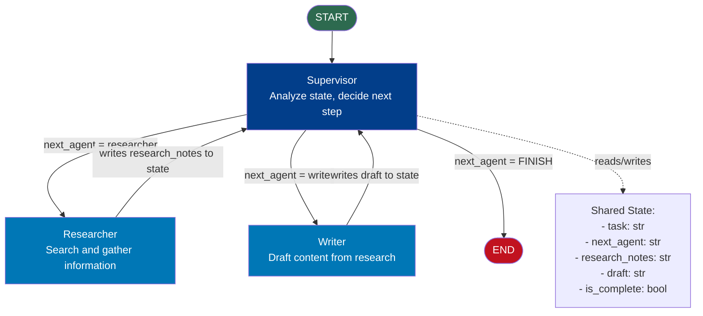
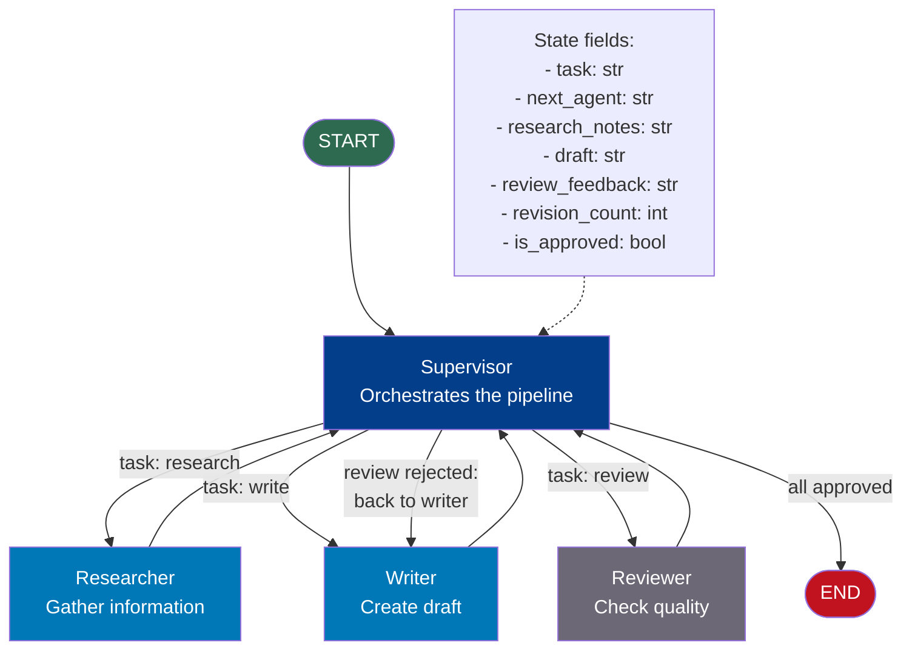
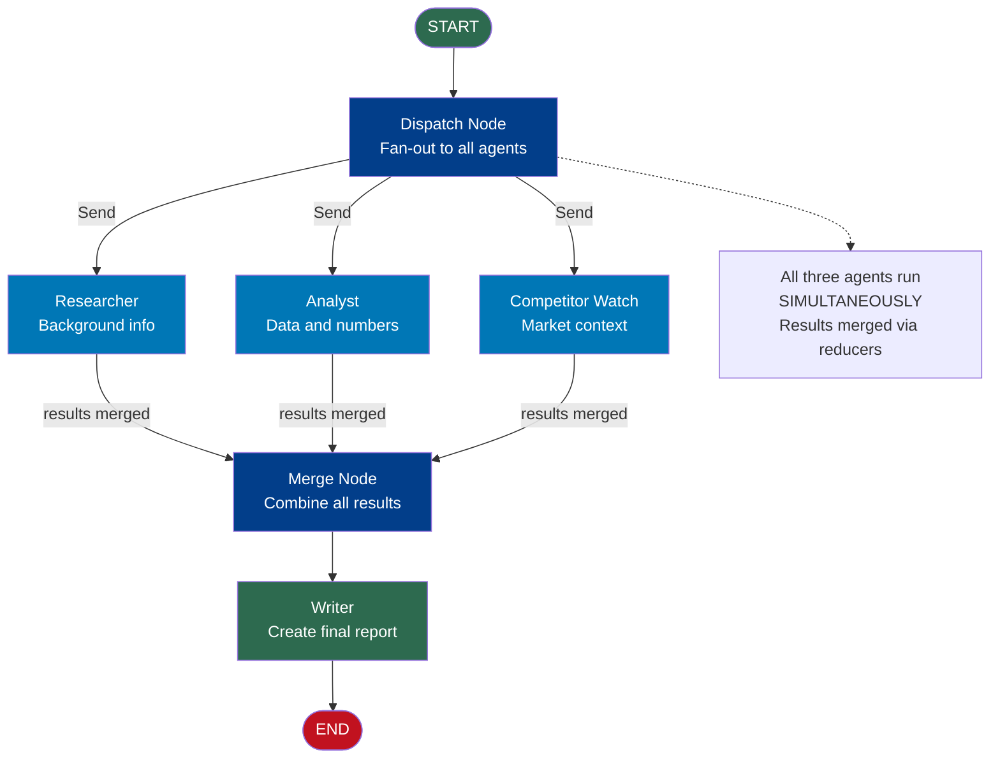
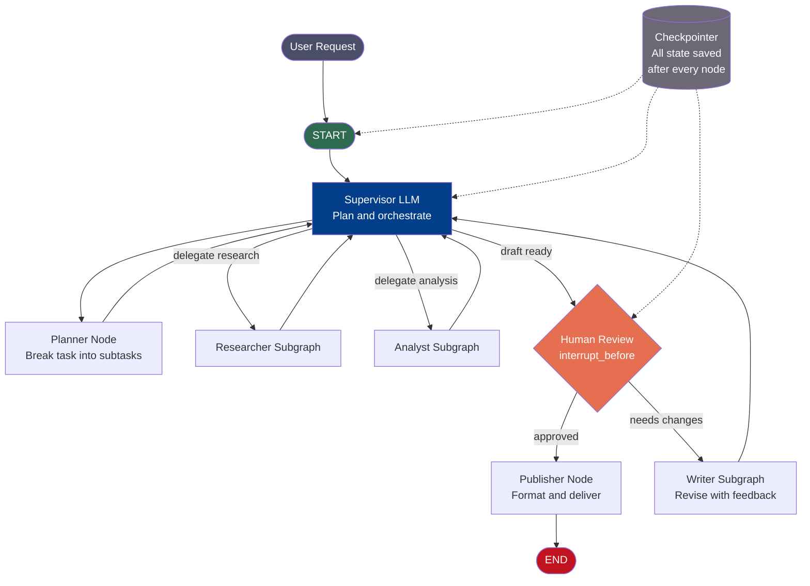
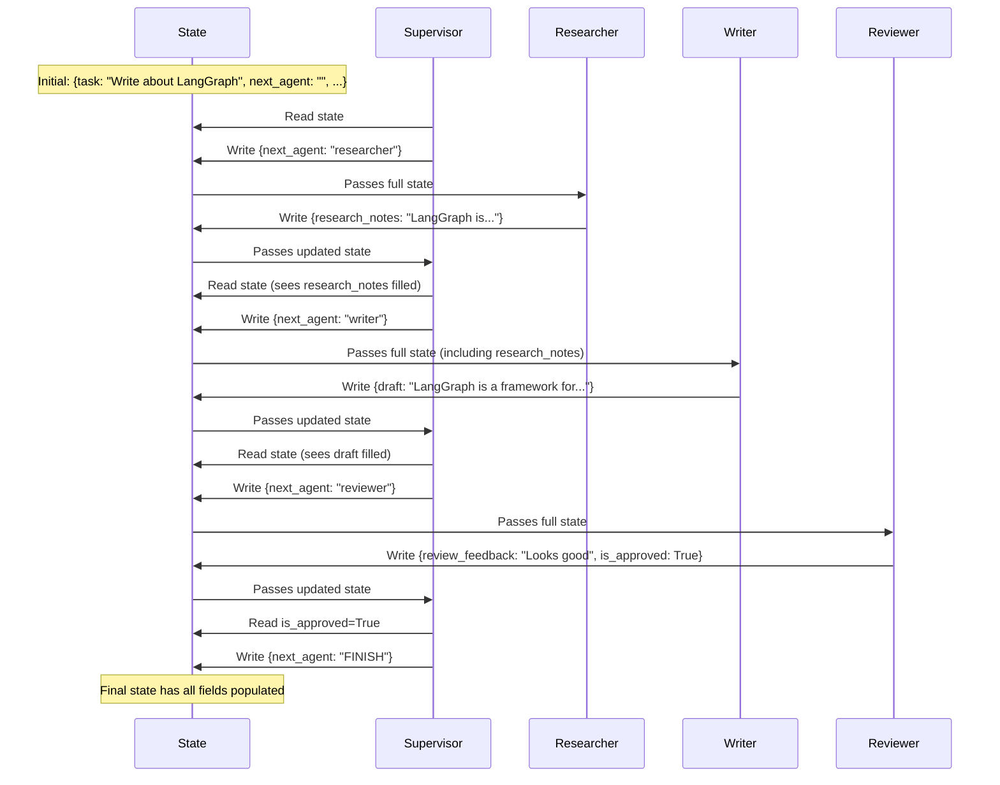

# Multi-Agent Architecture — Deep Dive

## Overview

This document provides a full architecture reference for multi-agent systems built with LangGraph, including detailed diagrams of the supervisor pattern and communication flows.

---

## Architecture 1: Simple Supervisor with 2 Specialists

The simplest multi-agent setup: one supervisor, two specialists, shared state.



**Data flow:**
1. START → Supervisor (with empty state, only `task` set)
2. Supervisor → Researcher (no research yet)
3. Researcher → Supervisor (research_notes now populated)
4. Supervisor → Writer (research done, no draft yet)
5. Writer → Supervisor (draft now populated)
6. Supervisor → END (all tasks complete)

---

## Architecture 2: Supervisor with 3 Specialists + Review Loop

A more realistic pipeline where the supervisor can send work back to the writer if the reviewer is not satisfied.



**Supervisor decision logic:**
```
if no research → research
if research but no draft → write
if draft but no review → review
if review rejected AND revisions < 3 → write again (with feedback)
if review approved OR revisions >= 3 → END
```

---

## Architecture 3: Subgraph Pattern (Each Agent is a Full Graph)

When specialists need their own internal complexity (their own loops, branching, tools).

```mermaid
flowchart TD
    subgraph Parent Graph
        START([START]) --> SUP[Supervisor Node]
        SUP -->|delegate| RES_NODE[Researcher Node]
        SUP -->|delegate| WRI_NODE[Writer Node]
        RES_NODE --> SUP
        WRI_NODE --> SUP
        SUP --> END([END])
    end

    subgraph Researcher Subgraph
        RS([START]) --> SEARCH[Search]
        SEARCH --> RERANK[Re-rank results]
        RERANK -->|not enough| SEARCH
        RERANK -->|sufficient| SYNTH[Synthesize]
        SYNTH --> RE([END])
    end

    subgraph Writer Subgraph
        WS([START]) --> DRAFT[Draft]
        DRAFT --> SELF_REVIEW[Self Review]
        SELF_REVIEW -->|needs improvement| DRAFT
        SELF_REVIEW -->|good enough| WE([END])
    end

    RES_NODE -.->|wraps| Researcher Subgraph
    WRI_NODE -.->|wraps| Writer Subgraph
```

**Code pattern for wrapping a subgraph:**

```python
# Each specialist is a compiled graph
researcher_app = build_researcher_graph().compile()
writer_app = build_writer_graph().compile()

# Wrap in a function that becomes a node
def researcher_node(state: TeamState) -> dict:
    sub_result = researcher_app.invoke({
        "query": state["task"],
        "max_results": 5
    })
    return {"research_notes": sub_result["synthesized_notes"]}

def writer_node(state: TeamState) -> dict:
    sub_result = writer_app.invoke({
        "task": state["task"],
        "notes": state["research_notes"]
    })
    return {"draft": sub_result["final_draft"]}
```

---

## Architecture 4: Parallel Fan-Out with Send API

When multiple agents can work simultaneously on independent subtasks.



---

## Architecture 5: Full Production Multi-Agent System

A complete production-grade system combining supervisor, subgraphs, HITL, and checkpointing.



---

## State Flow in a Multi-Agent System



---

## State Design for Multi-Agent Systems

The state TypedDict must include fields for every agent's inputs and outputs:

```python
from typing import TypedDict, Annotated
from langgraph.graph.message import add_messages
from langchain_core.messages import BaseMessage

class FullTeamState(TypedDict):
    # --- Input ---
    task: str                    # The original user request

    # --- Orchestration ---
    next_agent: str              # Supervisor's routing decision
    task_plan: list              # Planner's task breakdown
    iteration_count: int         # Safety: max supervisor loops

    # --- Researcher outputs ---
    research_notes: str          # Raw research from researcher
    sources: list                # URLs / citations

    # --- Writer outputs ---
    draft: str                   # Current draft content
    revision_count: int          # How many times writer has revised

    # --- Reviewer outputs ---
    review_feedback: str         # Reviewer's comments
    is_approved: bool            # Final approval flag

    # --- Conversation history ---
    messages: Annotated[list[BaseMessage], add_messages]

    # --- Final output ---
    final_output: str            # Published/delivered content
```

---

## 📂 Navigation

**In this folder:**

| File | |
|---|---|
| [📄 Theory.md](./Theory.md) | Full explanation |
| [📄 Cheatsheet.md](./Cheatsheet.md) | Quick reference |
| [📄 Interview_QA.md](./Interview_QA.md) | Interview prep |
| 📄 **Architecture_Deep_Dive.md** | ← you are here |
| [📄 Code_Example.md](./Code_Example.md) | Working code example |

⬅️ **Prev:** [Human-in-the-Loop](../05_Human_in_the_Loop/Theory.md) &nbsp;&nbsp;&nbsp; ➡️ **Next:** [Streaming and Checkpointing](../07_Streaming_and_Checkpointing/Theory.md)
