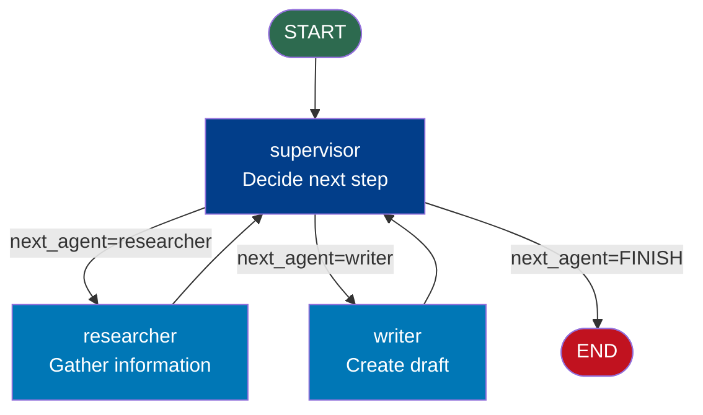

# Multi-Agent with LangGraph — Code Example

## Supervisor Agent with 2 Specialist Sub-agents

This example builds a content creation team:
- **Supervisor**: decides which specialist to call next
- **Researcher**: gathers information (simulated)
- **Writer**: drafts content based on research

```python
# multi_agent_example.py
# Run: pip install langgraph
# Then: python multi_agent_example.py

from langgraph.graph import StateGraph, START, END
from typing import TypedDict, Annotated
from langgraph.graph.message import add_messages
from langchain_core.messages import HumanMessage, AIMessage


# ─── 1. Shared Team State ────────────────────────────────────────────────────
# All agents read from and write to this single TypedDict.
# The state is the communication channel between agents.

class TeamState(TypedDict):
    # Input
    task: str

    # Orchestration: supervisor sets this, router reads it
    next_agent: str

    # Research agent output
    research_notes: str

    # Writer agent output
    draft: str

    # Loop safety
    iteration_count: int

    # Conversation log (accumulates all agent messages)
    messages: Annotated[list, add_messages]


# ─── 2. Supervisor Agent ────────────────────────────────────────────────────
# The supervisor analyzes the current state and decides what to do next.
# In production: this would call an LLM to make the routing decision.

def supervisor(state: TeamState) -> dict:
    """
    Orchestrator: decides which specialist to invoke next.
    Looks at what has been done and what still needs to be done.
    """
    iteration = state["iteration_count"]
    task = state["task"]

    print(f"\n[Supervisor] Iteration {iteration + 1} — Assessing state...")

    # Decision logic (in production: LLM makes this decision)
    if not state["research_notes"]:
        print("[Supervisor] → No research yet. Delegating to Researcher.")
        decision = "researcher"
        message = f"Delegating to Researcher: gather information about '{task}'"
    elif not state["draft"]:
        print("[Supervisor] → Research complete. Delegating to Writer.")
        decision = "writer"
        message = f"Delegating to Writer: create draft about '{task}' using gathered research"
    else:
        print("[Supervisor] → Both research and draft complete. Task finished.")
        decision = "FINISH"
        message = "All tasks complete. Finalizing."

    return {
        "next_agent": decision,
        "iteration_count": iteration + 1,
        "messages": [AIMessage(content=f"[Supervisor]: {message}")]
    }


# ─── 3. Researcher Agent ────────────────────────────────────────────────────
# A specialist that focuses exclusively on research.
# In production: this would use web search tools, database queries, etc.

def researcher(state: TeamState) -> dict:
    """
    Researcher specialist: gathers information on the task topic.
    Only writes to research_notes — does not touch other agent fields.
    """
    task = state["task"]
    print(f"\n[Researcher] Starting research on: '{task}'")

    # Simulate research (in production: call search tools, LLM, databases)
    research = f"""
    RESEARCH NOTES for: {task}
    ===========================
    Key facts discovered:
    1. {task} is a significant topic in modern AI development
    2. It was developed to solve specific coordination problems
    3. Key benefits include improved modularity and specialization
    4. Current adoption is growing in enterprise AI teams
    5. Best practices include starting simple and adding complexity iteratively

    Sources: [simulated — in production these would be real citations]
    Research quality: High confidence
    """

    print(f"[Researcher] Research complete. Notes: {len(research)} characters")

    return {
        "research_notes": research,
        "messages": [AIMessage(content=f"[Researcher]: Completed research on '{task}'. Found 5 key facts.")]
    }


# ─── 4. Writer Agent ────────────────────────────────────────────────────────
# A specialist that focuses exclusively on writing.
# In production: uses LLM with a writer system prompt and the research notes.

def writer(state: TeamState) -> dict:
    """
    Writer specialist: creates a draft based on the research notes.
    Reads research_notes but does not modify them.
    """
    task = state["task"]
    notes = state["research_notes"]

    print(f"\n[Writer] Starting draft for: '{task}'")
    print(f"[Writer] Working with {len(notes)} characters of research")

    # Simulate writing (in production: call LLM with writer system prompt)
    draft = f"""
    DRAFT: {task.upper()}
    ========================

    Introduction:
    {task} represents one of the most important developments in modern AI system
    design. This document provides a comprehensive overview.

    Key Points:
    Based on our research, {task} offers several critical advantages:

    • Modularity: Systems can be built component by component
    • Specialization: Each agent focuses on what it does best
    • Scalability: New capabilities can be added without restructuring

    Practical Applications:
    Organizations using {task} have reported significant improvements in their
    AI development workflows.

    Conclusion:
    {task} is not just a technical framework — it represents a new paradigm
    for building AI systems that can tackle complex, real-world problems.

    [Draft quality: Ready for review]
    """

    print(f"[Writer] Draft complete. {len(draft)} characters written.")

    return {
        "draft": draft,
        "messages": [AIMessage(content=f"[Writer]: Completed draft for '{task}'. {len(draft)} characters.")]
    }


# ─── 5. Supervisor Router ────────────────────────────────────────────────────

def supervisor_router(state: TeamState) -> str:
    """
    Router: reads the supervisor's decision and returns the next node name.
    Called after every supervisor execution.
    """
    next_agent = state["next_agent"]

    # Safety check: exit if too many iterations (prevents infinite loops)
    if state["iteration_count"] >= 10:
        print("[Router] Safety limit reached — terminating")
        return END

    if next_agent == "FINISH":
        return END
    return next_agent  # Returns "researcher" or "writer" (node names)


# ─── 6. Build the Multi-Agent Graph ─────────────────────────────────────────

graph = StateGraph(TeamState)

# Add all agent nodes
graph.add_node("supervisor", supervisor)      # Orchestrator
graph.add_node("researcher", researcher)      # Specialist 1
graph.add_node("writer", writer)              # Specialist 2

# Entry: always start with supervisor
graph.add_edge(START, "supervisor")

# Supervisor routes to specialists based on its decision
graph.add_conditional_edges("supervisor", supervisor_router)

# All specialists always report back to supervisor
graph.add_edge("researcher", "supervisor")   # researcher → back to supervisor
graph.add_edge("writer", "supervisor")       # writer → back to supervisor

# Compile the graph
app = graph.compile()


# ─── 7. Run the Multi-Agent System ──────────────────────────────────────────

print("=" * 65)
print("MULTI-AGENT CONTENT CREATION TEAM")
print("Supervisor → Researcher → Writer")
print("=" * 65)

initial_state: TeamState = {
    "task": "Multi-Agent Systems with LangGraph",
    "next_agent": "",
    "research_notes": "",
    "draft": "",
    "iteration_count": 0,
    "messages": [HumanMessage(content="Create a comprehensive piece about Multi-Agent Systems with LangGraph")],
}

final_state = app.invoke(initial_state, config={"recursion_limit": 30})

# ─── 8. Results ──────────────────────────────────────────────────────────────

print("\n" + "=" * 65)
print("FINAL RESULTS")
print("=" * 65)

print(f"\nTask completed in {final_state['iteration_count']} supervisor iterations")
print(f"\nMessage log ({len(final_state['messages'])} messages):")
for msg in final_state["messages"]:
    role = "User" if isinstance(msg, HumanMessage) else "Agent"
    print(f"  [{role}]: {msg.content[:80].strip()}...")

print(f"\nResearch notes (first 150 chars):")
print(f"  {final_state['research_notes'][:150].strip()}...")

print(f"\nDraft (first 200 chars):")
print(f"  {final_state['draft'][:200].strip()}...")
```

---

## Expected Output

```
=================================================================
MULTI-AGENT CONTENT CREATION TEAM
Supervisor → Researcher → Writer
=================================================================

[Supervisor] Iteration 1 — Assessing state...
[Supervisor] → No research yet. Delegating to Researcher.

[Researcher] Starting research on: 'Multi-Agent Systems with LangGraph'
[Researcher] Research complete. Notes: 387 characters

[Supervisor] Iteration 2 — Assessing state...
[Supervisor] → Research complete. Delegating to Writer.

[Writer] Starting draft for: 'Multi-Agent Systems with LangGraph'
[Writer] Working with 387 characters of research
[Writer] Draft complete. 789 characters written.

[Supervisor] Iteration 3 — Assessing state...
[Supervisor] → Both research and draft complete. Task finished.

=================================================================
FINAL RESULTS
=================================================================

Task completed in 3 supervisor iterations

Message log (4 messages):
  [User]: Create a comprehensive piece about Multi-Agent Systems with LangGraph...
  [Agent]: [Supervisor]: Delegating to Researcher: gather information about...
  [Agent]: [Researcher]: Completed research on 'Multi-Agent Systems...
  [Agent]: [Writer]: Completed draft for 'Multi-Agent Systems with LangGraph'...

Research notes (first 150 chars):
  RESEARCH NOTES for: Multi-Agent Systems with LangGraph
  ===========================
  Key facts discovered:
  1. Multi-Agent Syst...

Draft (first 200 chars):
  DRAFT: MULTI-AGENT SYSTEMS WITH LANGGRAPH
  ========================

  Introduction:
  Multi-Agent Systems with LangGraph represents one of the most impor...
```

---

## Graph Structure



---

## Key Concepts Demonstrated

| Concept | Where in code |
|---|---|
| Supervisor pattern | `supervisor()` node with `next_agent` decision field |
| Conditional routing | `supervisor_router()` reads `next_agent` state field |
| All agents → supervisor | `add_edge("researcher", "supervisor")` etc. |
| State as communication | `research_notes` written by researcher, read by writer |
| Message accumulation | `messages: Annotated[list, add_messages]` |
| Safety limit | `iteration_count >= 10` check in router |
| Specialist isolation | Writer only writes to `draft`, not `research_notes` |

---

## Extending This Example

### Add a Reviewer agent:
```python
def reviewer(state: TeamState) -> dict:
    draft = state["draft"]
    # Check quality criteria
    feedback = evaluate_draft(draft)
    is_approved = feedback["score"] >= 0.8
    return {
        "review_feedback": feedback["comments"],
        "is_approved": is_approved,
        "messages": [AIMessage(content=f"[Reviewer]: Score {feedback['score']:.2f}")]
    }

# Update supervisor logic:
# after writer: delegate to reviewer
# after reviewer: if approved → FINISH, else → writer again
```

---

## 📂 Navigation

**In this folder:**

| File | |
|---|---|
| [📄 Theory.md](./Theory.md) | Full explanation |
| [📄 Cheatsheet.md](./Cheatsheet.md) | Quick reference |
| [📄 Interview_QA.md](./Interview_QA.md) | Interview prep |
| [📄 Architecture_Deep_Dive.md](./Architecture_Deep_Dive.md) | Full architecture diagrams |
| 📄 **Code_Example.md** | ← you are here |

⬅️ **Prev:** [Human-in-the-Loop](../05_Human_in_the_Loop/Theory.md) &nbsp;&nbsp;&nbsp; ➡️ **Next:** [Streaming and Checkpointing](../07_Streaming_and_Checkpointing/Theory.md)
