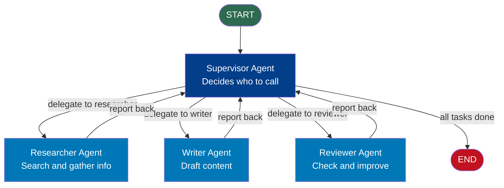
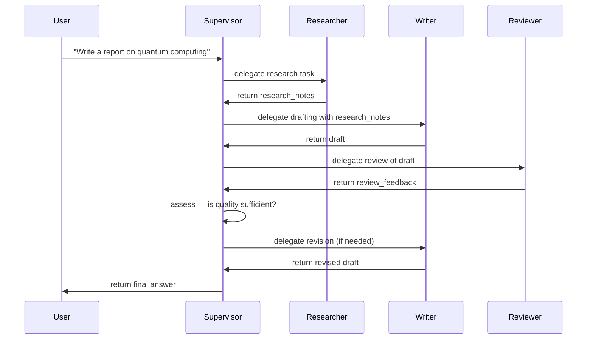

# Multi-Agent Systems with LangGraph

## The Story 📖

A technology company has a CEO (the orchestrator). When a client brings a complex project, the CEO doesn't do everything alone. They delegate: the researcher gathers information, the writer drafts the proposal, the reviewer checks it for errors, and the designer creates the visuals. Each specialist does one thing well. The CEO coordinates — deciding who to call, when, and in what order. No specialist knows what the others are doing; they just receive a task, complete it, and report back.

This is the structure of every effective organization — and it is also the structure of the most powerful AI systems being built today.

👉 This is why we need **Multi-Agent Systems with LangGraph** — the ability to build AI "org charts" in code, where a supervisor agent delegates to specialized sub-agents, each with their own tools, prompts, and capabilities.

---

## 📌 Learning Priority

**Must Learn** — core concepts, needed to understand the rest of this file:
[What is a Multi-Agent System?](#what-is-a-multi-agent-system) · [Supervisor Pattern](#the-supervisor-pattern) · [Communication via State](#how-agents-communicate-via-shared-state)

**Should Learn** — important for real projects and interviews:
[Handoffs Between Agents](#handoffs-between-agents) · [Common Mistakes](#common-mistakes-to-avoid-)

**Good to Know** — useful in specific situations, not needed daily:
[Subgraph Pattern](#the-subgraph-pattern) · [Parallel Execution](#parallel-execution)

**Reference** — skim once, look up when needed:
[Connection to Other Concepts](#connection-to-other-concepts-)

---

## What is a Multi-Agent System?

A **multi-agent system** is a collection of AI agents that work together to complete tasks that are too complex for a single agent. Each agent has:
- Its own set of tools
- Its own system prompt / persona
- Its own "area of expertise"

A **supervisor** agent coordinates them, deciding which specialist to call and when. This separation of concerns makes the system:
- **More capable**: specialists can be deeply tuned for their domain
- **More maintainable**: you can swap out one agent without touching others
- **More scalable**: you can add new specialists without restructuring everything

---

## Why It Exists — The Problem It Solves

A single LLM agent trying to do everything — research, write, review, and execute — has several problems:

1. **Context window limits**: One agent accumulates too much context doing diverse tasks, degrading quality
2. **Conflicting instructions**: "Be a careful researcher" and "be a decisive executor" conflict in a single system prompt
3. **Tool overload**: Giving one agent 20 tools degrades its tool selection quality
4. **Single point of failure**: One bad decision affects the entire workflow

Multi-agent architectures distribute these concerns across specialists, each with a focused context window, targeted system prompt, and appropriate tool subset.

---

## The Supervisor Pattern

The most common multi-agent pattern in LangGraph is the **supervisor pattern**:



The supervisor:
1. Receives the overall task in state
2. Decides which specialist to invoke (via conditional edge)
3. Receives the specialist's output (in state)
4. Decides what to do next: invoke another specialist, or finish
5. Repeats until the task is complete

Each specialist:
1. Receives a task in state
2. Does their specialized work
3. Returns results to state
4. Routes back to the supervisor

---

## How Agents Communicate via Shared State

In LangGraph's multi-agent setup, agents communicate through state — they do not call each other directly. The state is the shared communication channel.

```python
from typing import TypedDict, Annotated
import operator
from langchain_core.messages import BaseMessage
from langgraph.graph.message import add_messages

class TeamState(TypedDict):
    # The task for the overall team
    task: str

    # Which specialist should work next
    next_agent: str

    # Accumulated work from all specialists
    messages: Annotated[list[BaseMessage], add_messages]

    # Research results from researcher
    research_notes: str

    # Draft from writer
    draft: str

    # Review feedback from reviewer
    review_feedback: str

    # Whether the task is complete
    is_complete: bool
```

---

## The Subgraph Pattern

For more complex multi-agent systems, each specialist can be its own compiled LangGraph — a **subgraph**. This allows specialists to have their own internal cycles and logic.

```python
# Specialist as a subgraph
researcher_graph = StateGraph(ResearcherState)
researcher_graph.add_node("search", search_node)
researcher_graph.add_node("synthesize", synthesize_node)
researcher_graph.add_edge(START, "search")
researcher_graph.add_edge("search", "synthesize")
researcher_graph.add_edge("synthesize", END)
researcher_app = researcher_graph.compile()

# Use the compiled subgraph as a node in the supervisor graph
def researcher_node(state: TeamState) -> dict:
    # Call the subgraph like any function
    result = researcher_app.invoke({"query": state["task"]})
    return {"research_notes": result["notes"]}

# Add to supervisor graph as a regular node
supervisor_graph.add_node("researcher", researcher_node)
```

---

## Handoffs Between Agents

A **handoff** is when one agent passes control to another. In LangGraph, handoffs happen through the router function. The supervisor node returns an update to `next_agent` in state, and the router reads this to decide which specialist node runs next.

```python
def supervisor_node(state: TeamState) -> dict:
    """
    Supervisor decides what to do next.
    In production: LLM analyzes progress and decides the next step.
    """
    if not state["research_notes"]:
        # No research yet — start there
        return {"next_agent": "researcher"}
    elif not state["draft"]:
        # Research done, no draft yet
        return {"next_agent": "writer"}
    elif not state["review_feedback"]:
        # Draft exists, no review yet
        return {"next_agent": "reviewer"}
    else:
        # All done
        return {"next_agent": "FINISH", "is_complete": True}

def supervisor_router(state: TeamState) -> str:
    """Route to the next agent based on supervisor's decision."""
    next_agent = state["next_agent"]
    if next_agent == "FINISH":
        return END
    return next_agent  # Name of the next agent node
```

---

## Parallel Execution

Some tasks can run in parallel — the researcher and a data analyst, for example, can both work simultaneously. LangGraph supports this via the `Send` API.

```python
from langgraph.types import Send

def fan_out_node(state: TeamState) -> list[Send]:
    """
    Dispatch multiple agents in parallel.
    Each Send specifies a target node and the state to send it.
    """
    return [
        Send("researcher", {"task": state["task"], "focus": "background"}),
        Send("data_analyst", {"task": state["task"], "focus": "statistics"}),
    ]

# Both researcher and data_analyst run in parallel
# Their results are merged back into the main state via reducers
```

---

## Step by Step: Building a Supervisor System



---

## Where You'll See This in Real AI Systems

- **Research automation**: supervisor + research agent + summarization agent + citation checker
- **Software development**: supervisor + code generator + code reviewer + test writer + debugger
- **Content creation**: supervisor + researcher + writer + editor + SEO optimizer
- **Customer support**: supervisor + intent classifier + order agent + billing agent + escalation agent
- **Financial analysis**: supervisor + data collector + quantitative analyst + risk assessor + report writer

---

## Common Mistakes to Avoid ⚠️

1. **No termination condition in the supervisor** — The supervisor loop needs an exit. Check `is_complete`, `iteration_count`, or a specific state field. Without this, the supervisor will keep delegating indefinitely.

2. **Agents that modify global state unexpectedly** — Each agent should only update the state fields relevant to its task. If the writer accidentally overwrites `research_notes`, the next supervisor decision is based on bad data.

3. **Missing shared state fields** — Agents communicate through state. If you add a new specialist but forget to add its output fields to the shared state TypedDict, results are lost.

4. **Subgraph state incompatibility** — When using subgraphs, the subgraph's input/output state must be compatible with the parent graph's state. Plan the state interfaces when designing the system.

5. **Supervisor making decisions without sufficient context** — The supervisor LLM needs to see the current state clearly. Include the relevant state fields in the supervisor's prompt: what has been done, what the current outputs look like, what remains.

6. **Too many specialists too early** — Start with 2 agents (supervisor + one specialist). Add specialists one at a time after verifying the basic pattern works. Multi-agent debugging is harder than single-agent debugging.

---

## Connection to Other Concepts 🔗

- **Nodes and Edges** (15/02): Each agent is a node (or a function wrapping a subgraph). Handoffs between agents are edges routed by the supervisor's decision.
- **State Management** (15/03): Shared state is the communication channel between agents. Reducer-based fields like `messages` accumulate the full conversation history across all agent contributions.
- **Cycles and Loops** (15/04): The supervisor loop is the outer cycle. Individual specialists may have their own inner cycles.
- **Human-in-the-Loop** (15/05): You can add HITL at any point in the multi-agent flow — for example, pause before the supervisor delegates to a high-stakes agent.
- **Streaming** (15/07): Stream the supervisor's decisions and each agent's output to give users visibility into the coordination process.

---

✅ **What you just learned**: Multi-agent systems in LangGraph use a supervisor node to coordinate specialist agent nodes. Agents communicate through shared state. The supervisor uses a conditional edge (router) to decide which agent to call next. The subgraph pattern lets each specialist have its own internal LangGraph with its own cycles. The `Send` API enables parallel agent execution.

🔨 **Build this now**: Build a 2-agent system with a supervisor and a single "researcher" agent. The supervisor starts, delegates to the researcher, and when the researcher returns, the supervisor outputs a summary and ends. Use state to pass the task to the researcher and the result back to the supervisor.

➡️ **Next step**: `07_Streaming_and_Checkpointing/Theory.md` — Learn how to stream LangGraph output in real-time and use checkpointers for conversation persistence.

---

## 🛠️ Practice Project

Apply what you just learned → **[A4: Multi-Agent Research System](../../22_Capstone_Projects/14_Multi_Agent_Research_System/03_GUIDE.md)**
> This project uses: supervisor subgraph + 4 parallel worker subgraphs, Send API for parallel dispatch, fault tolerance


---

## 📝 Practice Questions

- 📝 [Q82 · multi-agent-langgraph](../../ai_practice_questions_100.md#q82--design--multi-agent-langgraph)


---

## 📂 Navigation

**In this folder:**

| File | |
|---|---|
| 📄 **Theory.md** | ← you are here |
| [📄 Cheatsheet.md](./Cheatsheet.md) | Quick reference |
| [📄 Interview_QA.md](./Interview_QA.md) | Interview prep |
| [📄 Architecture_Deep_Dive.md](./Architecture_Deep_Dive.md) | Full architecture diagrams |
| [📄 Code_Example.md](./Code_Example.md) | Working code example |

⬅️ **Prev:** [Human-in-the-Loop](../05_Human_in_the_Loop/Theory.md) &nbsp;&nbsp;&nbsp; ➡️ **Next:** [Streaming and Checkpointing](../07_Streaming_and_Checkpointing/Theory.md)
