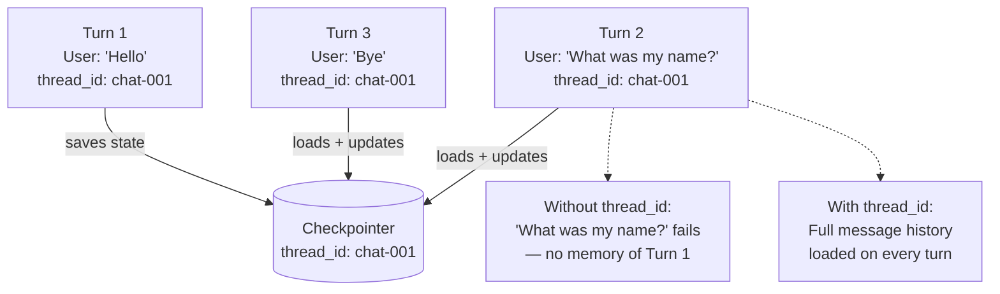
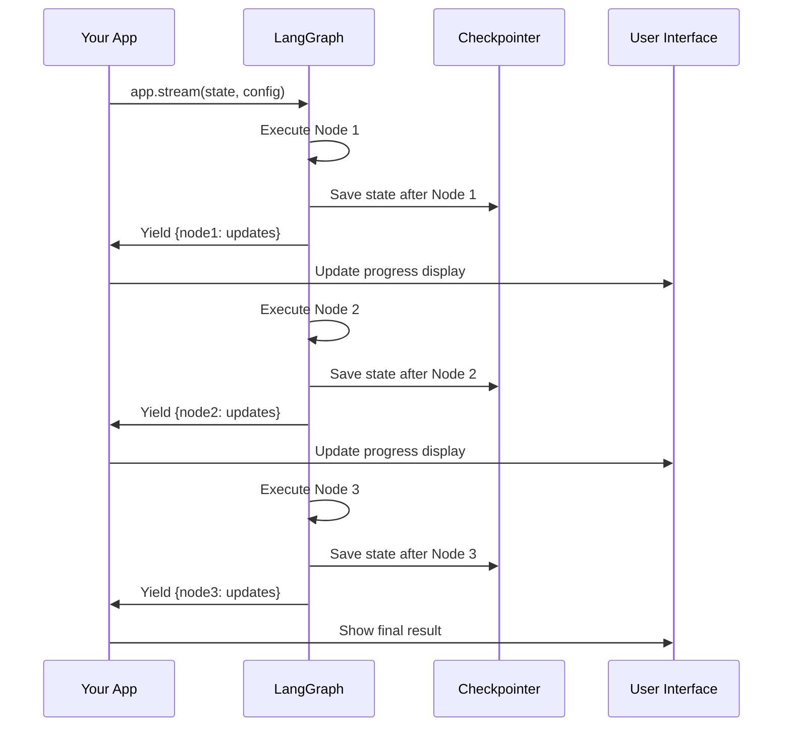

# Streaming and Checkpointing

## The Story 📖

You have asked a contractor to renovate your kitchen. They say it will take 4 weeks. You have two options: (1) they disappear for 4 weeks and you hear nothing, then one day they hand you keys to a finished kitchen; or (2) every day they send you a photo of progress — cabinets installed, tiles laid, plumbing done.

Option 2 is obviously better. You know it's on track. You can intervene if something looks wrong before it's too late. You know what to expect. The end result might be the same, but the *experience* is vastly different.

This is the difference between `.invoke()` and `.stream()` in LangGraph. Both produce the same final result — but streaming gives you the progress bar, the live updates, and the ability to react as the work unfolds.

👉 This is why we need **Streaming and Checkpointing** — streaming shows you the work as it happens, and checkpointing saves progress so it is never lost.

---

## 📌 Learning Priority

**Must Learn** — core concepts, needed to understand the rest of this file:
[What is Streaming?](#what-is-streaming-in-langgraph) · [invoke vs stream](#invoke-vs-stream--the-core-difference) · [What is Checkpointing?](#what-is-checkpointing)

**Should Learn** — important for real projects and interviews:
[Conversation Persistence](#conversation-persistence-with-thread-ids) · [Common Mistakes](#common-mistakes-to-avoid-)

**Good to Know** — useful in specific situations, not needed daily:
[Streaming Modes](#streaming-modes) · [Token-Level Streaming](#token-level-streaming--seeing-llm-output-live)

**Reference** — skim once, look up when needed:
[Checkpointer Types](#checkpointer-types)

---

## What is Streaming in LangGraph?

**Streaming** is the ability to receive output from a LangGraph graph incrementally, as each node finishes executing, rather than waiting for the entire graph to complete.

LangGraph provides two levels of streaming:

1. **Node-level streaming** — `stream()` yields a dict after each node completes, showing that node's output and which node ran
2. **Token-level streaming** — `astream_events()` streams individual LLM tokens as they are generated within a node

Both are exposed through the compiled graph's stream methods.

---

## Why Streaming Matters

Without streaming, your application shows a blank "loading" state while the graph runs. For a 5-second graph, that is annoying. For a 60-second research agent, it is unusable in any real-time application.

With streaming:
- **Chat interfaces**: users see tokens appear as the LLM generates them — feels instant even if generation takes 20 seconds
- **Agent dashboards**: operators watch each node's progress in real-time, can catch runaway loops early
- **Progress indicators**: show users "Researching... → Synthesizing... → Writing..." as work progresses
- **Debugging**: watch the state evolve node-by-node during development

---

## `.invoke()` vs `.stream()` — The Core Difference

```python
# .invoke() — waits for everything, returns final state
result = app.invoke(initial_state)
# You get: the complete final state after all nodes ran
# You wait: the entire graph execution time before seeing anything

# .stream() — yields after each node, shows progress
for chunk in app.stream(initial_state):
    print(chunk)
    # You get: {node_name: {state_updates_from_that_node}}
    # When: immediately after each node completes
```

### What `.stream()` yields:

```python
for chunk in app.stream({"question": "Why is the sky blue?"}):
    # chunk is a dict like:
    # {"search": {"results": ["Light scatters..."]}}  — after search node
    # {"summarize": {"summary": "The sky is blue because..."}}  — after summarize node
    print(chunk)
```

Each chunk is `{node_name: {partial_state_from_that_node}}`. You can use this to:
- Update a progress bar (new chunk = new node completed)
- Display intermediate results
- Log what each node contributed

---

## Streaming Modes

LangGraph's `.stream()` accepts a `stream_mode` parameter:

| Mode | What it yields | Best for |
|---|---|---|
| `"updates"` (default) | `{node_name: updates_dict}` after each node | Node-by-node progress |
| `"values"` | Full state after each node | Watching state evolve |
| `"debug"` | Detailed execution info | Development debugging |
| `"messages"` | Individual message tokens | Chat interfaces |

```python
# Default: node updates
for chunk in app.stream(state, stream_mode="updates"):
    print(chunk)

# Full state after each node
for state_snapshot in app.stream(state, stream_mode="values"):
    print(state_snapshot["messages"])

# Token streaming (async)
async for event in app.astream_events(state, version="v2"):
    if event["event"] == "on_chat_model_stream":
        print(event["data"]["chunk"].content, end="", flush=True)
```

---

## Token-Level Streaming — Seeing LLM Output Live

The most important streaming for user-facing applications is token-level streaming — seeing the LLM's response appear word by word, just like ChatGPT.

```python
import asyncio
from langchain_openai import ChatOpenAI

llm = ChatOpenAI(model="gpt-4o-mini", streaming=True)

async def stream_tokens():
    async for event in app.astream_events(
        initial_state,
        config=config,
        version="v2"  # Use v2 for stability
    ):
        kind = event["event"]
        if kind == "on_chat_model_stream":
            # This fires for every token the LLM generates
            content = event["data"]["chunk"].content
            if content:
                print(content, end="", flush=True)
        elif kind == "on_chain_start":
            # This fires when a node starts
            print(f"\n[Node starting: {event['name']}]")

asyncio.run(stream_tokens())
```

---

## What is Checkpointing?

A **checkpointer** is a storage backend that LangGraph uses to save the complete graph state after every node execution. When a checkpointer is attached, every state transition is automatically persisted.

Think of checkpointing like a video game save system: every time you complete a level (node), the game auto-saves. If anything goes wrong (crash, timeout, error), you resume from the last save point rather than starting over.

Checkpointing enables:
1. **Human-in-the-loop**: Pause execution, let a human review, resume later (covered in Section 05)
2. **Crash recovery**: If your process dies mid-execution, restart from the last checkpoint
3. **Conversation persistence**: A chat agent remembers previous conversations using checkpoints
4. **Audit trails**: Every state snapshot is stored and retrievable for compliance/debugging

---

## Checkpointer Types

### MemorySaver

Stores checkpoints in the Python process's memory. Fast, zero setup, lost on restart.

```python
from langgraph.checkpoint.memory import MemorySaver

memory = MemorySaver()
app = graph.compile(checkpointer=memory)
```

### SqliteSaver

Stores checkpoints in a SQLite database file. Persists across process restarts.

```python
from langgraph.checkpoint.sqlite import SqliteSaver

with SqliteSaver.from_conn_string("./my_checkpoints.db") as checkpointer:
    app = graph.compile(checkpointer=checkpointer)
```

---

## Conversation Persistence with Thread IDs

Checkpointing enables **multi-turn conversations** — the agent remembers what was said in previous turns because the full message history is saved in the checkpoint for each `thread_id`.



```python
from langgraph.graph import MessagesState

# Same thread_id = same conversation history loaded each time
config = {"configurable": {"thread_id": "user-alice-conversation-1"}}

# Turn 1
app.invoke({"messages": [HumanMessage("My name is Alice")]}, config=config)

# Turn 2 — history from Turn 1 is automatically loaded
result = app.invoke({"messages": [HumanMessage("What is my name?")]}, config=config)
# The LLM has access to the full history including "My name is Alice"
# It responds: "Your name is Alice"
```

---

## How Streaming and Checkpointing Work Together



Both streaming and checkpointing are attached at the same compile step — they work together automatically.

---

## Where You'll See This in Real AI Systems

- **Chat applications**: token streaming for real-time display (`astream_events`)
- **Research agents**: node streaming shows "Searching... → Analyzing... → Summarizing..."
- **Long-running pipelines**: checkpointing allows resuming after network timeouts
- **Customer service systems**: conversation persistence across sessions via `thread_id`
- **Audit systems**: every state change recorded for compliance review

---

## Common Mistakes to Avoid ⚠️

1. **Using `.invoke()` in user-facing applications** — For any AI that generates more than a short response, you should stream. Users will abandon your application if they stare at a spinner for 15+ seconds.

2. **Forgetting `streaming=True` on the LLM for token streaming** — Even if you use `astream_events`, if the LLM itself doesn't have `streaming=True`, it won't emit token events. Set `ChatOpenAI(streaming=True)`.

3. **Using MemorySaver for conversation persistence in production** — If your server restarts or you scale to multiple workers, MemorySaver loses all conversation history. Use SqliteSaver or PostgresSaver.

4. **Mixing up stream_mode="updates" and stream_mode="values"** — `"updates"` gives you `{node_name: node_output}` and is great for progress tracking. `"values"` gives you the full state after each node and is better for inspecting evolving state. Pick the right mode for your use case.

5. **Not using thread_id for multi-turn conversations** — Without a consistent thread_id, each `.invoke()` starts with a fresh state and the agent has no memory. Always use a thread_id for conversational applications.

---

## Connection to Other Concepts 🔗

- **State Management** (15/03): What gets checkpointed is the state TypedDict. Well-designed state = clear checkpoint data = easy to inspect and restore.
- **Human-in-the-Loop** (15/05): HITL uses the checkpointer to save the paused state. No checkpointer = no HITL. They are inseparable.
- **Cycles and Loops** (15/04): Streaming is especially valuable in loops — you can watch the agent improve with each iteration rather than waiting for the loop to complete.
- **Multi-Agent** (15/06): In multi-agent systems, streaming shows which sub-agent is running at each moment, giving visibility into complex orchestration.

---

✅ **What you just learned**: `.stream()` yields output after each node completes; `.astream_events()` streams individual LLM tokens. Checkpointers (`MemorySaver`, `SqliteSaver`) persist state after every node and enable conversation memory via thread IDs. `stream_mode` controls what is yielded — use `"updates"` for progress tracking and `"messages"` for chat token streaming.

🔨 **Build this now**: Add a MemorySaver checkpointer to any graph you've built. Then run it twice with the same thread_id (using MessagesState). In the second run, include a message that references something from the first run. Verify the agent remembers it.

➡️ **Next step**: `08_Build_with_LangGraph/Project_Guide.md` — Put everything together by building a full research agent that searches, synthesizes, reflects, and outputs a polished answer.

---

## 📂 Navigation

**In this folder:**

| File | |
|---|---|
| 📄 **Theory.md** | ← you are here |
| [📄 Cheatsheet.md](./Cheatsheet.md) | Quick reference |
| [📄 Interview_QA.md](./Interview_QA.md) | Interview prep |
| [📄 Code_Example.md](./Code_Example.md) | Working code example |

⬅️ **Prev:** [Multi-Agent with LangGraph](../06_Multi_Agent_with_LangGraph/Theory.md) &nbsp;&nbsp;&nbsp; ➡️ **Next:** [Build with LangGraph](../08_Build_with_LangGraph/Project_Guide.md)
