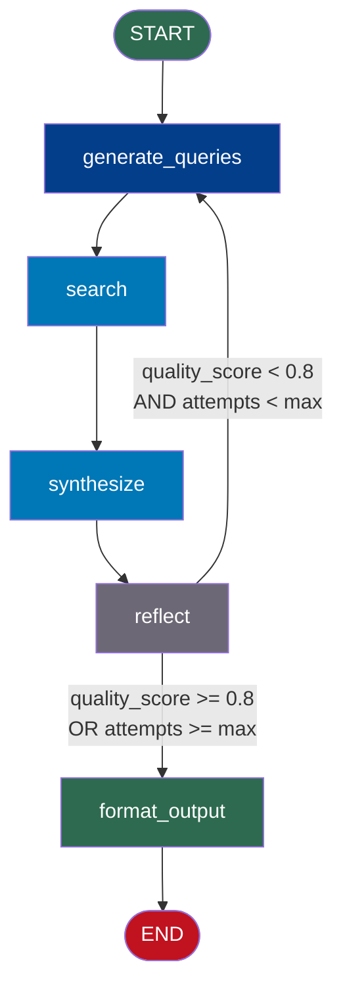
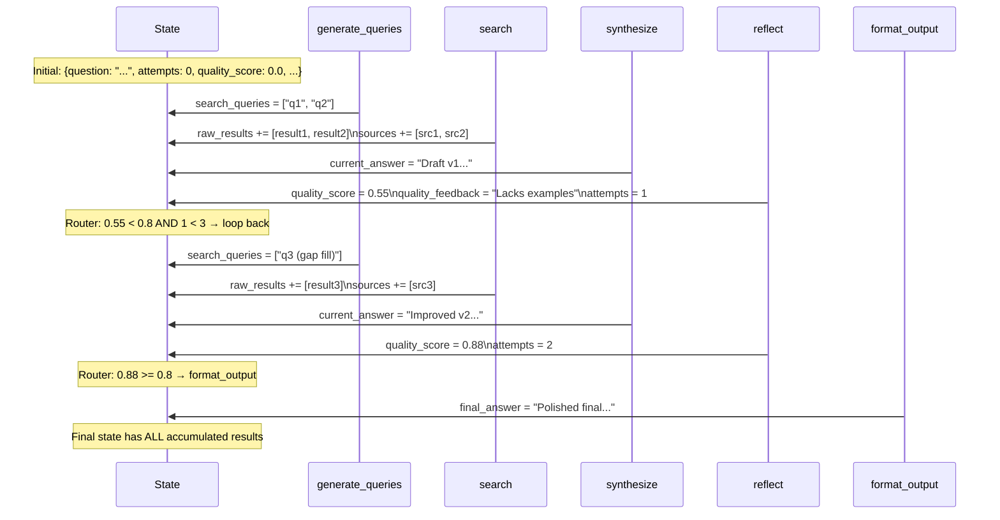
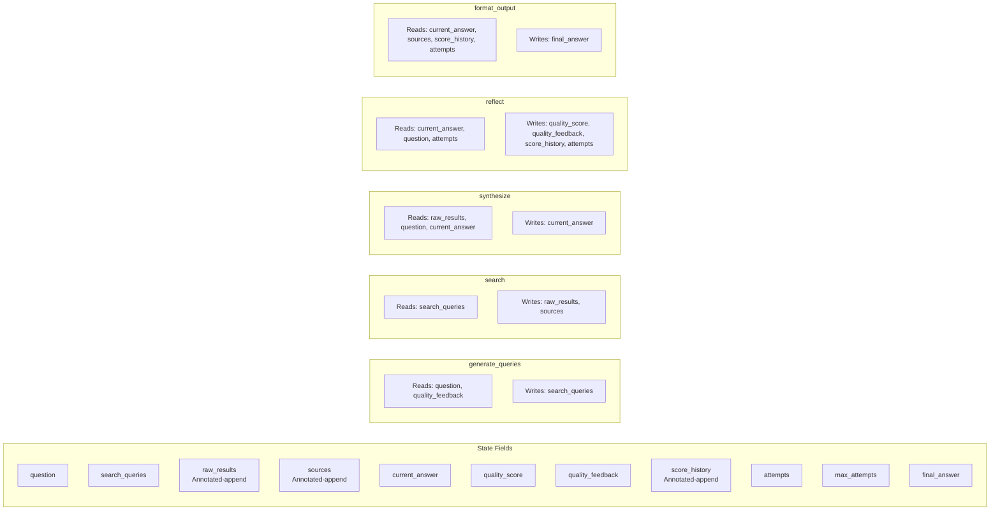
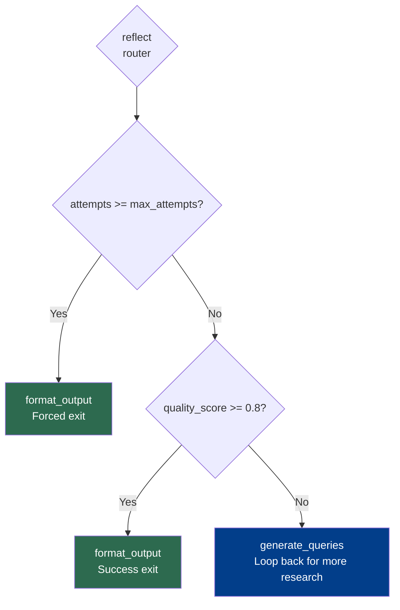

# Research Agent — Architecture Blueprint

## High-Level Graph Architecture



---

## State Flow Across Iterations



---

## Node Detail: What Each Node Reads and Writes



---

## Loop Termination Logic



The two conditions serve different purposes:
- **Quality threshold** (`>= 0.8`): natural success exit — the answer is good enough
- **Max attempts** (`>= max_attempts`): safety exit — give up gracefully, return best answer found

---

## Data Accumulation Across Loop Iterations

The `raw_results` and `sources` fields use `Annotated[list, operator.add]` reducers. This means:

```
Iteration 1: raw_results = ["Result from q1", "Result from q2"]
             sources    = ["source.com/1", "source.com/2"]

Iteration 2: raw_results = ["Result from q1", "Result from q2",   ← iteration 1
                             "Result from q3"]                    ← iteration 2
             sources    = ["source.com/1", "source.com/2",        ← iteration 1
                           "source.com/3"]                        ← iteration 2
```

By iteration 3, the `synthesize` node has *all* results from *all* iterations to work with. This is why the answer quality improves: more information is available each time.

---

## Streaming Output Plan

When run with `.stream()`, you see:

```
[Node: generate_queries] → Generated queries: ["q1", "q2"]
[Node: search]           → Found 4 results
[Node: synthesize]       → Answer draft v1 (320 chars)
[Node: reflect]          → Score: 0.55 | Feedback: "Lacks examples"
[Node: generate_queries] → Generated queries: ["q3 (examples)"]  ← loop iteration 2
[Node: search]           → Found 2 results
[Node: synthesize]       → Answer draft v2 (480 chars)
[Node: reflect]          → Score: 0.88 | Success!
[Node: format_output]    → Final answer ready (520 chars)
```

---

## Checkpointing Plan

With `MemorySaver` or `SqliteSaver` attached:
- Every node execution is saved
- 3 loop iterations × 4 nodes per iteration = 12 checkpoints minimum (plus format_output)
- If the process crashes mid-research, you can resume from the last checkpoint
- Use `app.get_state_history(config)` to see all checkpoints

---

## 📂 Navigation

**In this folder:**

| File | |
|---|---|
| [📄 Project_Guide.md](./Project_Guide.md) | Project overview and spec |
| 📄 **Architecture_Blueprint.md** | ← you are here |
| [📄 Step_by_Step.md](./Step_by_Step.md) | Implementation guide |
| [📄 Troubleshooting.md](./Troubleshooting.md) | Debug help |

⬅️ **Prev:** [Streaming and Checkpointing](../07_Streaming_and_Checkpointing/Theory.md) &nbsp;&nbsp;&nbsp; ➡️ **Next:** [LangGraph vs LangChain](../LangGraph_vs_LangChain.md)
