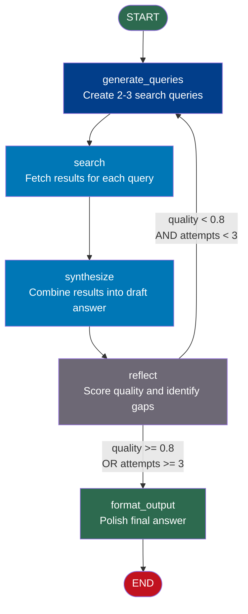

# Build with LangGraph — Project Guide

## Project: Research Agent

Build a complete **Research Agent** that takes a question, searches for information (simulated), synthesizes an answer, reflects on the quality, and loops until it produces a satisfactory response.

This project combines every concept from this section:
- StateGraph with TypedDict state
- Nodes and conditional edges
- Cycle/loop with quality reflection
- Streaming output
- Checkpointing for persistence

---

## What You Will Build

An agent that:
1. **Receives** a research question
2. **Generates** targeted search queries
3. **Simulates search** (returns fake but realistic results)
4. **Synthesizes** the results into a coherent answer
5. **Reflects** on its own answer — is it complete? Is it accurate?
6. **Loops back** to search more if quality is insufficient
7. **Outputs** the final polished answer with sources

---

## Architecture Overview



---

## State Design

```python
from typing import TypedDict, Annotated
import operator

class ResearchState(TypedDict):
    # Input
    question: str

    # Search phase
    search_queries: list           # Generated queries for this iteration
    raw_results: Annotated[list, operator.add]  # All results (accumulates)

    # Synthesis phase
    current_answer: str            # Current synthesized answer
    sources: Annotated[list, operator.add]      # All sources (accumulates)

    # Reflection phase
    quality_score: float           # 0.0 to 1.0 quality assessment
    quality_feedback: str          # What's missing or needs improvement
    score_history: Annotated[list, operator.add]  # Track all scores

    # Control
    attempts: int                  # Current iteration number
    max_attempts: int              # Maximum iterations allowed

    # Output
    final_answer: str              # Polished final output
```

---

## Node Specifications

### Node 1: `generate_queries`
- **Input**: `question`, `quality_feedback` (from previous iteration)
- **Output**: `search_queries` (list of 2-3 queries)
- **Logic**: LLM generates targeted queries. On subsequent iterations, uses `quality_feedback` to fill gaps.

### Node 2: `search`
- **Input**: `search_queries`
- **Output**: `raw_results` (appended), `sources` (appended)
- **Logic**: Loops through queries and retrieves results. Results accumulate across iterations.

### Node 3: `synthesize`
- **Input**: `raw_results`, `question`, `current_answer`
- **Output**: `current_answer`
- **Logic**: LLM synthesizes all accumulated results into a coherent answer. On subsequent iterations, improves on the previous answer.

### Node 4: `reflect`
- **Input**: `current_answer`, `question`, `attempts`
- **Output**: `quality_score`, `quality_feedback`, `score_history`, `attempts`
- **Logic**: LLM-as-judge scores the answer and identifies gaps.

### Node 5: `format_output`
- **Input**: `current_answer`, `sources`, `score_history`
- **Output**: `final_answer`
- **Logic**: Polishes formatting, adds source list, adds confidence note.

---

## Router Logic

```python
QUALITY_THRESHOLD = 0.80

def reflect_router(state: ResearchState) -> str:
    """
    Exit conditions (checked in priority order):
    1. Max attempts reached → force exit
    2. Quality threshold met → success exit
    3. Otherwise → loop back for more research
    """
    if state["attempts"] >= state["max_attempts"]:
        return "format_output"

    if state["quality_score"] >= QUALITY_THRESHOLD:
        return "format_output"

    return "generate_queries"
```

---

## Project Files

| File | Purpose |
|---|---|
| `Architecture_Blueprint.md` | Detailed Mermaid diagrams of the full agent graph |
| `Step_by_Step.md` | Complete implementation with working Python code |
| `Troubleshooting.md` | Common errors and how to fix them |

---

## Prerequisites

```bash
pip install langgraph langchain langchain-openai
# Set your API key (only needed if using real LLM)
export OPENAI_API_KEY="your-key-here"
```

For this project, all LLM calls are simulated. You can upgrade to real LLM calls by replacing the simulation functions with actual `llm.invoke()` calls.

---

## Learning Objectives

By completing this project you will have practiced:
- Designing a multi-field TypedDict state
- Writing 5 nodes that each update different state fields
- Using reducers for accumulating results across loop iterations
- Building a quality-reflection loop with dual exit conditions
- Adding streaming to watch the agent iterate in real time
- Adding checkpointing so the agent can be resumed

---

## 📂 Navigation

**In this folder:**

| File | |
|---|---|
| 📄 **Project_Guide.md** | ← you are here |
| [📄 Architecture_Blueprint.md](./Architecture_Blueprint.md) | Detailed architecture |
| [📄 Step_by_Step.md](./Step_by_Step.md) | Implementation guide |
| [📄 Troubleshooting.md](./Troubleshooting.md) | Debug help |

⬅️ **Prev:** [Streaming and Checkpointing](../07_Streaming_and_Checkpointing/Theory.md) &nbsp;&nbsp;&nbsp; ➡️ **Next:** [LangGraph vs LangChain](../LangGraph_vs_LangChain.md)
