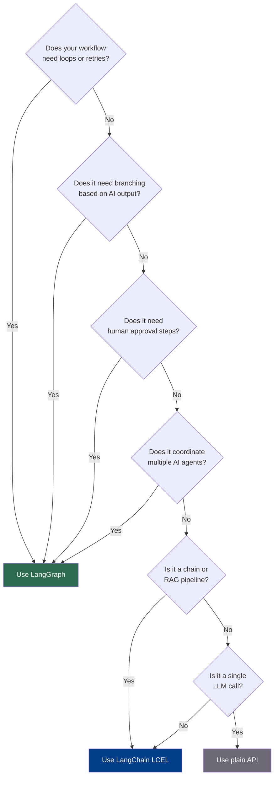

# LangGraph vs LangChain — The Complete Comparison

## The One-Sentence Summary

**LangChain** is for building linear AI pipelines (A→B→C). **LangGraph** is for building cyclic AI workflows (A→B→if condition→A or C). If your AI needs to loop, branch based on content, pause for human input, or coordinate multiple agents, use LangGraph. If it doesn't, LangChain is simpler.

---

## Feature-by-Feature Comparison

| Feature | LangChain | LangGraph |
|---|---|---|
| **Workflow shape** | Linear chain (DAG) | Directed graph with cycles |
| **Branching** | Limited (`RunnableBranch`) | First-class conditional edges |
| **Cycles / loops** | Not supported natively | Core feature |
| **State management** | Passed explicitly or via memory | Typed, shared TypedDict, auto-managed |
| **Streaming** | Yes (LCEL) | Yes (per-node + token-level) |
| **Human-in-the-loop** | Not built-in | First-class (`interrupt_before/after`) |
| **Checkpointing** | External, manual | Built-in (`MemorySaver`, `SqliteSaver`) |
| **Conversation memory** | Via `ConversationBufferMemory` | Via `MessagesState` + `thread_id` |
| **Multi-agent** | Not built-in | First-class subgraph pattern |
| **Debugging** | Chain inspect/trace | Stream nodes, `get_state_history()` |
| **Setup complexity** | Low | Medium |
| **Code verbosity** | Low | Higher (explicit graph definition) |
| **Best for** | RAG, text pipelines | Agents, complex workflows |
| **Built on** | LangChain core | LangChain (LangGraph uses it internally) |

---

## When to Use LangGraph

Use LangGraph when your workflow needs ANY of these:

### 1. Loops or Cycles
Your agent needs to retry, iterate, or keep going until a condition is met.
```
Generate answer → Evaluate quality → If quality < threshold → Generate again
```

### 2. Branching Based on Content
Your next action depends on what the previous step produced.
```
Classify intent → If "refund" → refund agent | If "order" → order agent
```

### 3. Human-in-the-Loop
A human needs to review, approve, or modify AI output before the workflow continues.
```
Draft email → [PAUSE for human review] → Resume after approval → Send
```

### 4. Multi-Agent Coordination
Multiple specialized AI agents need to work together under a coordinator.
```
Supervisor → Researcher → Writer → Reviewer → Supervisor → ...
```

### 5. Persistent State Across Sessions
Your agent needs to remember previous conversations or resume interrupted workflows.
```
User turn 1 → [saved] → User turn 2 → Agent recalls turn 1 → responds
```

### 6. Complex Control Flow
You need if/else/loop logic that determines what your AI does next — not just what it says.

---

## When to Use LangChain (Without LangGraph)

Use LangChain when your workflow is a straight line from input to output:

### 1. RAG Pipelines
```
Query → Retrieve documents → Augment prompt → Generate → Return
```
No loops, no branching — LCEL handles this perfectly.

### 2. Simple Tool-Using Agents
```
User message → LLM with tools → Tool result → LLM → Response
```
If the tool use is simple (one tool, one call), `AgentExecutor` is fine.

### 3. Text Transformation Pipelines
```
Raw text → Extract → Transform → Format → Output
```
Pure sequential processing — a chain is ideal.

### 4. Prompt Chaining
```
Prompt 1 → Output 1 → Prompt 2 (using Output 1) → Output 2 → Final
```
LCEL's pipe operator `|` handles this elegantly.

### 5. Prototyping and Experimentation
LangChain is faster to get started. If you're experimenting, start with LangChain. Add LangGraph when you hit the limits.

---

## When to Use Plain API Calls

Use neither LangChain nor LangGraph when:

- You have a single LLM call with no orchestration
- You're building a tight prototype in an afternoon
- The overhead of either framework isn't justified
- You need maximum performance and minimal dependencies

```python
# Just use the SDK directly
from openai import OpenAI
client = OpenAI()
response = client.chat.completions.create(
    model="gpt-4o-mini",
    messages=[{"role": "user", "content": "Hello"}]
)
```

---

## Decision Flowchart



---

## Code Style Comparison

**LangChain (LCEL)** — compact, declarative, chain-style:
```python
from langchain_core.prompts import ChatPromptTemplate
from langchain_openai import ChatOpenAI

chain = (
    ChatPromptTemplate.from_template("Answer: {question}")
    | ChatOpenAI(model="gpt-4o-mini")
    | StrOutputParser()
)
result = chain.invoke({"question": "What is AI?"})
```

**LangGraph** — explicit, stateful, graph-style:
```python
from langgraph.graph import StateGraph, START, END
from typing import TypedDict

class State(TypedDict):
    question: str
    answer: str

def answer_node(state: State) -> dict:
    response = llm.invoke(state["question"])
    return {"answer": response.content}

graph = StateGraph(State)
graph.add_node("answer", answer_node)
graph.add_edge(START, "answer")
graph.add_edge("answer", END)
app = graph.compile()
result = app.invoke({"question": "What is AI?", "answer": ""})
```

The LangChain version is shorter. But the LangGraph version lets you add loops, branches, and human approval at any point — the LangChain version cannot.

---

## Migration Guide: LangChain → LangGraph

If you have an existing LangChain agent and need to migrate to LangGraph:

### Step 1: Identify what you're adding
Common reasons to migrate:
- Need to retry on bad outputs
- Need human approval for certain actions
- Need to track multiple steps in state
- Need conditional branching

### Step 2: Design your state TypedDict
Map your existing chain's inputs/outputs to TypedDict fields:
```python
# Before (LangChain): separate variables
query = "..."
docs = retriever.invoke(query)
answer = llm.invoke(...)

# After (LangGraph): unified state
class RAGState(TypedDict):
    query: str
    docs: list
    answer: str
```

### Step 3: Convert each step to a node
```python
# Each step becomes a node function
def retrieve(state: RAGState) -> dict:
    docs = retriever.invoke(state["query"])
    return {"docs": docs}

def generate(state: RAGState) -> dict:
    answer = llm.invoke(format_prompt(state["query"], state["docs"]))
    return {"answer": answer.content}
```

### Step 4: Add the graph structure
```python
graph = StateGraph(RAGState)
graph.add_node("retrieve", retrieve)
graph.add_node("generate", generate)
graph.add_edge(START, "retrieve")
graph.add_edge("retrieve", "generate")
graph.add_edge("generate", END)
app = graph.compile()
```

### Step 5: Add your new capabilities
```python
# Now you can add what wasn't possible before:
# - Retry if docs are insufficient
# - Add human review before sending
# - Add reflection loop for quality
graph.add_conditional_edges("generate", quality_router)
```

### Migration tips:
- Migrate incrementally — convert one node at a time
- Keep your existing LangChain components as-is inside node functions
- Start with a simple 2-node linear graph and add complexity after it works
- Your existing LangChain chains/tools continue to work inside LangGraph nodes

---

## Summary

| | LangChain | LangGraph |
|---|---|---|
| **Mental model** | Recipe | Flowchart |
| **When it shines** | RAG, text pipelines, simple agents | Agents with loops, HITL, multi-agent |
| **Learning curve** | Low | Medium |
| **Production use** | Millions of apps | Growing rapidly in enterprise AI |
| **Relationship** | Foundation | Built on LangChain |

The most important thing to remember: **LangGraph is not a replacement for LangChain — it is an extension of it**. You use both together. LangChain provides the LLM integrations, prompt templates, and tools. LangGraph provides the orchestration layer that connects them into cyclic, stateful workflows.

---

## 📂 Navigation

| | |
|---|---|
| **Section root** | `15_LangGraph/` |
| **This file** | `LangGraph_vs_LangChain.md` |
| **Fundamentals** | `01_LangGraph_Fundamentals/Theory.md` |
| **Build Project** | `08_Build_with_LangGraph/Project_Guide.md` |
| **Previous section** | `14_LangChain/` (if exists) |
