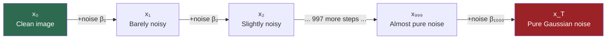
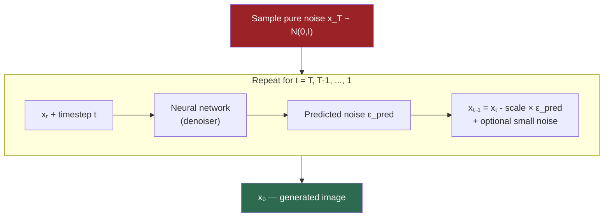
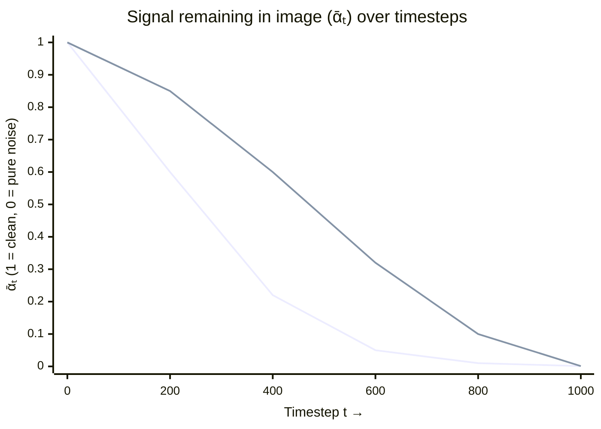

# Diffusion Fundamentals

## The Story 📖

Imagine dropping ink into a glass of water. It blooms outward until the whole glass is a uniform pale blue — structure destroyed, randomness achieved. Now imagine reversing that: the pale blue un-mixes, the drop reforms.

In real physics, this is impossible. In machine learning, you can teach a neural network to perform exactly this reversal — not on ink, but on images. Show it millions of examples of "what a slightly less noisy version of this image looks like," and it learns to go from pure static all the way back to a clear picture.

That is the core idea behind **diffusion models**: destroy structure step by step by adding noise, then train a model to undo that destruction, one small step at a time.

---

## What is a Diffusion Model?

A **diffusion model** is a generative AI that creates images (or audio, video, molecules, etc.) by learning to reverse a gradual noising process.

- If you can learn to take a slightly noisy image and make it slightly less noisy, you can chain those steps together to turn pure random noise into a coherent image.
- The model never "imagines" an image from scratch — it just answers: "given this noisy image at this noise level, what direction should I nudge it to make it cleaner?"

Diffusion models belong to the **generative models** family alongside GANs, VAEs, and autoregressive models (like GPT).

---

## Why It Exists

Before diffusion (roughly pre-2021), the state-of-the-art was **GANs**. GANs produce sharp images but suffer from training instabilities and **mode collapse** — generators stuck producing a narrow range of outputs.

Diffusion models trade inference speed for:
- Far more **training stability** (simple regression loss, no adversarial game)
- Better **coverage of the data distribution** (no collapse)
- Higher **image quality and diversity**
- Natural support for **conditioning** on text, images, depth maps, etc.

Key papers: **DDPM** (Ho et al., 2020), **Improved DDPM** (2021), **Latent Diffusion** (Rombach et al., 2022) — the last made it practical on consumer hardware.

---

## How It Works — Step by Step

### The Forward Process — Destroying Structure

Given a real image x₀, the forward process adds **Gaussian noise** at each of T timesteps (T ≈ 1000):



**The clever trick:** You don't run 1000 steps during training. A closed-form formula jumps directly from x₀ to any xₜ, making training efficient.

### The Reverse Process — Creating Images

A neural network (the **denoiser**) takes xₜ (noisy) and predicts the added noise. Subtract the predicted noise → get xₜ₋₁. Repeat T times.



---

## The Math / Technical Side (Simplified)

### Forward Process

At each step, a tiny amount of noise is blended in:
```
xₜ = √(1 - βₜ) · xₜ₋₁  +  √βₜ · ε,    ε ~ N(0, I)
```

### Closed-Form Shortcut

Stack all steps to jump from x₀ directly to any xₜ:
```
xₜ = √(ᾱₜ) · x₀  +  √(1 - ᾱₜ) · ε
```
Where **ᾱₜ = ∏ᵢ₌₁ᵗ (1 - βᵢ)**. When t is small, ᾱₜ ≈ 1 (mostly image); when t is large, ᾱₜ ≈ 0 (mostly noise).

### Training Objective

Predict the noise that was added; penalize with MSE:
```
L = E[ || ε - ε_θ(xₜ, t) ||² ]
```
Not a GAN game. Not a complex variational bound. Just: predict the noise, minimize squared error.

### Noise Schedules

| Schedule | Behavior | Introduced In |
|----------|----------|---------------|
| **Linear** | βₜ increases linearly from 0.0001 to 0.02 | Original DDPM (2020) |
| **Cosine** | ᾱₜ follows a cosine curve — slower start, more signal early | Improved DDPM (2021) |

The **cosine schedule** is preferred — the linear schedule destroys too much structure early, leaving the model little to learn.



---

## Where You'll See This in Real AI Systems

- **Stable Diffusion** — open-source image generation workhorse
- **DALL-E 2 and 3** (OpenAI) — diffusion for the image generation stage
- **Midjourney** — diffusion-based under the hood
- **Imagen / Imagen 2** (Google) — cascaded diffusion at multiple resolutions
- **Sora** (OpenAI) — extends diffusion to video
- **AudioLDM** — latent diffusion on audio spectrograms
- **DiffDock / RFDiffusion** — diffusion for protein-ligand binding and protein structure design

---

## Common Mistakes to Avoid ⚠️

**Thinking the model "draws" like an artist.** It starts with random noise and reduces uncertainty everywhere simultaneously — more like developing a photograph than drawing a picture.

**Confusing training steps with inference steps.** T=1000 is a training detail. With **DDIM**, inference needs only 20-50 steps for comparable quality.

**Assuming Gaussian noise is arbitrary.** Gaussian noise gives a closed-form forward process and clean decomposition of the reverse. Other distributions break these properties.

**Confusing model architecture with the diffusion process.** The U-Net is one architecture for the denoiser. The diffusion math is the framework — swap in a transformer (as FLUX does) and the math stays the same.

**Expecting memorization = bad, novelty = good.** Diffusion models learn statistical structure, not pixel copies. However, for very rare training images, memorization can occur and is an active research concern.

---

## Connection to Other Concepts 🔗

- **Score matching** — alternative framing that arrives at the same algorithm; the score function ∇ log p(x) is equivalent to the normalized noise prediction
- **VAEs** — also use a learned prior with encoder-decoder structure, but single-step inference; faster but lower quality
- **U-Net** — the most common denoiser architecture; see `02_How_Diffusion_Works/Architecture_Deep_Dive.md`
- **CLIP** — text encoder used to condition the denoiser on language; see `03_Stable_Diffusion/Theory.md`
- **CFG** — the technique that makes text conditioning powerful; see `04_Guidance_and_Conditioning/Theory.md`
- **Latent Diffusion** — runs diffusion in compressed latent space; see `03_Stable_Diffusion/Theory.md`

---

✅ **What you just learned:**
Diffusion models learn to reverse a gradual noising process. The forward pass adds Gaussian noise step-by-step (with a closed-form shortcut). A neural network is trained to predict the added noise (simple MSE loss). Noise schedules (linear vs cosine) control how fast structure is destroyed — cosine preserves more signal early and gives better results.

🔨 **Build this now:**
In Python, take any image and apply the closed-form noise formula at t=100, t=500, and t=999 using a linear noise schedule. Visualize the three corrupted versions side by side.

➡️ **Next step:**
Head to [02_How_Diffusion_Works / Theory.md](../02_How_Diffusion_Works/Theory.md) to see the U-Net architecture in detail, understand the full DDPM training loop, and compare DDPM vs DDIM sampling speed.

---

## 📂 Navigation

**In this folder:**
| File | |
|---|---|
| 📄 **Theory.md** | ← you are here |
| [📄 Cheatsheet.md](./Cheatsheet.md) | Quick reference card |
| [📄 Interview_QA.md](./Interview_QA.md) | Interview prep Q&A |
| [📄 Intuition_First.md](./Intuition_First.md) | Pure intuition, no math |

⬅️ **Prev:** [Section 16 README](../Readme.md) &nbsp;&nbsp;&nbsp; ➡️ **Next:** [How Diffusion Works](../02_How_Diffusion_Works/Theory.md)
