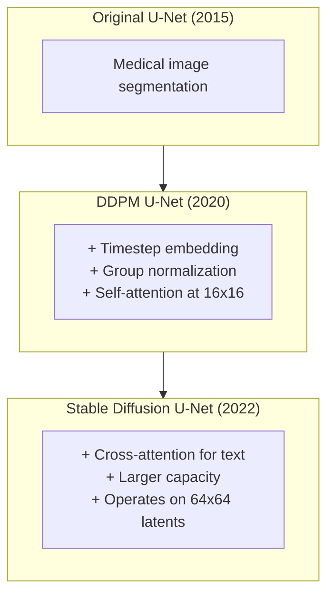
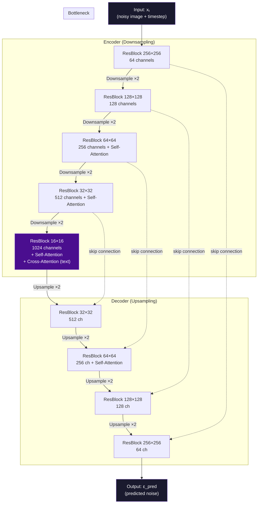
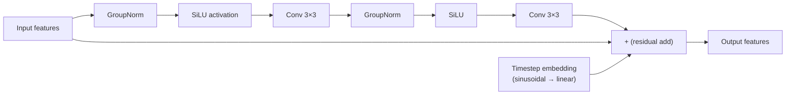
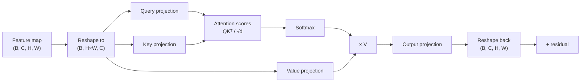
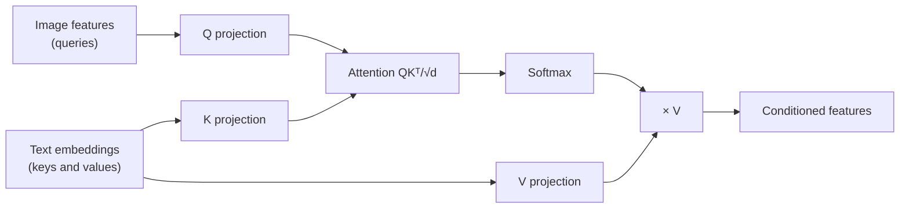

# U-Net Architecture — Deep Dive

## Why U-Net?

The denoiser in a diffusion model faces a unique challenge: it needs to understand an image at multiple levels of abstraction simultaneously.

- **Global structure** (is this a face or a landscape?) — needs high-level, compressed representations
- **Local detail** (is this a wrinkle or a hair strand?) — needs high-resolution spatial maps

A plain CNN loses spatial information as you go deeper. A plain transformer treats everything as patches without explicit resolution hierarchy. The **U-Net** solves this by having a symmetric encoder-decoder with skip connections that explicitly preserve spatial information at every scale.

---

## The U-Net Family Tree

The U-Net was originally designed for biomedical image segmentation (Ronneberger et al., 2015). It was adopted for diffusion models in DDPM (Ho et al., 2020) because its architecture naturally handles the denoising task at multiple resolutions.

---

## U-Net Architecture Overview

The U-Net has three sections: the **encoder** (downsampling path), the **bottleneck**, and the **decoder** (upsampling path). Skip connections link encoder and decoder at each resolution.

---

## The Key Building Blocks

### ResBlock (Residual Block)

Each "ResBlock" in the U-Net contains:

The **timestep embedding** is projected via a linear layer and added to the feature maps after the first normalization. This is how the model knows what noise level it's working at — the embedding modulates every ResBlock throughout the entire network.

### Self-Attention Block

Self-attention (the same mechanism from transformers) is applied at the lower-resolution feature maps (e.g., 16×16, 32×32):

Self-attention is expensive at high resolutions (O(n²) complexity where n = H×W). That's why it's only used in the lower-resolution (spatially smaller) parts of the network.

### Cross-Attention Block (Text Conditioning)

In text-conditioned models (like Stable Diffusion), cross-attention layers are added to every ResBlock:

The text embeddings act as keys and values. The image features act as queries. This allows each spatial location in the image to "attend to" relevant parts of the text description — that's how "a red apple on a white table" gets the red color into the right region.

---

## Downsampling and Upsampling

**Downsampling (encoder):** Typically strided convolution or average pooling. Reduces spatial dimensions by 2× while increasing channel count.

**Upsampling (decoder):** Nearest-neighbor or bilinear interpolation followed by convolution. Restores spatial dimensions by 2×.

**Skip connections:** The output of each encoder ResBlock is concatenated channel-wise with the input of the corresponding decoder ResBlock. This doubles the channel count at the concatenation point, which is why decoder blocks typically have a convolution to reduce channels back down.

---

## U-Net Dimensions in Stable Diffusion

For Stable Diffusion 1.5, the U-Net operates on 64×64×4 latent tensors (not pixel space):

| Stage | Spatial Size | Channels | Has Attention? |
|-------|-------------|----------|----------------|
| Input | 64×64 | 4 (latent) | — |
| Encoder block 1 | 64×64 | 320 | No |
| Encoder block 2 | 32×32 | 640 | Yes |
| Encoder block 3 | 16×16 | 1280 | Yes |
| Bottleneck | 8×8 | 1280 | Yes + cross-attn |
| Decoder block 3 | 16×16 | 1280 | Yes |
| Decoder block 2 | 32×32 | 640 | Yes |
| Decoder block 1 | 64×64 | 320 | No |
| Output | 64×64 | 4 (latent) | — |

Total parameters: ~860M for SD 1.5's U-Net.

---

## Why Skip Connections Are Critical

Without skip connections: the decoder must reconstruct all fine-grained spatial information from the bottleneck alone. This is a massive information bottleneck — the 8×8 representation at the bottleneck must contain enough information to reconstruct sharp 64×64 features. It can't.

With skip connections: the decoder at each resolution has direct access to the encoder's high-resolution feature maps from the same scale. The bottleneck handles semantics; the skip connections handle spatial precision.

In denoising, this means: the bottleneck determines the overall structure of the scene, while the skip connections allow the decoder to precisely predict where each noise pixel is.

---

## 📂 Navigation

**In this folder:**
| File | |
|---|---|
| [📄 Theory.md](./Theory.md) | Full explanation with diagrams |
| [📄 Cheatsheet.md](./Cheatsheet.md) | Quick reference |
| [📄 Interview_QA.md](./Interview_QA.md) | Interview prep |
| [📄 Math_Intuition.md](./Math_Intuition.md) | Simplified math walkthrough |
| 📄 **Architecture_Deep_Dive.md** | ← you are here |

⬅️ **Prev:** [Diffusion Fundamentals](../01_Diffusion_Fundamentals/Theory.md) &nbsp;&nbsp;&nbsp; ➡️ **Next:** [Stable Diffusion](../03_Stable_Diffusion/Theory.md)
