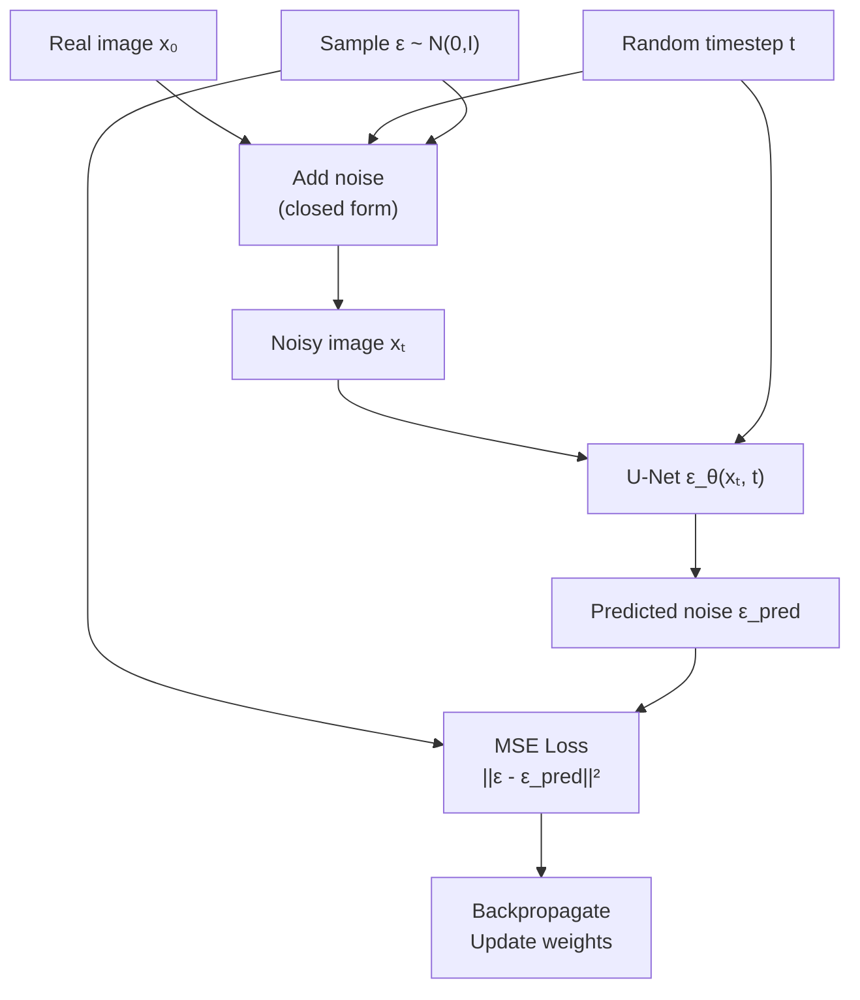
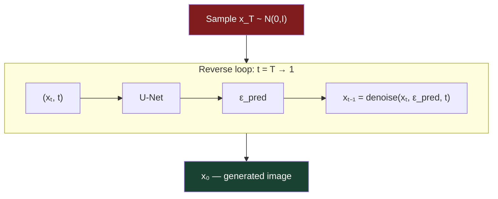
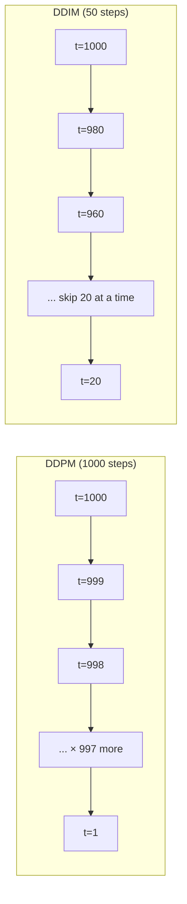

# How Diffusion Works

## The Story 📖

Imagine teaching someone to restore damaged photographs. You have an archive: originals alongside versions at every damage level — light scratches, heavy scratches, faded colors, near-total destruction.

You show your apprentice examples at every level: "Here's a photo with light damage — here's what it looks like slightly restored." After months, they get extraordinarily good at one thing: given any damaged photo and a label for how damaged it is, they can predict and patch the damage slightly. They've internalized the visual statistics of photographs at every level of degradation.

That's a U-Net learning to denoise. It never "sees" the final image it will produce — it just makes small improvements, chained together to produce new photographs from pure static.

---

## 📌 Learning Priority

**Must Learn** — core concepts, needed to understand the rest of this file:
[Forward Process](#step-1-the-forward-process) · [Training the Denoiser](#step-2-training-the-denoiser) · [Inference Loop](#step-3-inference--generating-new-images)

**Should Learn** — important for real projects and interviews:
[DDIM Sampling](#ddim-denoising-diffusion-implicit-models) · [DDPM vs DDIM](#ddpm-vs-ddim-sampling) · [Real AI Systems](#where-youll-see-this-in-real-ai-systems)

**Good to Know** — useful in specific situations, not needed daily:
[Parameterization Choices](#parameterization-choices) · [DDPM Reverse Step](#ddpm-reverse-step)

**Reference** — skim once, look up when needed:
[Common Mistakes](#common-mistakes-to-avoid-) · [Connection to Other Concepts](#connection-to-other-concepts-)

---

## What is the Mechanics of Diffusion?

Three concrete components work together:

1. **The forward process** — a fixed mathematical procedure that gradually corrupts real images with Gaussian noise
2. **The reverse process** — a trained neural network that learns to undo that corruption step by step
3. **The training objective** — a loss function that teaches the network to be a good denoiser

---

## How It Works — Step by Step

### Step 1: The Forward Process

Given a clean image x₀, the forward process adds Gaussian noise βₜ at each of T steps:

```mermaid
flowchart LR
    X0["x₀\nClean"] -->|q(x₁|x₀)| X1["x₁\nBarely noisy"]
    X1 -->|q(x₂|x₁)| X2["x₂\nLight noise"]
    X2 -->|"... × 996"| XT1["x₉₉₉\nHeavy noise"]
    XT1 -->|q(xT|xT₋₁)| XT["x_T\nPure noise"]

    style X0 fill:#1b4332,color:#fff
    style XT fill:#7f1d1d,color:#fff
```

The closed-form shortcut: jump from x₀ to any xₜ directly:
```
xₜ = √(ᾱₜ) · x₀  +  √(1 - ᾱₜ) · ε
```

### Step 2: Training the Denoiser

For each real image x₀:
1. Sample a random timestep t ~ Uniform(1, T)
2. Sample random noise ε ~ N(0, I)
3. Compute noisy image xₜ using the closed-form formula
4. Feed xₜ and t into the U-Net, get predicted noise ε_θ
5. Compute loss: MSE between actual noise ε and predicted ε_θ
6. Backpropagate, update weights



### Step 3: Inference — Generating New Images

1. Sample random noise x_T ~ N(0, I)
2. Run the reverse process T times: use U-Net to predict noise, subtract it, optionally add a small fresh noise (DDPM) or not (DDIM)



---

## DDPM vs DDIM Sampling

Two sampling algorithms, same trained model:

### DDPM (Denoising Diffusion Probabilistic Models)
At each reverse step, the model predicts noise, subtracts it, then adds a small fresh stochastic noise — preventing the reverse process from collapsing to a deterministic average.

```
xₜ₋₁ = μ_θ(xₜ, t) + σₜ · z,    z ~ N(0,I)
```

- Requires ~1000 steps for high quality
- Stochastic: different runs from the same seed give different results

### DDIM (Denoising Diffusion Implicit Models)
Reformulates the reverse process to be deterministic (σₜ = 0). Determinism allows "skipping" timesteps — jump from t=800 to t=600 — giving consistent results.

```
xₜ₋₁ = √(ᾱₜ₋₁) · x̂₀(xₜ) + √(1-ᾱₜ₋₁) · ε_θ(xₜ, t)
```

- Needs only 20-50 steps for comparable quality
- Deterministic: same seed gives same image every time
- Enables image editing via DDIM inversion



---

## The Math / Technical Side (Simplified)

### DDPM Reverse Step

The full DDPM reverse step computes the posterior mean of p(xₜ₋₁ | xₜ):

```
μ_θ(xₜ, t) = (1/√αₜ) · (xₜ - (βₜ/√(1-ᾱₜ)) · ε_θ(xₜ, t))
```

- `1/√αₜ`: rescales the step size
- `βₜ/√(1-ᾱₜ)`: weight on how much to subtract
- `ε_θ(xₜ, t)`: predicted noise from the network

The variance σₜ² can be fixed (βₜ) or learned. Fixed works fine in practice.

### Parameterization Choices

The model can predict:
1. **ε (noise)** — the Ho et al. default; what was added
2. **x₀ (clean image)** — what the clean image should be
3. **v (velocity)** — linear combination of ε and x₀; used in modern models like SD v-prediction

Noise prediction is most common and produces sharper results at high noise levels. v-prediction can be numerically more stable.

---

## Where You'll See This in Real AI Systems

- **DDPM**: Foundational algorithm; used in early research implementations
- **DDIM**: The fast sampler used by almost all practical diffusion pipelines
- **DPM-Solver++ / UniPC**: Even faster samplers (5-10 steps) based on ODE solvers; default in many modern UIs
- **HuggingFace Diffusers**: `DDPMScheduler` and `DDIMScheduler` implement exactly these algorithms
- **Stable Diffusion WebUI / ComfyUI**: DDIM, DPM++2M, Euler, etc. — all variants of the reverse process described here

---

## Common Mistakes to Avoid ⚠️

**Thinking DDIM and DDPM are different models.** They use the same trained model; they differ only in how they run the reverse process. You can switch schedulers on any diffusion model.

**Assuming more steps is always better.** Quality improves up to ~30-50 DDIM steps, then plateaus. 200 steps is not better than 50 and takes 4x longer.

**Forgetting the timestep embedding.** The U-Net receives the timestep as an input (sinusoidal embedding). Without this, the model can't distinguish low-noise from high-noise images.

**Confusing the training data requirement.** Diffusion models are trained as unconditional generators first. Text conditioning is added on top via cross-attention — two separate mechanisms.

---

## Connection to Other Concepts 🔗

- **U-Net architecture** — the standard denoiser; see `Architecture_Deep_Dive.md` in this folder
- **Attention mechanisms** — U-Net uses self-attention at middle and decoder layers; transformers replace U-Net entirely in FLUX
- **Noise schedules** — the βₜ values are a hyperparameter; cosine beats linear
- **Latent diffusion** — run diffusion in compressed VAE latent space instead of pixels (see folder 03)
- **CFG** — classifier-free guidance modifies the reverse process to bias toward a text prompt (see folder 04)

---

✅ **What you just learned:**
The forward process adds noise step-by-step (with a closed-form shortcut to any timestep). The U-Net is trained with simple MSE loss to predict the noise. DDPM uses stochastic sampling (~1000 steps). DDIM is deterministic and much faster (~20-50 steps), enabling practical real-time generation.

🔨 **Build this now:**
Implement the DDPM training loop from scratch: generate xₜ from x₀ using the closed-form formula, run it through a small U-Net, compute MSE against the actual noise, and backpropagate. Use MNIST images to keep it fast. Even a tiny model will learn to denoise noticeably within a few hundred steps.

➡️ **Next step:**
Head to [03_Stable_Diffusion / Theory.md](../03_Stable_Diffusion/Theory.md) to see how running diffusion in a compressed latent space makes it 8x cheaper and enables the Stable Diffusion family of models.

---

## 📂 Navigation

**In this folder:**
| File | |
|---|---|
| 📄 **Theory.md** | ← you are here |
| [📄 Cheatsheet.md](./Cheatsheet.md) | Quick reference |
| [📄 Interview_QA.md](./Interview_QA.md) | Interview prep |
| [📄 Math_Intuition.md](./Math_Intuition.md) | Simplified math walkthrough |
| [📄 Architecture_Deep_Dive.md](./Architecture_Deep_Dive.md) | U-Net with skip connections |

⬅️ **Prev:** [Diffusion Fundamentals](../01_Diffusion_Fundamentals/Theory.md) &nbsp;&nbsp;&nbsp; ➡️ **Next:** [Stable Diffusion](../03_Stable_Diffusion/Theory.md)
