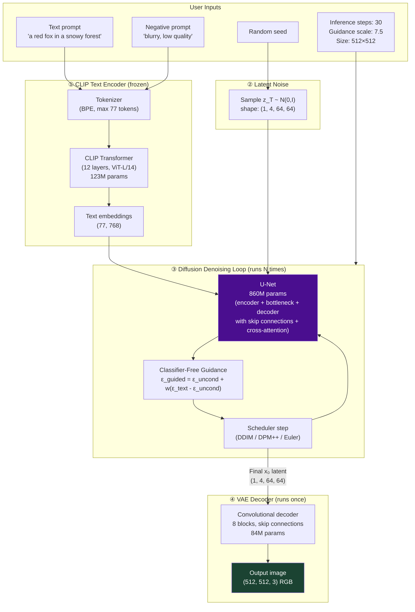
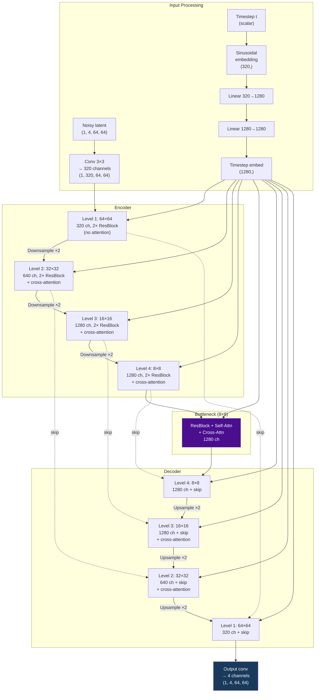
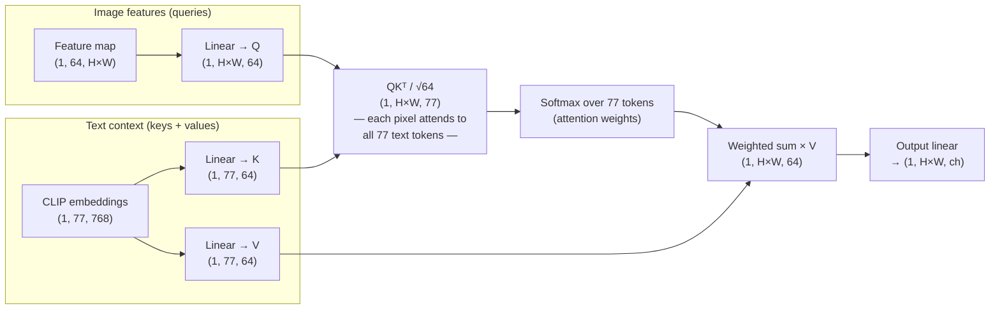
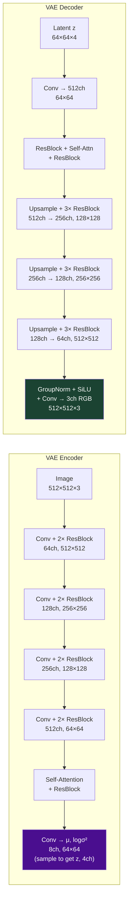
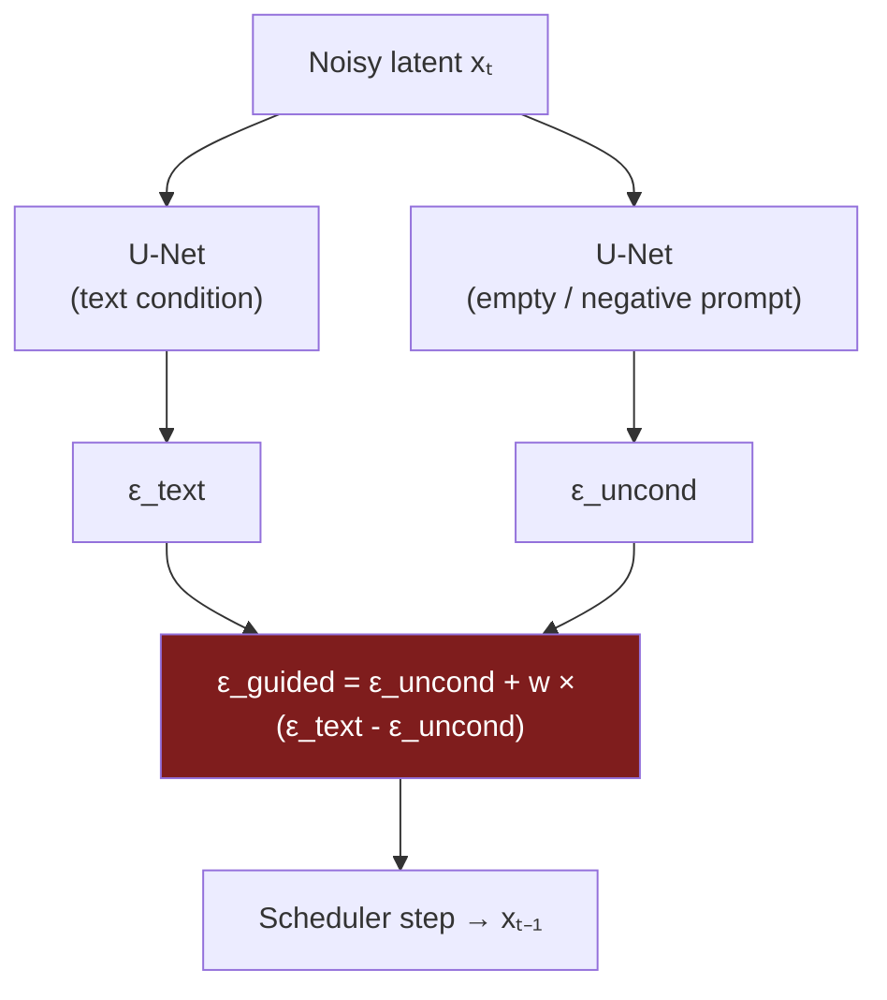
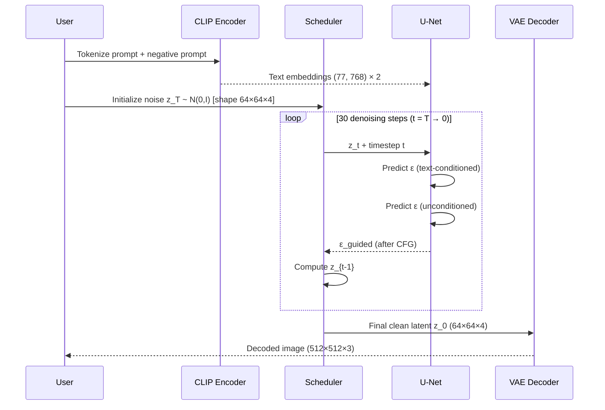

# Stable Diffusion — Full Architecture Deep Dive

## The Big Picture

Stable Diffusion is a composition of four independently trained components, connected into a single inference pipeline. Understanding which component does what is essential for debugging, customizing, and fine-tuning.

---

## Component 1: CLIP Text Encoder

```mermaid
flowchart LR
    TEXT["'a red fox in snowy forest'"] --> TOKENIZE

    subgraph TOKENIZE["Tokenization (BPE)"]
        TOK1["[SOT]"]
        TOK2["'a'"]
        TOK3["'red'"]
        TOK4["'fox'"]
        TOK5["'in'"]
        TOK6["'sn'"]
        TOK7["'owy'"]
        TOK8["'forest'"]
        TOK9["[EOT]"]
        TOKNPAD["[PAD] × 68"]
    end

    TOKENIZE --> EMBED["Token embeddings\n(77, 768)"]
    EMBED --> TRANSFORMER["Transformer\n12 layers\nself-attention\n768 hidden dim"]
    TRANSFORMER --> CONTEXT["Text context\n(77, 768)\nOne vector per token"]

    style CONTEXT fill:#1a3a5c,color:#fff
```

Key points:
- Maximum 77 tokens including [SOT] and [EOT] markers = 75 usable tokens for prompt
- Output shape: (77, 768) — not a single vector, but 77 vectors, one per token position
- The full sequence is used, not just the final [EOT] token — this preserves per-word information
- CLIP was trained on image-text alignment; it understands visual-semantic relationships

---

## Component 2: U-Net Architecture Detail

The U-Net in SD 1.5 has a specific structure with 4 resolution levels:

### Cross-Attention in Detail (how text guides image)

Inside each cross-attention block in the U-Net:

This is how "red" goes into the fox and "snowy" goes into the background — spatial positions that "should be fox" attend strongly to the "red" and "fox" tokens.

---

## Component 3: VAE Architecture

The VAE encoder compresses and the decoder expands. Both use residual blocks and attention at the bottleneck:

---

## Classifier-Free Guidance — The Math

During inference, the U-Net is called twice per step:

The guidance scale w controls how far to "push" toward the text condition:
- w=1: no guidance (same as using text condition without CFG)
- w=7.5: strong adherence to prompt (SD default)
- w=15+: over-adherence — artifacts, over-saturation

---

## Inference Timeline

---

## Total Compute Budget (per inference)

| Component | When | # Calls | Cost |
|-----------|------|---------|------|
| CLIP text encoder | Once | 1-2 | Tiny (123M params, fast) |
| U-Net forward pass | Every step | 30 × 2 = 60 (with CFG) | Heavy (860M params) |
| VAE decoder | Once | 1 | Medium (84M params) |
| VAE encoder | Only for img2img | 0-1 | Medium |

The U-Net is responsible for 95%+ of the total compute in a standard generation.

---

## 📂 Navigation

**In this folder:**
| File | |
|---|---|
| [📄 Theory.md](./Theory.md) | Conceptual overview |
| [📄 Cheatsheet.md](./Cheatsheet.md) | Quick reference |
| [📄 Interview_QA.md](./Interview_QA.md) | Interview prep |
| [📄 Code_Example.md](./Code_Example.md) | Generate images with diffusers |
| 📄 **Architecture_Deep_Dive.md** | ← you are here |

⬅️ **Prev:** [How Diffusion Works](../02_How_Diffusion_Works/Theory.md) &nbsp;&nbsp;&nbsp; ➡️ **Next:** [Guidance and Conditioning](../04_Guidance_and_Conditioning/Theory.md)
