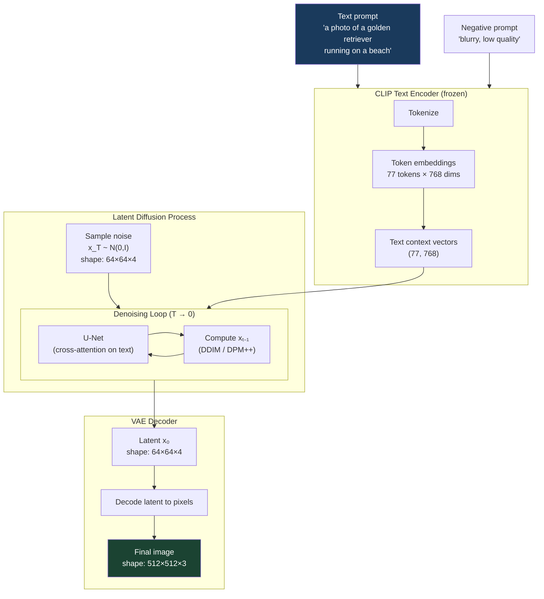
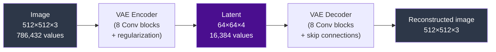
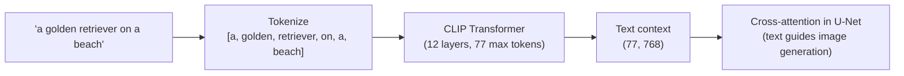

# Stable Diffusion

## The Story 📖

A sculptor wants to carve a detailed building-sized statue. Every chisel strike requires a crane and scaffolding — years of work. With a magic shrink ray, they shrink the statue to desk size, do all the detailed carving on the small version, then expand it back. Same detail, a fraction of the effort.

That's Stable Diffusion. Running diffusion on a 512×512 RGB image means operating on 786,432 numbers at each step. Stable Diffusion compresses the image into a 64×64×4 latent (16,384 numbers), runs denoising there, then expands back at the very end using a **VAE**. The result: full diffusion quality at 8× lower cost.

---

## What is Stable Diffusion?

**Stable Diffusion** is an open-source text-to-image model using **Latent Diffusion** — diffusion in the compressed latent space of a VAE rather than in pixel space. Released by Stability AI in August 2022, trained on LAION-5B (5 billion image-text pairs).

Four key components:
1. **VAE** — compresses images from pixel space to latent space and back
2. **CLIP text encoder** — converts text prompts into vectors the U-Net can use
3. **U-Net** — the diffusion denoiser, operating on latents, conditioned on text
4. **Noise scheduler** — controls noise levels during sampling

---

## Why It Exists

The "Latent Diffusion Models" paper (Rombach et al., 2022) made three observations:
1. Perceptually important image information is highly compressible — interesting variation lives in a much lower-dimensional space
2. A well-trained VAE can compress images to 1/8th linear dimensions (1/64th pixel count) with minimal perceptual loss
3. Running diffusion in this compressed space is 64× cheaper in memory

This made high-quality text-to-image generation possible on consumer GPUs for the first time.

---

## How It Works — Step by Step

### The Full Stable Diffusion Pipeline



### The VAE — Compressing and Decompressing



The 4-channel latent encodes color, texture, shape, and composition. What it discards: high-frequency noise and imperceptible fine-grain texture.

### The CLIP Text Encoder — Text Becomes a Vector

1. The prompt is tokenized into up to 77 tokens
2. CLIP encodes these into a sequence of 768-dimensional vectors: shape (77, 768)
3. These vectors serve as **keys and values** in cross-attention layers throughout the U-Net
4. Image features (queries) attend to text tokens, allowing text to guide what structure appears where



### The U-Net — Denoising in Latent Space

The U-Net operates on 64×64×4 latents (not pixels), has cross-attention layers at every ResBlock for text conditioning, and uses a cosine noise schedule. Cross-attention is what makes it a **text-to-image** model rather than just an image generator.

---

## The Math / Technical Side (Simplified)

### VAE Compression

The encoder outputs mean μ and log-variance log σ² for each latent dimension:
```
z = μ + σ · ε,    ε ~ N(0, I)
```
**KL divergence regularization** keeps the latent space organized and prevents memorization. During inference, the final denoised latent x₀ is decoded deterministically using just μ.

### Classifier-Free Guidance in Latent Space

CFG computes two noise predictions at each step:
1. Conditioned: ε_θ(xₜ, t, text)
2. Unconditional: ε_θ(xₜ, t, ∅)

Guided prediction: `ε_guided = ε_uncond + w · (ε_text - ε_uncond)`

Where w is the **guidance scale** (e.g., 7.5). Higher w → stronger prompt adherence.

### The Latent Space Scale Factor

The VAE's latent distribution has std ≈ 0.18, not 1. Stable Diffusion multiplies latents by **0.18215** before diffusion and divides before decoding. This constant matters when implementing from scratch.

---

## Where You'll See This in Real AI Systems

- **Stable Diffusion 1.5** — foundational model; still widely used for its speed and ControlNet ecosystem
- **Stable Diffusion 2.1** — improved OpenCLIP encoder, v-prediction, 768×768 native resolution
- **SDXL** — larger U-Net, two text encoders (CLIP-L + OpenCLIP-G), 1024×1024 native
- **Stable Diffusion 3** — replaces U-Net with a DiT, uses flow matching instead of DDPM
- **img2img** — encode image to latent, add noise to intermediate t, denoise with new prompt
- **Inpainting** — mask a region, encode remaining pixels, infill with diffusion
- **ComfyUI / InvokeAI / AUTOMATIC1111** — all run Stable Diffusion and expose the full pipeline

---

## Common Mistakes to Avoid ⚠️

**Forgetting the VAE scale factor.** Multiply encoded latents by 0.18215 before diffusion, divide before decoding. Forgetting this gives blurry, washed-out output.

**Confusing the VAE's latent channels with RGB.** The 4-channel latent is not "compressed RGBA." Each channel has no direct pixel correspondence — the VAE learned its own encoding.

**Thinking CLIP encodes linguistic meaning.** CLIP encodes visual-semantic relationships from image-text pairs. It can fail on unusual grammar, very long prompts, and rare concept combinations.

**Running the VAE at the wrong stage.** In SDXL, VAE decode happens at the very end. In img2img, VAE encode happens at the very beginning.

**Using the wrong CLIP for a model.** SD 1.5 uses OpenAI CLIP ViT-L/14. SD 2.x uses OpenCLIP ViT-H. SDXL uses both. Swapping text encoders gives garbage outputs.

---

## Connection to Other Concepts 🔗

- **VAEs** — the compression mechanism; the ELBO loss and KL regularization
- **CLIP** — the text encoder; trained via contrastive learning (see 06_Transformers)
- **U-Net** — the core denoiser; see `02_How_Diffusion_Works/Architecture_Deep_Dive.md`
- **CFG** — the guidance mechanism; see `04_Guidance_and_Conditioning/Theory.md`
- **ControlNet** — adds structural conditioning on top of SD; see folder 06
- **LoRA** — popular fine-tuning for adapting SD to specific styles/subjects; see folder 06
- **SDXL / FLUX** — next-generation models; see folder 05

---

✅ **What you just learned:**
Stable Diffusion = VAE compression + latent diffusion + CLIP text conditioning. The VAE shrinks images 8× in each dimension, making the process 64× cheaper. CLIP turns text into context vectors guiding generation via cross-attention. Full pipeline: text → CLIP → context vectors → U-Net (denoising latents) → VAE decoder → image.

🔨 **Build this now:**
Run the `Code_Example.md` in this folder to generate your first image with HuggingFace diffusers. Modify the prompt, inference steps, and guidance scale to see how each affects the output.

➡️ **Next step:**
Head to [04_Guidance_and_Conditioning / Theory.md](../04_Guidance_and_Conditioning/Theory.md) to understand how classifier-free guidance and negative prompts actually work, and why the CFG scale is the most important parameter for prompt adherence.

---

## 📂 Navigation

**In this folder:**
| File | |
|---|---|
| 📄 **Theory.md** | ← you are here |
| [📄 Cheatsheet.md](./Cheatsheet.md) | Quick reference |
| [📄 Interview_QA.md](./Interview_QA.md) | Interview prep |
| [📄 Code_Example.md](./Code_Example.md) | Generate images with diffusers |
| [📄 Architecture_Deep_Dive.md](./Architecture_Deep_Dive.md) | Full SD architecture diagram |

⬅️ **Prev:** [How Diffusion Works](../02_How_Diffusion_Works/Theory.md) &nbsp;&nbsp;&nbsp; ➡️ **Next:** [Guidance and Conditioning](../04_Guidance_and_Conditioning/Theory.md)
