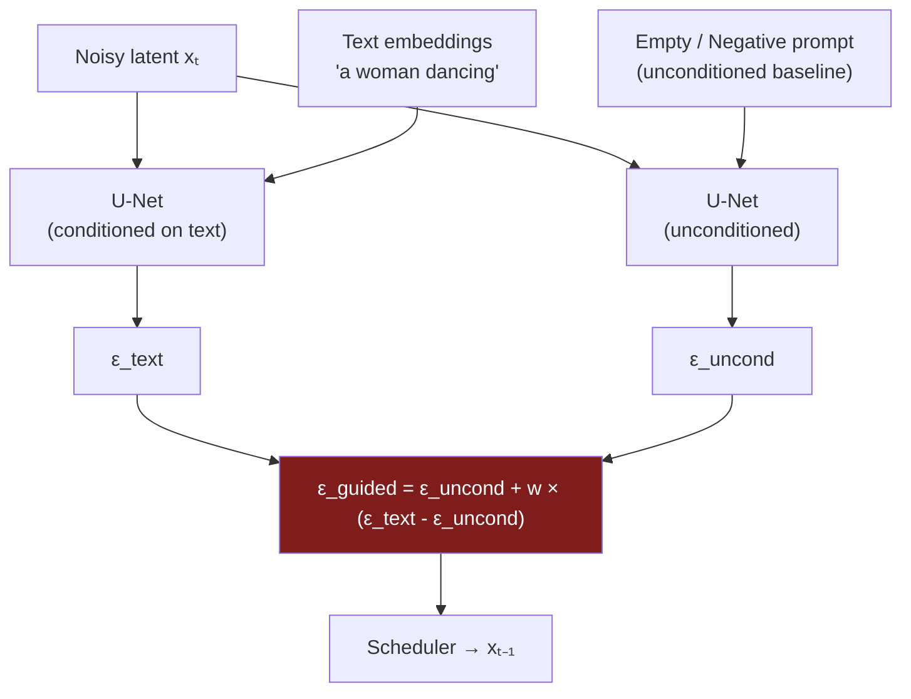
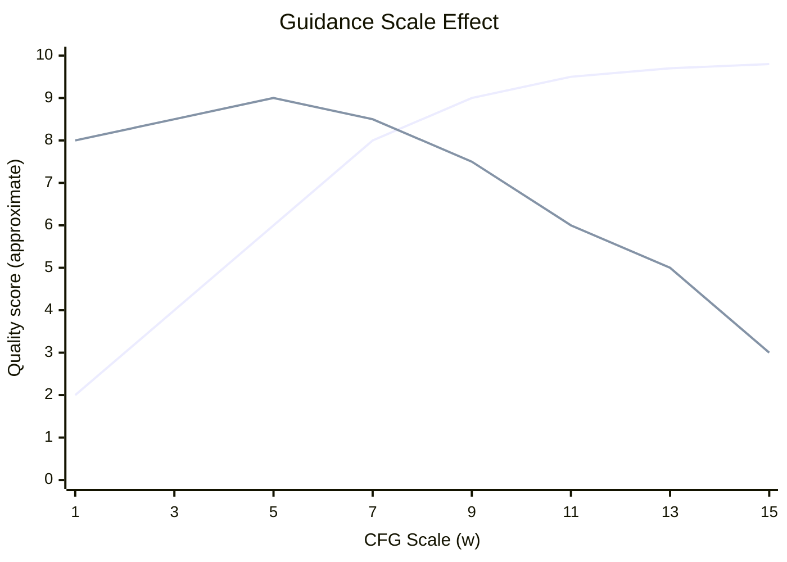
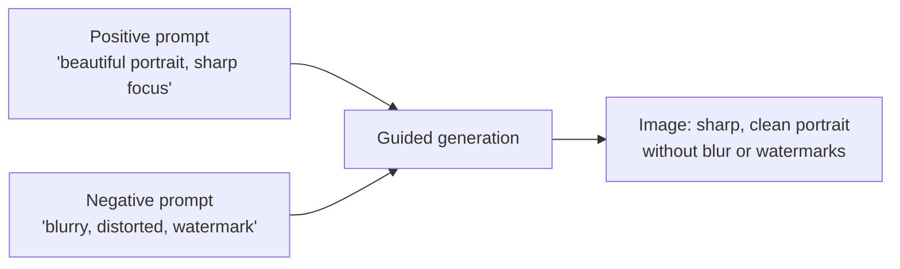
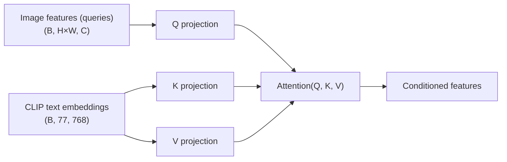

# Guidance and Conditioning

## The Story 📖

Imagine commissioning a sculptor to make you a statue. You describe what you want: "a woman dancing, joyful, arms raised." The sculptor begins working.

Here's the problem: a sculptor who's been trained on thousands of commissions develops their own aesthetic preferences. Left to their own devices, they might follow your brief loosely — interpreting "joyful" in ways you didn't intend, or making creative choices you didn't ask for.

Now imagine you have a volume knob labeled "how literally should the sculptor interpret my instructions." At setting 1, they basically ignore you and make whatever feels artistically interesting. At setting 7, they follow your brief closely but still use their own judgment on the details. At setting 20, they follow your instructions so literally that the statue looks over-rendered, stiff, and slightly uncanny — every word you said is visible in the result, in the worst possible way.

That volume knob is **Classifier-Free Guidance (CFG)**. The setting is called the **guidance scale**. And the whole trick is that you can steer the same model toward or away from text conditions just by dialing up or down how much weight you put on "what does the prompt predict" versus "what would the model generate if it had no instructions at all."

---

## 📌 Learning Priority

**Must Learn** — core concepts, needed to understand the rest of this file:
[What is CFG](#what-is-classifier-free-guidance) · [CFG Formula](#the-cfg-formula) · [Guidance Scale Effect](#what-the-guidance-scale-does)

**Should Learn** — important for real projects and interviews:
[Negative Prompts](#negative-prompts) · [Cross-Attention Conditioning](#cross-attention-primary-text-conditioning) · [Real AI Systems](#where-youll-see-this-in-real-ai-systems)

**Good to Know** — useful in specific situations, not needed daily:
[Classifier Guidance vs CFG](#classifier-guidance-vs-cfg) · [Other Conditioning Types](#other-conditioning-types)

**Reference** — skim once, look up when needed:
[Common Mistakes](#common-mistakes-to-avoid-) · [Connection to Other Concepts](#connection-to-other-concepts-)

---

## What is Classifier-Free Guidance?

**Classifier-Free Guidance (CFG)** is a technique for steering a diffusion model's output toward a desired condition (like a text prompt) without needing a separate classifier model.

It works by running the denoiser twice at every step:
1. Once conditioned on the text prompt: what would the model generate for "a woman dancing"?
2. Once unconditional (with no text, or a negative prompt): what would the model generate with no instructions?

Then it computes the guided prediction as: "Go even further in the direction the text prompt is pulling, relative to the unconditioned baseline."

---

## Why It Exists

**The problem before CFG:** Early conditioning methods attached a separate classifier to the diffusion model. The classifier gradient would nudge the denoising trajectory toward the desired class. This worked but had problems:
- Required training a separate noise-robust classifier
- Was only practical for class labels, not arbitrary text
- Added complexity and potential for adversarial artifacts

**The CFG insight** (Ho & Salimans, 2022): You can get the same steering effect by using the model's own unconditional prediction as the baseline. No separate classifier needed. The model already knows what "good images without any prompt" look like — use that as the reference point, and amplify the deviation toward the prompt.

---

## How It Works — Step by Step

### The CFG Formula

At every denoising step, run the U-Net twice:



The guided noise prediction is:

```
ε_guided = ε_uncond + w × (ε_text − ε_uncond)
```

Where:
- **w** is the guidance scale (the volume knob)
- **ε_text − ε_uncond** is the "prompt direction" — the vector pointing from "no prompt" toward "prompt"
- Multiplying by w amplifies that direction

### What the Guidance Scale Does

| w value | Behavior | Visual Effect |
|---------|----------|---------------|
| 1.0 | No guidance (uses text output as-is) | Weakly follows prompt, creative/random |
| 3.0 | Mild guidance | Soft prompt adherence |
| 7.5 | Standard (SD default) | Good balance of prompt fidelity and image quality |
| 12-15 | Strong guidance | Very close to prompt, may look oversaturated |
| 20+ | Too much | Over-saturated, high-contrast artifacts, weird distortion |



### Negative Prompts

Without a negative prompt, the "unconditioned" run uses an empty string (""). With a negative prompt, it uses that text instead:

```
negative_prompt = "blurry, low quality, distorted, watermark, bad anatomy"
```

Now ε_uncond is "the noise prediction for the negative prompt." The CFG formula pushes the output toward the text prompt AND away from the negative prompt simultaneously.



---

## The Math / Technical Side (Simplified)

### Why CFG Works — Intuition from Probability

In probability terms, CFG is doing **importance sampling** in the direction of the conditional distribution p(x | text) away from the marginal p(x).

The score function (∇ log p) perspective makes this clean:

```
∇ log p(x | text) ≈ ∇ log p(x) + w · (∇ log p(x | text) - ∇ log p(x))
```

This is exactly what CFG computes. The "unconditioned" run estimates ∇ log p(x) (the baseline). The "text-conditioned" run estimates ∇ log p(x | text). The difference is the conditioning signal; multiplying by w amplifies it.

### Classifier Guidance vs CFG

The original paper ("Classifier Guidance," Dhariwal & Nichol 2021) used a real classifier's gradient:

```
ε_guided = ε_uncond - √(1-ᾱₜ) · ∇_xₜ log p_φ(y | xₜ)
```

CFG replaces this with a model-internal approximation:

```
ε_guided = ε_uncond + w · (ε_cond - ε_uncond)
```

CFG is simpler (no separate classifier), more flexible (works for any text, not just class labels), and produces comparable or better quality. It became the standard immediately after publication.

---

## Conditioning Mechanisms — How Text Gets into the U-Net

Beyond CFG, there are several mechanisms by which conditioning information enters the U-Net:

### Cross-Attention (Primary Text Conditioning)

The main mechanism. Text embeddings act as keys and values; image features attend to them:



Each spatial position in the image can attend to all 77 text tokens, learning which words influence which spatial regions.

### Time Embedding (Timestep Conditioning)

The timestep t is encoded as a sinusoidal embedding and injected into every ResBlock. This conditions the model on "which noise level am I working at."

### Other Conditioning Types

| Conditioning Type | How It's Applied | Used In |
|------------------|-----------------|---------|
| Text (CLIP) | Cross-attention | All SD models |
| Timestep | Sinusoidal embed → ResBlock add | All diffusion models |
| Class label | Embed → ResBlock add | Unconditional/class-conditional models |
| Image (IP-Adapter) | Cross-attention (reference image features) | IP-Adapter |
| Depth / Pose / Edges | Extra U-Net input channels or parallel U-Net (ControlNet) | ControlNet |

---

## Where You'll See This in Real AI Systems

- **Every Stable Diffusion pipeline** uses CFG by default — the `guidance_scale` parameter in `diffusers` is exactly w
- **DALL-E 3 / Midjourney** use their own variants of guidance internally
- **InstructPix2Pix** extends CFG to two simultaneous conditions (image + instruction)
- **ComfyUI / A1111** expose CFG scale as a prominent UI parameter
- **SDXL** uses CFG with two text encoders — guidance is applied to both simultaneously
- **FLUX** uses a "distilled" version of CFG called **CFG Distillation** that bakes guidance into the model weights so only one forward pass is needed (2× faster inference)

---

## Common Mistakes to Avoid ⚠️

**Setting CFG too high.** Above 12-15, image quality degrades significantly. The colors become over-saturated, faces look distorted, and the image loses natural texture. CFG 7-8 is the sweet spot for most models and prompts.

**Thinking CFG "adds" the prompt to the image.** CFG amplifies the *directional difference* between conditioned and unconditioned predictions. At w=1, you're using the conditioned output directly. At w>1, you're extrapolating beyond it.

**Using negative prompts as a trash bin for all bad things.** Long negative prompts with dozens of terms can conflict with each other or reduce overall image quality. Focus on 5-10 specific terms that are most relevant to your use case.

**Forgetting that CFG doubles compute.** Every denoising step requires two U-Net passes. If you're building a production system and need speed, look at CFG distillation (FLUX, Lightning, Turbo) which eliminates the second pass.

**Using negative prompts for positive goals.** "negative_prompt='old man'" won't make the person look young — it just pushes away from "old man." Use the positive prompt to specify what you *want*: "young woman" is more effective than negative_prompt="old man."

---

## Connection to Other Concepts 🔗

- **CLIP** — provides the text embeddings that enter the cross-attention layers
- **Score functions** — CFG is an amplification of the conditional score direction
- **ControlNet** — adds structural conditioning (pose, depth) on top of CFG text guidance; see folder 06
- **IP-Adapter** — adds image conditioning via a parallel cross-attention mechanism
- **CFG Distillation** — bakes guidance into model weights; used in FLUX, SDXL-Turbo, Lightning
- **Negative prompts** — the practical UX feature built on top of CFG's unconditional baseline

---

✅ **What you just learned:**
CFG works by running the U-Net twice per step (conditioned + unconditioned), then amplifying the difference in the direction of the text prompt. The guidance scale w controls prompt adherence: 1.0 = no guidance, 7-8 = standard, 15+ = over-saturated artifacts. Negative prompts replace the empty string in the unconditioned run, pushing the output away from unwanted content. Text enters the U-Net via cross-attention layers throughout the decoder.

🔨 **Build this now:**
Run the `Code_Example.md` in this folder: generate the same prompt at w=1.0, 5.0, 7.5, 12.0, and 20.0. Save all five images and compare them. You'll clearly see the tradeoff between creative freedom (low w) and prompt adherence (high w) and where the over-saturation artifacts emerge.

➡️ **Next step:**
Head to [05_Modern_Diffusion_Models / Theory.md](../05_Modern_Diffusion_Models/Theory.md) to see how SDXL, SD 3, and FLUX improve on the original SD architecture and what architectural choices drive quality gains.

---

## 📂 Navigation

**In this folder:**
| File | |
|---|---|
| 📄 **Theory.md** | ← you are here |
| [📄 Cheatsheet.md](./Cheatsheet.md) | CFG guide + negative prompt tips |
| [📄 Interview_QA.md](./Interview_QA.md) | Interview prep |
| [📄 Code_Example.md](./Code_Example.md) | CFG scale comparison + negative prompts |

⬅️ **Prev:** [Stable Diffusion](../03_Stable_Diffusion/Theory.md) &nbsp;&nbsp;&nbsp; ➡️ **Next:** [Modern Diffusion Models](../05_Modern_Diffusion_Models/Theory.md)
