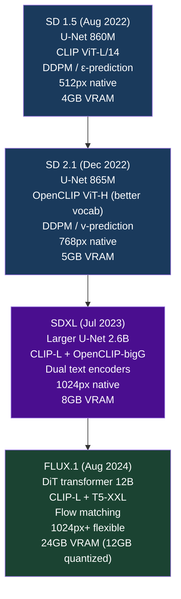

# Model Comparison: SD 1.5 vs SD 2.1 vs SDXL vs FLUX

## The Quick Summary

| Model | Year | Best For | VRAM | Speed | Quality |
|-------|------|----------|------|-------|---------|
| SD 1.5 | 2022 | Ecosystem/LoRA | 4GB | Fast | Good |
| SD 2.1 | 2022 | Slightly better quality | 5GB | Fast | Better |
| SDXL | 2023 | Quality + ecosystem | 8GB | Medium | Great |
| FLUX.1-dev | 2024 | Best quality | 24GB (12GB quantized) | Slow | Excellent |
| FLUX.1-schnell | 2024 | Speed + open license | 24GB (12GB quantized) | Very fast (1-4 steps) | Very good |

---

## Full Comparison Table

### Architecture

| Property | SD 1.5 | SD 2.1 | SDXL | FLUX.1 |
|----------|--------|--------|------|--------|
| Denoiser type | U-Net | U-Net | U-Net (larger) | DiT transformer |
| Denoiser params | 860M | 865M | 2.6B | 12B |
| Latent channels | 4 | 4 | 4 | 16 |
| Native resolution | 512×512 | 768×768 | 1024×1024 | 1024×1024+ |
| Latent spatial size | 64×64 | 96×96 | 128×128 | 128×128 |
| VAE compression | 8× | 8× | 8× | 8× |
| Training objective | DDPM / ε-pred | DDPM / v-pred | DDPM / v-pred | Flow matching |
| Skip connections | Yes | Yes | Yes | No (full attention) |

---

### Text Encoding

| Property | SD 1.5 | SD 2.1 | SDXL | FLUX.1 |
|----------|--------|--------|------|--------|
| Text encoder 1 | CLIP ViT-L/14 | OpenCLIP ViT-H | CLIP ViT-L/14 | CLIP ViT-L/14 |
| Text encoder 2 | None | None | OpenCLIP ViT-bigG | T5-XXL |
| Context dimension | 768d | 1024d | 768+1280=2048d | 768+4096d |
| Token limit | 77 | 77 | 77 each | 77 (CLIP) + ~512 (T5) |
| Text-in-image | Poor | Poor | Medium | Good |
| Complex prompts | Limited | Moderate | Good | Excellent |

---

### Performance

| Metric | SD 1.5 | SD 2.1 | SDXL | FLUX.1-dev | FLUX.1-schnell |
|--------|--------|--------|------|-----------|----------------|
| Typical inference steps | 20-50 | 20-50 | 20-50 | 20-50 | 1-4 |
| Time per image (A100) | ~2s | ~3s | ~6s | ~15s | ~3s |
| Time per image (RTX 3090) | ~4s | ~5s | ~10s | ~30s+ | ~6s |
| VRAM (fp16) | 4GB | 5GB | 8GB | 24GB | 24GB |
| VRAM (fp8 quantized) | — | — | — | ~12GB | ~12GB |
| VRAM (int8 quantized) | — | — | — | ~10GB | ~10GB |

---

### Quality Comparison by Dimension

| Quality Aspect | SD 1.5 | SD 2.1 | SDXL | FLUX.1 |
|---------------|--------|--------|------|--------|
| Overall photorealism | ★★★☆☆ | ★★★☆☆ | ★★★★☆ | ★★★★★ |
| Portrait / faces | ★★★☆☆ | ★★★☆☆ | ★★★★☆ | ★★★★★ |
| Hands / anatomy | ★★☆☆☆ | ★★★☆☆ | ★★★☆☆ | ★★★★☆ |
| Complex scenes | ★★★☆☆ | ★★★☆☆ | ★★★★☆ | ★★★★★ |
| Text rendering | ★☆☆☆☆ | ★★☆☆☆ | ★★★☆☆ | ★★★★☆ |
| Artistic styles | ★★★★★ | ★★★☆☆ | ★★★★★ | ★★★★☆ |
| High resolution detail | ★★☆☆☆ | ★★★☆☆ | ★★★★☆ | ★★★★★ |

---

### Ecosystem

| Ecosystem Factor | SD 1.5 | SD 2.1 | SDXL | FLUX.1 |
|-----------------|--------|--------|------|--------|
| LoRA library size | Massive | Small | Large | Growing |
| ControlNet support | Excellent | Good | Good | Emerging |
| InstructPix2Pix / editing | Yes | Some | Yes | Limited |
| ComfyUI workflows | Many | Some | Many | Growing |
| AUTOMATIC1111 support | Full | Full | Full | Partial |
| InvokeAI support | Full | Full | Full | Full |
| Community models | Thousands | Hundreds | Hundreds | Dozens |
| DreamBooth fine-tuning | Yes | Yes | Yes | Yes (expensive) |
| Commercial LoRAs available | Abundant | Moderate | Abundant | Limited |

---

### Licensing

| License | SD 1.5 | SD 2.1 | SDXL | FLUX.1-dev | FLUX.1-schnell |
|---------|--------|--------|------|-----------|----------------|
| License type | CreativeML OpenRAIL-M | CreativeML OpenRAIL-M | CreativeML OpenRAIL-M | FLUX-1 dev (non-commercial) | Apache 2.0 |
| Commercial use | Yes (with restrictions) | Yes (with restrictions) | Yes (with restrictions) | No | Yes |
| Fine-tune for commercial | Yes | Yes | Yes | Check license | Yes |
| Weights publicly available | Yes | Yes | Yes | Yes | Yes |

---

## Architectural Evolution Diagram

---

## SD 1.5 vs SDXL vs FLUX: Use Case Matrix

| Use Case | Recommended | Why |
|----------|------------|-----|
| Experimenting / learning | SD 1.5 | Low VRAM, fast, huge community resources |
| Portrait photography | FLUX.1-dev | Best anatomy, realistic skin |
| Artistic illustration | SD 1.5 / SDXL | Enormous LoRA library for styles |
| Product photography | SDXL or FLUX | High resolution, good realism |
| Text-in-image | FLUX.1-dev | T5-XXL enables actual text rendering |
| Concept art | SDXL with LoRA | Rich ecosystem, good composition |
| Custom character/style | SD 1.5 or SDXL | LoRA training is cheaper |
| Production API at scale | SDXL or FLUX.1-schnell | Cost/quality balance |
| Consumer app (commercial) | FLUX.1-schnell or SDXL | Apache 2.0 or CreativeML |
| Scientific/research use | SD 1.5 | Most reproducible results in literature |
| ControlNet pose/depth | SD 1.5 or SDXL | Best ControlNet ecosystem |

---

## Memory-Constrained Quick Reference

| Your GPU VRAM | Best Option | Notes |
|--------------|------------|-------|
| 4GB | SD 1.5 (fp16) | Use attention slicing |
| 6GB | SD 1.5 or SDXL (with offload) | SDXL needs CPU offload at 6GB |
| 8GB | SDXL (fp16) | Native; enable attention slicing |
| 12GB | SDXL or FLUX quantized | FLUX needs fp8/int8 quantization |
| 16GB | SDXL comfortably, FLUX quantized | Good working VRAM for SDXL+refiner |
| 24GB+ | FLUX.1 full precision | Maximum quality |

---

## 📂 Navigation

**In this folder:**
| File | |
|---|---|
| [📄 Theory.md](./Theory.md) | Full explanation with diagrams |
| [📄 Cheatsheet.md](./Cheatsheet.md) | Quick reference |
| [📄 Interview_QA.md](./Interview_QA.md) | Interview prep |
| 📄 **Comparison.md** | ← you are here |

⬅️ **Prev:** [Guidance and Conditioning](../04_Guidance_and_Conditioning/Theory.md) &nbsp;&nbsp;&nbsp; ➡️ **Next:** [ControlNet and Adapters](../06_ControlNet_and_Adapters/Theory.md)
