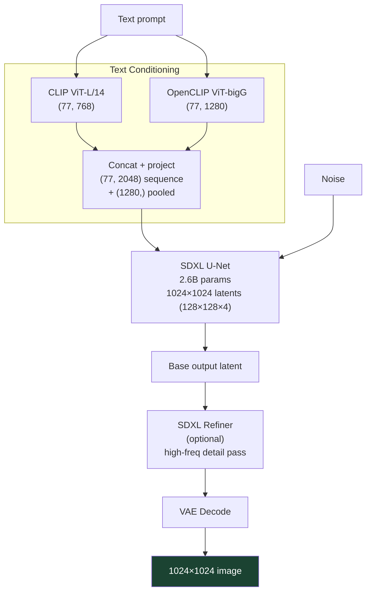
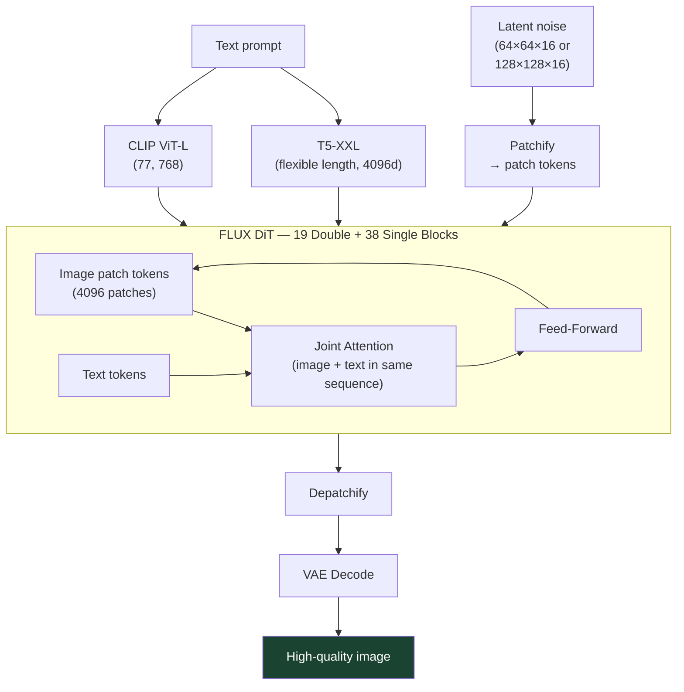
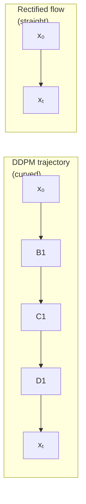

# Modern Diffusion Models

## The Story 📖

Think of it as a car model lineup. SD 1.5 was a reliable compact car — affordable, plenty of accessories in the aftermarket (LoRAs, ControlNets), and it got you where you needed to go. SDXL is a luxury SUV: bigger engine, better sound system, twice the compute requirement, noticeably smoother ride. FLUX is an electric sports car from a different manufacturer — fundamentally different architecture under the hood, faster on the track, but some of your old accessories don't fit.

And in the same way cars have evolved — not just incrementally faster but with whole new drivetrain philosophies (internal combustion → hybrid → fully electric) — diffusion model architecture has evolved: from the U-Net + DDPM combo of 2020, through U-Net + DDIM in 2022, to the **Diffusion Transformer (DiT)** paradigm of 2024.

Understanding the progression is not just history. It tells you what to choose for your use case, what tradeoffs you're accepting, and where the field is heading.

---

## What Changed and Why It Matters

| Generation | Model | Key Architectural Change | Quality Jump |
|-----------|-------|--------------------------|-------------|
| 1st (2020) | DDPM | U-Net, pixel space, DDPM sampler | Baseline |
| 2nd (2022) | SD 1.5 | Latent diffusion, CLIP text, cross-attention | Major |
| 3rd (2023) | SDXL | Larger U-Net, 2 text encoders, multi-aspect training | Significant |
| 4th (2024) | FLUX / SD3 | Diffusion Transformer (DiT), flow matching | Major |

---

## Why It Exists — The Limits of SD 1.5

SD 1.5 made latent diffusion practical, but revealed new limitations:
- **Resolution**: native 512×512 — going higher led to repetitive patterns
- **Text rendering**: CLIP struggled with text-in-image generation
- **Complex compositions**: multiple subjects with complex relationships were unreliable
- **Anatomical accuracy**: hands, fingers, faces at unusual angles were notoriously poor

Each generation of model addressed these pain points with architectural improvements.

---

## How It Works — The Evolution

### SDXL: The Bigger U-Net

**Stable Diffusion XL** (2023) made several major changes:

**1. Two text encoders in parallel:**
- CLIP ViT-L/14 (768d) from OpenAI
- OpenCLIP ViT-bigG/14 (1280d) from LAION
- Their outputs are concatenated: (77, 768) + (77, 1280) → pooled + sequence both used
- Total text conditioning: 2048-dim per token + a 1280-dim pooled vector

**2. Larger U-Net:**
- Transformer blocks throughout (not just at bottleneck)
- 2.6B parameters (vs 860M for SD 1.5)
- Higher native resolution: 1024×1024

**3. Multi-aspect training:**
- Trained on multiple resolutions and aspect ratios simultaneously
- Better at portrait (768×1344), landscape (1344×768), square (1024×1024)

**4. Two-stage pipeline (base + refiner):**
- Base model: generates at 1024×1024
- Refiner model: adds high-frequency detail as a second pass (optional)

---

### FLUX: The Diffusion Transformer

**FLUX.1** (Black Forest Labs, 2024) represents the most significant architectural departure from the original DDPM/SD lineage:

**1. Replaces the U-Net with a DiT (Diffusion Transformer):**
- Instead of a convolutional U-Net with skip connections, FLUX uses a pure transformer architecture
- Image patches and text tokens are processed jointly in the same transformer blocks
- Bidirectional full attention: every image patch attends to every other patch AND every text token

**2. Flow matching instead of DDPM:**
- Instead of predicting Gaussian noise, the model is trained with **rectified flow**: predict the straight-line path from noise to image
- The forward process adds noise along a straight interpolation: xₜ = (1-t)·x₀ + t·ε
- This produces straighter trajectories in the reverse process → fewer steps needed
- Numerical ODE solvers are more effective on these straighter paths

**3. Two text encoders (same as SDXL) + T5-XXL:**
- CLIP ViT-L: image-aligned text features
- T5-XXL (4.9B parameters): a powerful language model encoder for complex language understanding
- T5 greatly improves: long prompts, text rendering in images, complex relationships

**4. FLUX Model Variants:**
| Variant | Parameters | Use Case | License |
|---------|-----------|----------|---------|
| FLUX.1-schnell | 12B | Fast inference, 1-4 steps | Apache 2.0 (open) |
| FLUX.1-dev | 12B | High quality, 20-50 steps | Non-commercial |
| FLUX.1-pro | 12B | Best quality (API only) | Proprietary |

---

## The Math / Technical Side (Simplified)

### Flow Matching vs DDPM

**DDPM forward process:** xₜ = √(ᾱₜ)·x₀ + √(1-ᾱₜ)·ε (curved trajectory)

**Rectified flow forward process:** xₜ = (1-t)·x₀ + t·ε (straight line)

The straight-line paths in rectified flow mean the ODE describing the forward/reverse process is simpler. The neural network is trained to predict the **velocity** v = dx/dt = ε - x₀ (the direction from x₀ to ε, i.e., constant along the straight path).

Straight paths mean: fewer steps needed for the reverse ODE solver, more accurate updates per step, better few-step generation (FLUX.1-schnell generates in 1-4 steps).

### The DiT — Why Transformers for Diffusion?

The U-Net was chosen in 2020 because convolutions are fast and the inductive bias (locality, translation equivariance) helps for image tasks. By 2022, transformers had shown that sufficient scale and data could overcome the lack of inductive bias and produce superior results.

DiT (Peebles & Xie, 2022) showed transformers could match and exceed U-Net quality when scaling:
- Transformers scale cleanly (more parameters = predictably better)
- U-Nets have complex hyperparameter tuning (channel counts, attention resolution choices)
- Full self-attention captures long-range dependencies better than hierarchical skip connections

FLUX takes DiT further with **joint attention** — image patches and text tokens are in the same sequence, allowing direct cross-modal attention rather than separate cross-attention layers.

---

## Where You'll See This in Real AI Systems

- **SDXL** — default high-quality model in most professional workflows; excellent LoRA/ControlNet ecosystem
- **FLUX.1-dev** — state-of-the-art open quality; used in high-end workflows; good text-in-image
- **FLUX.1-schnell** — fast generation; used for rapid prototyping and consumer apps
- **Stable Diffusion 3** (Stability AI) — uses MM-DiT (multimodal DiT) + flow matching; strong text rendering
- **Midjourney v6** — widely believed to use a transformer-based architecture
- **HuggingFace diffusers** — supports all above models via unified API
- **ComfyUI** — workflows for SDXL, FLUX, SD3 with visual node editor

---

## Common Mistakes to Avoid ⚠️

**Using SD 1.5 LoRAs with SDXL.** They are incompatible — different U-Net architecture, different attention layer shapes. Always check that your LoRA was trained for your base model.

**Running SDXL on <8GB VRAM without optimization.** SDXL base requires ~8GB in float16 without optimizations. Enable attention slicing and consider using SDXL + VAE CPU offload. The refiner stage adds another ~8GB if run simultaneously.

**Expecting FLUX.1-schnell at 1-4 steps to equal FLUX.1-dev at 20 steps.** Schnell is a distilled model optimized for speed at the cost of some quality ceiling. For professional outputs, use dev.

**Confusing flow matching with DDPM.** These are different training objectives. A DDPM scheduler (e.g., DDIMScheduler) will not work with a FLUX/SD3 model — use a flow matching scheduler (FlowMatchEulerDiscreteScheduler).

**Ignoring T5 prompt encoding for FLUX.** FLUX's T5 encoder can handle long, complex prompts much better than CLIP's 77-token limit. Write detailed, descriptive prompts and let T5 handle the complexity.

---

## Connection to Other Concepts 🔗

- **Transformers** — the architecture foundation for DiT and FLUX; see `06_Transformers/`
- **CLIP** — shared text encoder component across all SD generations
- **T5** — language model encoder used in FLUX and SD3 for rich text understanding
- **VAE** — all latent diffusion models (SD 1.5, SDXL, FLUX) use a VAE for pixel compression
- **ControlNet** — SD 1.5 and SDXL have rich ControlNet ecosystems; FLUX ControlNets are emerging
- **LoRA** — lightweight fine-tuning; model-specific (SD 1.5 LoRAs ≠ SDXL LoRAs ≠ FLUX LoRAs)
- **Flow matching** — the training objective used in FLUX and SD3 as an alternative to DDPM

---

✅ **What you just learned:**
The evolution from SD 1.5 → SDXL → FLUX tracks three changes: bigger and smarter text encoding (CLIP → CLIP+OpenCLIP → CLIP+T5), more powerful denoiser (U-Net → larger U-Net → DiT transformer), and better training objective (DDPM → flow matching). SDXL is the practical sweet spot with the richest ecosystem. FLUX gives state-of-the-art quality, especially for text in images and complex prompts.

🔨 **Build this now:**
Install the diffusers library and generate the same prompt with SD 1.5, SDXL (base only), and FLUX.1-schnell. Note the quality differences, especially for complex scenes or text within the image. Compare inference time per image on your hardware.

➡️ **Next step:**
Head to [06_ControlNet_and_Adapters / Theory.md](../06_ControlNet_and_Adapters/Theory.md) to learn how ControlNet adds structural conditioning (pose, depth, edges) to any diffusion model, and how LoRA enables efficient fine-tuning to custom styles.

---

## 📂 Navigation

**In this folder:**
| File | |
|---|---|
| 📄 **Theory.md** | ← you are here |
| [📄 Cheatsheet.md](./Cheatsheet.md) | Model comparison table |
| [📄 Interview_QA.md](./Interview_QA.md) | Interview prep |
| [📄 Comparison.md](./Comparison.md) | SD 1.5 vs SD 2.1 vs SDXL vs FLUX |

⬅️ **Prev:** [Guidance and Conditioning](../04_Guidance_and_Conditioning/Theory.md) &nbsp;&nbsp;&nbsp; ➡️ **Next:** [ControlNet and Adapters](../06_ControlNet_and_Adapters/Theory.md)
