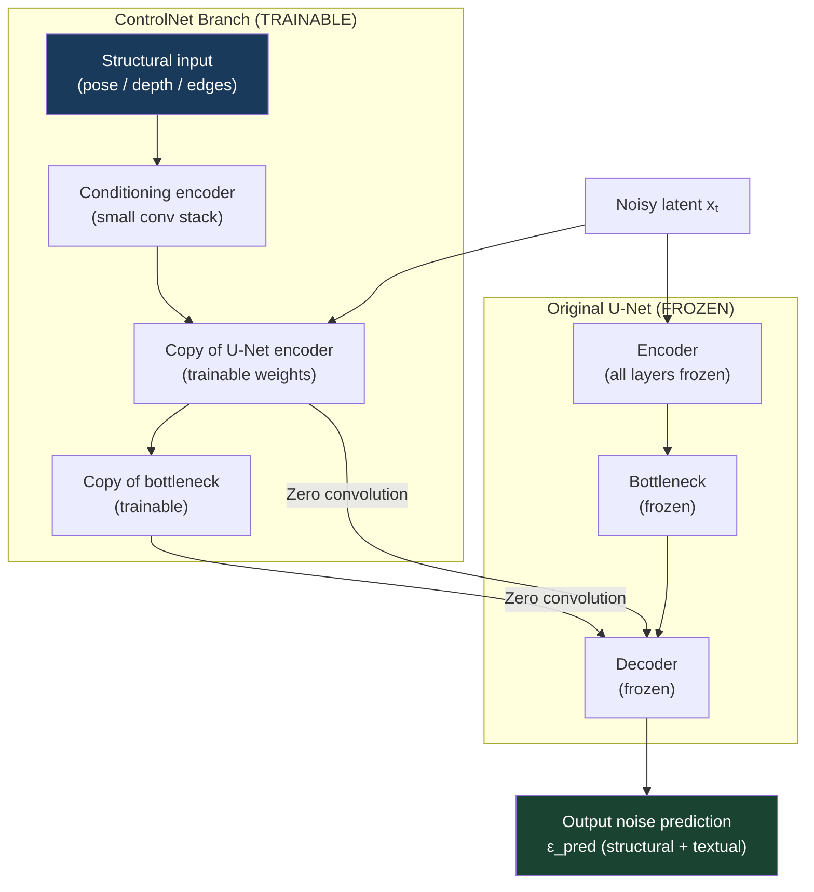
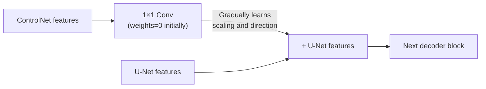
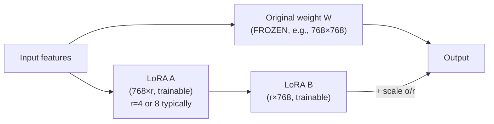
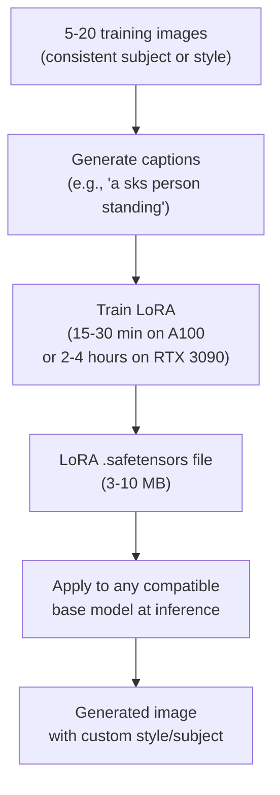
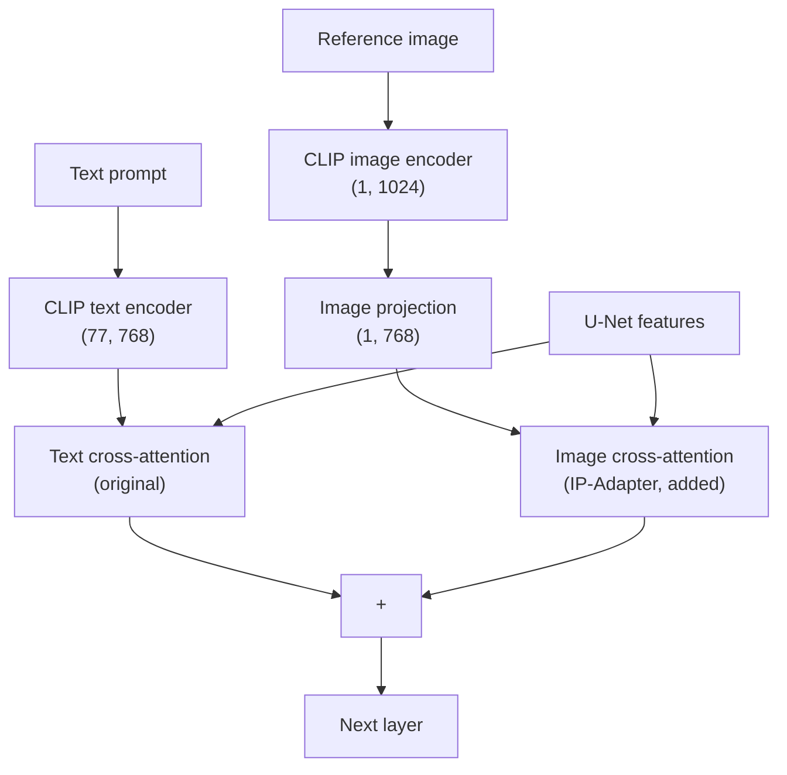

# ControlNet and Adapters

## The Story 📖

You want to generate an image of "a woman dancing in a red dress, elegant, professional photo." You type the prompt and hit generate. The result is beautiful — but the woman is in a completely different pose than you need, facing the wrong direction, with her arms in awkward positions.

You try again. And again. The model generates thousands of possible dancers, each one in a random pose it decided on. You have no way to say "I need her in *this* exact pose" — because the model only understands words, and words like "arms raised at 45 degrees, weight on left foot" don't translate well into CLIP embeddings.

Now imagine you have a reference photo of a ballet dancer in the exact pose you want. You strip away all the color and texture — keeping only the stick-figure skeleton that captures the joint positions. You feed that skeleton to the model as a "structural blueprint" alongside your text prompt. The model then generates a new woman in a red dress, but with her joints positioned exactly as the skeleton dictates.

That's **ControlNet**: a way to give the diffusion model a structural blueprint — pose, depth, edges, or segmentation mask — that it must respect while still following the text prompt for visual style and content.

---

## 📌 Learning Priority

**Must Learn** — core concepts, needed to understand the rest of this file:
[What is ControlNet](#what-is-controlnet) · [ControlNet Architecture](#controlnet-architecture) · [Zero Convolutions](#zero-convolutions)

**Should Learn** — important for real projects and interviews:
[LoRA Fine-Tuning](#lora--efficient-diffusion-fine-tuning) · [ControlNet Types](#different-controlnet-types) · [Real AI Systems](#where-youll-see-this-in-real-ai-systems)

**Good to Know** — useful in specific situations, not needed daily:
[IP-Adapter](#ip-adapter--condition-on-reference-images) · [LoRA Training Workflow](#lora-training-workflow)

**Reference** — skim once, look up when needed:
[Common Mistakes](#common-mistakes-to-avoid-) · [Connection to Other Concepts](#connection-to-other-concepts-)

---

## What is ControlNet?

**ControlNet** (Zhang et al., 2023) is an adapter architecture that adds conditional structural control to a pretrained diffusion model without retraining it.

It accepts various types of structural inputs:
- **Pose** (OpenPose skeleton): control body positioning and joint locations
- **Depth map**: control 3D spatial structure
- **Edge/Canny**: control shape outlines and composition
- **Segmentation mask**: control which areas contain which types of content
- **Normal map**: control surface orientation for realistic lighting
- **Line art / scribble**: control from hand-drawn sketches

The key design principle: ControlNet does not modify the original diffusion model. It runs in parallel, feeding structural guidance into the U-Net without changing any original weights.

---

## Why It Exists

Before ControlNet, getting structural control over diffusion output required:
- Expensive img2img (loses too much of the original or too little)
- Manual prompt engineering (brittle, limited)
- Full fine-tuning (expensive, inflexible)

ControlNet enabled structural control that was:
- **Precise**: pixel-level control over composition and structure
- **Flexible**: same model, different control types
- **Non-destructive**: original model weights unchanged
- **Cheap to train**: only the ControlNet branch requires training

---

## How It Works — Step by Step

### ControlNet Architecture

ControlNet adds a trainable copy of the U-Net's encoder blocks. The original U-Net is frozen. The ControlNet encoder processes the structural input (e.g., pose skeleton), and injects its features into the original U-Net's decoder layers via **zero convolutions**.



### Zero Convolutions

The "zero convolutions" are 1×1 convolution layers initialized with zero weights AND zero biases. This is the key training trick:
- At the start of ControlNet training, the zero convolutions output exactly zero
- This means at initialization, ControlNet adds zero signal — the U-Net behaves identically to before
- As training progresses, the zero convolutions learn to scale and direct the structural features
- Training is stable because you start from a known-good baseline (the pretrained U-Net)



### Different ControlNet Types

Each ControlNet type was trained on a different conditioning signal:

| ControlNet Type | Input | Use Case |
|----------------|-------|----------|
| **OpenPose** | 18-keypoint body skeleton | Control body/face pose |
| **Canny** | Edge detection image | Control shapes and composition |
| **Depth (MiDaS)** | Grayscale depth map | Control 3D spatial arrangement |
| **HED** | Soft edge detection | Control outlines, less strict than Canny |
| **Segmentation** | Color-coded segment mask | Control region content |
| **Normal Map** | RGB surface normal | Control surface lighting/shape |
| **Scribble** | Hand-drawn lines | Rough layout from sketches |
| **IP2P** (InstructPix2Pix) | Image + text instruction | Style transfer with instructions |

---

## LoRA — Efficient Diffusion Fine-Tuning

**LoRA** (Low-Rank Adaptation) is a technique for fine-tuning large models by adding small, trainable rank-decomposition matrices alongside the frozen original weights.

For diffusion models, LoRA is used to:
- Train a custom style (e.g., "generate images in the style of Studio Ghibli")
- Train a specific subject (e.g., "generate images of my face, referenced as 'sks'")
- Train a specific character, concept, or composition type

### How LoRA Works in Diffusion

For each attention layer (Q, K, V, Out projections) in the U-Net:



The modification: `W_effective = W_frozen + (α/r) · B · A`

Key numbers for a typical LoRA:
- Original weight matrix: 768×768 = 589,824 parameters
- LoRA with r=4: 768×4 + 4×768 = 6,144 parameters — 96× smaller
- Full U-Net LoRA at r=4: ~3-10MB file vs ~2GB for full fine-tune

### LoRA Training Workflow



---

## IP-Adapter — Condition on Reference Images

**IP-Adapter** (Ye et al., 2023) is a plug-in adapter that allows conditioning a diffusion model on a reference image (providing its style or content) rather than a text prompt.

### How IP-Adapter Works

IP-Adapter adds a second cross-attention mechanism alongside the text cross-attention. The reference image is encoded by a CLIP image encoder (not text encoder) into visual features, which then guide the generation via their own cross-attention stream:



### IP-Adapter Variants

| Variant | Use Case |
|---------|----------|
| **IP-Adapter** | Base — conditions on overall style + content of reference |
| **IP-Adapter-Plus** | Higher fidelity — uses more image features from CLIP |
| **IP-Adapter-Plus-Face** | Face-specific — extracts and preserves facial identity |
| **IP-Adapter-FaceID** | Uses face recognition features for identity preservation |

---

## The Math / Technical Side (Simplified)

### ControlNet Conditioning

At each decoder block in the U-Net, the feature map is modified:

```
h_decoder = h_decoder_original + ZeroConv(h_controlnet)
```

The ZeroConv starts at 0 so initially adds nothing. As it learns, it shifts features in the decoder toward structure matching the control input.

### LoRA Mathematical Form

For a weight matrix W ∈ ℝ^(d×k), LoRA parameterizes the update as:

```
ΔW = B · A,    B ∈ ℝ^(d×r),  A ∈ ℝ^(r×k)
```

The effective weight used at inference: `W + α · B · A / r`

The rank r controls the expressiveness vs. the parameter count. Common values:
- r=1: minimal (concepts only)
- r=4: standard style training
- r=8: moderate fidelity
- r=32+: high fidelity character training (more VRAM, longer training)

---

## Where You'll See This in Real AI Systems

- **AUTOMATIC1111 / ComfyUI**: First-class ControlNet support — select type, upload control image, generate
- **HuggingFace diffusers**: `ControlNetModel` + `StableDiffusionControlNetPipeline`
- **InvokeAI**: ControlNet + IP-Adapter integrated into the node editor
- **Production use**: Character consistency in storyboarding, product placement, architectural visualization
- **IP-Adapter in diffusers**: `IPAdapterMixin` — apply reference style in one line
- **LoRA Civitai marketplace**: Thousands of community LoRAs for styles, characters, concepts (free and paid)
- **LoRA in ComfyUI**: `LoraLoader` node — stack multiple LoRAs with per-LoRA weight sliders
- **Commercial tools**: Adobe Firefly, Ideogram, and others use ControlNet-like conditioning internally

---

## Common Mistakes to Avoid ⚠️

**Using a ControlNet trained for SD 1.5 with SDXL.** ControlNets are model-specific. SD 1.5 ControlNets will not work with SDXL — they expect different architecture. Use SDXL-specific ControlNets.

**Using a LoRA at full strength (weight=1.0) and getting artifacts.** LoRA strength is typically tuned between 0.5 and 1.0. At 1.0, especially for style LoRAs, the result can look over-stylized or washed out. Start at 0.7 and adjust.

**Expecting ControlNet pose to work perfectly with extreme camera angles.** ControlNet pose works best with standard forward-facing body angles. Overhead, extreme side profiles, or heavily foreshortened poses often fail because the training data was biased toward standard photography angles.

**Combining too many ControlNets at once.** Multiple ControlNets can conflict. Start with one, verify it works, then add a second at lower weight. Combining depth + pose + edges at full strength usually produces muddy results.

**Training LoRA with too few images.** DreamBooth / LoRA training works with 5-30 images, but quality varies significantly. Fewer than 10 images with poor variation (all same angle/lighting) often produces an overfit LoRA that only regenerates the training images rather than generalizing.

---

## Connection to Other Concepts 🔗

- **U-Net** — ControlNet adds a parallel branch that feeds into the U-Net decoder; see `02_How_Diffusion_Works/Architecture_Deep_Dive.md`
- **Cross-attention** — IP-Adapter adds a second cross-attention stream alongside text cross-attention
- **CLIP image encoder** — used by IP-Adapter to extract visual features from reference images
- **Fine-tuning** — LoRA is a PEFT (Parameter-Efficient Fine-Tuning) method; same category as prefix tuning
- **Stable Diffusion** — ControlNet and LoRA are designed for SD models; each version needs its own adapter
- **FLUX** — FLUX ControlNets and LoRAs are emerging but ecosystem is less mature than SD/SDXL

---

✅ **What you just learned:**
ControlNet adds structural conditioning (pose, depth, edges) to diffusion by training a parallel encoder copy with zero convolutions, leaving the original U-Net frozen. LoRA enables cheap fine-tuning by adding small rank-decomposition matrices alongside frozen weights — 10× fewer parameters, same expressiveness for style/subject. IP-Adapter adds a reference image conditioning stream via a second cross-attention mechanism.

🔨 **Build this now:**
Run the `Code_Example.md` in this folder to use ControlNet with OpenPose: detect a pose from a reference photo, then generate a new character in that pose with a different text description.

➡️ **Next step:**
Head to [07_Diffusion_vs_GANs / Theory.md](../07_Diffusion_vs_GANs/Theory.md) to understand why diffusion models have largely replaced GANs for image synthesis, what GANs are still better at, and how VAEs fit into the overall picture.

---

## 📂 Navigation

**In this folder:**
| File | |
|---|---|
| 📄 **Theory.md** | ← you are here |
| [📄 Cheatsheet.md](./Cheatsheet.md) | Quick reference |
| [📄 Interview_QA.md](./Interview_QA.md) | Interview prep |
| [📄 Code_Example.md](./Code_Example.md) | ControlNet with pose detection |

⬅️ **Prev:** [Modern Diffusion Models](../05_Modern_Diffusion_Models/Theory.md) &nbsp;&nbsp;&nbsp; ➡️ **Next:** [Diffusion vs GANs](../07_Diffusion_vs_GANs/Theory.md)
