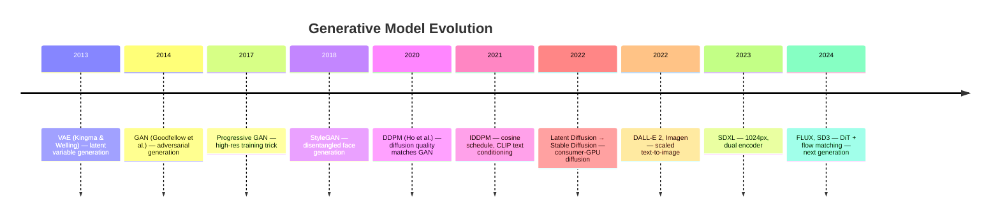

# Generative Models Comparison: Diffusion vs GANs vs VAEs

## Complete Side-by-Side Comparison

### Training

| Dimension | GANs | Diffusion | VAEs |
|-----------|------|-----------|------|
| **Training objective** | Minimax game: min_G max_D | MSE noise prediction | ELBO (reconstruction + KL) |
| **Loss function** | Non-saturating BCE / Wasserstein | Simple MSE | −E[log p(x|z)] + KL(q||p) |
| **Training stability** | Poor — sensitive to hyperparameters | Excellent — standard optimization | Good |
| **Mode collapse risk** | High | None | Low |
| **Gradient issues** | Vanishing/exploding gradients common | None (direct MSE regression) | Posterior collapse possible |
| **Number of networks** | 2 (Generator + Discriminator) | 1 (U-Net denoiser) | 2 (Encoder + Decoder) |
| **Training compute** | Moderate | High (many timesteps × batch) | Moderate |
| **Batch size sensitivity** | High | Moderate | Low |
| **Training time** | Hours–days | Days–weeks (at scale) | Hours–days |
| **Convergence** | Unstable, may not converge | Stable, predictable | Stable |

---

### Image Quality

| Dimension | GANs | Diffusion | VAEs |
|-----------|------|-----------|------|
| **Sharpness** | Excellent | Excellent | Poor (blurry) |
| **Diversity** | Poor–Good (mode collapse risk) | Excellent | Good |
| **Fidelity to training data** | High for trained modes | High across full distribution | Medium |
| **Photorealism** | Good (faces/specific domains) | Excellent (general) | Poor |
| **Texture quality** | Very good | Excellent | Poor |
| **Artifact types** | Checkerboard, over-sharpening | Oversmoothing (low steps), oversat (high CFG) | Blur, smearing |
| **Resolution scalability** | Hard beyond 1024px | Scales well | Limited |
| **Fréchet Inception Distance (FID)** | Low for specific domains | Very low (general) | High |
| **CLIP score (text alignment)** | N/A (not text-conditioned) | Very high | Limited |

---

### Inference / Generation

| Dimension | GANs | Diffusion | VAEs |
|-----------|------|-----------|------|
| **Number of forward passes** | 1 | 20-1000 (DDIM: 20-50) | 1 |
| **Inference latency (A100)** | <100ms | 2-90s | <50ms |
| **Inference latency (distilled)** | N/A | <1s (1-4 steps) | N/A |
| **VRAM at inference** | Low (1-2GB) | Medium (4-24GB) | Low (1-2GB) |
| **Deterministic** | No (stochastic) | DDIM: yes; DDPM: no | No (stochastic) |
| **Interpolation quality** | Good (latent space) | Limited | Excellent (smooth latent) |
| **Parallel generation** | Fully parallel | Sequential (each step depends on last) | Fully parallel |

---

### Conditioning and Control

| Dimension | GANs | Diffusion | VAEs |
|-----------|------|-----------|------|
| **Text conditioning** | Very hard, rarely done | Excellent (cross-attention + CFG) | Possible but limited |
| **Class conditioning** | Yes (class-conditional GANs) | Yes (classifier-free guidance) | Yes |
| **Image editing** | Limited (requires fine-tuning) | Excellent (img2img, DDIM inversion) | Limited |
| **Structural control** | Very limited | Excellent (ControlNet) | None |
| **Style control** | Training-time only | LoRA, IP-Adapter at inference | Limited |
| **Negative prompting** | N/A | Yes (via CFG) | N/A |
| **Fine-tuning cost** | High (full retrain) | Low (LoRA ~3-10MB) | Medium |

---

### Diversity

| Dimension | GANs | Diffusion | VAEs |
|-----------|------|-----------|------|
| **Output diversity** | Low–Medium | High | Medium |
| **Mode coverage** | Partial (mode collapse) | Full (covers training distribution) | Full |
| **Rare sample generation** | Poor | Good | Moderate |
| **Novel combinations** | Possible but unreliable | Reliable | Moderate |

---

### Production / Deployment

| Dimension | GANs | Diffusion | VAEs |
|-----------|------|-----------|------|
| **Model file size** | Small (50-300MB typical) | Large (2-24GB) | Small-medium |
| **Serving cost** | Low | Medium-High | Low |
| **Real-time viable** | Yes | Only distilled versions | Yes |
| **Batch processing** | Efficient | Less efficient (sequential) | Efficient |
| **Open source ecosystem** | Moderate (StyleGAN3) | Massive (HuggingFace Diffusers) | Moderate |
| **Community adoption** | Declining | Dominant | Moderate |

---

## Notable Models in Each Family

### GANs
| Model | Year | Specialty |
|-------|------|-----------|
| DCGAN | 2015 | First effective image GAN |
| Progressive GAN | 2018 | High-res faces |
| StyleGAN | 2018 | Disentangled face generation |
| StyleGAN2 | 2020 | State-of-the-art faces; still used |
| StyleGAN3 | 2021 | Alias-free; equivariant |
| BigGAN | 2018 | Class-conditional at scale |
| CycleGAN | 2017 | Domain transfer without paired data |
| Pix2Pix | 2017 | Paired image-to-image translation |
| ESRGAN / Real-ESRGAN | 2018/2021 | Super-resolution |
| GauGAN (SPADE) | 2019 | Semantic image synthesis |

### Diffusion
| Model | Year | Specialty |
|-------|------|-----------|
| DDPM | 2020 | Foundational algorithm |
| IDDPM | 2021 | Cosine schedule, better ELBO |
| GLIDE | 2021 | First text-to-image diffusion |
| LDM / Stable Diffusion | 2022 | Latent diffusion, open source |
| DALL-E 2 | 2022 | OpenAI text-to-image |
| SD 1.5 | 2022 | Open-source workhorse |
| SDXL | 2023 | 1024px, dual encoder |
| DALL-E 3 | 2023 | Better text understanding |
| Stable Diffusion 3 | 2024 | DiT + flow matching |
| FLUX.1 | 2024 | 12B transformer, best quality |

### VAEs
| Model | Year | Specialty |
|-------|------|-----------|
| VAE (original) | 2013 | Foundational algorithm |
| VQ-VAE | 2017 | Vector quantized; discrete latents |
| VQ-VAE-2 | 2019 | Hierarchical; high-quality samples |
| DALL-E (original) | 2021 | dVAE for DALL-E tokenizer |
| KL-regularized VAE | 2022 | Used in SD as latent encoder |
| Stable Cascade VQGAN | 2024 | 3-stage compression |

---

## The Evolutionary Story

---

## Why Diffusion Won

Five years ago, GANs were the clear state-of-the-art for image synthesis. By 2023, diffusion had largely replaced them for quality-critical use cases. Why?

**1. Training reliability at scale.** GANs become harder to train as they get larger. Diffusion models train more reliably — you get predictable quality improvements with more data and compute.

**2. Text-to-image is hard for GANs.** Getting a GAN to understand arbitrary text prompts requires a complex conditioning mechanism and is prone to mode collapse at scale. The cross-attention + CFG approach in diffusion scales naturally.

**3. Diversity.** GANs that achieve high quality often sacrifice coverage of the data distribution. Diffusion models cover the distribution much more fully, which matters for creative applications.

**4. Conditioning ecosystem.** ControlNet, LoRA, IP-Adapter, CFG — all these conditioning mechanisms were built on top of the diffusion framework. The GAN ecosystem never developed comparable tools for controlled generation.

**5. Open source momentum.** Stable Diffusion's open-source release created a massive community that GANs never had. This accelerated innovation exponentially.

---

## When GANs Are Still Better

- **Real-time inference** (<100ms hard requirement): StyleGAN3 and similar can generate at near video-frame rates
- **Super-resolution**: ESRGAN/Real-ESRGAN remain popular for upscaling
- **Face generation for specific domains**: StyleGAN2 still produces state-of-the-art human faces for avatar/gaming applications
- **Video frame generation**: GANs are faster at per-frame generation when temporal coherence can be handled separately
- **Edge devices**: GAN generators are small enough to run on mobile; diffusion models typically aren't

---

## 📂 Navigation

**In this folder:**
| File | |
|---|---|
| [📄 Theory.md](./Theory.md) | Full explanation with story and diagrams |
| [📄 Cheatsheet.md](./Cheatsheet.md) | Quick reference |
| 📄 **Comparison.md** | ← you are here |

⬅️ **Prev:** [ControlNet and Adapters](../06_ControlNet_and_Adapters/Theory.md) &nbsp;&nbsp;&nbsp; ➡️ **Next:** [Section 16 README](../Readme.md)
