# Diffusion vs GANs

## The Story 📖

Two chefs are competing to bake the best bread.

The first chef (the GAN) has a very direct approach: a Baker who tries to make bread, and a Critic who tastes each loaf and tells the Baker "fake" or "real." The Baker gets better and better at fooling the Critic. The problem: sometimes the Baker figures out that making exactly one type of bread — say, sourdough — fools the Critic 100% of the time, so they just make sourdough forever, even though real bakeries make dozens of varieties. That's **mode collapse**. Also, the training can become a game of cat and mouse: the Critic gets too good and the Baker's gradients vanish; or the Baker gets too clever and the Critic stops learning. The oven keeps catching fire.

The second chef (the Diffusion model) has a completely different training regimen: study restoration. Take a perfect loaf, gradually destroy it into crumbs, then practice reconstructing it from the crumbs one step at a time. No competition, no Critic, no unstable game. Just: given these crumbs at this level of destruction, what would the next stage of reconstruction look like? Train on millions of examples. The resulting chef can make any type of bread in the training set, with stunning variety.

The cost: the second chef needs more steps to bake each loaf (more inference time). But the first is going to burn the kitchen down once a week.

---

## 📌 Learning Priority

**Must Learn** — core concepts, needed to understand the rest of this file:
[Three Model Families](#what-are-we-comparing) · [GAN Training Loop](#gan-adversarial-generation) · [Why Diffusion is Stable](#why-diffusion-is-stable)

**Should Learn** — important for real projects and interviews:
[Diffusion vs GAN Tradeoffs](#diffusion-models-denoising-generation) · [VAE Role](#vaes-latent-variable-generation) · [Real AI Systems](#where-youll-see-this-in-real-ai-systems)

**Good to Know** — useful in specific situations, not needed daily:
[GAN Instability Math](#training-stability-why-gans-fail) · [Common Mistakes](#common-mistakes-to-avoid-)

**Reference** — skim once, look up when needed:
[Connection to Other Concepts](#connection-to-other-concepts-)

---

## What Are We Comparing?

This section compares three families of generative models that have each dominated the state-of-the-art at different points:

1. **GANs (Generative Adversarial Networks)**: A generator and discriminator in an adversarial training game
2. **Diffusion Models**: Iterative denoising using a trained noise predictor
3. **VAEs (Variational Autoencoders)**: Single-step generation via encoder-decoder with learned latent prior

Understanding all three — their strengths, weaknesses, and use cases — is essential for any serious ML engineer.

---

## Why It Exists — The Problem Each Solves

### GANs: Adversarial Generation
**Core idea**: Train two networks against each other. The generator G(z) maps random noise to images. The discriminator D(x) classifies images as real or fake. They play a minimax game:

```
min_G max_D [ E[log D(x)] + E[log(1 - D(G(z)))] ]
```

**Strengths**: Fast inference (single forward pass), very sharp images, small model size
**Weaknesses**: Mode collapse, training instability, limited diversity, hard to scale

### Diffusion Models: Denoising Generation
**Core idea**: Learn to reverse a gradual noising process. The model predicts and removes noise iteratively.

**Strengths**: Training stability, diversity, high quality, excellent conditioning support
**Weaknesses**: Slow inference (many denoising steps), high memory during sampling

### VAEs: Latent Variable Generation
**Core idea**: Encode images to a latent distribution, sample from it, decode back. Trained with reconstruction + KL divergence loss.

**Strengths**: Very fast inference, stable training, continuous latent space (interpolation)
**Weaknesses**: Blurry outputs, less sharp than GANs or diffusion

---

## How It Works — Comparing the Training Loops

```mermaid
flowchart TD
    subgraph GAN_TRAIN["GAN Training"]
        REAL["Real image x"] --> DISC["Discriminator D"]
        NOISE_G["Random noise z"] --> GEN["Generator G"]
        GEN --> FAKE["Fake image G(z)"]
        FAKE --> DISC
        DISC --> DISC_LOSS["D loss:\nreal=1, fake=0"]
        DISC_LOSS --> GEN_LOSS["G loss:\nfool D → fake=1"]
        GEN_LOSS --> BOTH["Update both networks\nalternately (unstable!)"]
    end

    subgraph DIFF_TRAIN["Diffusion Training"]
        CLEAN["Real image x₀"] --> ADD_NOISE["Add Gaussian noise\nxₜ = √ᾱₜ·x₀ + √(1-ᾱₜ)·ε"]
        T["Random timestep t"] --> ADD_NOISE
        EPS["Noise ε"] --> ADD_NOISE
        ADD_NOISE --> UNET2["U-Net ε_θ(xₜ, t)"]
        UNET2 --> MSE["MSE loss:\n||ε - ε_pred||²"]
        MSE --> UPDATE["Update U-Net\n(single optimizer step, stable)"]
    end

    subgraph VAE_TRAIN["VAE Training"]
        IMG["Real image x"] --> ENC["Encoder q(z|x)"]
        ENC --> LAT["Latent z ~ N(μ, σ²)"]
        LAT --> DEC["Decoder p(x|z)"]
        DEC --> RECON["Reconstructed x̂"]
        RECON --> ELBO["ELBO loss:\n-E[log p(x|z)] + KL(q||p)"]
        ELBO --> UPDATE2["Update both networks\n(stable)"]
    end
```



---

## The Math / Technical Side (Simplified)

### Training Stability: Why GANs Fail

The GAN training problem can be understood through the discriminator's loss landscape. The discriminator outputs a probability D(x) ∈ (0,1). The generator's gradient is:

```
∇_G L = E[ ∇_G log(1 - D(G(z))) ]
```

When the discriminator is too good (D(G(z)) ≈ 0 for all fake images), this gradient vanishes — the generator gets essentially no learning signal. When the generator is too good, the discriminator's gradients vanish. This tug-of-war creates the characteristic instability.

Mode collapse occurs when the generator finds a single output (or small cluster of outputs) that reliably fools the discriminator. The game's Nash equilibrium allows this degenerate solution to persist.

### Why Diffusion Is Stable

Diffusion training has a single, well-defined loss: MSE on noise prediction. There is no adversarial game, no vanishing gradients from a second network, and no incentive to collapse — the training signal comes from every noise level independently. Each batch is a well-conditioned regression problem.

---

## Where You'll See This in Real AI Systems

- **GANs still used for**: Real-time face generation (StyleGAN3 in games/avatars), super-resolution (ESRGAN, Real-ESRGAN), video frame interpolation, domain transfer
- **Diffusion used for**: Image generation (SD, SDXL, FLUX), video generation (Sora, Runway), audio synthesis (AudioLDM), protein design (RFDiffusion)
- **VAEs used for**: The compression stage in latent diffusion, feature learning, anomaly detection, data augmentation

---

## Common Mistakes to Avoid ⚠️

**Saying "GANs are dead."** GANs remain the best choice for real-time generation tasks (single forward pass), super-resolution, and applications where inference latency is the hard constraint. StyleGAN3 still produces state-of-the-art face generation at extremely high resolution with fast inference.

**Thinking diffusion models are always better.** For tasks requiring real-time outputs (e.g., video game character generation, webcam-style instant generation), diffusion's multi-step inference is a fundamental disadvantage that distillation only partially addresses.

**Forgetting VAEs are the most used generative component.** The VAE in Stable Diffusion processes every image. VAEs are used extensively in video codecs, compression research, and as the encoding backbone for many multimodal systems.

---

## Connection to Other Concepts 🔗

- **Mode collapse** — the GAN failure mode diffusion solves; see Comparison.md in this folder
- **ELBO** — the VAE training objective; connects to the DDPM derivation (DDPM is also ELBO-based)
- **Latent space** — VAE enables latent diffusion (SD's key optimization)
- **Score matching** — mathematical equivalent to both denoising and diffusion training
- **Flow matching** — modern alternative to both GAN and DDPM objectives; used in FLUX

---

✅ **What you just learned:**
GANs use adversarial training (generator vs discriminator), which produces sharp images fast but suffers from mode collapse and training instability. Diffusion models use stable MSE training on noise prediction, giving better diversity and quality at the cost of slow multi-step inference. VAEs are fast and stable but produce blurry outputs. In practice: diffusion has replaced GANs for quality-critical generation; GANs remain relevant for real-time applications.

🔨 **Build this now:**
Read the Comparison.md in this folder for the full side-by-side table covering training dynamics, quality, speed, diversity, and control for all three model families.

➡️ **Next step:**
You've completed Section 16. Consider exploring `09_RAG_Systems/` for a different paradigm of AI application, or `10_AI_Agents/` to see how generative models fit into autonomous AI pipelines.


---

## 📝 Practice Questions

- 📝 [Q85 · diffusion-vs-gans](../../ai_practice_questions_100.md#q85--interview--diffusion-vs-gans)


---

## 📂 Navigation

**In this folder:**
| File | |
|---|---|
| 📄 **Theory.md** | ← you are here |
| [📄 Cheatsheet.md](./Cheatsheet.md) | Quick reference |
| [📄 Comparison.md](./Comparison.md) | Full comparison table |

⬅️ **Prev:** [ControlNet and Adapters](../06_ControlNet_and_Adapters/Theory.md) &nbsp;&nbsp;&nbsp; ➡️ **Next:** [Section 16 README](../Readme.md)
