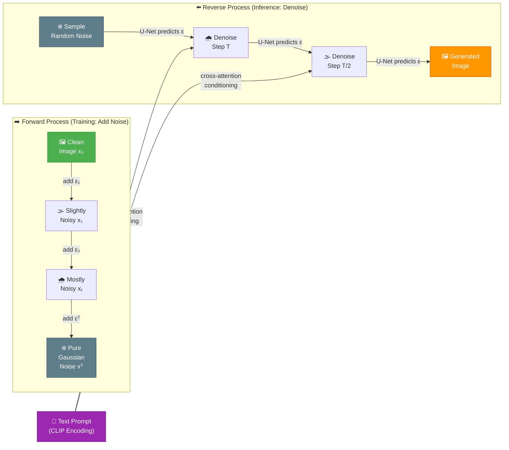

# 🎨 Diffusion Models

⬅️ [15 LangGraph](../15_LangGraph/Readme.md) &nbsp;|&nbsp; [🏠 Home](../00_Learning_Guide/Readme.md) &nbsp;|&nbsp; [17 Multimodal AI ➡️](../17_Multimodal_AI/Readme.md)

> The generative AI breakthrough behind Stable Diffusion, DALL·E, and Sora — models that learn to create by learning to destroy, then running the process in reverse.

**[▶ Start here → Diffusion Fundamentals Theory](./01_Diffusion_Fundamentals/Theory.md)**

---

## At a Glance

| | |
|---|---|
| 📚 Topics | 7 topics |
| ⏱️ Est. Time | 6–8 hours |
| 📋 Prerequisites | [LangGraph](../15_LangGraph/Readme.md) |
| 🔓 Unlocks | [Multimodal AI](../17_Multimodal_AI/Readme.md) |

---

## What's in This Section

---

## Topics

| # | Topic | What You'll Learn | Files |
|---|---|---|---|
| 01 | [Diffusion Fundamentals](./01_Diffusion_Fundamentals/) | The core intuition: why adding and reversing noise works as a generative model; score matching and the DDPM objective | [📖 Theory](./01_Diffusion_Fundamentals/Theory.md) · [⚡ Cheatsheet](./01_Diffusion_Fundamentals/Cheatsheet.md) · [🎯 Interview Q&A](./01_Diffusion_Fundamentals/Interview_QA.md) |
| 02 | [How Diffusion Works](./02_How_Diffusion_Works/) | The math step-by-step: the forward Markov chain, the noise schedule (linear vs cosine), and how the U-Net learns to predict noise | [📖 Theory](./02_How_Diffusion_Works/Theory.md) · [⚡ Cheatsheet](./02_How_Diffusion_Works/Cheatsheet.md) · [🎯 Interview Q&A](./02_How_Diffusion_Works/Interview_QA.md) |
| 03 | [Stable Diffusion](./03_Stable_Diffusion/) | How Stable Diffusion moves diffusion into latent space (LDM), the role of the VAE, CLIP text encoder, and the scheduler | [📖 Theory](./03_Stable_Diffusion/Theory.md) · [⚡ Cheatsheet](./03_Stable_Diffusion/Cheatsheet.md) · [🎯 Interview Q&A](./03_Stable_Diffusion/Interview_QA.md) |
| 04 | [Guidance and Conditioning](./04_Guidance_and_Conditioning/) | Classifier-free guidance (CFG), how guidance scale controls creativity vs fidelity, and techniques for image-to-image and inpainting | [📖 Theory](./04_Guidance_and_Conditioning/Theory.md) · [⚡ Cheatsheet](./04_Guidance_and_Conditioning/Cheatsheet.md) · [🎯 Interview Q&A](./04_Guidance_and_Conditioning/Interview_QA.md) |
| 05 | [Modern Diffusion Models](./05_Modern_Diffusion_Models/) | SDXL, FLUX, Sora, and Consistency Models — how the field evolved past vanilla DDPM for speed, quality, and video | [📖 Theory](./05_Modern_Diffusion_Models/Theory.md) · [⚡ Cheatsheet](./05_Modern_Diffusion_Models/Cheatsheet.md) · [🎯 Interview Q&A](./05_Modern_Diffusion_Models/Interview_QA.md) |
| 06 | [ControlNet and Adapters](./06_ControlNet_and_Adapters/) | How ControlNet adds structural control (edges, poses, depth maps) to generation; IP-Adapter for style and identity conditioning | [📖 Theory](./06_ControlNet_and_Adapters/Theory.md) · [⚡ Cheatsheet](./06_ControlNet_and_Adapters/Cheatsheet.md) · [🎯 Interview Q&A](./06_ControlNet_and_Adapters/Interview_QA.md) |
| 07 | [Diffusion vs GANs](./07_Diffusion_vs_GANs/) | Why diffusion models displaced GANs as the dominant generative paradigm: training stability, mode coverage, and editability trade-offs | [📖 Theory](./07_Diffusion_vs_GANs/Theory.md) · [⚡ Cheatsheet](./07_Diffusion_vs_GANs/Cheatsheet.md) · [🎯 Interview Q&A](./07_Diffusion_vs_GANs/Interview_QA.md) |

---

## Key Concepts at a Glance

| Concept | What It Means |
|---|---|
| **Forward process destroys information** | The model is trained by progressively adding Gaussian noise to real images over T timesteps until only noise remains; the network learns to reverse each step. |
| **The U-Net predicts noise, not the image** | At each denoising step, the network is asked "what noise was added?" and subtracts that estimate; this formulation is more stable than predicting the clean image directly. |
| **Latent diffusion is 64x cheaper** | Stable Diffusion compresses images into a tiny latent space with a VAE before running diffusion, drastically cutting compute while preserving quality. |
| **CFG is the creativity dial** | Classifier-free guidance runs the U-Net twice per step (conditioned and unconditioned) and extrapolates between them; higher guidance scale = stronger prompt adherence but less diversity. |
| **ControlNet unlocks precise spatial control** | A trainable copy of the U-Net encoder processes condition signals (Canny edges, human poses, depth maps) and injects them via residual connections, enabling layout-consistent generation. |

---

## 📂 Navigation

⬅️ **Prev:** [15 LangGraph](../15_LangGraph/Readme.md) &nbsp;&nbsp; ➡️ **Next:** [17 Multimodal AI](../17_Multimodal_AI/Readme.md)
