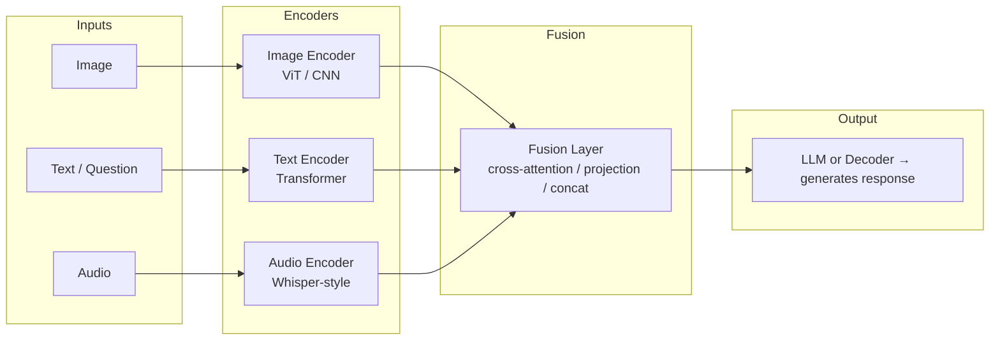
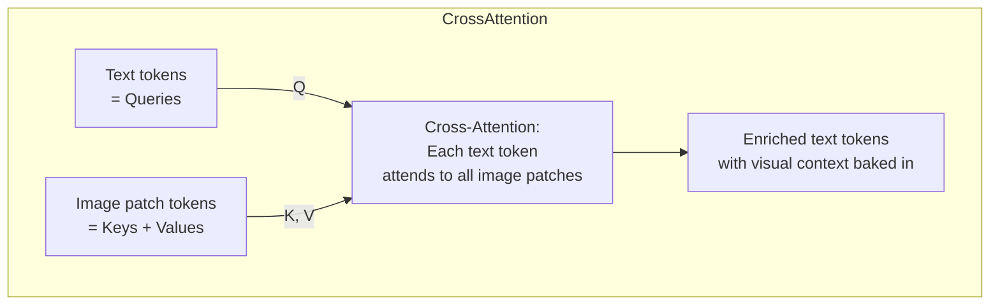

# Multimodal AI Fundamentals

## The Story 📖

Leila was born blind — she navigates through touch, sound, and verbal descriptions. Marco is deaf — he navigates through sight, lip reading, and text. Each is highly capable, but each has a gap.

Now imagine a system that has all of it: it can see the image, hear the audio, read the text, watch the video, and cross-reference across all of them. This is **multimodal AI** — intelligence that doesn't limit itself to a single sense.

The first wave of AI was unimodal: text models read text, image classifiers looked at images, speech recognizers listened to audio. Multimodal AI is the generalist that combines everything.

👉 This is why we need **Multimodal AI** — the real world sends information through many channels at once, and limiting AI to one channel limits what it can understand.

---

## What is Multimodal AI?

**Multimodal AI** refers to systems that can process, understand, and/or generate information across more than one **modality** — a distinct type of data or sensory input.

| Modality | Examples | Common formats |
|----------|----------|----------------|
| **Text** | documents, chat, code, captions | plain text, markdown, JSON |
| **Image** | photos, diagrams, screenshots, charts | JPEG, PNG, WebP |
| **Audio** | speech, music, sound effects | MP3, WAV, FLAC |
| **Video** | recordings, screen captures | MP4, WebM |
| **Structured data** | tables, sensor readings, logs | CSV, JSON, Parquet |

A model is multimodal if it takes in or produces more than one of these. Claude 3+ accepts text and images. Whisper takes audio and produces text. DALL-E takes text and produces images. Gemini 1.5 handles all five.

#### Real-world examples

- **Claude Vision**: Image + question → text answer
- **Whisper**: Audio file → transcribed text
- **DALL-E 3**: Text description → generated image
- **GPT-4V**: Screenshot + instruction → description/analysis
- **ElevenLabs TTS**: Text → spoken audio

---

## Why It Exists — The Problem It Solves

**1. The real world is multimodal.**
When a mechanic diagnoses a car, they listen to the engine, look at dashboard lights, read error codes, and watch how the car handles. An AI limited to text is like a mechanic who can only read error codes — blind to everything else.

**2. Text alone has hard limits.**
"The dashboard warning light is amber, shaped like an engine, with a small exclamation mark to the right." A photo makes this instantly obvious. Some information is simply more efficiently conveyed in images or audio than in text descriptions.

**3. New capabilities only emerge from combinations.**
- Image + text → visual question answering, document understanding
- Audio + text → meeting transcription and summarization
- Video + text → content moderation, sports analysis
- Image + image → visual search

These capabilities are impossible with unimodal systems.

---

## How It Works — Step by Step

Every multimodal system shares the same pattern: **encode each modality separately**, **fuse the representations**, **produce output**.

### Step 1: Modality-specific encoding

Each modality gets processed by a specialized encoder:
- **Images**: Split into patches, process through ViT or CNN
- **Text**: Tokenize and embed through a language model encoder
- **Audio**: Convert to spectrogram, process through an audio transformer (like Whisper's encoder)

### Step 2: Fusion



### Step 3: Output generation

The fused representation feeds into a decoder (usually an LLM) that generates the final output — text, image, audio, or actions.

---

## The Math / Technical Side (Simplified)

### The alignment problem

A text encoder and an image encoder trained separately produce embeddings in completely different vector spaces. "Dog" as a text embedding and a photo of a dog as an image embedding have no mathematical relationship — they're speaking different languages.

**Solution: joint training with contrastive loss**

Train both encoders together so matching pairs (image + its caption) land close in embedding space, while mismatched pairs land far apart.

```
For a batch of N (image, text) pairs:
  - similarity(image_i, text_i) should be HIGH  (correct pairs)
  - similarity(image_i, text_j) should be LOW   (wrong pairs, i ≠ j)
Loss = -log(correct_pair_similarity / sum(all_pair_similarities))
```

This is the core mechanism behind CLIP.

### Projection layers

When connecting a pre-trained vision encoder to an LLM, a **projection layer** (linear layer or small MLP) maps image embedding dimensions to text token dimensions — a translator making two separately-trained models speak the same vector language.

### Three fusion strategies

| Strategy | How it works | When used |
|----------|-------------|-----------|
| **Early fusion** | Concatenate raw inputs before encoding | Rarely; loses modality structure |
| **Late fusion** | Process each modality fully, combine predictions | Simple tasks; modalities don't need to interact |
| **Cross-attention fusion** | Text tokens attend to image tokens (and vice versa) | Modern VLMs; most powerful |

Cross-attention fusion is how GPT-4V, LLaVA, and Claude Vision work.



---

## Where You'll See This in Real AI Systems

| System | Input modalities | Output modality | Primary use |
|--------|-----------------|-----------------|-------------|
| **DALL-E 3** | Text | Image | Creative image generation |
| **Whisper** | Audio | Text | Speech transcription |
| **Claude 3 Vision** | Image + Text | Text | Visual Q&A, document analysis |
| **GPT-4V** | Image + Text | Text | Visual reasoning |
| **Gemini 1.5 Pro** | Image + Text + Audio + Video | Text | Broad multimodal tasks |
| **LLaVA** | Image + Text | Text | Open-source vision-language |
| **Stable Diffusion** | Text (+ optional Image) | Image | Image generation/editing |
| **ElevenLabs** | Text | Audio | Realistic TTS |
| **Sora** | Text | Video | Video generation |

---

## Common Mistakes to Avoid ⚠️

- **Assuming multimodal = always better**: Text-only models are faster and cheaper. Don't add vision when there's no visual information to reason about.
- **Ignoring modality-specific preprocessing**: Images need resizing and normalization. Audio needs resampling (usually 16kHz for Whisper). Skipping preprocessing causes silent degradation.
- **Treating all modalities as equal contributors**: In a scanned document task, the image is just a carrier for text. Understand which modality carries the signal.
- **Underestimating cost**: Vision API calls are typically 3–10× more expensive than text-only. Video processed frame-by-frame can cost dollars per minute.
- **Expecting perfect spatial reasoning**: Current vision models still struggle with precise spatial questions, small text, and complex diagrams. Test your specific use case.

---

## Connection to Other Concepts 🔗

- **Transformers** (Section 6): Cross-attention fusion relies on the same attention mechanism at the heart of every transformer
- **Embeddings** (Section 5): Each modality produces embeddings — multimodal AI is about making multiple embedding spaces compatible
- **CLIP and Vision-Language Models** (Section 17.02): The specific architecture that made text-image joint understanding practical at scale
- **RAG Systems** (Section 9): Multimodal RAG retrieves images and text together — same retrieval logic, richer documents
- **AI Agents** (Section 10): Multimodal agents see screenshots and UI elements, dramatically expanding possible actions

---

✅ **What you just learned**
- What multimodal means: AI that processes more than one type of data (text, image, audio, video)
- Why single-modality AI is fundamentally limited for real-world tasks
- Three fusion strategies: early, late, and cross-attention (the modern standard)
- How joint training with contrastive loss aligns different modality embedding spaces
- Which production systems use multimodal AI and what each one does

🔨 **Build this now**
Send an image to Claude via the API and ask a specific question about it. Start simple: take a photo of something in your environment, encode it as base64, and ask "What objects are visible in this image?" This is your first multimodal API call.

➡️ **Next step**
Move to [`02_Vision_Language_Models/Theory.md`](../02_Vision_Language_Models/Theory.md) to understand CLIP and LLaVA — the architectures that made visual understanding in language models possible.

---

## 📂 Navigation

**In this folder:**
| File | |
|---|---|
| 📄 **Theory.md** | ← you are here |
| [📄 Cheatsheet.md](./Cheatsheet.md) | Quick reference |
| [📄 Interview_QA.md](./Interview_QA.md) | Interview prep |

⬅️ **Prev:** [Section 16 — Deployment](../../16_Deployment/) &nbsp;&nbsp;&nbsp; ➡️ **Next:** [02 — Vision Language Models](../02_Vision_Language_Models/Theory.md)
