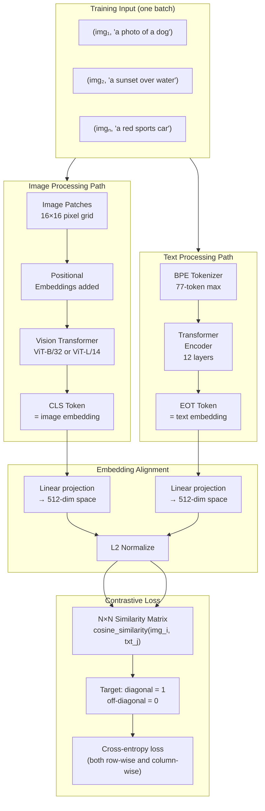
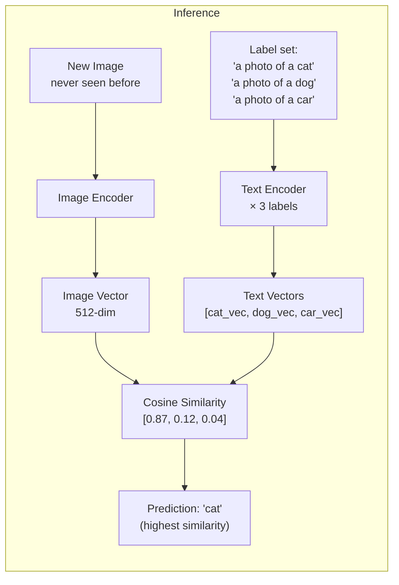
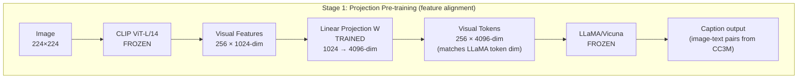
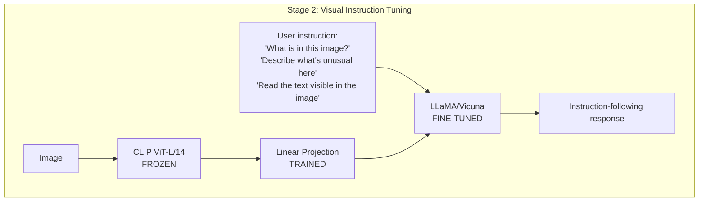
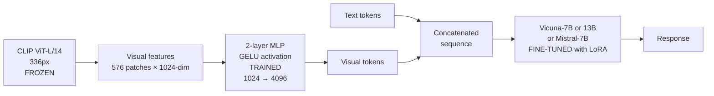
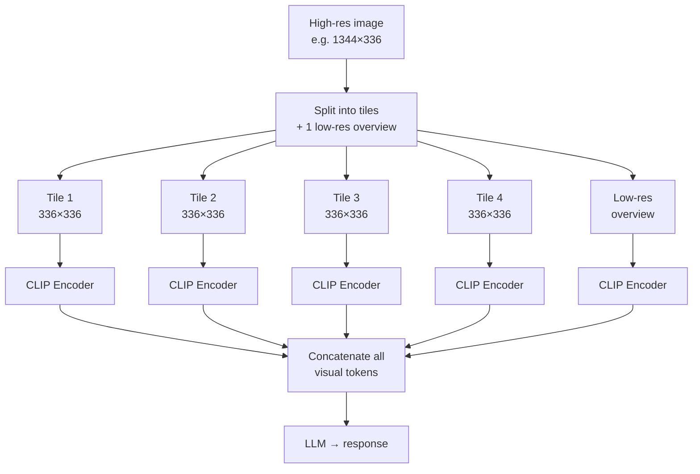
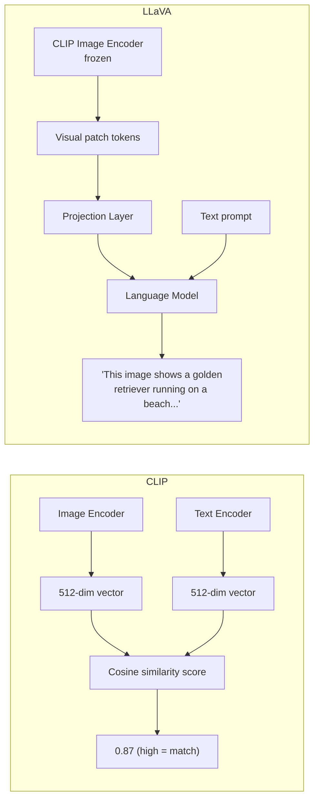
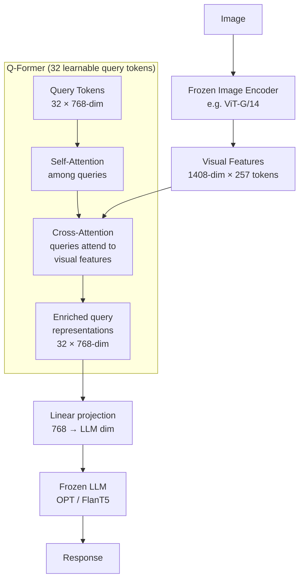

# Vision-Language Models — Architecture Deep Dive

## CLIP Architecture

### Overview

CLIP learns a shared embedding space for images and text by training two separate encoders with a contrastive objective. After training, any image and any text description can be compared directly by measuring the cosine similarity of their embeddings.

### CLIP Zero-Shot Classification

### Key CLIP Variants

| Model | Image encoder | Embedding dim | Params | Notes |
|-------|--------------|---------------|--------|-------|
| ViT-B/32 | ViT-Base, 32×32 patches | 512 | 151M | Fastest |
| ViT-B/16 | ViT-Base, 16×16 patches | 512 | 150M | Better detail |
| ViT-L/14 | ViT-Large, 14×14 patches | 768 | 428M | Most accurate |
| ViT-L/14@336 | ViT-Large, higher res | 768 | 428M | Higher resolution |

---

## LLaVA Architecture

### LLaVA-1.0: The Minimal Bridge

The original LLaVA paper showed that a single linear projection layer is sufficient to connect a visual encoder to an LLM effectively — you don't need a complex cross-attention mechanism.

### LLaVA-1.5 Improvements

LLaVA-1.5 upgraded the projection layer from a single linear layer to a 2-layer MLP and used a better base LLM (Vicuna 1.5 / Mistral), significantly improving performance while keeping the same elegant architecture.

### LLaVA-1.6 (LLaVA-NeXT): High-Resolution Support

LLaVA-1.6 added a dynamic resolution scheme: instead of downscaling all images to 336px, images are split into tiles at the native resolution, allowing much better reading of fine text and small details.

---

## CLIP vs LLaVA Side-by-Side

---

## BLIP-2: An Alternative Connector Architecture

BLIP-2 uses a **Q-Former** (Querying Transformer) instead of a simple projection layer. The Q-Former has learned query tokens that attend to the visual encoder's output and extract the most task-relevant visual features. This provides a more expressive bridge than a linear projection.

The advantage: only 32 query tokens go to the LLM (vs 256 in LLaVA), drastically reducing the visual token count and thus computational cost.

---

## 📂 Navigation

**In this folder:**
| File | |
|---|---|
| [📄 Theory.md](./Theory.md) | Full explanation |
| [📄 Cheatsheet.md](./Cheatsheet.md) | Quick reference |
| [📄 Interview_QA.md](./Interview_QA.md) | Interview prep |
| 📄 **Architecture_Deep_Dive.md** | ← you are here |

⬅️ **Prev:** [01 — Multimodal Fundamentals](../01_Multimodal_Fundamentals/Theory.md) &nbsp;&nbsp;&nbsp; ➡️ **Next:** [03 — Image Understanding](../03_Image_Understanding/Theory.md)
