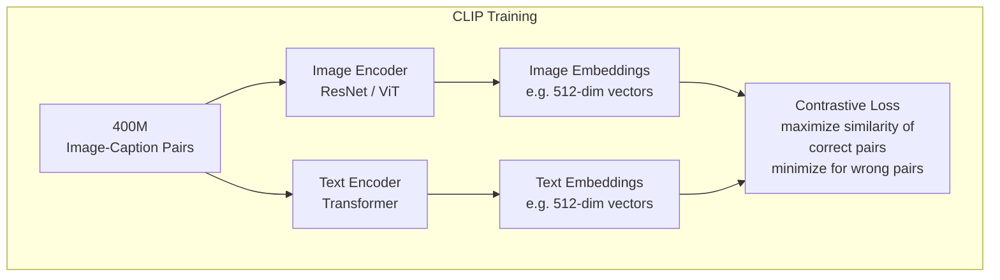
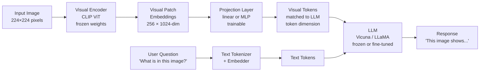

# Vision-Language Models

## The Story 📖

Imagine your job is to match photographs to their written captions in a giant archive. On day one you see 1,000 pairs. By day 100 you've seen 400 million pairs. At some point something clicks — you've developed a deep intuitive sense of what makes a photo and a sentence describe "the same thing."

That's CLIP. Trained on 400 million image-caption pairs, the model developed such a strong sense of visual-linguistic similarity that you can show it a photo it's never seen, show it ten text labels it's never seen, and it can match them correctly — zero-shot.

Then came a natural question: if CLIP can understand images and text in the same space, can we connect it to a language model that can *reason* and *generate*? That's LLaVA — take CLIP's visual encoder, connect it to an LLM with a projection layer, and you have a model that can answer any question about any image.

👉 This is why we need **Vision-Language Models** — to give language models eyes.

---

## What is a Vision-Language Model?

A **Vision-Language Model (VLM)** processes both images and text, understanding the relationship between them. Unlike pure image classifiers (which categorize), VLMs can reason, describe, answer questions, follow instructions, and generate text about visual content.

| Model | What it is | Key innovation |
|-------|-----------|----------------|
| **CLIP** | Dual-encoder: separate image and text encoders trained jointly | Shared embedding space via contrastive learning |
| **LLaVA** | Vision encoder + projection layer + LLM | Connects CLIP-like encoder to a full generative LLM |

#### Real-world examples

- **Claude 3 Vision**: Accepts images alongside prompts — built on VLM architecture
- **GPT-4V**: OpenAI's VLM powering visual understanding in ChatGPT
- **LLaVA-1.6**: Open-source VLM you can run locally
- **BLIP-2**: Another connector architecture (Q-Former instead of linear projection)

---

## Why It Exists — The Problem It Solves

**1. Language models were blind.** GPT-3, BERT — none could see. To ask "what's in this photo?" you'd have to manually describe it first — slow, lossy, and unscalable.

**2. Image classifiers couldn't reason.** ResNet could classify "cat vs dog" but couldn't answer "what breed is this and what does it appear to be doing?" Classifiers output categories, not reasoning.

**3. Zero-shot transfer was missing from vision.** Text models generalized to new tasks via prompting. Vision models needed retraining per category. CLIP's contrastive training created a unified semantic space where vision could generalize the same way.

👉 Without VLMs: vision AI was rigid and separate from language AI. With VLMs: a single model handles arbitrary visual questions and instructions.

---

## How It Works — Step by Step

### CLIP: Learning a shared embedding space

CLIP stands for **Contrastive Language-Image Pre-training**. It trains two encoders — one for images, one for text — simultaneously with contrastive loss.



**Zero-shot classification with CLIP**:
```
1. Encode the image into a vector
2. Encode every possible label as text: "a photo of a {label}"
3. Find the text label whose embedding is closest to the image embedding
4. Return that label — no training needed for new categories
```

### LLaVA: Connecting vision to language generation

LLaVA stands for **Large Language and Vision Assistant**. Key insight: with a good vision encoder (CLIP) and a good LLM (Vicuna/LLaMA), you just need a bridge between them.



Three components:
1. **Visual encoder** (CLIP's ViT): converts image to patch embeddings. Usually frozen.
2. **Projection layer**: simple trainable layer mapping visual embeddings to the LLM's token dimension — the only part trained in initial LLaVA.
3. **LLM** (Vicuna, LLaMA, etc.): generates responses. May be fine-tuned.

### Visual instruction tuning

LLaVA introduced **visual instruction tuning**: instead of just training on image-caption pairs, train on instruction-following data like "describe this image in detail," "what is unusual about this image?," "extract all text visible." This makes the model useful for real tasks.

---

## The Math / Technical Side (Simplified)

### CLIP's contrastive objective

For a batch of N image-text pairs, CLIP computes an N×N similarity matrix. The loss (InfoNCE / NT-Xent):

```
L = -1/N * sum_i [ log( exp(sim(img_i, txt_i) / τ) / sum_j exp(sim(img_i, txt_j) / τ) ) ]
```

Where `sim(a, b)` = cosine similarity and `τ` = temperature. With batch size 32,768 (as CLIP used), each image has 32,767 negatives to contrast against, forcing very fine-grained distinctions.

### Vision Transformer (ViT) image encoding

1. Split image into fixed-size patches (e.g., 16×16 pixels)
2. Flatten each patch into a vector
3. Add positional embeddings
4. Process through standard transformer layers
5. Use the [CLS] token embedding as the final image representation

```
224×224 image → 196 patches of 16×16 → 196-length sequence → Transformer → 512-dim vector
```

---

## Where You'll See This in Real AI Systems

- **Claude Vision API**: Every image call goes through VLM-style architecture
- **ChatGPT with vision**: GPT-4V is OpenAI's VLM
- **Google Lens**: Visual search powered by vision-language alignment
- **GitHub Copilot**: Understanding screenshots of UI to generate code
- **Medical imaging AI**: VLMs connecting radiology images to clinical notes
- **Document AI**: Processing scanned PDFs with mixed text and images
- **Robot perception**: Robots using VLMs to understand their visual environment

---

## Common Mistakes to Avoid ⚠️

- **Confusing CLIP with a generative model**: CLIP cannot generate text — it only computes similarity scores. For generation, you need LLaVA-style architectures connecting CLIP to an LLM.
- **Thinking the projection layer is the whole story**: It's just a translator. Real capability comes from the pre-trained visual encoder and pre-trained LLM.
- **Freezing too much or too little**: In LLaVA, the visual encoder is frozen; the projection layer is trained; the LLM may be LoRA-adapted. Freezing the LLM entirely limits instruction-following quality.
- **Small batch sizes for contrastive training**: CLIP's effectiveness depends on large batches. Small batches produce dramatically weaker representations — not enough negatives to learn from.
- **Ignoring the gap between CLIP similarity and semantic understanding**: CLIP excels at visual-semantic alignment but struggles with spatial reasoning, counting, and fine-grained attributes.

---

## Connection to Other Concepts 🔗

- **Transformers and Attention** (Section 6): ViT uses the same transformer architecture; cross-attention is the core of VLM fusion
- **Embeddings** (Section 5): CLIP creates a unified multimodal embedding space
- **Contrastive Learning**: The training objective behind CLIP is also used in SimCLR, MoCo, and other self-supervised methods
- **Multimodal Fundamentals** (Section 17.01): CLIP and LLaVA instantiate the fusion strategies described there
- **Image Understanding** (Section 17.03): VLMs are the engine under all image understanding capabilities
- **Multimodal Embeddings** (Section 17.06): CLIP embeddings are the basis for cross-modal image search

---

✅ **What you just learned**
- CLIP: contrastive learning on 400M image-caption pairs creates a shared embedding space enabling zero-shot vision transfer
- LLaVA: a projection layer connects CLIP's visual encoder to an LLM, giving the language model the ability to see and reason
- Visual instruction tuning: training on diverse instruction data makes VLMs actually useful in practice
- ViT image encoding: images are split into patches and processed as sequences, just like text tokens

🔨 **Build this now**
Install `transformers` and load a CLIP model from HuggingFace (`openai/clip-vit-base-patch32`). Pass two images and three text labels, compute the similarity matrix, and see which label matches which image. Zero-shot classification without any training.

➡️ **Next step**
Move to [`03_Image_Understanding/Theory.md`](../03_Image_Understanding/Theory.md) to learn what you can actually build with a VLM — VQA, captioning, OCR, and visual grounding.


---

## 📝 Practice Questions

- 📝 [Q86 · vision-language-models](../../ai_practice_questions_100.md#q86--normal--vision-language-models)


---

## 📂 Navigation

**In this folder:**
| File | |
|---|---|
| 📄 **Theory.md** | ← you are here |
| [📄 Cheatsheet.md](./Cheatsheet.md) | Quick reference |
| [📄 Interview_QA.md](./Interview_QA.md) | Interview prep |
| [📄 Architecture_Deep_Dive.md](./Architecture_Deep_Dive.md) | CLIP + LLaVA diagrams |

⬅️ **Prev:** [01 — Multimodal Fundamentals](../01_Multimodal_Fundamentals/Theory.md) &nbsp;&nbsp;&nbsp; ➡️ **Next:** [03 — Image Understanding](../03_Image_Understanding/Theory.md)
