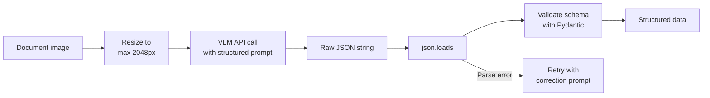

# Image Understanding — Cheatsheet

## Key Tasks at a Glance

| Task | What it does | Example prompt | Output type |
|------|-------------|---------------|-------------|
| **VQA** | Answer questions about images | "What color is the car?" | Short text |
| **Image captioning** | Describe image content | "Describe this image" | Paragraph |
| **Visual reasoning** | Logical inference from visual info | "Could the person reach the shelf?" | Reasoning + answer |
| **OCR / Text extraction** | Read text in images | "Extract all visible text" | Text |
| **Document parsing** | Extract structured data from docs | "Extract as JSON: {fields}" | JSON |
| **Visual grounding** | Locate objects in images | "Where is the red cup?" | Bounding box |
| **Defect detection** | Find anomalies | "Is there any damage visible?" | Yes/no + description |
| **Chart/graph reading** | Interpret visual data | "What was the peak value in 2023?" | Data value |

---

## Prompt Templates for Common Tasks

**General VQA**
```
Look at this image and answer: [your question]
Be concise and specific.
```

**Document / Receipt Extraction**
```
Extract the following information from this document as JSON:
{
  "field_1": null,
  "field_2": null
}
Return ONLY valid JSON.
```

**Detailed Description**
```
Describe this image in detail. Include:
- Main subjects
- Background elements
- Colors and lighting
- Any text visible
- Overall scene context
```

**Defect / Anomaly Detection**
```
Examine this image for defects or anomalies.
List any issues found, or state "No defects detected" if none.
For each issue: describe what it is, where it is, and severity (low/medium/high).
```

**Text Extraction (OCR)**
```
Extract all text visible in this image.
Preserve the original structure and formatting where possible.
```

---

## Resolution Guidelines

| Task | Recommended resolution | Why |
|------|----------------------|-----|
| General scene description | 512–768px | Sufficient for large objects |
| Reading text / OCR | 1024px+ | Small text needs detail |
| Document parsing | Original resolution | Preserve layout |
| Chart reading | 800px+ | Numbers and labels must be clear |
| Defect detection | Task-dependent | Must see the defect clearly |

---

## Known Limitations

| Limitation | Severity | Workaround |
|-----------|---------|------------|
| Counting objects (>7) | High | Use object detection model |
| Small text (<14pt equiv.) | Medium | Crop + zoom in |
| Spatial relationships | Medium | Ask multiple sub-questions |
| Handwriting | Medium | Specialized handwriting model |
| Complex diagrams | Medium | Describe what to look for |
| Exact coordinates | High | Use grounding-specific model |

---

## Document Understanding Workflow



---

## Golden Rules

1. Higher resolution costs more tokens — use the minimum needed for your task
2. Always validate/parse structured output; never trust raw JSON without checking
3. For counting tasks, use dedicated object detection, not VQA
4. Crop and zoom into regions of interest for detailed extraction tasks
5. Test with your actual images — performance varies significantly by content type

---

## 📂 Navigation

**In this folder:**
| File | |
|---|---|
| [📄 Theory.md](./Theory.md) | Full explanation |
| 📄 **Cheatsheet.md** | ← you are here |
| [📄 Interview_QA.md](./Interview_QA.md) | Interview prep |
| [📄 Code_Example.md](./Code_Example.md) | VQA with vision model API |

⬅️ **Prev:** [02 — Vision Language Models](../02_Vision_Language_Models/Theory.md) &nbsp;&nbsp;&nbsp; ➡️ **Next:** [04 — Using Vision APIs](../04_Using_Vision_APIs/Theory.md)
