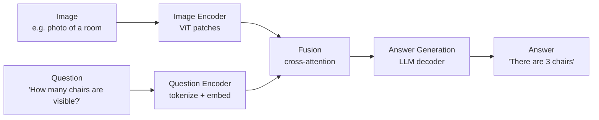
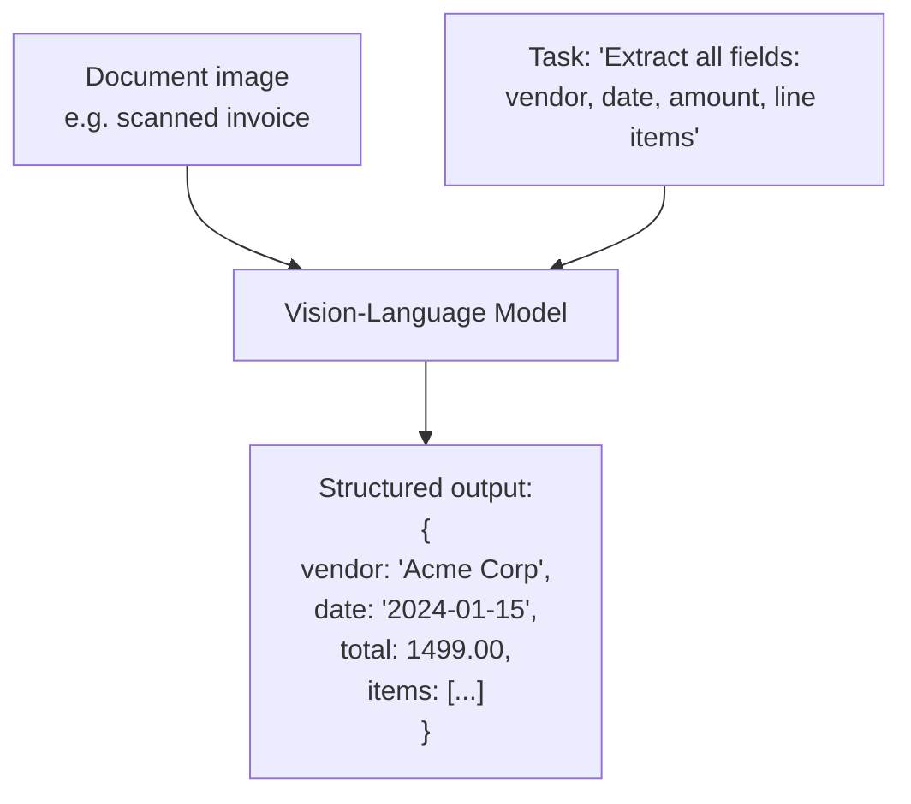

# Image Understanding

## The Story 📖

A quality control engineer walks the production line. She doesn't just say "that's a gear" — she answers specific questions: "Is this gear tooth chipped?", "Does the thread depth match spec?", "Is there any corrosion visible?" The question defines what she's looking for; the image contains the answer.

When she goes on vacation, you deploy an AI to answer the same questions from a camera feed. This is image understanding AI — systems that can answer *any* question about *any* image.

This is the practical layer above vision-language models. CLIP and LLaVA are the engines. Image understanding is what you build with those engines: QA systems, captioning tools, document parsers, OCR pipelines, and visual grounding.

👉 This is why we need **Image Understanding** — to turn raw visual perception into actionable answers.

---

## What is Image Understanding?

**Image understanding** is the set of tasks where an AI system extracts meaning, answers questions, or generates descriptions from visual input. It focuses on semantic comprehension — understanding *what is happening* — rather than low-level vision (edges, pixel classification).

| Task | Input | Output | Example |
|------|-------|--------|---------|
| **VQA** (Visual Q&A) | Image + question | Text answer | "What color is the car?" → "Red" |
| **Image captioning** | Image | Description | → "A dog running on a beach at sunset" |
| **Visual reasoning** | Image + question | Reasoning + answer | "Can the person reach the apple?" |
| **OCR with AI** | Image of document | Extracted text | → "Invoice #1234, Total: $499.00" |
| **Visual grounding** | Image + phrase | Bounding box | "the red cup" → coordinates |
| **Document understanding** | Scanned doc image | Structured data | → JSON with field values |

---

## Why It Exists — The Problem It Solves

**1. The world sends us images, not text.** Product listings have photos. Support tickets come with screenshots. Medical records include scans. All require extracting information from images directly.

**2. Manual image analysis doesn't scale.** A human can examine ~50 images per hour. An AI can process 50,000. Quality control, content moderation, document digitization — any high-volume image task benefits enormously.

**3. Traditional computer vision was task-specific.** Old OCR had to be configured per document type. Object detectors needed retraining per category. With modern VLMs, one model handles arbitrary questions about arbitrary images.

---

## How It Works — Step by Step

### Visual Question Answering (VQA)



The fusion step is crucial — the model "looks" at the image through the lens of the question. "How many chairs?" directs attention to sitting-height objects. "What time does the clock show?" directs attention to the wall clock.

### Image Captioning

Captioning is VQA with an implicit question: "Describe this image." Captioning must be comprehensive (cover the whole image) while VQA focuses on a specific query. Modern approach: feed the image to a VLM with the prompt "Describe this image in detail."

### Visual Reasoning

Beyond factual answering to logical inference:
- "If the person tried to open the drawer, could they reach it?" (spatial reasoning)
- "Based on the shadows, approximately what time of day was this taken?" (inference)
- "What would need to change for the car to fit in this space?" (counterfactual)

Modern VLMs are surprisingly capable here but still make systematic errors.

### OCR with AI (Document Understanding)

Classic OCR extracts text character by character. AI-based document understanding goes further:



The model understands layout (this label goes with this value), handles varying formats, and can infer fields that are implicit.

### Visual Grounding

**Visual grounding** means locating a specific thing in an image given a text description.

Input: image + "the person wearing the red hat on the left"
Output: bounding box `[x1, y1, x2, y2]`

Harder than simple detection — requires understanding relationships, attributes, and disambiguation ("on the *left*" not the one on the right).

---

## The Math / Technical Side (Simplified)

### VQA as conditional generation

Modern VQA is framed as conditional text generation:

```
P(answer | image, question) = P(token_1 | image, question)
                             × P(token_2 | image, question, token_1)
                             × ...
```

The model generates the answer token by token, conditioning each on visual features (via cross-attention) and previously generated tokens. No special VQA-specific architecture — just an LLM conditioned on visual features.

### Document understanding as structured extraction

Combine VQA with output format constraints:

```
Prompt: "Extract the following fields as JSON: vendor, date, total_amount.
         Return ONLY valid JSON, nothing else."
```

Visual understanding identifies where each piece of information is; the format constraint shapes how it's returned.

### Grounding coordinates

Some models output bounding box coordinates as text tokens: "The red cup is at [0.32, 0.41, 0.67, 0.78]" (normalized x1, y1, x2, y2). Others use special tokens or separate detection heads. Paligemma, Qwen-VL, and Florence-2 all support visual grounding output.

---

## Where You'll See This in Real AI Systems

| Application | Image understanding capability |
|-------------|-------------------------------|
| **Gmail Smart Reply** | Understands image attachments |
| **Google Lens** | Visual search, plant ID, text extraction |
| **DocuSign/ABBYY** | Document understanding, form extraction |
| **Medical AI (Rad-AI, Aidoc)** | Radiology image analysis, clinical notes |
| **Manufacturing QC** | Defect detection via visual Q&A |
| **Insurance claims** | Photo damage assessment |

---

## Common Mistakes to Avoid ⚠️

- **Assuming models can read all text in images**: Small text (under ~14pt equivalent), unusual fonts, handwriting, and rotated text all reduce accuracy. Test on real examples.
- **Ignoring image resolution**: Sending a 100×100 thumbnail and expecting brand-label extraction will fail. Use adequate resolution for the task.
- **Over-relying on VQA for counting**: Modern VLMs are poor at exact counting above ~7 objects. Use object detection for counting tasks.
- **Not validating JSON output**: VLMs generating structured data will occasionally produce malformed JSON, hallucinate values, or miss fields. Always parse + validate.
- **Treating grounding as reliable for safety-critical tasks**: Bounding box predictions are approximate. Don't use them directly in physical systems without validation.

---

## Connection to Other Concepts 🔗

- **Vision-Language Models** (Section 17.02): CLIP and LLaVA are the underlying models that make image understanding work
- **Prompt Engineering** (Section 8.01): All image understanding tasks are fundamentally prompting tasks
- **Structured Output** (Section 8): JSON extraction from documents uses the same patterns as text-only structured generation
- **RAG Systems** (Section 9): Multimodal RAG uses image understanding to extract content from image-heavy documents
- **Using Vision APIs** (Section 17.04): Image understanding is what you implement through vision API calls

---

✅ **What you just learned**
- Key tasks: VQA, captioning, visual reasoning, OCR, document understanding, and visual grounding
- VQA works as conditional text generation: the LLM generates answers conditioned on visual features and the question
- Document understanding: visual layout understanding + structured extraction prompts
- Visual grounding: locating objects given text descriptions, outputting bounding box coordinates
- Key limitations: counting, small text, spatial reasoning, coordinate precision

🔨 **Build this now**
Take a photo of a document — a receipt, business card, or any printed form. Send it to a vision API (Claude or GPT-4V) and extract the information as JSON. Try "Extract all text" vs "Extract as JSON: {fields you want}" and notice the output structure difference.

➡️ **Next step**
Move to [`04_Using_Vision_APIs/Theory.md`](../04_Using_Vision_APIs/Theory.md) to learn how to call vision APIs in code — base64 encoding, URL images, prompt engineering for vision, and the 10 most useful vision use cases.

---

## 📂 Navigation

**In this folder:**
| File | |
|---|---|
| 📄 **Theory.md** | ← you are here |
| [📄 Cheatsheet.md](./Cheatsheet.md) | Quick reference |
| [📄 Interview_QA.md](./Interview_QA.md) | Interview prep |
| [📄 Code_Example.md](./Code_Example.md) | VQA with vision model API |

⬅️ **Prev:** [02 — Vision Language Models](../02_Vision_Language_Models/Theory.md) &nbsp;&nbsp;&nbsp; ➡️ **Next:** [04 — Using Vision APIs](../04_Using_Vision_APIs/Theory.md)
