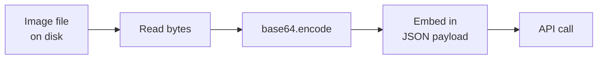
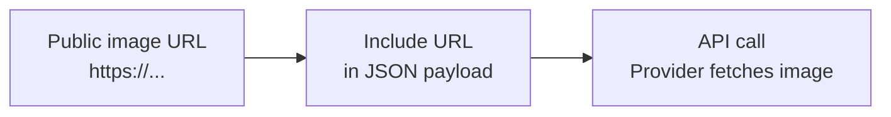

# Using Vision APIs

## The Story 📖

A developer named Priya wants to build a tool that scans uploaded receipts and extracts line items. She thinks she needs to train a computer vision model and spends two weeks researching object detection and layout parsing.

Then her colleague says: "You know Claude can read receipts, right? You just send the image and ask it."

Priya makes one API call. The model reads the receipt perfectly. Total development time: 20 minutes.

This is the modern reality. Claude, GPT-4V, and Gemini can all see images through API calls. The barrier dropped from "PhD + GPU cluster" to "know how to make an API request."

👉 This is why we need to understand **Vision APIs** — because practical vision AI is now a single HTTP request away.

---

## 📌 Learning Priority

**Must Learn** — core concepts, needed to understand the rest of this file:
[What is a Vision API](#what-is-a-vision-api) · [Prepare the Image](#step-1-prepare-the-image) · [Construct the Request](#step-2-construct-the-request)

**Should Learn** — important for real projects and interviews:
[Prompt Engineering for Vision](#prompt-engineering-for-vision) · [API Capabilities](#can-do-well) · [Cost Considerations](#cost-considerations)

**Good to Know** — useful in specific situations, not needed daily:
[Token Counting](#how-images-become-tokens) · [Common Mistakes](#common-mistakes-to-avoid-)

**Reference** — skim once, look up when needed:
[Connection to Other Concepts](#connection-to-other-concepts-)

---

## What is a Vision API?

A **Vision API** is an endpoint that accepts images (alongside text) and returns text responses. The provider hosts the model; you send images and questions; you get answers.

| Provider | Model | API |
|----------|-------|-----|
| **Anthropic** | Claude 3 Haiku/Sonnet/Opus/3.5/4 | Messages API with image content blocks |
| **OpenAI** | GPT-4o, GPT-4V | Chat Completions API with image_url |
| **Google** | Gemini 1.5 Pro/Flash, Gemini 2.0 | Generative Language API |
| **AWS** | Claude via Bedrock | Bedrock API |

All follow the same pattern: send a message containing an image (base64 or URL) plus a text prompt, receive a text response.

---

## Why It Exists — The Problem It Solves

- **No model to run**: Vision models require 8–80GB VRAM depending on size. APIs abstract this entirely.
- **No fine-tuning needed**: Vision APIs work zero-shot across a massive range of tasks.
- **Instant scale**: APIs scale with demand; a batch of 10,000 images costs the same per-image as processing 1.
- **Always up-to-date**: Change a model name in your code when a better model drops — no retraining.

---

## How It Works — Step by Step

### Step 1: Prepare the image

**Base64 encoding** (local files):


**URL reference** (hosted images):


Base64 is more reliable — no dependency on URL availability, redirects, or auth. Use URLs only when images are publicly accessible and you want to avoid large payloads.

### Step 2: Construct the request

**Claude (Anthropic SDK)**:
```python
messages=[{
    "role": "user",
    "content": [
        {
            "type": "image",
            "source": {
                "type": "base64",
                "media_type": "image/jpeg",
                "data": "<base64_string>"
            }
        },
        {
            "type": "text",
            "text": "What is shown in this image?"
        }
    ]
}]
```

**OpenAI**:
```python
messages=[{
    "role": "user",
    "content": [
        {
            "type": "image_url",
            "image_url": {
                "url": f"data:image/jpeg;base64,{base64_string}",
                "detail": "high"  # or "low" or "auto"
            }
        },
        {
            "type": "text",
            "text": "What is shown in this image?"
        }
    ]
}]
```

### Step 3: Handle the response

The response is plain text — same format as any other LLM response. Parse it as needed.

---

## The Math / Technical Side (Simplified)

### How images become tokens

1. Image is resized to fit the model's supported resolution
2. Image is split into patches (usually 16×16 or 32×32 pixels)
3. Each patch is encoded as one or more tokens
4. Visual tokens are prepended to the text tokens

**Cost implication**: larger images = more patches = more tokens = higher cost.

**OpenAI token counting (GPT-4V)**:
- Low detail: flat 85 tokens per image regardless of size
- High detail: tile into 512×512 chunks, 170 tokens per tile + 85 base

**Anthropic token counting (Claude)**:
- Approximately 1,600 tokens for a 1000×1000 image
- Formula: `width_px × height_px / 750` (approximate)

### Resolution trade-off

```
Low resolution → fewer tokens → cheaper → less detail
High resolution → more tokens → more expensive → more detail
```

For most tasks (scene description, general questions), low/medium resolution is sufficient. For OCR or reading small text, use higher resolution.

---

## What Vision APIs Can and Cannot Do

### Can do well
- General scene description and understanding
- Reading large, clear text (printed receipts, signs, documents)
- Identifying objects, people, animals, activities
- Reading charts and graphs (approximate values)
- Answering factual questions about image content
- Comparing images to each other
- Following complex visual instructions

### Struggle with
- Exact pixel-level measurements
- Counting precisely (above ~7-10 objects)
- Very small text or handwriting
- Complex technical diagrams (circuit boards, schematics)
- Precise spatial coordinates
- Distinguishing near-identical objects
- Images with very low contrast or heavy noise

---

## Prompt Engineering for Vision

Vision prompts follow the same principles as text prompts, with added guidance about *what to look at*.

**Be specific about what to examine**:
- Vague: "Describe this."
- Better: "Examine the machine part. Focus on the threads and surface finish. Are there any defects visible?"

**Guide the output format**:
- "List each issue as a separate bullet point."
- "Respond with only: PASS or FAIL, followed by one sentence of explanation."
- "Return JSON: {defect_found: bool, location: str, severity: str}"

**Chain-of-thought for complex visual reasoning**:
- "First describe what you see. Then analyze whether the setup is safe based on OSHA guidelines."

**Multiple images — label each**:
```
Image 1 (before): [image]
Image 2 (after): [image]
What changed between image 1 and image 2?
```

---

## Cost Considerations

| Provider | Approx. cost per image | Notes |
|----------|----------------------|-------|
| Claude Haiku | ~$0.001–0.004 | Cheapest Claude |
| Claude Sonnet | ~$0.003–0.012 | Balance of cost and capability |
| Claude Opus | ~$0.015–0.060 | Most capable |
| GPT-4o mini | ~$0.001–0.003 | Cheapest OpenAI |
| GPT-4o | ~$0.003–0.015 | Standard GPT-4 vision |
| Gemini Flash | ~$0.0001–0.001 | Very cheap, high speed |
| Gemini Pro | ~$0.002–0.008 | Standard Gemini |

_Prices as of early 2025; always check provider websites for current pricing._

Cost optimization:
- Use lower resolution when fine detail isn't needed
- Use cheaper models (Haiku, Flash) for high-volume tasks
- Cache results for repeated identical images
- Batch process non-time-sensitive tasks overnight
- Resize images before sending (don't send 4K photos for general questions)

---

## Where You'll See This in Real AI Systems

- **E-commerce**: Product photo moderation, alt-text generation
- **Finance**: Receipt and invoice processing, check reading
- **Healthcare**: Patient-uploaded wound photos, symptom triage
- **Real estate**: Automated property photo descriptions
- **Legal/Insurance**: Document digitization, damage assessment
- **Retail**: Shelf compliance checking, price tag reading
- **Social media**: Content moderation, accessibility alt-text

---

## Common Mistakes to Avoid ⚠️

- **Sending unnecessarily large images**: Resize before sending. A 6000×4000 raw photo costs 10× more tokens than a 1200×800 version, often with no benefit.
- **Using URLs for critical workflows**: Public URLs can expire, have rate limits, or change. For production, always use base64.
- **Not handling API errors**: Vision calls can fail with rate limit, image-too-large, or content policy errors. Always implement retry logic with exponential backoff.
- **Ignoring model limitations in prompts**: Asking "count every item in this warehouse photo" gives unreliable answers. Know what not to ask.
- **Sending sensitive images without checking policies**: Most vision APIs prohibit certain image content. Review provider policies before building with sensitive image types.

---

## Connection to Other Concepts 🔗

- **Image Understanding** (Section 17.03): The tasks (VQA, OCR, etc.) you implement through these API calls
- **Prompt Engineering** (Section 8.01): All prompt engineering principles apply equally to vision prompts
- **Structured Output** (Section 8): JSON extraction from images uses the same structured output patterns as text
- **Cost Optimization** (Section 12): Image token costs are a major factor in production AI budgets
- **Vision Language Models** (Section 17.02): The models powering these APIs

---

✅ **What you just learned**
- Vision APIs accept images via base64 (local files) or URL, alongside text prompts
- Images are converted to tokens; resolution directly controls cost
- Major providers: Anthropic Claude, OpenAI GPT-4V, Google Gemini — all similar API patterns
- Prompt engineering principles apply: be specific, guide format, label multiple images
- Key limitations: counting, small text, spatial precision, complex diagrams

🔨 **Build this now**
Write a Python function that accepts an image path and a question, makes a Claude vision API call, and returns the answer. Call it three ways: (1) "describe this image", (2) "what text is visible?", (3) "extract key information as JSON." See how the same image produces different structured outputs with different prompts.

➡️ **Next step**
See [`Code_Example.md`](./Code_Example.md) and [`Code_Cookbook.md`](./Code_Cookbook.md) in this folder for 10 complete vision API use cases with working code.

---

## 📂 Navigation

**In this folder:**
| File | |
|---|---|
| 📄 **Theory.md** | ← you are here |
| [📄 Cheatsheet.md](./Cheatsheet.md) | Quick reference |
| [📄 Interview_QA.md](./Interview_QA.md) | Interview prep |
| [📄 Code_Example.md](./Code_Example.md) | Send image to Claude Vision API |
| [📄 Code_Cookbook.md](./Code_Cookbook.md) | 10 vision use cases |

⬅️ **Prev:** [03 — Image Understanding](../03_Image_Understanding/Theory.md) &nbsp;&nbsp;&nbsp; ➡️ **Next:** [05 — Audio and Speech AI](../05_Audio_and_Speech_AI/Theory.md)
