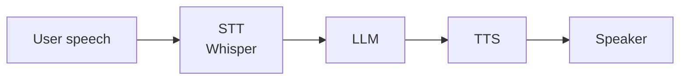

# Audio and Speech AI — Cheatsheet

## Key Terms

| Term | One-line meaning |
|------|-----------------|
| **STT** | Speech-to-Text: converts audio speech to written text |
| **TTS** | Text-to-Speech: converts text to spoken audio |
| **Whisper** | OpenAI's open-source STT model; 99 languages, encoder-decoder transformer |
| **Log-Mel spectrogram** | 2D "picture of sound" used as input to Whisper; 80 frequency bins × time |
| **Voice cloning** | TTS conditioned on a reference speaker's voice to mimic it |
| **VAD** | Voice Activity Detection: detecting when a person is/isn't speaking |
| **WER** | Word Error Rate: % of words incorrectly transcribed (lower = better) |
| **Vocoder** | Neural network that converts mel spectrogram → audio waveform |
| **Streaming STT** | Transcription that starts outputting before audio recording finishes |

---

## Whisper Model Selection

| Model | Size | Speed | WER | Use when |
|-------|------|-------|-----|----------|
| tiny | 39M | ~32x | ~5.7% | Fast + low-resource, drafts |
| base | 74M | ~16x | ~4.2% | Good balance, most apps |
| small | 244M | ~6x | ~3.3% | Better accuracy needed |
| medium | 769M | ~2x | ~2.5% | Professional quality |
| large-v3 | 1.5B | 1x | ~1.9% | Best accuracy, via API |

Speed relative to real-time (large = 1x). Via OpenAI API always gets large-v3.

---

## Whisper Quick Start

```bash
pip install openai-whisper ffmpeg-python
```

```python
# Local
import whisper
model = whisper.load_model("base")
result = model.transcribe("audio.mp3")
print(result["text"])

# With timestamps
result = model.transcribe("audio.mp3", word_timestamps=True)
for segment in result["segments"]:
    print(f"[{segment['start']:.1f}s] {segment['text']}")

# Via OpenAI API (large-v3)
from openai import OpenAI
client = OpenAI()
with open("audio.mp3", "rb") as f:
    transcription = client.audio.transcriptions.create(
        model="whisper-1", file=f
    )
print(transcription.text)
```

---

## TTS Quick Start

```python
# OpenAI TTS
from openai import OpenAI
client = OpenAI()

response = client.audio.speech.create(
    model="tts-1",           # or "tts-1-hd" for higher quality
    voice="nova",            # alloy, echo, fable, onyx, nova, shimmer
    input="Hello, how can I help you today?"
)
response.stream_to_file("output.mp3")

# ElevenLabs
from elevenlabs.client import ElevenLabs
client = ElevenLabs(api_key="...")
audio = client.text_to_speech.convert(
    voice_id="21m00Tcm4TlvDq8ikWAM",  # Rachel voice
    text="Hello, how can I help you today?",
    model_id="eleven_monolingual_v1"
)
```

---

## Voice Agent Pipeline



```python
def voice_turn(audio_path: str) -> str:
    # 1. Transcribe
    transcript = transcribe(audio_path)
    # 2. Generate response
    response_text = llm_respond(transcript)
    # 3. Speak response
    audio_path_out = text_to_speech(response_text)
    return audio_path_out
```

---

## TTS Provider Comparison

| Provider | Quality | Latency | Cost | Key feature |
|----------|---------|---------|------|-------------|
| OpenAI TTS-1 | Good | Low | $0.015/1K chars | Fast, cheap |
| OpenAI TTS-1-HD | Better | Medium | $0.030/1K chars | Higher quality |
| ElevenLabs | Excellent | Medium | $0.18/1K chars | Voice cloning |
| Google TTS | Good | Low | $4/1M chars | WaveNet voices |
| Azure TTS | Good | Low | $1/1M chars | Neural voices |

---

## Audio Preprocessing Checklist

Before sending audio to Whisper:
- [ ] Resample to 16,000 Hz (16kHz)
- [ ] Convert to mono (single channel)
- [ ] Format: WAV, MP3, M4A, or FLAC
- [ ] File size: < 25MB for API calls (split longer files)
- [ ] Remove long silences for efficiency (optional)

```python
import subprocess

def preprocess_audio(input_path: str, output_path: str):
    """Resample to 16kHz mono WAV using ffmpeg."""
    subprocess.run([
        "ffmpeg", "-i", input_path,
        "-ar", "16000",  # sample rate
        "-ac", "1",      # mono
        "-y",            # overwrite output
        output_path
    ], check=True, capture_output=True)
```

---

## Latency Optimization

| Bottleneck | Solution |
|-----------|---------|
| STT latency | Use smaller Whisper model or streaming STT (Deepgram, AssemblyAI) |
| LLM latency | Stream tokens; start TTS as first sentence arrives |
| TTS latency | Use low-latency TTS (ElevenLabs Flash, OpenAI TTS-1) |
| Pipeline total | Parallelize: end-of-speech detection while STT still running |

---

## Golden Rules

1. Resample all audio to 16kHz mono before Whisper
2. Use base model for drafts, large-v3 for production
3. Always validate Whisper output for hallucinations in quiet/noisy segments
4. Stream TTS for voice agents — don't wait for full LLM response before speaking
5. Implement VAD to detect when user stops speaking

---

## 📂 Navigation

**In this folder:**
| File | |
|---|---|
| [📄 Theory.md](./Theory.md) | Full explanation |
| 📄 **Cheatsheet.md** | ← you are here |
| [📄 Interview_QA.md](./Interview_QA.md) | Interview prep |
| [📄 Code_Example.md](./Code_Example.md) | Whisper + voice pipeline code |

⬅️ **Prev:** [04 — Using Vision APIs](../04_Using_Vision_APIs/Theory.md) &nbsp;&nbsp;&nbsp; ➡️ **Next:** [06 — Multimodal Embeddings](../06_Multimodal_Embeddings/Theory.md)
