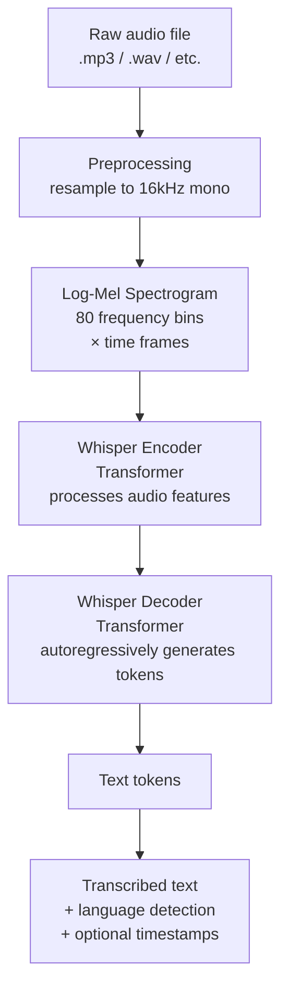
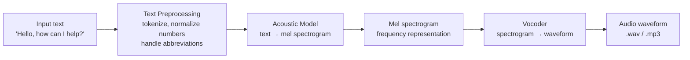
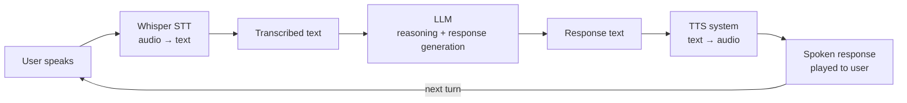

# Audio and Speech AI

## The Story 📖

In 2022, OpenAI released a model called Whisper and made it open source. Developers immediately started describing it as the speech-to-text model that "just works." It transcribed 99 languages. It handled background noise. It understood heavy accents. It ran locally on a laptop.

Before Whisper, building speech transcription into an application meant either paying a cloud provider (Google STT, AWS Transcribe) and carefully managing each edge case, or training your own model from scratch. Neither option was easy.

After Whisper: you install a Python package, point it at an audio file, and get back accurate text. Total setup time: 5 minutes.

Then came the other half of the voice equation: text-to-speech. ElevenLabs launched in 2022 with voices so realistic that people couldn't tell them from humans. OpenAI added TTS to their API. Suddenly both ends of the voice pipeline — ears and mouth — were accessible to any developer.

Chain them together: user speaks → Whisper hears → LLM thinks → TTS speaks → voice agent.

👉 This is why **Audio and Speech AI** matters — the full voice pipeline is now a few API calls.

---

## What is Audio and Speech AI?

**Audio and Speech AI** covers systems that process or generate audio, particularly human speech. The main components:

| Component | Direction | What it does | Example |
|-----------|-----------|-------------|---------|
| **STT** (Speech-to-Text) | Audio → Text | Transcribes spoken words | Whisper |
| **TTS** (Text-to-Speech) | Text → Audio | Generates spoken audio from text | ElevenLabs, OpenAI TTS |
| **Audio embeddings** | Audio → Vector | Represents audio semantically | music similarity |
| **Audio classification** | Audio → Label | Identifies sounds or events | "is this speech or noise?" |
| **Voice cloning** | Reference audio → New audio | Clones a specific voice | ElevenLabs |

A **voice agent** combines all of this: STT converts user speech to text → LLM processes and generates a response → TTS speaks the response back.

---

## Why It Exists — The Problem It Solves

**1. Speech is the most natural human interface**
Typing is a skill. Speaking is innate. For accessibility, hands-free situations (driving, cooking), and real-time interaction, voice is superior to typing. AI that can't hear or speak is limited to keyboard users only.

**2. Enormous amounts of information is audio-only**
Meetings, phone calls, podcasts, lectures, interviews — all of this is spoken and lost unless recorded and transcribed. Whisper converts this unstructured audio into searchable, analyzable text at scale.

**3. Accessibility**
TTS makes written content accessible to visually impaired users. STT makes digital interfaces accessible to users who can't type. Voice AI dramatically expands who can use software.

**4. Real-time agent interaction**
Traditional chatbots require typing. Voice agents feel fundamentally different — they're closer to a phone call than a form. This is a qualitatively different user experience.

👉 Without audio AI: voice interaction requires massive specialized teams. With audio AI: any developer can build voice-in, voice-out applications.

---

## How It Works — Step by Step

### Whisper: Speech-to-Text

Whisper is an encoder-decoder transformer trained on 680,000 hours of multilingual audio.

**Key design decisions in Whisper**:
- The **log-Mel spectrogram** converts raw audio waveform to a 2D representation (frequency × time) that transformers can process like an image
- Whisper is trained on diverse internet audio, making it robust to noise, accents, and domains
- The decoder can produce **timestamps** (word-level or segment-level) alongside transcription
- Multitask training: Whisper was trained to transcribe, translate (to English), detect language, and classify audio activity simultaneously

### Text-to-Speech (TTS)

TTS converts written text into spoken audio. Modern neural TTS models produce natural-sounding speech indistinguishable from humans at their best.

Modern TTS systems (ElevenLabs, OpenAI TTS) skip the explicit acoustic model + vocoder separation and use end-to-end neural networks.

**Voice cloning** works by conditioning the TTS model on a short reference audio sample — the model learns to mimic the speaker's voice characteristics (pitch, cadence, accent, timbre).

### Voice Agent Pipeline

**Latency is the key challenge**:
- STT (Whisper large): 1–3 seconds for short utterances
- LLM response generation: 1–5 seconds depending on length
- TTS generation: 0.5–2 seconds
- Total pipeline: 3–10 seconds per turn, which feels slow

**Solutions**:
- Use faster STT models (Whisper tiny/base, or streaming STT from Deepgram/AssemblyAI)
- Use streaming LLM responses (start TTS as first tokens arrive)
- Use fast TTS models with low latency (OpenAI TTS, ElevenLabs Flash)

---

## The Math / Technical Side (Simplified)

### Log-Mel Spectrogram

Converting audio to a format suitable for a transformer:

1. **Sampling**: Audio is recorded at some sample rate. Whisper resamples everything to 16,000 samples per second (16kHz)
2. **Framing**: The audio is divided into overlapping 25ms windows every 10ms
3. **FFT**: Fast Fourier Transform converts each frame from time domain to frequency domain
4. **Mel filterbank**: Apply mel-scale filters — compresses high frequencies (where humans have less resolution) and expands low frequencies, matching human perception
5. **Log**: Take the log of the mel spectrogram (matches how humans perceive loudness)

Result: a 2D array of shape `(80 mel bins, time_frames)` — essentially a "picture of sound" that a transformer can process like an image.

### Whisper model sizes

| Model | Parameters | VRAM | Relative speed | English WER |
|-------|-----------|------|---------------|-------------|
| tiny | 39M | ~1GB | ~32x | ~5.7% |
| base | 74M | ~1GB | ~16x | ~4.2% |
| small | 244M | ~2GB | ~6x | ~3.3% |
| medium | 769M | ~5GB | ~2x | ~2.5% |
| large | 1550M | ~10GB | 1x | ~2.2% |
| large-v3 | 1550M | ~10GB | 1x | ~1.9% |

WER = Word Error Rate (lower is better). large-v3 via API is recommended for most production use.

---

## Where You'll See This in Real AI Systems

| Product | What it uses | Audio AI |
|---------|-------------|----------|
| **Otter.ai** | Meeting transcription | Whisper-like STT |
| **Fireflies.ai** | Meeting notes | STT + LLM summarization |
| **NotionAI audio** | Transcribe audio notes | STT |
| **ElevenLabs** | TTS, voice cloning | Neural TTS |
| **OpenAI Voice Mode** | Real-time voice conversation | STT + LLM + TTS pipeline |
| **Siri / Alexa / Google** | Voice assistants | Full STT→NLU→TTS pipeline |
| **Call centers AI** | Automated support | STT + intent detection + TTS |
| **Podcast tools** | Episode transcription, chapters | STT + summarization |

---

## Common Mistakes to Avoid ⚠️

- **Not resampling audio before Whisper**: Whisper expects 16kHz mono audio. Sending 44.1kHz stereo works but is slower and may reduce accuracy. Always preprocess.

- **Using Whisper large for all tasks**: For low-stakes transcription (notes, drafts), Whisper tiny or base is 10–30x faster and still very accurate. Use the smallest model that meets your accuracy requirement.

- **Ignoring hallucination in Whisper**: Whisper is known to hallucinate text (generate plausible-sounding words that weren't said) especially in silent or low-signal segments. Always validate outputs for production use.

- **Building a voice pipeline without streaming**: A sequential pipeline (wait for full STT → wait for full LLM → wait for full TTS) feels very slow to users. Implement streaming at each step.

- **Not handling end-of-speech detection**: Real voice agents need to know when the user stopped speaking. This is non-trivial. Use VAD (Voice Activity Detection) libraries like `silero-vad` or `webrtcvad`.

- **Underestimating TTS cost**: ElevenLabs charges per character. A verbose AI response can accumulate significant cost. Keep responses concise for voice interfaces.

---

## Connection to Other Concepts 🔗

- **Transformers** (Section 6): Whisper is an encoder-decoder transformer; the audio spectrogram is processed like a sequence
- **Embeddings** (Section 5): Audio can be embedded into vectors just like text, enabling audio similarity search
- **AI Agents** (Section 10): Voice agents are audio-in, audio-out agents using the STT→LLM→TTS pipeline
- **Multimodal Agents** (Section 17.07): Adding voice to a multimodal agent expands its I/O channels
- **Using APIs** (Section 17.04): The same API-first pattern applies — Whisper and TTS are API calls

---

✅ **What you just learned**
- Whisper: an encoder-decoder transformer trained on 680K hours of audio; converts log-Mel spectrograms to text; robust to accents and noise
- TTS systems: neural models (ElevenLabs, OpenAI TTS) convert text to natural speech; voice cloning via reference audio
- Voice agent pipeline: STT → LLM → TTS chained together with streaming to minimize latency
- Log-Mel spectrogram: how audio is converted to a 2D "picture of sound" for transformers
- Key trade-offs: model size vs speed for STT, latency optimization for voice agents

🔨 **Build this now**
Install `openai-whisper` and transcribe a short audio clip: `whisper audio.mp3 --model base`. Then connect to OpenAI TTS: send a text string via the API, receive an MP3 file, play it. These two steps are the core of every voice pipeline.

➡️ **Next step**
Move to [`06_Multimodal_Embeddings/Theory.md`](../06_Multimodal_Embeddings/Theory.md) to learn how CLIP embeddings let you search a photo library by typing — images and text in the same vector space.

---

## 📂 Navigation

**In this folder:**
| File | |
|---|---|
| 📄 **Theory.md** | ← you are here |
| [📄 Cheatsheet.md](./Cheatsheet.md) | Quick reference |
| [📄 Interview_QA.md](./Interview_QA.md) | Interview prep |
| [📄 Code_Example.md](./Code_Example.md) | Whisper + voice pipeline code |

⬅️ **Prev:** [04 — Using Vision APIs](../04_Using_Vision_APIs/Theory.md) &nbsp;&nbsp;&nbsp; ➡️ **Next:** [06 — Multimodal Embeddings](../06_Multimodal_Embeddings/Theory.md)
