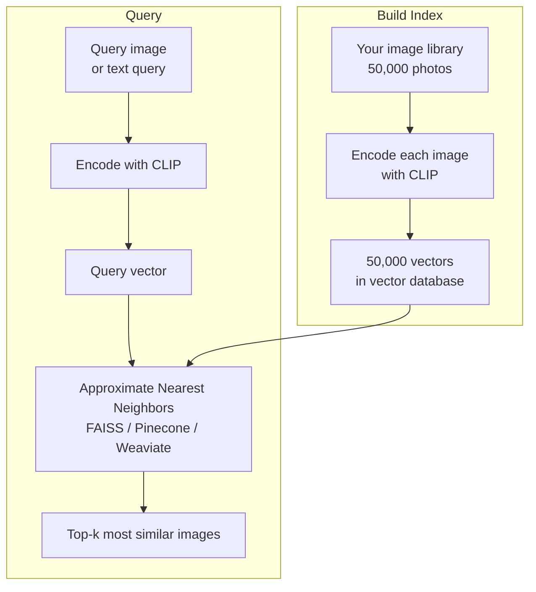

# Multimodal Embeddings

## The Story 📖

You have 50,000 photos on your phone. You want to find "the sunset photo from that trip to Portugal." With traditional file search, you'd need to have tagged every photo manually. You'd be scrolling for minutes.

Now imagine you can just type "sunset at the beach with warm orange colors" — and your photo library shows you the three best matches instantly, even though you never typed a single tag.

That's what CLIP embeddings make possible. CLIP doesn't just understand images separately and text separately — it puts them in the *same* vector space. So "sunset at the beach" as a text query and the actual photo of a sunset at a beach end up with very similar numbers. You can search photos using words, and words using photos, because they live in the same neighborhood of a 512-dimensional space.

This is **cross-modal retrieval**: using one type of input to search for another.

👉 This is why **Multimodal Embeddings** matter — they make images and text interoperable in vector databases, enabling search and retrieval that crosses the modality boundary.

---

## 📌 Learning Priority

**Must Learn** — core concepts, needed to understand the rest of this file:
[What is a Multimodal Embedding](#what-is-a-multimodal-embedding) · [CLIP Shared Space](#encoding-images-for-the-shared-space) · [Cross-Modal Similarity](#cross-modal-similarity)

**Should Learn** — important for real projects and interviews:
[Image Similarity Search](#image-similarity-search) · [ANN Search](#approximate-nearest-neighbor-ann-search) · [Real AI Systems](#where-youll-see-this-in-real-ai-systems)

**Good to Know** — useful in specific situations, not needed daily:
[Cosine Similarity Math](#cosine-similarity) · [Common Mistakes](#common-mistakes-to-avoid-)

**Reference** — skim once, look up when needed:
[Connection to Other Concepts](#connection-to-other-concepts-)

---

## What is a Multimodal Embedding?

A **multimodal embedding** is a vector representation where different modality types — images, text, (and in some systems, audio) — are mapped to the same vector space with the same dimensions.

Think of it as a shared language of numbers. When text and images speak the same numerical language:
- "A photo of a dog" → `[0.12, -0.34, 0.87, ..., 0.23]` (512 numbers)
- A photo of a dog → `[0.13, -0.35, 0.89, ..., 0.21]` (512 numbers)
These two vectors are very close to each other — high cosine similarity.

Compare with:
- "A photo of a car" → `[0.91, 0.12, -0.45, ..., -0.67]` (512 numbers)
This is far from the dog photo.

This shared space enables powerful applications:

| Application | Query type | Result type |
|-------------|-----------|-------------|
| **Image search by text** | Text query | Similar images |
| **Text search by image** | Image query | Similar text/captions |
| **Image similarity search** | Image query | Similar images |
| **Zero-shot classification** | Text label | Match score per image |
| **Cross-modal RAG** | Text query | Relevant images + text |

---

## Why It Exists — The Problem It Solves

**1. Images can't be searched like text**
Traditional database search works on text. Images have no natural searchable representation. Before CLIP embeddings, finding images required either manual tagging (labor intensive) or training a custom classifier for each category (inflexible and expensive).

**2. Separate embedding spaces don't interoperate**
Text embeddings (from models like `text-embedding-3-small`) and image feature vectors (from ResNet) are completely different representations. You can't compare them directly. CLIP solved this by training both encoders jointly to produce compatible representations.

**3. Zero-shot generalization**
A model trained to classify "cat vs dog" can't classify "Persian cat vs Siamese cat" without retraining. CLIP embeddings generalize: you can classify any image against any text label without any training.

👉 Without multimodal embeddings: image search requires manual tagging or per-category models. With multimodal embeddings: any image can be found with any text query.

---

## How It Works — Step by Step

### Encoding images for the shared space


### Encoding text for the shared space


### Cross-modal similarity

Once both are encoded to L2-normalized vectors, you measure similarity with cosine similarity — which, for unit vectors, is just the dot product:

```python
similarity = image_vector @ text_vector  # dot product of unit vectors = cosine similarity
# Result: between -1 and 1
# Close to 1 → very similar meaning
# Close to 0 → unrelated
# Close to -1 → opposite
```

### Image similarity search



---

## The Math / Technical Side (Simplified)

### Cosine similarity

For two vectors **a** and **b**, cosine similarity is:

```
cos_sim(a, b) = (a · b) / (||a|| × ||b||)
```

Since CLIP vectors are L2-normalized (||v|| = 1), this simplifies to just the dot product:
```
cos_sim(a, b) = a · b    (when both are unit vectors)
```

**Why this works**: vectors with similar directions (both pointing "toward sunset") have a large positive dot product. Vectors pointing in different directions (sunset vs car) have a small or negative dot product.

### Approximate Nearest Neighbor (ANN) search

Searching all 50,000 vectors exactly (brute force) takes O(n·d) time — 50,000 × 512 operations per query. This is fast for small datasets but slow at millions of vectors.

ANN algorithms (FAISS, HNSW) build index structures that allow approximate search in O(log n) time with a small accuracy trade-off. For image search, approximate matches are perfectly acceptable — near-matches are still semantically relevant.

### Multimodal vector databases

Databases like **Weaviate**, **Qdrant**, **Pinecone**, and **Chroma** can store both image and text vectors and search across them. Some (like Weaviate with CLIP) support direct image uploads and perform the encoding internally.

---

## Where You'll See This in Real AI Systems

| Product/System | Uses CLIP embeddings for |
|----------------|------------------------|
| **Pinterest Visual Search** | Find visually similar pins from an uploaded image |
| **Google Lens** | Match a photo to products, places, or information |
| **Shopify product search** | Search product photos by description text |
| **Stock photo sites (Shutterstock, Getty)** | "Find photos like this" visual similarity |
| **Content moderation** | Zero-shot detection: does this image match "adult content"? |
| **Dataset curation** | Filter a large image dataset to only images matching a concept |
| **Multimodal RAG** | Retrieve relevant images from a knowledge base alongside text |

---

## Common Mistakes to Avoid ⚠️

- **Forgetting to normalize vectors**: CLIP encoders output raw embeddings that must be L2-normalized before computing cosine similarity. Many libraries do this automatically, but if you're doing it manually, always normalize.

- **Mixing CLIP model variants**: Embeddings from ViT-B/32 and ViT-L/14 are not compatible. If you build an index with one variant and query with another, results will be nonsense. Always use the same model for indexing and querying.

- **Trying to use CLIP for fine-grained tasks**: CLIP is trained on broad internet concepts. It struggles with fine-grained distinctions ("Labrador vs Golden Retriever"), specialized domains (medical imaging), and concepts rarely seen on the internet. For these, domain-specific CLIP fine-tuning is needed.

- **Not handling the 77-token text limit**: CLIP's text encoder only accepts 77 tokens. Long descriptions get truncated. For matching image content to long documents, encode chunked sentences separately and use the best-matching chunk's embedding.

- **Expecting perfect recall for all queries**: CLIP embeddings reflect internet training data patterns. Unusual or culturally specific concepts may not embed well. Always evaluate your specific retrieval use case with real test queries.

---

## Connection to Other Concepts 🔗

- **Embeddings** (Section 5): Multimodal embeddings are the same concept as text embeddings — vectors that represent meaning — extended to multiple modalities
- **Vector Databases** (Section 8): CLIP embeddings are stored and searched in vector databases just like text embeddings
- **CLIP / Vision-Language Models** (Section 17.02): CLIP is the primary source of multimodal embeddings
- **RAG Systems** (Section 9): Multimodal RAG uses these embeddings to retrieve images and text together
- **Multimodal Agents** (Section 17.07): Agents can use visual embeddings to perceive and navigate visual environments

---

✅ **What you just learned**
- Multimodal embeddings put images and text in the same vector space, enabling cross-modal similarity computation
- CLIP creates this shared space through joint training with contrastive loss
- Cross-modal retrieval: searching images with text (and vice versa) using cosine similarity
- ANN search enables efficient similarity search at scale in vector databases
- Real applications: visual product search, image search by description, zero-shot classification, content moderation

🔨 **Build this now**
Use `sentence-transformers` (which wraps CLIP) to encode 5 images and 5 text descriptions. Compute the 5×5 cosine similarity matrix. Verify that matching image-text pairs have higher similarity than non-matching pairs. This is the core of cross-modal retrieval.

➡️ **Next step**
Move to [`07_Multimodal_Agents/Theory.md`](../07_Multimodal_Agents/Theory.md) to learn how to build agents that can see screenshots, click buttons, and navigate the web.

---

## 📂 Navigation

**In this folder:**
| File | |
|---|---|
| 📄 **Theory.md** | ← you are here |
| [📄 Cheatsheet.md](./Cheatsheet.md) | Quick reference |
| [📄 Interview_QA.md](./Interview_QA.md) | Interview prep |
| [📄 Code_Example.md](./Code_Example.md) | CLIP image search system |

⬅️ **Prev:** [05 — Audio and Speech AI](../05_Audio_and_Speech_AI/Theory.md) &nbsp;&nbsp;&nbsp; ➡️ **Next:** [07 — Multimodal Agents](../07_Multimodal_Agents/Theory.md)
