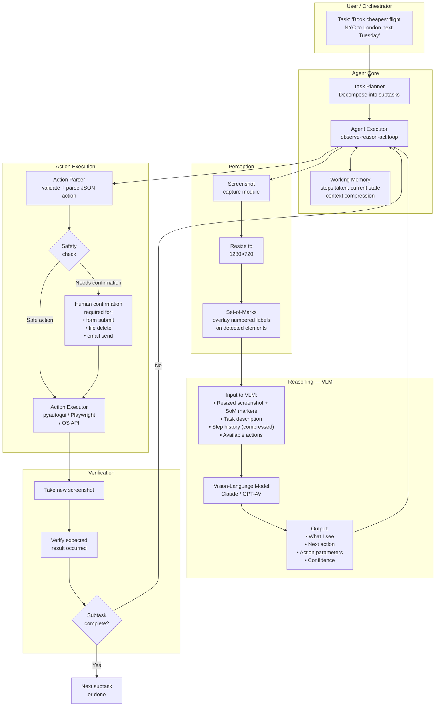
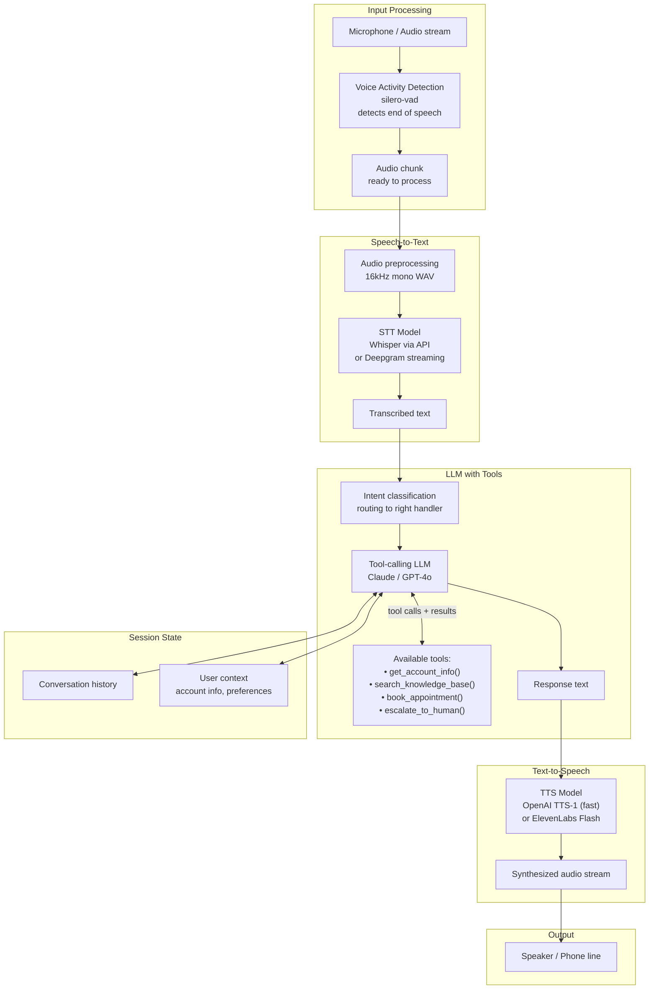
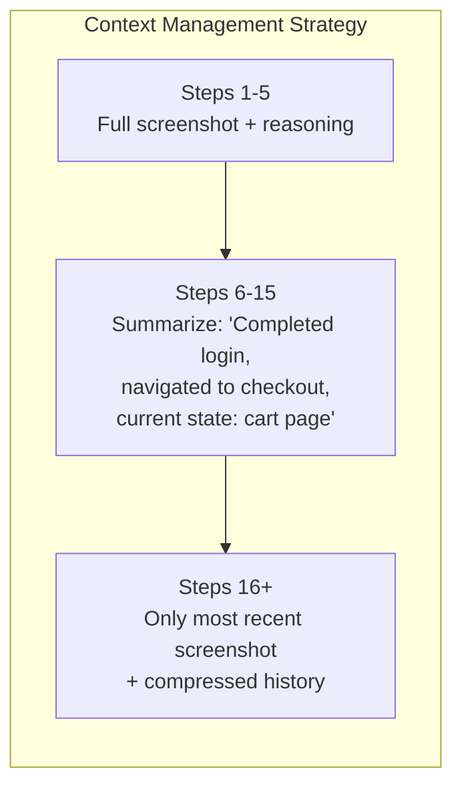

# Multimodal Agents — Architecture Deep Dive

## Computer Use Agent: Full Architecture



---

## Voice Agent: Full Pipeline Architecture



---

## Set-of-Marks (SoM) Grounding Pipeline

```mermaid
flowchart LR
    subgraph RawScreen ["Raw Screenshot"]
        RAW[Screenshot\n1280×720]
    end

    subgraph ElementDetection ["UI Element Detection"]
        OD[Object detector\nor OCR + layout parser]
        ELEMENTS["Detected elements:\n• Button: 'Submit' @ (450, 820)\n• Input: 'Email' @ (340, 280)\n• Link: 'Cancel' @ (200, 820)"]
        RAW --> OD --> ELEMENTS
    end

    subgraph Overlay ["SoM Overlay"]
        MARK[Draw numbered markers\non each element]
        MARKED_IMG["Annotated screenshot:\n• ①Submit button\n• ②Email input\n• ③Cancel link"]
        ELEMENTS --> MARK --> MARKED_IMG
    end

    subgraph VLM_SOM ["VLM Reasoning"]
        VLM_IN["Input:\nAnnotated screenshot +\n'I need to submit the form.\nWhich element number?'"]
        VLM_CHOICE["Output:\n'Element ①'\n(the Submit button)"]
        MARKED_IMG --> VLM_IN --> VLM_CHOICE
    end

    subgraph Execution ["Action Execution"]
        MAP[Map choice ① → coordinates\n(450, 820)]
        CLICK[Execute click\nat (450, 820)]
        VLM_CHOICE --> MAP --> CLICK
    end
```

---

## Multi-Agent Multimodal System

Some tasks benefit from multiple specialized agents working together:

```mermaid
flowchart TB
    subgraph Orchestrator ["Orchestrator Agent"]
        ORCH[Main LLM\ndecomposes task\nassigns to workers]
    end

    subgraph Workers ["Specialized Worker Agents"]
        WEB_AGENT[Web Navigation Agent\n• screenshot perception\n• browser actions]
        VISION_AGENT[Document Vision Agent\n• reads PDFs, images\n• extracts structured data]
        VOICE_AGENT[Voice Agent\n• STT → LLM → TTS\n• phone/audio interface]
        CODE_AGENT[Code Agent\n• executes code\n• processes data]
    end

    subgraph Tools ["Shared Tools"]
        DB[Database]
        API_S[External APIs]
        FILE[File system\n(sandboxed)]
    end

    USER[User task] --> ORCH
    ORCH -->|subtask 1| WEB_AGENT
    ORCH -->|subtask 2| VISION_AGENT
    ORCH -->|subtask 3| VOICE_AGENT
    ORCH -->|subtask 4| CODE_AGENT
    WEB_AGENT & VISION_AGENT & CODE_AGENT <--> DB & API_S & FILE
    WEB_AGENT & VISION_AGENT & VOICE_AGENT & CODE_AGENT -->|results| ORCH
    ORCH --> FINAL[Final answer / action]
```

---

## Context Window Management in Long Computer Use Tasks

A major challenge: each screenshot adds ~1,400 tokens. By step 20, you've used 28,000 tokens just for screenshots.



**Implementation**: After every N steps (e.g., 5), prompt the LLM to produce a compressed summary of what has happened so far and what the current state is. Replace the detailed history with this summary, keeping only the most recent screenshot at full fidelity.

---

## 📂 Navigation

**In this folder:**
| File | |
|---|---|
| [📄 Theory.md](./Theory.md) | Full explanation |
| [📄 Cheatsheet.md](./Cheatsheet.md) | Quick reference |
| [📄 Interview_QA.md](./Interview_QA.md) | Interview prep |
| 📄 **Architecture_Deep_Dive.md** | ← you are here |
| [📄 Code_Example.md](./Code_Example.md) | Code examples |

⬅️ **Prev:** [06 — Multimodal Embeddings](../06_Multimodal_Embeddings/Theory.md) &nbsp;&nbsp;&nbsp; ➡️ **Next:** [Section 18 — AI Evaluation](../../18_AI_Evaluation/01_Evaluation_Fundamentals/Theory.md)
