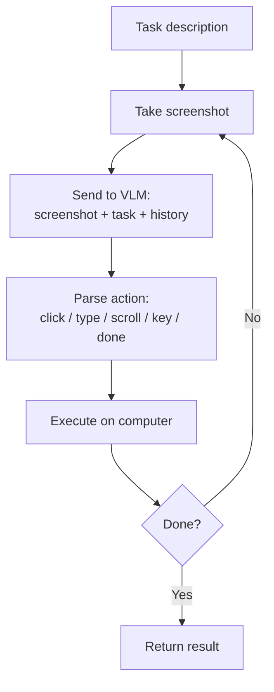

# Multimodal Agents — Cheatsheet

## Key Terms

| Term | One-line meaning |
|------|-----------------|
| **Computer use agent** | AI agent that controls a computer by viewing screenshots and executing UI actions |
| **Grounding** | Mapping a text description ("click Submit") to pixel coordinates in an image |
| **Set-of-Marks (SoM)** | Overlay numbered labels on UI elements; model chooses by number instead of pixel coordinates |
| **Observe-reason-act loop** | The core agent loop: screenshot → LLM reasoning → execute action |
| **Voice agent** | STT → LLM → TTS pipeline for voice-in, voice-out interaction |
| **VAD** | Voice Activity Detection: knowing when a user stops speaking |
| **Computer use sandbox** | Isolated VM/container where agent actions can't affect the host system |
| **Action space** | The set of actions an agent can take (click, type, scroll, key, screenshot, etc.) |

---

## Computer Use Agent Loop



---

## Action Types for Computer Use

| Action | Description | Example |
|--------|-------------|---------|
| `click` | Left-click at coordinates | `{"action": "click", "x": 450, "y": 820}` |
| `right_click` | Right-click for context menu | `{"action": "right_click", "x": 200, "y": 300}` |
| `double_click` | Double-click to open/select | |
| `type` | Type text at current cursor position | `{"action": "type", "text": "hello world"}` |
| `scroll` | Scroll up/down | `{"action": "scroll", "direction": "down", "amount": 3}` |
| `key` | Press keyboard shortcut | `{"action": "key", "keys": ["ctrl", "c"]}` |
| `screenshot` | Take a fresh screenshot | |
| `done` | Signal task completion | |

---

## Grounding Strategies

| Strategy | How it works | Accuracy | Complexity |
|----------|-------------|---------|-----------|
| **Direct coordinates** | Model outputs `(x, y)` pixels | Medium | Low |
| **Bounding box** | Model describes region, click center | Medium | Low |
| **Set-of-Marks (SoM)** | Number all elements, model picks number | High | Medium |
| **DOM + vision hybrid** | Combine HTML structure with visual | High | High |

---

## Cost / Latency Estimates

| Resolution | Tokens (Claude) | Cost per step | Latency |
|-----------|----------------|--------------|---------|
| 1920×1080 | ~2,764 | ~$0.05 (Sonnet) | 2–4s |
| 1366×768 | ~1,396 | ~$0.025 | 2–4s |
| 1024×768 | ~1,048 | ~$0.02 | 2–3s |

For 20-step task: $0.40–$1.00 and 40–80 seconds.

---

## Voice Agent Quick Start

```python
from openai import OpenAI
import anthropic

openai_client = OpenAI()
anthropic_client = anthropic.Anthropic()

def voice_turn(audio_path: str) -> str:
    # 1. STT
    with open(audio_path, "rb") as f:
        text = openai_client.audio.transcriptions.create(
            model="whisper-1", file=f, response_format="text"
        )
    # 2. LLM
    response = anthropic_client.messages.create(
        model="claude-opus-4-6", max_tokens=256,
        messages=[{"role": "user", "content": str(text)}]
    )
    reply = response.content[0].text
    # 3. TTS
    tts = openai_client.audio.speech.create(
        model="tts-1", voice="nova", input=reply
    )
    tts.stream_to_file("response.mp3")
    return reply
```

---

## Safety Checklist for Computer Use Agents

- [ ] Run in sandboxed VM or Docker container
- [ ] Disable internet access unless explicitly needed
- [ ] Require human confirmation before irreversible actions (form submit, file delete, email send)
- [ ] Log all screenshots and actions taken
- [ ] Set maximum step limit to prevent infinite loops
- [ ] Monitor for unexpected behavior (closing windows, accessing sensitive paths)
- [ ] Never store credentials in agent's context window

---

## Golden Rules

1. Always sandbox — never run computer use agents on a production machine directly
2. Resize screenshots to 1280×720 before sending — saves 50% of token cost
3. Use Set-of-Marks for action grounding — more reliable than coordinate output
4. Confirm before irreversible actions — this should be non-negotiable
5. Build error recovery — when an element isn't found, try an alternative approach
6. Keep voice responses short for voice agents — verbose TTS is expensive and slow

---

## 📂 Navigation

**In this folder:**
| File | |
|---|---|
| [📄 Theory.md](./Theory.md) | Full explanation |
| 📄 **Cheatsheet.md** | ← you are here |
| [📄 Interview_QA.md](./Interview_QA.md) | Interview prep |
| [📄 Architecture_Deep_Dive.md](./Architecture_Deep_Dive.md) | Architecture diagrams |
| [📄 Code_Example.md](./Code_Example.md) | Code examples |

⬅️ **Prev:** [06 — Multimodal Embeddings](../06_Multimodal_Embeddings/Theory.md) &nbsp;&nbsp;&nbsp; ➡️ **Next:** [Section 18 — AI Evaluation](../../18_AI_Evaluation/01_Evaluation_Fundamentals/Theory.md)
